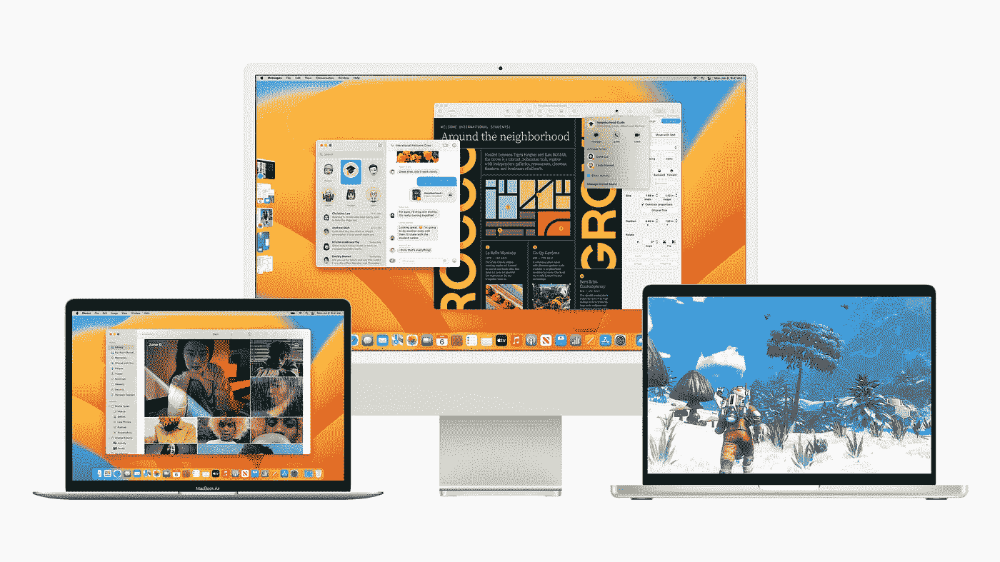
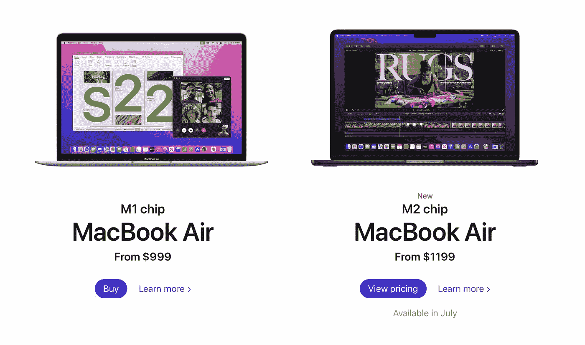
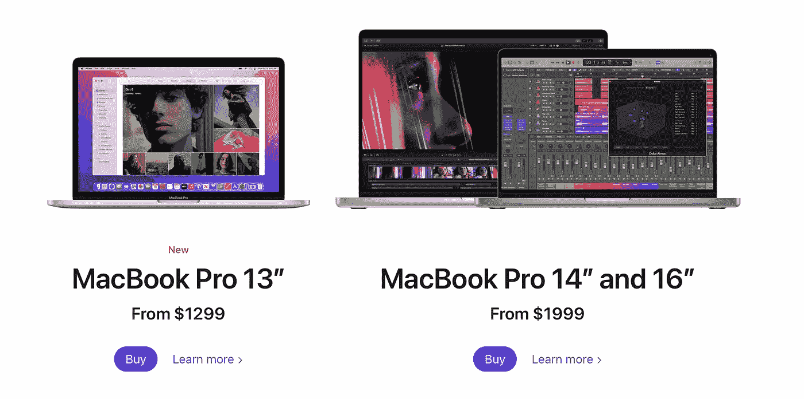
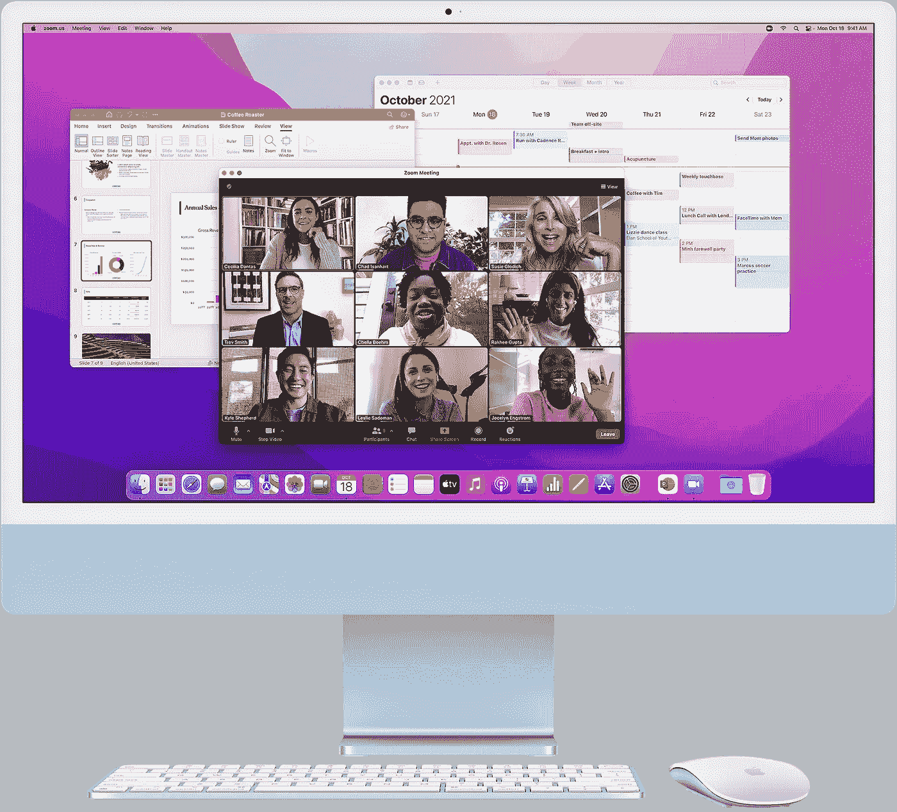
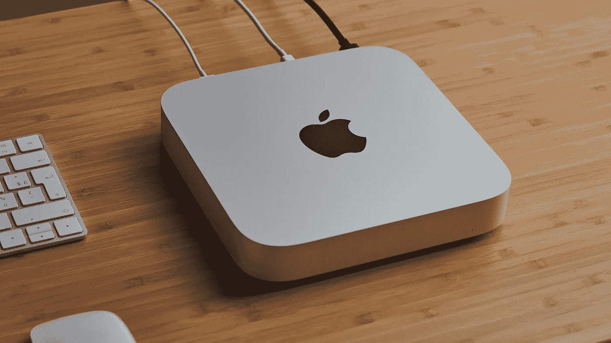
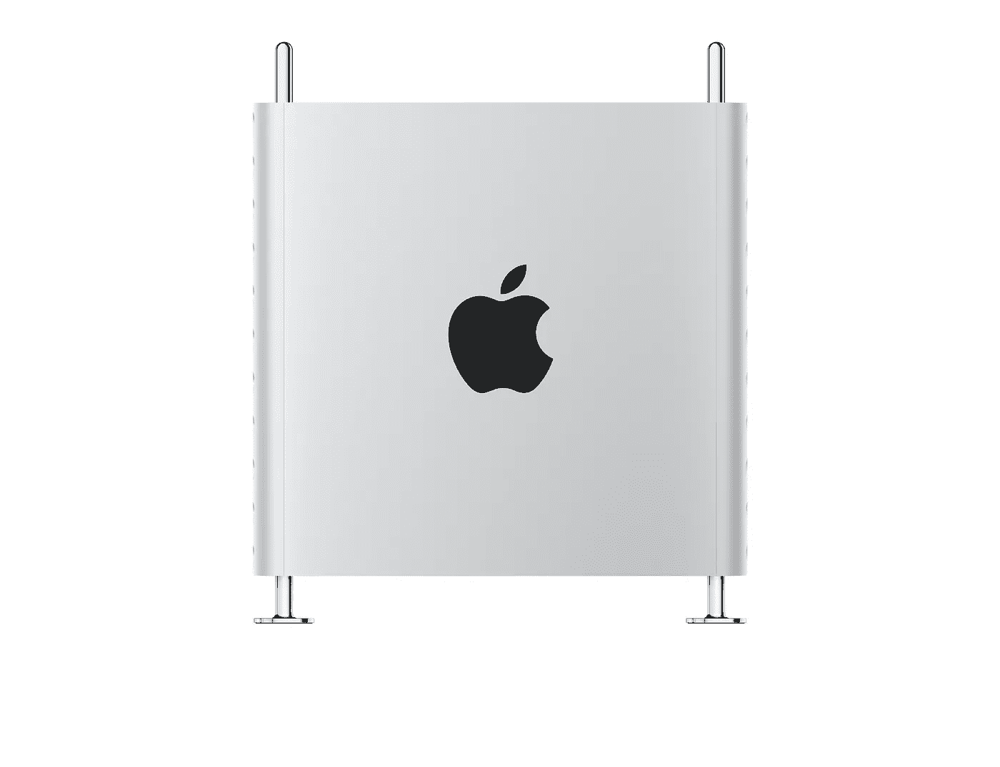

# 在您购买 Mac 电脑之前，请阅读以下内容…

> 原文：<https://medium.com/codex/before-you-buy-a-mac-read-this-cbe69cea2d0e?source=collection_archive---------4----------------------->

## 关键在于做出正确的选择

让我们面对现实吧。今天的苹果生态系统和几年前不一样了。最具突破性的变化之一是苹果硅芯片。正如史蒂夫·乔布斯所说，这是 21 世纪的“革命性产品”。

由于 M1(现在是 M2)芯片的强大功能和行业领先的性能，MAC 已经成为几种不同类型用户的时尚选择。在这篇博客中，我们来谈谈你应该如何(以及是否)根据自己的需求选择 Mac。此外，我将向您介绍所有选项(天哪，实在太多了)，并告诉您该群体的目标用户。

# 需要 Mac 吗？

这是你需要问自己的第一个问题。这里有几个原因——你可能愿意购买 Mac 的原因。它们按照概率的降序排列。

*   你手头有一大笔现金，想买一台有品牌价值的新电脑和一台很棒的 UX。
*   你的工作需要你使用苹果电脑。如果你是一名设计师或 iOS 开发人员，这可能是相关的。
*   您购买 Mac 只是为了探索和了解苹果及其产品，包括 Swift。

这里有一些潜在的危险信号，它们大声地喊着不，你可能会忽略它们。

*   你买不起苹果电脑。你只是需要苹果的品牌价值来获得社会的认可。
*   你有浏览网页、看电影、写邮件和博客等基本需求，但你几乎不需要 Mac。

看，这个想法很简单。当你拥有一台苹果电脑时，没有什么神奇的事情会发生。那不是你通往天堂的门票，当然也不要仅仅为了向朋友炫耀苹果的 logo 而购买。如果您的使用案例表明 Mac 是唯一的解决方案，请继续。然而，这是不成立的，如果你是超级富豪，在这种情况下，你当然可以买任何东西。

# 启动灯 MacBook Air

现在，我知道不是每个人都喜欢听这个，但新的 MacBook Air (M1)的性能让旧的 MacBook Pros 相形见绌。需要一台基本型笔记本电脑来满足您的所有需求—只需 999 美元即可获得基本型。认为你可能正在做一些繁重的工作，如开发或视频编辑？只需放入 16 GB 内存。

让你了解其中一个有多强大...我用的是 MacBook Air M1(16gb 内存)，目前我正在用这款设备写这篇博客。同时，我在后台运行 Apple Music、Android Studio、Xcode、Slack、iMessage、一个模拟器和一个 Android 模拟器。🤯

有了 M2，我相信你可以做得更多。你现在还有 1080p 摄像头，以及类似专业的设计——老实说，我觉得不太方便。

> **目标观众**——几乎所有人，除非你想在笔记本电脑上制作电影！

# 走向专业 MacBook Pro

我也用的是 MacBook Pro 14”(32gb RAM)，我很适合谈论这个问题。理想情况下，即使你是一个计算需求很高的开发人员，你也很难注意到在 Air 或 Pro 上使用硅芯片有什么不同。

那么，区别在哪里呢？嗯，首先是屏幕尺寸。越大越好，对吗？另一个原因是性能。虽然 13 英寸的手机运行 M2 芯片，但 14 英寸和 16 英寸的手机依靠 M1 专业版和 M1 马克斯芯片来实现超能力。

除了性能，其他一切，从屏幕亮度和音质，到散热风扇和更好的摄像头(除了 13 英寸的那款)，都在 MacBook Pros 上保持得更好。

如果你手头有 2000 美元，我强烈建议你买 14 或 16 英寸的，而不是 13 英寸的。那 700 美元的投资物有所值。

> **目标受众** —寻求比空气更好的性能并且有钱购买的人。

# 充满活力的台式机 iMac

如果你正在寻找一台可以整天坐在桌子上的台式电脑，那么你需要 iMac 24”。苹果过去也有一台 27 英寸的 iMac，但现在已经停产了(尽管预计很快会回来)。

起价仅为 1299 美元——你可以用 16 GB 内存的 MacBook Air 的价格买到它。现在，这是你必须做出谨慎选择的地方。如果你在办公室工作，经常出差，会见客户等。，那么你就知道 MacBook 是你需要的。但是，如果您需要一台台式机来满足工作或家庭需求，那么 iMac 是一个完美的选择。

> **目标受众** —有桌面需求的人，例如自由职业者和内容创作专业人员，或者有家庭需求的人，例如您的孩子！

# 可爱的小 CPU——Mac mini

需要一台 MacOS 台式机，但不想购买 iMac？在这里，这可能是用苹果获得超级动力的最便宜的方式，只需 699 美元。

Mac mini 基本上只是一个 CPU，具有与 MacBooks 相同的计算能力，并有更多的端口来连接东西！首先，你需要一台显示器。如果你正在考虑 5000 美元的专业显示器 XDR，你为什么还要购买 Mac mini？😂

您可以将它连接到一台价格合理的兼容显示器上，然后嘭！你的家庭办公室有一个很棒的桌面设置。你也可以随身携带它(虽然很难想象为什么),以防你需要的时候，把你所有的数据都带在身边。

苹果现在有了不小但非常可爱的 Mac Studio，作为需要比 Mac mini 更高计算能力的人的替代选择。

> **目标受众**——寻找更便宜的 iMac 替代品的人。

# 哦，太专业了 Mac Pro

现在只剩下专业用户了。老实说，如果你正在阅读这篇文章，并且对你购买 Mac 的决定感到困惑，那么 Mac Pro 几乎肯定不适合你！

高达 28 核英特尔至强处理器，1.5 TB DDR 4 RAM 和 8 TB 存储，这款机器实际上是为从事大型 AV 项目的人设计的。对于普通用户来说，它只是一件 6000 美元的垃圾，并不比 MacBook Air 更强大！

> **目标受众** —认真拍电影的人！

# 结论

那我应该买什么呢？看看你属于哪一类，只有当你属于其中一类的时候。这是给程序员和开发人员的一条具体建议—

> 具有 16 GB RAM 和 Intel i7(第 12 代或更低版本)处理器的 Windows/Linux 机器对于各种开发需求来说绰绰有余。除非你需要做 iOS 的工作或者很容易买得起，否则不要追求 Mac。

第二个常见的困惑是 Pro 和 Air 之间。如果你的需求不是很极端，我个人推荐空气。如果你需要一台台式机，那就选择 iMac 而不是 Mac mini，除非你的预算非常紧张。

> 一旦你买了你的 Mac，那么你可能想看看 [5 必须在 2022 年为开发者提供 macOS 工具](/codex/5-must-have-tools-on-macos-for-developers-in-2022-f2c652e41f3d)。

那都是我这边的。再见！

如果您有任何问题或建议，请随时联系我。您可以在这些社交媒体平台上关注我— [LinkedIn](https://www.linkedin.com/in/ab-satyaprakash/) 、 [YouTube](https://www.youtube.com/channel/UCJ6D0HS8c9Il-eX5lGbAyGg) 、 [Twitter](https://twitter.com/AbSatyaprakash) 、 [Instagram](https://www.instagram.com/absatyaprakash/) 了解更多更新内容！

**一如既往！黑客快乐！😇**

[加入我的电子邮件列表，获得更多精彩的教程和编程博客](https://absatyaprakash01.medium.com/subscribe) ❤️