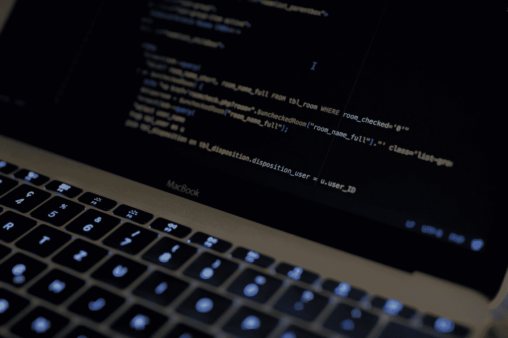

# 初级程序员不应该使用 Visual Studio 代码

> 原文：<https://medium.com/codex/beginner-coders-should-not-be-using-visual-studio-code-842ab0b9ed8b?source=collection_archive---------1----------------------->

卡斯帕·卡米尔·鲁宾在 [Unsplash](https://unsplash.com?utm_source=medium&utm_medium=referral) 上的照片

所以这篇文章非常针对编程初学者。如果你是一个有经验的程序员，你仍然可以阅读它

1.  你可能已经知道了这一切
2.  不管我说什么，你可能都不会改变你的代码编辑器

## 这不是一个 IDE