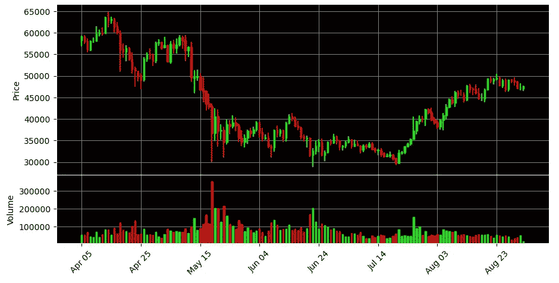
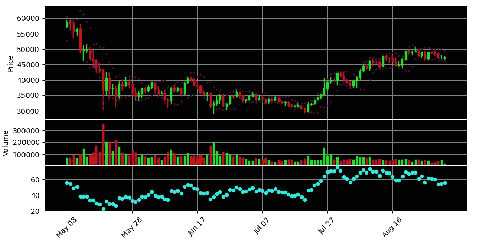

# Python 技术分析初学者指南

> 原文：<https://medium.com/codex/beginner-guide-to-technical-analysis-in-python-1fc507476d6?source=collection_archive---------2----------------------->

我们都喜欢赚钱，没有什么可以逃避的。如果你是交易新手，那么在你开始之前，至少对一些技术指标有一个基本的了解是很重要的。如果你是新手，很容易迷失在图表中，不可避免地会赔钱，这是没有人想要的！如果你也喜欢用 python 编程，那么这是一个让你熟悉这些指标并自己做一些数据分析的好方法。

因此，在这篇文章中，我将介绍一些存储和显示外汇或加密货币市场数据的基础知识，以及一个充满技术指标的精彩库。


我们将需要这个项目的几个包:

```
import numpy as np
import matplotlib.pyplot as plt
import pandas as pd
import mplfinance as mpf
from datatime import datetime as dt
import talib as ta
```

TA-Lib 是一个非常棒的技术分析库，我们将用它来生成大量的分析数据。这些都将使用 pandas dataframes 存储，数据将使用 mplfinance 显示。

因此，首先你需要下载一些特定股票、货币或任何其他资产的历史数据。在本教程中，我将以比特币为例。雅虎财经是获取价格数据的一种非常简单的方式，你可以免费下载一个 csv，或者如果你对加密货币更感兴趣，你可能有一个币安账户。有了币安，你可以设置一个 API，你可以安装 python-币安库。

```
from binance.client import Client
```

对于币安用户，您需要执行以下操作:

```
api_key = 'YOUR API KEY' #found on binance site when setting up api
api_secret = 'YOUR API SECRET'
client = Client(api_key,api_secret)
symbol = 'BTCUSDT'
kline = '1d'
data_since = '100 days ago'df = pd.DataFrame(
            client.get_historical_klines(symbol,kline,data_since)).drop(columns={6,7,8,9,10,11}).astype('float')
```

这给你留下了一个数据框架:日期、开盘、盘高、盘低、收盘、成交量列，其中填充了浮点数据。

如果您从另一个网站下载 csv，您只需写下:

```
df = pd.read_csv('PATH TO YOUR CSV FILE')
```

如果你从其他地方得到数据，确保至少和从币安得到的数据一样。

因此，从这里开始，为了简单起见，我们将对这些列进行重命名，以便清楚地表明哪一列是哪一列:

```
df.columns = ['Date',Open','High','Low','Close','Volume']
```

为了让 mpl finance 能够处理这些数据，我们需要将 date 列设置为 datetime 索引。它也通常以时间戳而不是日期的形式出现，所以我们也将对其进行转换

```
df.index = pd.DatetimeIndex(
              [dt.fromtimestamp(x/1000) for x in df['Date']
                                   )
```

如果您的数据已经是 datetime 格式，那么只需将' df['Date']'传递给该方法即可。

所以现在我们的数据可以显示了。我们可以用两行代码来实现:

```
mpf.plot(df,type='candle')
plt.show()
```

就这么简单！虽然如果它看起来更像我们习惯的在线图表会更容易使用，所以我们会给它添加一些简单的样式。

```
colors = mpf.marketcolors(up='lime',down='r',
                          wick={'up':'lime','down':'r'},
                          edge={'up':'lime','down':'r'},
                          volume={'up':'lime','down':'r'})
s = mpf.make_mpf_style(marketcolors=colors,facecolor='black,
                       edgecolor='w',gridstyle='solid',
                       gridcolor='grey')
kwargs = dict(type='candle',style=s,figratio=(20,10),
              width_adjuster_version='v0')mpf.plot(df,**kwargs)
plt.show()
```

现在我们有了一些看起来更像我们所了解和喜爱的东西！我们还可以快速添加一个东西，那就是底部的音量条形图。要做到这一点，我们需要做的就是将“volume=True”添加到我们的 kwargs 字典中，这样它就变成了:

```
kwargs = dict(type='candle',style=s,figratio=(20,10),
              width_adjuster_version='v0', volume=True)
```



现在，我们可以轻松地显示蜡烛图数据及其体积。接下来我们开始讨论技术分析指标。有这么多可用的选项，所以我将介绍一些更受欢迎的选项:

*   移动平均线
*   指数移动平均线
*   相对强度指数
*   随机 RSI
*   移动平均收敛发散(MACD)
*   布林线
*   平均真实距离

因为我们已经有了一个包含所有价格数据的数据框架，所以添加一些新的列来存储指标值是有意义的。前两个指标:MA 和 EMA 使用熊猫内置方法最容易做到。对于每个指标，我会做 12 日均线和均线，但这取决于你，你可能会希望每个指标都增加一些。

```
df['12MA'] = df['Close'].rolling(12).mean()
df['12EMA'] = df['Close'].ewm(com=12,adjust=False).mean()
```

这就是熊猫如何创造我们需要的移动平均线。注意:现在我们已经在数据框中添加了额外的列，我们需要稍微修改一下我们的绘图代码:

```
mpf.plot(df[['Date','Open','High','Low','Close','Volume]],**kwargs)
```

转到其他指标，您将看到 TA-Lib 使这些计算变得多么容易。从 RSI 开始:

```
df['RSI'] = ta.RSI(df['Close'],timeperiod=14)
```

就是这么简单！TA-Lib 是如此的有用和简单。其他一些指标有多个输出，因此会跨越多列。您将注意到的另一件事是，在执行这些操作之后，一些起始行将读取 NaN。这是完全正常的，只是数学的结果，所以这是收集大量数据的另一个原因。其余的指标可以这样实现:

```
df['fastk'],df['fastd'] = ta.STOCHRSI(df['Close'],timeperiod=14,
                                      fastk_period=5,fastd_period=3)df['macd'],df['macdsignal'],df['macdhist'] = ta.MACD(df['Close'],fastperiod=12,slowperiod=26,signalperiod=9)df['upperBB'],df['midBB'],df['lowerBB'] = ta.BBANDS(df['Close'],timeperiod=5)df['ATR'] = ta.ATR(df['High'],df['Low'],df['Close'],timeperiod=14)
```

对于所有可能的指标，我建议查看这里的文档:[https://mrjbq 7 . github . io/ta-lib/func _ groups/volatility _ indicators . html](https://mrjbq7.github.io/ta-lib/func_groups/volatility_indicators.html)

为了绘制这些新的指标，你需要知道哪些属于蜡烛图，哪些需要支线图。你可能想在蜡烛图数据上绘制的唯一数据是任何类型的移动平均线和布林线。剩下的放在支线剧情里会更好，因为尺度很不一样。

所以添加这个非常容易，在我们的‘kwargs’字典上面，我们想添加一个名为 apdict 的列表，并且可以添加我们的新指标:

```
apdict = [mpf.make_addplot(df[['upperBB','lowerBB']],color='b',
                           type='scatter',panel=0),
          mpf.make_addplot(df['RSI'],color='cyan',
                           type='scatter',panel=2)]
```

这将把我们的布林线添加到蜡烛图中，同时在底部为我们的 RSI 创建第三个面板。面板参数是我们决定在哪里绘制数据的方式，您可以添加任意多的数据

然后，在“kwargs”字典中，我们添加了另一个变量“addplot=apdict”，这就是它的全部内容。您应该会得到这样的结果:



如何选择造型完全取决于你。这是掌握如何分析股市或加密货币数据的一个好方法。如果你想尝试创建一个价格预测模型，这也是一个为机器学习收集额外数据的好方法！

为了更进一步，一定要看一下我之前链接的 TA-Lib 的文档，以及“mplfinance”的文档，这样你就可以看到如何设计和改进这些图。

如果你正在寻找一些将它付诸实践的想法，这里有一些可以让你思考的:

*   机器学习价格预测
*   将实时股票价格数据传输到图表中
*   用你的数据创建一个 tkinter 应用
*   创建一个带有指示器的 flask webapp
*   做一个交易策略测试者
*   制作一个交易机器人

我希望这篇介绍对你有所帮助，并让你更好地理解价格趋势。享受这些库，创造一些很酷的东西！

我必须补充一点，这绝不是任何财务建议，纯粹是为了帮助演示如何用 python 做自己的技术分析。