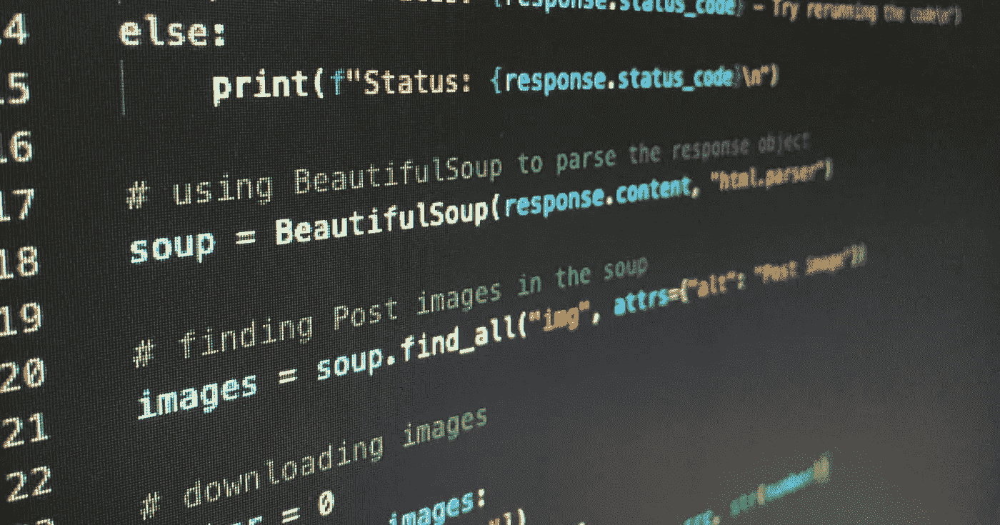

# 从初学者到专业 Python 学习路径。

> 原文：<https://medium.com/codex/beginner-to-pro-python-learning-path-9826ce3400c0?source=collection_archive---------4----------------------->

## 如果我能重新开始，我将如何学习。

Python 是 21 世纪最好的编程语言之一。它不会很快去任何地方。为什么？嗯，因为它简单易学，是一种干净的结构化编程语言，功能强大。

既然已经看到 Python 是一门多么重要的编程语言，那么初学者应该如何开始学习它呢？学习一门编程语言最令人沮丧的事情之一是学习资源是多么的普通，这使得新手程序员放弃学习特定的编程，因为学习看起来是多么令人生畏。

那么一个初学者学习 Python 编程语言应该走什么样的确切路径呢？我应该从哪里开始？应该做哪些项目？我应该使用什么框架？

这是我作为一个程序员新手学习 Python 的学习路径。这只是我对什么对我有效以及我认为什么对你有效的研究。所以事不宜迟，让我们开始吧。

1.Python 基础知识
2。数据结构和算法
3。网络开发
4。网页抓取和自动化
5。人工智能和机器学习

## **Python 基础知识**。

这是学习 python 最重要的一步，因为它是不可跳过的，你必须学习编程语言最基本的语法，这将作为你深入学习的基础。然而，你不应该在这上面浪费太多时间，因为这不是很有动力。你可以查阅学习编程的书籍，从 Udemy 上的众多课程中选择一门。你甚至可以在 python 的官网上免费学习。

## 数据结构和算法。

DSA 是开发新手的下一条路。学习数据结构和算法是令人畏惧和困难的，对我来说也是如此。但是人们不应该认为这是最重要的技能之一，不仅仅是作为一个 Python 程序员，而是作为一个整体的程序员。这是因为精通数据结构和算法的程序员可以轻松地执行任何关于计算、数据处理、自动推理等任务。DSA 展示了你在未来雇主中解决问题的技巧和能力。

# 网络开发。

Python 的一个亮点是在 web 开发领域。有多种框架可供选择，包括 Flask、Django、Web2Py、Bottle.py、CherryPy。精通 python will 开发将使您能够创建几乎任何自己选择的 web 应用程序。网络开发也是一个非常有利可图的领域，因此了解网络开发将为你提供更好的工作机会。

## 网页抓取和自动化。

Python 通常被认为是最好的网络抓取语言之一。这使您能够平稳地处理 web 爬行/抓取过程。BeautifulSoup 是最能让网络抓取变得简单的 python 框架之一。Python 还使人们能够创建脚本，以非常有效的方式自动化重复的任务。

## 人工智能和机器学习。

Python 的另一个亮点是在人工智能和 ML 领域，因为它已经被认为是人工智能的最佳编程语言。它提供了很棒的库和框架，因为它提供了科学计算、统计计算、计算能力等等。因此，如果您想创建下一个 JARVIS，使用 Python 是不会错的

## 项目。

这一点虽然不在列表中，但却是你不应该展望的事情之一，因为你将学习编程语言，你必须构建项目。这不仅巩固了你的学习和技能，也为你提供了一个可以展示给未来雇主的项目库。所以即使你在学习...建设

## 你想做什么？

需要注意的是，这是从个人角度出发的。学习途径应该基于你想用你选择的语言做什么，数据科学家或移动开发者的学习途径可能与我上面提到的完全不同。这是学习编程语言的一种更普遍的方式。