# 使用 Scikit-learn 完成简单回归任务的初学者指南

> 原文：<https://medium.com/codex/beginners-guide-on-using-scikit-learn-for-simple-regression-task-12b0311bada?source=collection_archive---------10----------------------->

*照片由* [*马库斯·温克勒*](https://unsplash.com/@markuswinkler?utm_source=unsplash&utm_medium=referral&utm_content=creditCopyText)*[*Unsplash*](https://unsplash.com/s/photos/machine-learning?utm_source=unsplash&utm_medium=referral&utm_content=creditCopyText)*

*进入数据科学领域可能是一条铺天盖地的导航路线，那里有超载的信息，过滤掉必要的信息并丢弃不必要的信息可能非常困难。我绝不是专家，但非常精通我的技能，我写这篇文章是为了让初学者和爱好者更容易地了解这些信息。*

*我也仍然在学习，仍然在寻找克服障碍的方法，变得更好，并分享这篇文章，作为加强我的技能和帮助任何考虑将数据科学作为职业的人的一种方式，但也使这成为任何人的有趣阅读。*

*这是令人困惑的，尤其是如果你找不到合适的资源来获得基本技能。根据我的经验，扎实的基础知识通常会决定你在任何事情上的表现。*

*我们的目标是让这篇文章简单易懂，便于任何人掌握内容。*

*强大的基础是一个更好的程序员的主要先决条件，这适用于所有世俗的职业。*

*我将对如何执行简单的线性回归任务发表更多见解，并解释一些重要的概念。对于初学者、好奇的爱好者和非数据科学家来说，我会简单明了地让他们理解本文所描述的内容。首先让我们从一些定义开始，这样每个人都能理解。*

# ***什么是机器学习？***

*机器学习是教会计算机系统如何在输入数据时做出准确预测的过程。*

# ***类型***

*机器学习的主要类型*

*   *监督学习*
*   *无监督学习*

# ***什么是监督学习？***

*我们将只研究监督学习的概念，具体来说就是线性回归。*

***监督学习**是一种算法任务，使用**标记的示例**(特征)来训练模型，这是一种输入和期望输出已知的情况。*

*通常用于**过去的数据预测未来可能发生的事件的应用。***

# ***类型***

*监督学习的主要类型*

*   *分类*
*   *回归*

# ***现实场景中的用例***

*   *欺诈检测。*
*   *网络搜索结果。*
*   *图像和语音识别。*
*   *信用评分。*
*   *实时聊天机器人代理。*
*   *产品推荐。*
*   *设备故障。*
*   *医疗保健(疾病检测)等。*

*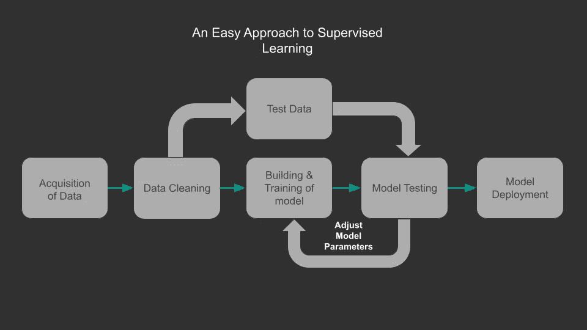*

## ***数据采集***

*获取并准备您的数据，这些数据可能来自应用程序、客户调查、传感器、在线等。*

## ***数据清理***

*在这里，我们使用 pandas *(pandas 是一个为 Python 编程语言编写的软件库，用于数据操作和分析)*，清理、格式化和填充数据中缺失的信息，以达到更好的标准*

## ***模型的建立和训练***

*我们将数据分为**测试**和**训练数据，**但是为了最佳实践，我们被鼓励分为三组，即**测试**、**验证**和**训练**、**数据集**，因为最好使用**训练**和**验证**、**数据集**来构建和调整您的模型参数，直到达到完美拟合。*

## ***模型测试***

*我们所有的数据分割，包括**测试数据**都要经过这个阶段，但这是在我们调整了模型参数以适应我们的**训练和验证数据集**之后，然后在模型上使用我们的测试数据。*

## ***车型部署***

*在我们对使用测试数据的最终性能指标感到满意之后，应该部署模型。*

# ***简短回顾***

## *培训用数据*

*用于训练模型参数*

## *验证数据*

*用于确定要调整的模型参数*

## *测试数据*

*用于获得一些最终的性能指标*

# ***回归***

*回归任务是一种监督学习模型，它预测连续或定量值，例如根据数据集中的一些定量特征预测个人的工资，使用其特征预测房价。*

*众所周知，机器学习的核心是统计方法，虽然有些人可能会认为你不需要统计知识来执行机器学习任务，但我会断言，拥有强大的基础知识足以让你用机器学习解决现实世界的问题。*

*对于回归任务，我们有 3 个常见的统计性能评估指标，即*

## *平均绝对误差(MAE)是误差绝对值的平均值:*

*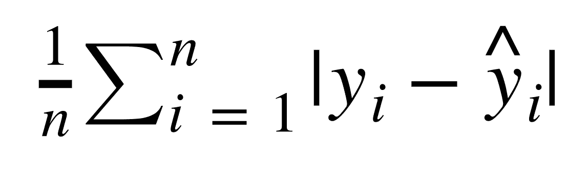*

## *均方差(MSE)是平方误差的平均值:*

*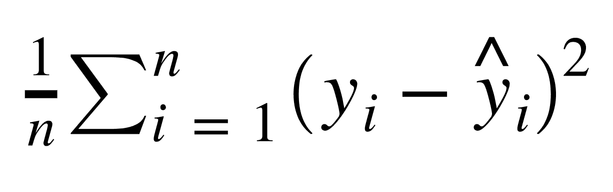*

## *均方根误差(RMSE)是平方误差平均值的平方根:*

*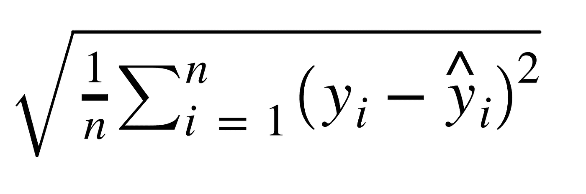*

*我们将了解如何使用这些统计方程来评估我们的模型性能，其中 **yi 是标签**的历史测试数据值，而**是我们的模型生成的预测值。***

*在我们获得数据集并为清理和分析做好准备后，我们将继续安装 Scikit-Learn。*

*Scikit-learn ( **Sklearn** )是一个有用且健壮的**库，用于 Python** 中的机器学习。它为机器学习和统计建模提供了一系列有效的工具，对于那些使用他们的命令行界面的人来说，只需粘贴这个' **pip install scikit-learn** '，而那些使用 anaconda 的人应该将这个粘贴到他们的界面' **conda install scikit-learn** '，安装后我们将继续在我们的 IDE 中导入库。*

***软件库**是一套数据和编程代码，使软件程序和应用程序的开发更加容易。*

# ***线性回归***

*为了这篇文章，我们将使用来自纽约市一家在线服装店的虚假电子商务数据，但他们也有店内风格和服装建议会议。顾客来到店里，与私人造型师进行会谈/会面，然后他们可以回家，在手机应用程序或网站上订购他们想要的衣服。*

## ***问题陈述***

*该公司正试图决定是将精力集中在他们的移动应用程序体验还是他们的网站上。*

*我们将与该公司的电子商务客户 csv 文件。它包含分类列的信息，例如*

*   ***电子邮件***
*   ***地址***
*   ***彩色头像***

*然后它还有数值/连续栏(**功能**):*

*   *平均。会话长度:店内风格建议会话的平均会话时间。*
*   ***在应用上的时间:在应用上花费的平均时间(分钟)***
*   ***在网站上的时间:平均花费在网站上的时间(分钟)***
*   ***会员年限:客户成为会员的年限。***

*而我们预测的连续柱(**标签**):*

*   ***每年花费的金额***

*我们将在牌桌上看到一个峰值，并查看一些信息:*

*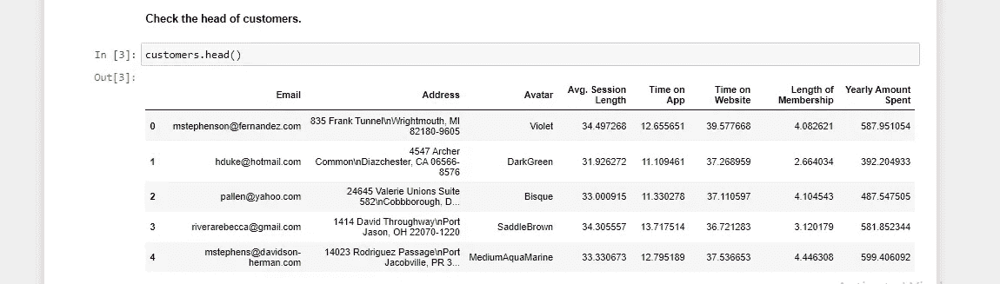*

## ***第一步:***

*删除所有分类列，并将数字列拆分为特征( **X** )和标签( **y** )(我们试图预测的历史数据)*

*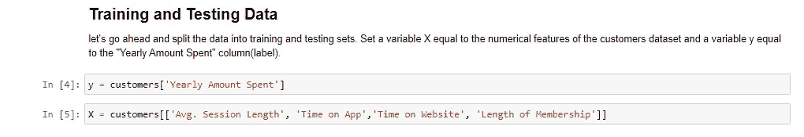*

## ***第二步:***

*我们将从**sk learn _ model _ selection**导入 **train_test_split** ，将数据集拆分为训练和测试数据，通常最佳实践是将数据集的 30% — 33%分配给测试数据，至少 70%分配给训练数据。*

*这是通过将 **test_size** 参数设置在 0 到 1 之间来实现的，例如 0.3 = 30%*

*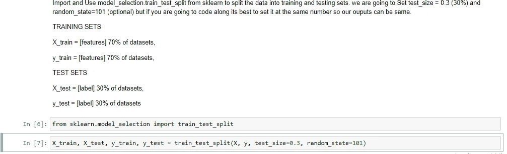*

## ***第三步:***

*导入并实例化线性回归模型，然后我们拟合实例化的对象，并用特征(X_train)和标签(y_train)拟合(训练)训练数据。*

*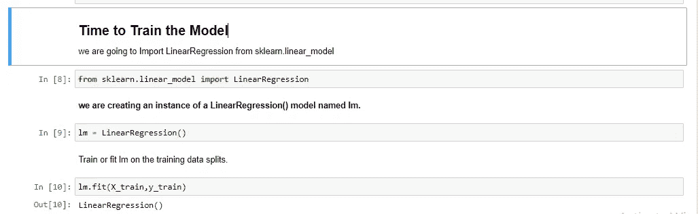*

## ***第四步:***

*通过检查系数来评估我们的模型，系数返回一个序列，该序列可用于构建以我们各自的特征(X)作为列的数据帧。*

*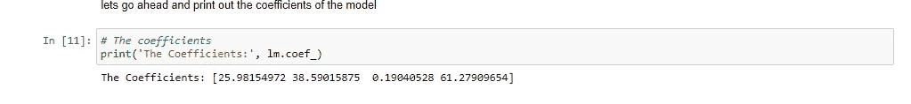*

***回归系数**是描述特征和标签之间关系的未知参数的估计值，它告诉我们称为自变量的预测变量(特征)和称为因变量的响应变量(标签)之间的相关性是正还是负。*

## ***第五步:***

*通过使用**，从特性测试数据(x_test)中获取我们的模型预测。predict()** 方法，然后我们使用散点图绘制 y_test 值与我们的预测值的关系。*

*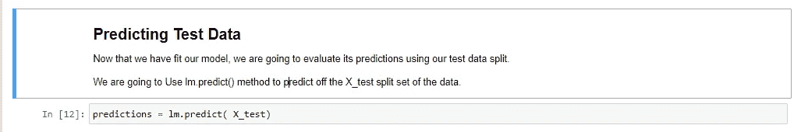*

## ***第六步:***

*我们的目标是使我们的相关性为正，使我们的模型非常适合。*

## *变量之间的相关性表明，当一个变量的值发生变化时，另一个变量往往会朝特定方向变化。*

*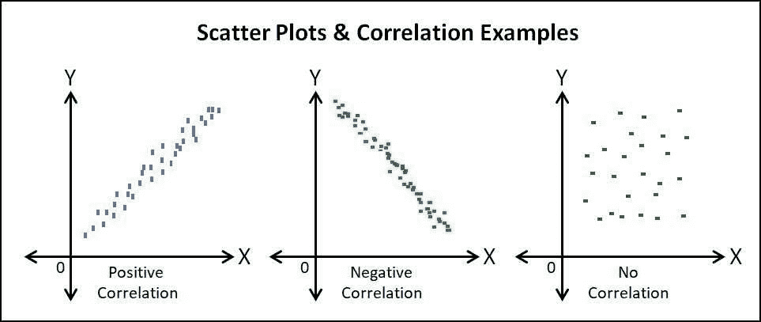*

*相关图像*

*如果我们碰巧得到一个负相关或零相关，我们需要回去调整我们的参数。这就是为什么总是有验证数据是最好的做法，下面是一个掌握相关性重要性的图片。*

*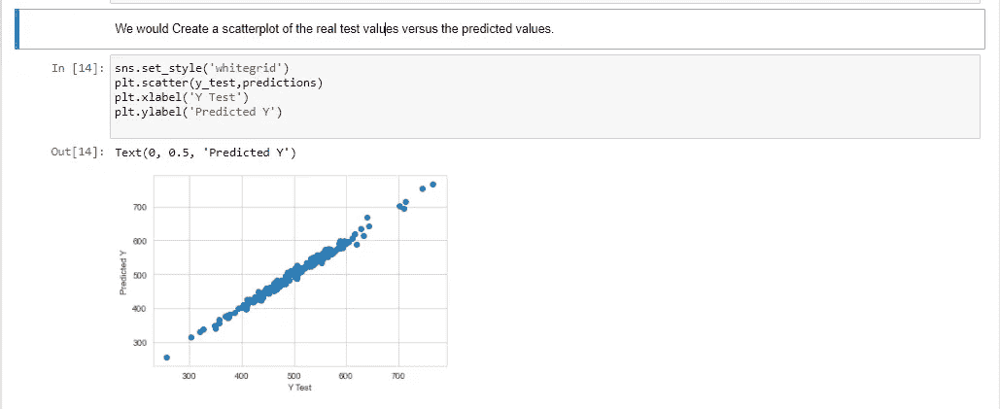*

## ***第七步:***

*可视化我们的残差分布，只是为了确保我们的数据是均匀分布的。*

***残差**是我们标签的实际测试值(y_test)和预测值(predictions)之间的差值。*

*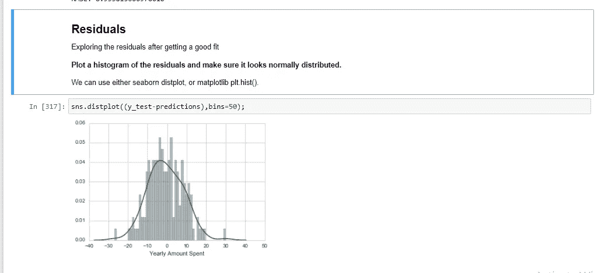*

## ***第八步:***

*导入用于评估模型性能的指标，我们将使用来自 **sklearn import metrics** 的语法，并通过输入 y_test 和 predictions 作为参数来计算我们之前讨论的三种方法。*

*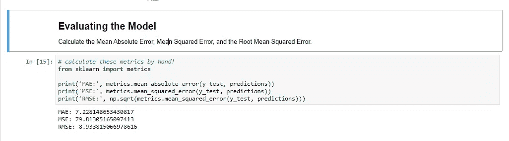*

*你可以在网上深入阅读这三个概念，以获得更好的解释。*

## ***第九步:***

*解释我们可以从回归系数中推断出的见解，这是所提问题的答案将得到回答的地方，该公司正试图决定是否将他们的努力集中在他们的移动应用程序体验或他们的网站上。*

# ***解释系数***

*如果所有其他特征都是固定的，并且某一特定特征的一个单位的增加等于以美元为单位的系数的值，在这种情况下，我们试图预测每年花费的金额。*

*例如:*

*   *如果所有其他夹具都固定，则**平均值增加一个单位。会话长度**等于总花费增加**25.98 美元。***
*   *如果所有其他功能都是固定的，应用程序上的单位时间增加等于总花费增加 38.59 美元的 T2。等。*

*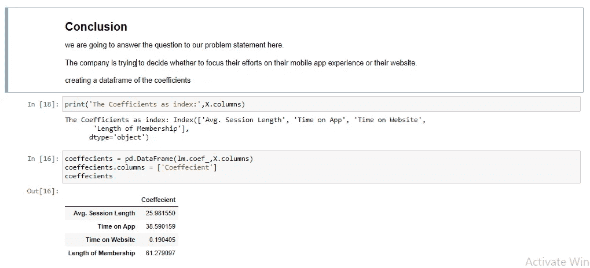*

# ***推荐***

*从上图中我们可以清楚地看到，相比于网站上的**时间****【0.190】，**采用移动应用作为与客户互动的公司模式是有意义的，也是一个很好的论据。*

*我们优化网站功能以匹配移动应用程序的功能如何，这样我们可以留住喜欢在网站上购物的客户，也可以吸引喜欢在网站上购物的新客户，到时候在网站上的花费将匹配甚至超过应用程序。*

*这是一个**[**GitHub**](https://github.com/thuds67/Beginners-Guide-On-Using-Scikit-learn-For-Simple-Regression-Task)repo for this 文章的链接，它包含了文章中的文件和代码。享受吧。***

# ***结论***

***祝贺你，如果你跟随我经历了这次激动人心的旅程，我希望你学到了一点或更多关于我们如何使用机器学习来改善我们周围的体验。***

***作为这篇文章的继续，我将继续撰写更多关于 pandas 和探索性数据分析(EDA)的内容，如何使用 python 和 Tableau 识别、创建和使用正确的可视化技术，然后谈论更多的机器学习技术。***

***我希望您能加入我的旅程，并通过以下方式与我联系:***

***领英***

***[推特](https://twitter.com/Ghenghis_)***

***[哈希节点](https://hashnode.com/@Thuds)***

***干杯！！。***