# 分类模型初学者指南(捕捉信用卡欺诈)

> 原文：<https://medium.com/codex/beginners-guide-to-classification-models-catch-credit-card-fraud-fe5a73a3401f?source=collection_archive---------2----------------------->

## 异常检测


您是否知道，一个典型的组织每年因欺诈而损失约 5%的收入？然而，用户行为中也有微妙和隐藏的事件，这些事件可能不明显，但仍然预示着可能的欺诈。机器学习允许创建处理具有许多变量的大型数据集的算法，并帮助找到用户行为和欺诈行为可能性之间的隐藏相关性。与基于规则的系统相比，机器学习系统的另一个优势是更快的数据处理和更少的人工工作。例如，智能算法非常适合行为分析，有助于减少验证步骤的数量。

## 本文的目的:

> 本文面向数据科学领域的初学者&旨在演示如何系统地解决这个问题，并开始使用为欺诈检测相关的不平衡分类问题而设计的技术。**当类别不平衡时，我们将着重于选择合适的模型评估指标。我会尝试触及各种常见的话题，但也会尽可能地简化概念。**

# 数据集描述:

> 数据集 fraud_data.csv 是从 Coursera 网站下载的。fraud_data.csv 中的每一行都对应于一笔信用卡交易。
> 
> 2.功能包括机密变量 V1 到 V28 以及交易金额。
> 
> 3.目标存储在“class”列中，对于欺诈性交易，该列的值为 1，否则为 0。

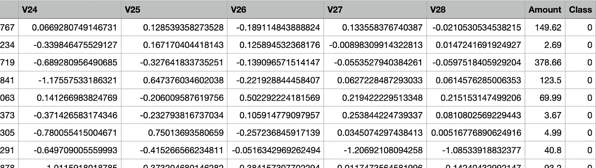

取样前几行

> 4.我们可以看到第一列是时间，是整数，倒数第二列是购买金额。我们可以看到 PCA 变换后的特征是正负的，包含了很多浮点精度。
> 
> 5.时间列不太可能有用，可能会被删除。PCA 变量和美元数量之间的比例差异表明，数据缩放应该用于那些对输入变量的比例敏感的算法。

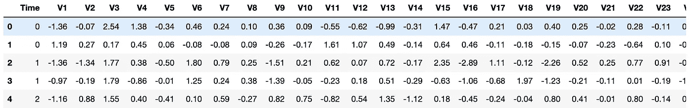

# **数据探索**

在这里，我们将检查 fraud_data.csv 数据集的汇总统计数据&我们将在这一部分花很多时间。在构建任何东西之前，了解数据是很重要的。

稍后，我们将把数据集分成训练集和测试集来训练几个模型，在下一节中，我们将评估它们在检测信用卡交易欺诈方面的有效性。

```
df **=** read_transactions_data()

**print**(round(df**.**describe()**.**transpose(), 3))
**print**('\nThe number of missing values across all attributes and samples: ', df**.**isnull()**.**sum()**.**sum())
```

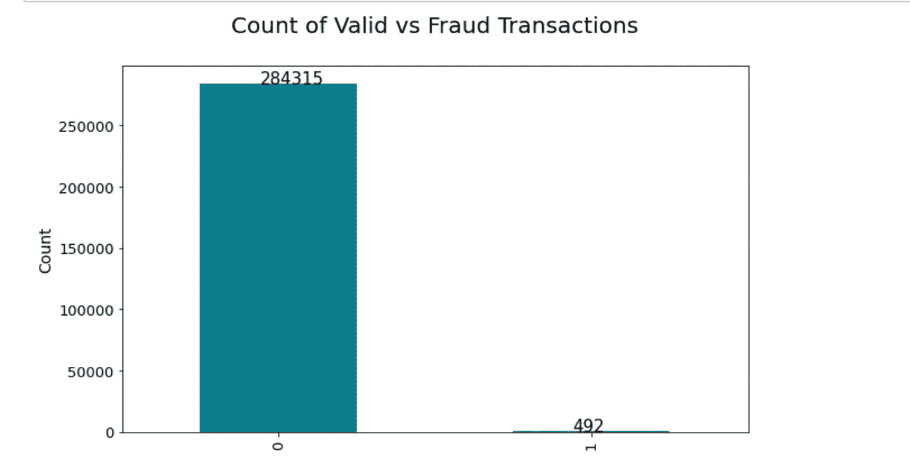

**观察结果 1:** 下面的汇总统计显示，数据中有 284806 笔交易，其中 0.17%是欺诈性的(即欺诈类仅代表观察结果的一小部分)。

```
#This code is for the bar graph above
ax = df[‘Class’].value_counts().plot(kind=’bar’, figsize=(10, 6), fontsize=13, color=’#087E8B’)
ax.set_title(‘Count of Valid vs Fraud Transactions’, size=20, pad=30)
ax.set_ylabel(‘Count’, fontsize=14)
```

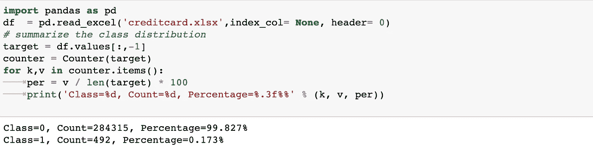

**为什么不平衡数据会引起关注？**

> 如果目标变量的至少一个类仅构成非常小的少数，则数据集是不平衡的。在监督机器学习模型中，目标变量中的类别不平衡会导致严重偏向多数类别，并降低可预测性。不平衡数据在银行、保险、工程和许多其他领域普遍存在。只需知道，在欺诈检测中，不平衡的比例通常为 100:1。

**观察结果 2:** 平均交易金额大大高于中位数，表明有相对少量的非常大的交易推动平均值上升。数据集没有缺失值。

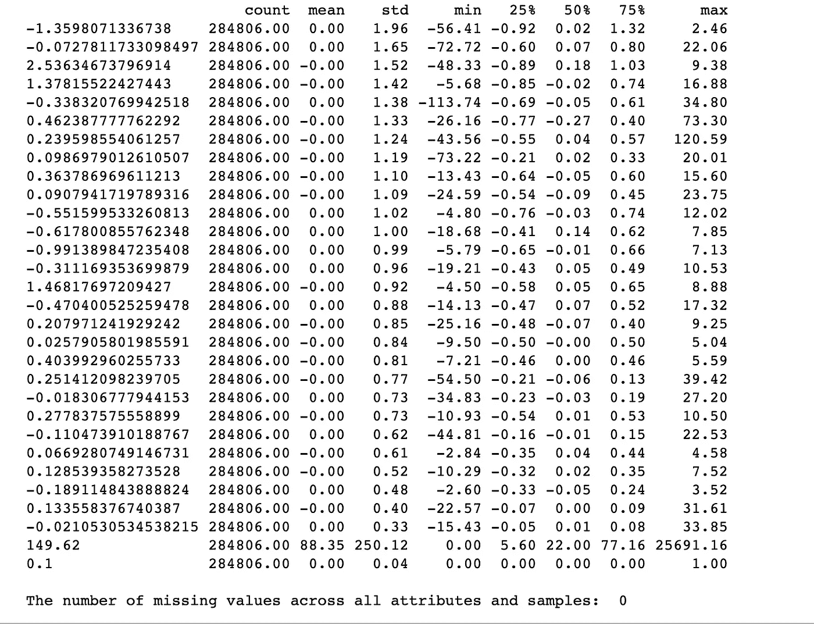

汇总统计

**观察三:**

在“数量”列中，我们可以看到大多数数量都很小，平均值约为 88，中间 50%的观察值介于 5 和 77 之间。最大值约为 25，691，这似乎是一个异常值，当然会提高分布。

**观察四:**

大多数 PCA 分量的分布是高斯型的，并且许多可能以零为中心，这表明变量被标准化为 PCA 变换的一部分。

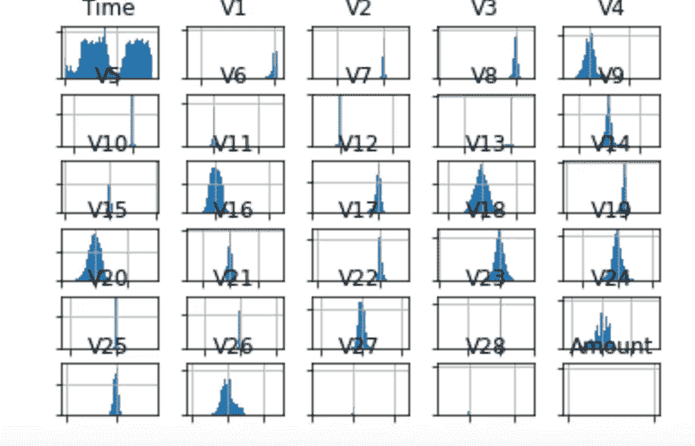

**重要注意事项:**

1.  在我们训练模型之前，需要对特征进行缩放。

```
*# Split the data into X_train, X_test, y_train, y_test*
X **=** df**.**iloc[:,:**-**1]
y **=** df**.**iloc[:,**-**1]

X_train, X_test, y_train, y_test **=** train_test_split(X, y, random_state **=** 0)
```

2.该代码将使一个定标器适合训练数据，并使用适合的定标器转换训练和测试数据。(注:定标器应仅适用于训练数据，以防止测试数据中的信息泄漏。)

```
scaler **=** StandardScaler()**.**fit(X_train)
X_train **=** scaler**.**transform(X_train)
X_test **=** scaler**.**transform(X_test)
```

## 你为什么要关心阶级不平衡及其在选择度量标准中的作用？

只有一小部分交易是欺诈性的，预测每个交易不是欺诈性的分类器将达到 99%的准确度分数。这样的分类器对我们没有价值。因此，在类别不平衡的情况下，应该考虑准确性以外的度量。这些度量包括精确度、召回率以及这两个度量的组合(F2)。

# 拟合和评估 ML 模型一般

这是对我们初看时如何处理这个问题的回顾

**步骤 1** :我们训练一个虚拟分类器，将所有事物分类为训练数据的主要类别(即，所有交易都不是欺诈性的)

```
**def** **dummy_classifier**():

    dummy_majority **=** DummyClassifier(strategy **=** 'most_frequent')**.**fit(X_train, y_train)
    accuracy **=** dummy_majority**.**score(X_test, y_test)

    **return** accuracy
```

**虚拟分类器练习的主要收获**

> 1)正如所讨论的，该函数返回超过 99%的准确度分数。
> 
> 2)同时，召回率(换句话说，所有欺诈交易中被正确预测为欺诈的部分)是 0%。这是因为该模型不是为了将任何交易归类为欺诈而设计的。因此，尽管准确度分数很高，但模型表现不佳。

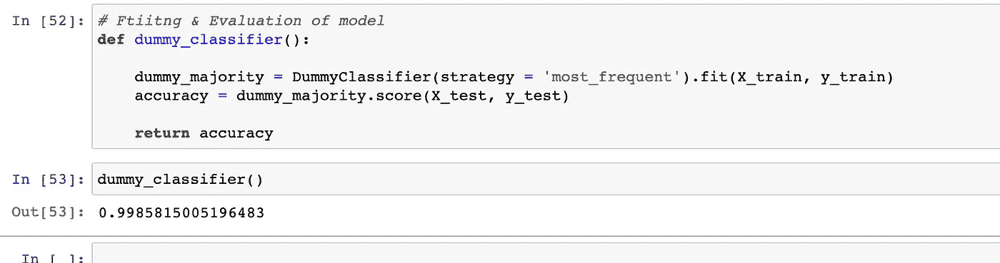

虚拟分数

**步骤 2 SVC →** 接下来，我们使用默认参数训练支持向量分类器(SVC ):

```
**def** **SVC_classifier**():

    svm **=** SVC()**.**fit(X_train, y_train)
    y_pred **=** svm**.**predict(X_test)
    accuracy **=** svm**.**score(X_test, y_test)
    precision **=** precision_score(y_test, y_pred)
    recall **=** recall_score(y_test, y_pred)

    **return** (accuracy, recall, precision)
```

准确度、召回率和精确度现在分别是 0.995、0.67 和 0.96。召回率从零增加到 0.67 表明 SVC 比简单的多数类规则执行得好得多。

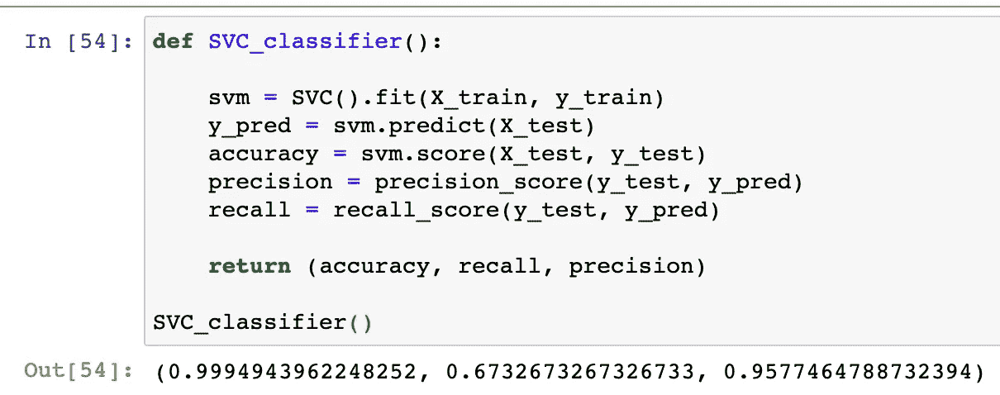

**步骤 3 - >混淆矩阵**

```
**def** **confusion_mtrx**():

    svm **=** SVC()**.**fit(X_train, y_train)
    y_pred **=** svm**.**predict(X_test)
    confusion **=** confusion_matrix(y_test, y_pred)

    **return** confusion

**print**(confusion_mtrx())
```

一张图胜过千言万语，你可以这样解释:

三个假阳性不构成威胁，但 33 个假阴性是算法无法准确分类的欺诈案件。

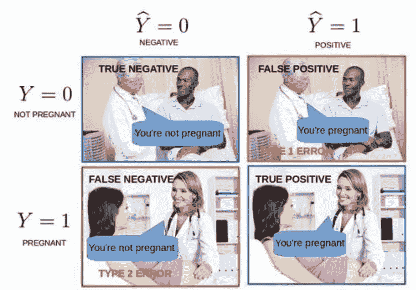

**步骤 4 - >** 让我们试着跳过 SVC &代之以用默认参数训练逻辑回归分类器。对于这个分类器，我们然后使用测试数据创建一个精确召回曲线和一个 ROC 曲线。但是，在我们开始深入研究代码之前，您需要了解一些事情:

> 注意:一条**精确-召回曲线**显示了召回和精确之间的权衡。
> 
> 注: **ROC 曲线**当真阳性率增加时，以假阳性率衡量成本。
> 
> 注意:信用卡公司旨在优化召回。当我在一家保险公司工作时，我们通常会优化精确度。召回只是所有实际欺诈案例中预测欺诈案例的一小部分。换句话说，我们抓到了多少诈骗案？这就转化成了𝑅𝑒𝑐𝑎𝑙𝑙=𝑇𝑟𝑢𝑒𝑃𝑜𝑠𝑖𝑡𝑖𝑣𝑒𝑠/𝑇𝑟𝑢𝑒𝑃𝑜𝑠𝑖𝑡𝑖𝑣𝑒𝑠+𝐹𝑎𝑙𝑠𝑒𝑁𝑒𝑔𝑎𝑡𝑖𝑣𝑒𝑠公式
> 
> Davis 和 Goadrich 在这篇[论文](http://ftp.cs.wisc.edu/machine-learning/shavlik-group/davis.icml06.pdf)中提出，在处理高度倾斜的数据集时，精确召回(PR)曲线将比 ROC 提供更多信息。PR 曲线描绘了精确度与召回率的关系(FPR)。因为精度直接受到类别不平衡的影响，所以精度-召回曲线更好地突出了高度不平衡数据集的模型之间的差异。当您比较具有不平衡设置的不同模型时，精确度-召回曲线下的区域将比 ROC 曲线下的区域更敏感。

在我谈论更多的 PR 曲线之前，让我先谈谈阈值的概念。

## PR 曲线的阈值设置

通常，分类模型预测概率。在我们的例子中，我们正在寻找给定记录的欺诈概率。通过将概率值与阈值进行比较(例如，如果概率超过 80%，则标记为欺诈)，我们可以将记录分类。这意味着我们需要首先定义规则。

**为什么会在意门槛和职业？**

> 当构建混淆矩阵和计算准确率和召回率时，我们需要预测的类别而不是概率分数。这就是原因。

您应该在任何想要可视化假阳性和假阴性之间的权衡的时候可视化精度-召回曲线。大量的假阳性导致低精度，大量的假阴性导致低召回率。

您应该以高精度和高召回模型为目标，但在现实中，一个指标更重要(在这种情况下召回，我们不想忽略任何欺诈者)，因此您可以随时为它进行优化。优化后，相应调整分类阈值。

我们将使用推荐的精确召回曲线下面积指标或 PR AUC。以下是你如何在脑海中形象化和合理化这个方法:

> 让我们开始写一些代码:

现在我们知道了什么是精度、召回率和阈值，一旦我们计算了多个阈值的精度和召回率，我们就在 x 轴上绘制召回率，在 y 轴上绘制精度-召回率曲线。

```
lr = LogisticRegression().fit(X_train, y_train)
#use logistic regression model to make predictions
y_score = lr.decision_function(X_test)
precision, recall, thresholds = precision_recall_curve(y_test, y_score)
#create precision recall curve
fig, ax = plt.subplots()
ax.plot(recall, precision, color='purple')#add axis labels to plot
ax.set_title('Precision-Recall Curve')
ax.set_ylabel('Precision')
ax.set_xlabel('Recall')#display plot
plt.show()
```

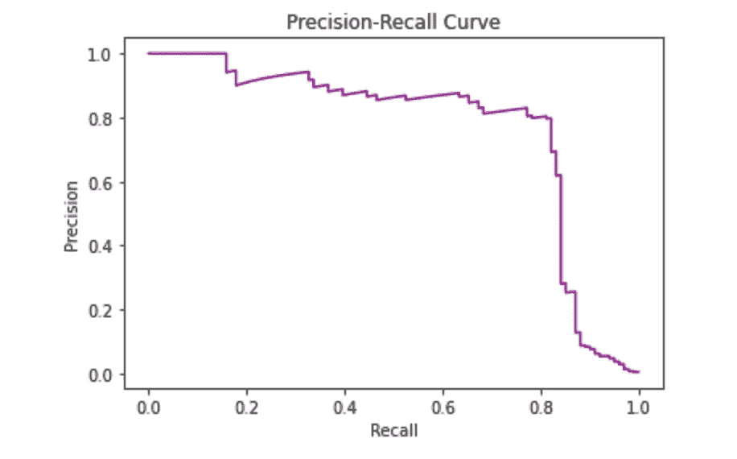

这表明召回率为 0.82(82%的欺诈交易在测试数据中被识别为欺诈交易)，其中 20%被预测为欺诈的交易被错误地预测)

## 让我们从不同的角度来看这个问题。

> 第一步:我们将让算法首先预测一个概率或类似概率的度量。
> 
> 步骤 2:然后在不同的阈值范围内使用精度和召回率来评估预测的概率，以将概率映射到类别标签，并且作为最后一步
> 
> 步骤 3:这些阈值曲线下的面积被报告为模型的性能。
> 
> 最终结果:这允许最终模型的操作者选择将概率映射到类别标签(欺诈或非欺诈交易)的阈值，该阈值最好地平衡最终模型的精确度和召回率。
> 
> 我们将如何做第一步:当涉及到评估模型时，我们将使用**重复 k-fold 交叉验证和分层**。为什么我们要这样做？在 k 折叠中具有大约十个折叠，其中每个折叠包含 284807/10 = 28480 个示例，这将比单个训练测试分割做得好得多。这将确保模型性能不会偏向于非欺诈案例。**使用分层**就像锦上添花，我们将能够保护 99.8%到 0.2%的正常和欺诈交易。**简单地说，重复 3 次**意味着评估过程将被多次执行，以避免结果的偶然性，并更好地捕捉所选模型的变化。

**第一步:让算法预测**

在这里，我们将依次定义每个模型，并将它们添加到一个列表中，以便我们可以按顺序对它们进行评估。下面的 *get_models()* 函数定义了用于评估的模型列表，以及用于稍后绘制结果的模型简称列表。

在这种情况下，我们可以看到，所有测试的算法都具有这种技能，实现了高于默认值 0.5 的 PR AUC。结果表明，决策树算法的集成在这个数据集上都做得很好。

创建一个图形，显示每个算法的一个方框和须状图。该框显示中间的 50%数据，每个框中间的橙色线显示样本的中值，每个框中的绿色三角形显示样本的平均值。

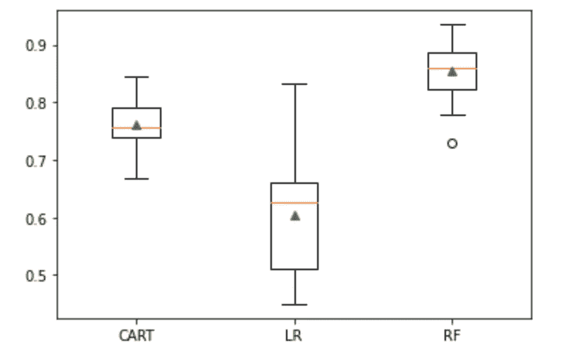

我们可以看到，决策树的 RF 和系综的分数分布是紧密的，并且平均值似乎与中位数一致，这表明分布可能是对称的，并且可能是高斯分布，并且分数可能是相当稳定的。上述代码如下所示:

```
# spot check machine learning algorithms on the credit card fraud dataset
from numpy import mean
from numpy import std
from pandas import read_csv
from matplotlib import pyplot
from sklearn.preprocessing import StandardScaler
from sklearn.pipeline import Pipeline
from sklearn.model_selection import cross_val_score
from sklearn.model_selection import RepeatedStratifiedKFold
from sklearn.metrics import precision_recall_curve
from sklearn.metrics import auc
from sklearn.metrics import make_scorer
from sklearn.tree import DecisionTreeClassifier
from sklearn.neighbors import KNeighborsClassifier
from sklearn.ensemble import RandomForestClassifier
from sklearn.ensemble import ExtraTreesClassifier
from sklearn.ensemble import BaggingClassifier

# load the dataset
def load_dataset(full_path):
 # load the dataset as a numpy array
 data  = pd.read_excel(full_path,index_col= None, header= 0)
 # retrieve numpy array
 data = data.values
 # split into input and output elements
 X, y = data[:, :-1], data[:, -1]
 return X, y

# calculate precision-recall area under curve
def pr_auc(y_true, probas_pred):
 # calculate precision-recall curve
 p, r, _ = precision_recall_curve(y_true, probas_pred)
 # calculate area under curve
 return auc(r, p)# evaluate a model
def evaluate_model(X, y, model):
 # define evaluation procedure
 cv = RepeatedStratifiedKFold(n_splits=10, n_repeats=3, random_state=1)
 # define the model evaluation the metric
 metric = make_scorer(pr_auc, needs_proba=True)
 # evaluate model
 scores = cross_val_score(model, X, y, scoring=metric, cv=cv, n_jobs=-1)
 return scoresdef get_models():
 models, names = list(), list()
 # CART
 models.append(DecisionTreeClassifier())
 names.append('CART')models.append( LogisticRegression())
 names.append('LR')
 # RF
 models.append(RandomForestClassifier(n_estimators=100))
 names.append('RF')return models, names# define the location of the dataset
full_path = 'creditcard.xlsx'
# load the dataset
X, y = load_dataset(full_path)
# define models
models, names = get_models()
results = list()
# evaluate each model
for i in range(len(models)):
 # evaluate the model and store results
 scores = evaluate_model(X, y, models[i])
 results.append(scores)
 # summarize performance
 print('>%s %.3f (%.3f)' % (names[i], mean(scores), std(scores)))
# plot the results
pyplot.boxplot(results, labels=names, showmeans=True)
pyplot.show()
```

我们将使用 RF 模型作为我们的最终模型，因为它实现了高 PR AUC。

正如我们可能希望的那样，使用 F 分数作为度量标准，大多数示例都可以通过默认阈值 0.5 正确预测。

```
 model = RandomForestClassifier(n_estimators=100)
model.fit(trainX, trainy)
# predict probabilities
yhat = model.predict_proba(testX)
# keep probabilities for the positive outcome only
yhat = yhat[:, 1]
# calculate roc curves
precision, recall, thresholds = precision_recall_curve(testy, yhat)
# convert to f score
fscore = (2 * precision * recall) / (precision + recall)
# locate the index of the largest f score
ix = argmax(fscore)
print('Best Threshold=%f, F-Score=%.3f' % (thresholds[ix], fscore[ix]))
# plot the roc curve for the model
no_skill = len(testy[testy==1]) / len(testy)
pyplot.plot([0,1], [no_skill,no_skill], linestyle='--', label='No Skill')
pyplot.plot(recall, precision, marker='.', label='RF')
pyplot.scatter(recall[ix], precision[ix], marker='o', color='black', label='Best')
# axis labels
pyplot.xlabel('Recall')
pyplot.ylabel('Precision')
pyplot.legend()
# show the plot
pyplot.show()
```

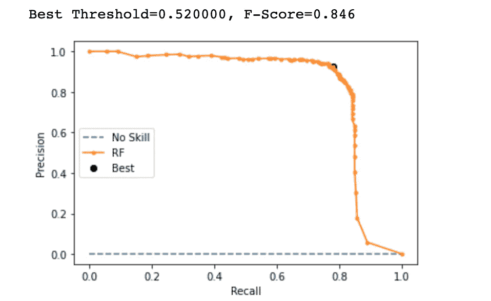

拟合最终模型包括在拟合模型之前定义管道来缩放数值变量。

然后，可以使用管道直接对新数据进行预测，并使用与对训练数据集执行的操作相同的操作来自动缩放新数据。

# **结论**

总之，我们学习了如何用强大的测试工具系统地评估一套机器学习模型&如何拟合最终模型，并使用它来预测特定案例中的欺诈概率。