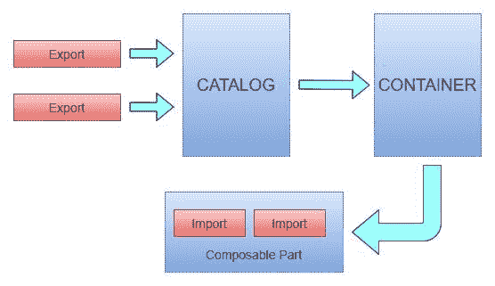

# 托管扩展性框架初学者指南

> 原文：<https://medium.com/codex/beginners-guide-to-managed-extensibility-framework-aa062b731f7?source=collection_archive---------31----------------------->

托管扩展性框架(MEF)是 of.NET 4.0 中的一项新功能。它允许开发人员设计可以在众多应用程序之间动态扩展和重用的应用程序。

MEF 使应用程序开发人员无需配置就能定位和使用扩展。它还使扩展作者封装代码和消除硬依赖变得简单。在这篇文章中，我们将了解关于 MEF 的一切，包括它是什么以及它是如何工作的。

**目录**

1.  什么是托管扩展性框架？
2.  关于托管扩展性框架的详细信息
3.  托管扩展性框架命名法
4.  托管扩展性框架(MEF)是如何工作的？
5.  结论

# 什么是托管扩展性框架？

MEF(托管扩展性框架)是一个包含的组件。通过使用松散耦合的类似插件的体系结构，Net Framework 4.0(和更高版本)使您能够创建轻量级和可扩展的应用程序。这个框架可以用来发现和使用扩展，而不需要任何配置。

MEF 使得增加应用程序的灵活性、可维护性和可测试性变得极其简单。使用 MEF 时，您可以在同一个应用程序内甚至跨应用程序重用扩展。MEF 也可以被认为是一个用于创建轻量级和可扩展应用程序的库。它还使扩展开发人员封装代码和避免硬依赖变得简单。

# 托管扩展性框架命名法

在我们开始使用托管可扩展框架之前，让我们先来看看一些基本术语，它们将帮助我们更好地理解它

*   部件:部件是一个对象(比如类、函数或属性),可以由插件导出，也可以由程序导入。
*   目录:目录是有助于从装配或目录中发现可组合零件的项目。
*   契约:导入和导出的片段必须通过契约(例如，接口或预定义的数据类型，如字符串)相互通信
*   导入属性:它具有挂钩或插座的功能。它定义了零件的要求，并且仅适用于单个导出属性。
*   导入:许多属性与导入属性相同，只是它允许导入许多导出属性。
*   导出属性(Export Attribute):这个属性充当了一个插头，可以连接到插座(即导入)来完成流。导入属性是导致需求的原因。Export 属性满足了这一需求。这意味着这些元素将被包括在组合物中。
*   合成:在 MEF 术语中，合成是导出和导入组件连接的空间，也是组装导出和导入零件的空间。

# 托管扩展性框架(MEF)是如何工作的？

托管扩展性框架为应用程序提供了一种隐式方法，以便在需要使用外部组件时发现它们。ComposablePart 组件是一个 MEF 组件。它列举了 ComposablePart 必须提供的所有功能。

导入指定了零件与其他组件的相互依赖关系。这些 ComposableParts 是可以在运行时发现的扩展。基于 MEF 的可扩展应用程序声明可由扩展组件填充的导入和向扩展公开服务的导出。每个扩展组件声明一个导出和导入(如果适用)。

CompositionContainer 持有所有 ComposableParts 并进行合成，是 MEF 合成范例(连接导入和导出)的核心。它也是最常用的复合容器。

现在让我们进入 MEF 的工作。应该发现托管可扩展框架的可提供组件。合同必须由供需双方签署(即接口)。每当需要将任何部件插入到应用程序(即:目录)中时，MEF 会从随机位置动态发现这些部件到目录或汇编中。只要符合约定，合成引擎(即合成容器)就会将这些片段组合在一起。

让我们通过图示来更好地理解这一点

## 合成容器、零件和目录

MEF 应用程序的基本构建组件是部件和组合容器。组件是导入或导出值的对象，包括组件本身。目录是来自单一供应商的零件的集合。为了执行合成，合成容器使用由目录提供的片段以及导入到排除的绑定。

## 进口和出口

组件通信的方式是通过导入和导出。该组件通过导入来表达对特定值或对象的需求，并通过导出来指定值的可用性。通过合同，每一项进口都与一份出口清单相匹配。

# 结论

许多架构师和开发人员已经在他们的架构中使用了 MEF，它允许他们更快更好地创建更多复合的、可扩展的、经过测试的和可伸缩的应用程序。你还在等什么？继续在您的组织中使用它来增强您的应用程序。

*原载于*[*https://www . partech . nl*](https://www.partech.nl/nl/publicaties/2021/08/beginners-guide-to-managed-extensibility-framework)*。*