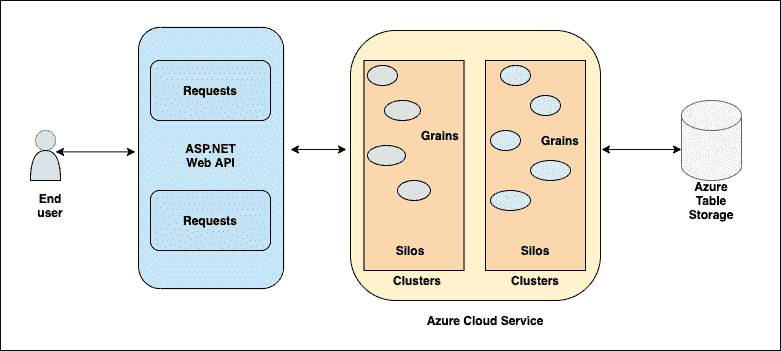

# 微软奥尔良初学者指南

> 原文：<https://medium.com/codex/beginners-guide-to-microsoft-orleans-d32446811499?source=collection_archive---------12----------------------->

设计一个高度可伸缩和可靠的应用程序是一项艰巨的任务，比我们想象的要复杂得多。遵循复杂的并发和扩展模式会加剧应用程序的复杂性，并把事情搞得一团糟。

在这个数字时代，可扩展的应用程序非常受欢迎，因为病毒式营销可以通过巨大的流量让你的应用程序一夜成名。但是什么是可伸缩性呢？

简而言之，可伸缩性是系统处理不同方向不断增长的使用量的属性。可伸缩性是蛋糕上的糖衣，而分布式计算是整个蛋糕。

在分布式系统中，组件位于网络中的不同计算机上，通过传递消息来相互通信和协调。分布式也意味着你的数据库不是运行在一个单一的巨型数据库上。您的数据被复制到多台计算机上，这样，如果一个系统出现故障，复制到另一个系统上的数据可以使用。

网飞是可扩展分布式系统的一个很好的例子。其他例子包括银行系统、大型多人游戏平台、聊天室和蜂窝网络。现在想象一下构建这样一个全方位可扩展的系统。

使用传统的并发方法和扩展模式来构建分布式系统会使它变得更加复杂。这就是为什么需要一个开发人员友好的框架来构建一个可伸缩的分布式系统。微软奥尔良服务于确切的目的。

**目录**

1.  什么是微软奥尔良？
2.  什么是演员模特？
3.  微软奥尔良的工作
4.  Microsoft Orleans 的使用案例
5.  包扎

# 什么是微软奥尔良？

Microsoft Orleans 是一个跨平台框架，用于构建可按需扩展的健壮分布式应用程序。Orleans 建立在。网芯。然后它把它带到分布式服务的世界，比如云。Orleans 将其扩展从单个本地服务器扩展到云中的全球分布式应用程序。

它由 Cloud Research 开发，使用虚拟角色模型作为在云中构建下一代分布式系统的新方法。

# 什么是演员模特？

虚拟角色模型是用于实施并发计算的概念模型。它定义了不同系统组件如何相互作用的一般规则。演员是一个计算单位。一个演员是孤立的，从来没有共享的记忆。无论是交换信号还是数据，一个参与者的状态永远不会被另一个参与者直接改变。接收消息的参与者能够

1.  同时与其他参与者分享信息
2.  创造新的演员和
3.  改变他们的内部状态

Orleans 涉及到构建一个有状态的中间层，在这个中间层中，各种业务逻辑对象可以在一个孤立的全局可寻址的海洋中找到。NET 对象。这些被称为不同应用类型的颗粒。它们分布在一个称为筒仓的服务器集群上。

在整体式系统中，您只能选择纵向扩展。但是对于使用微服务和 actor 模型构建的系统，您可以选择向外扩展。那么，纵向扩展和横向扩展意味着什么？

向上扩展意味着向运行系统的硬件添加更多资源，无论是 RAM、更多 CPU 还是内存。这意味着整个开发模型被限制在一个盒子里。

但是向外扩展是一种更加外向的方法，这意味着您可以向一个具有新资源的服务器集群添加一台全新的机器。

# 微软奥尔良的工作

奥尔良的工作基于以下理念-

**颗粒**——这些就是上面描述的虚拟演员。颗粒实际上是包含你要分发的逻辑的对象。每个单独的颗粒都习惯于单线程操作，以避免死锁和竞争情况。它被编程为异步工作(这意味着允许多个操作同时发生)，并打算以更快的速度运行。

**筒仓**——假设这是你储存谷物的地方。根据您的需要，筒仓可以容纳几种谷物类型及其类型的实例。

**集群** —筒仓的集合，这允许利用 Orleans 的横向扩展优势。您需要更多或更少的资源，您可以删除或添加集群来轻松地扩展您的应用程序。

# Microsoft Orleans 的使用案例

奥尔良是理想的-

*   当你的系统有大量的实体时
*   当您拥有松散连接的系统和智能缓存时
*   当您被迫在多台服务器上运行应用程序时(可能是在黑色星期五销售这样的高峰时段)
*   当您的应用程序不需要停机时
*   当您的客户需要快速响应时
*   当您的应用程序有几个长生命周期的参与者时。产品、库存、仓库等就是一个很好的例子。还有生命周期较短的参与者，如支付交易、订单和购物车物品。

奥尔良并不理想-

*   当您拥有没有分布式系统前景的紧密耦合系统时
*   当您的系统包含较少的组件和对象时
*   当您打算执行计算密集型任务时。
*   当演员需要直接访问彼此的记忆时
*   当应用程序的运行需要全局协调时
*   管理多个版本的颗粒是非常复杂的，从长远来看会变得难以管理。因此需要多次额外的部署来将颗粒从状态 A 迁移到状态 b。

# 包扎

当您从单一服务器系统切换到分布式服务器系统时，无论是 2 台服务器还是数千台服务器，您都会享受到奥尔良的额外好处。当您有一天需要扩展时，您甚至可以开始利用 Orleans 来构建单个服务器设置，以便它能够完全容错。这里的美妙之处在于代码不会改变。向外扩展是一件必不可少的事情，因为应用程序的成功和影响范围取决于经常使用它的客户数量。只需添加更多的服务器，观察谷物在筒仓中的分布，让您的应用程序准备好在高峰时段为其客户服务。

*原载于*[*https://www . partech . nl*](https://www.partech.nl/nl/publicaties/2021/07/beginners-guide-to-microsoft-orleans)*。*