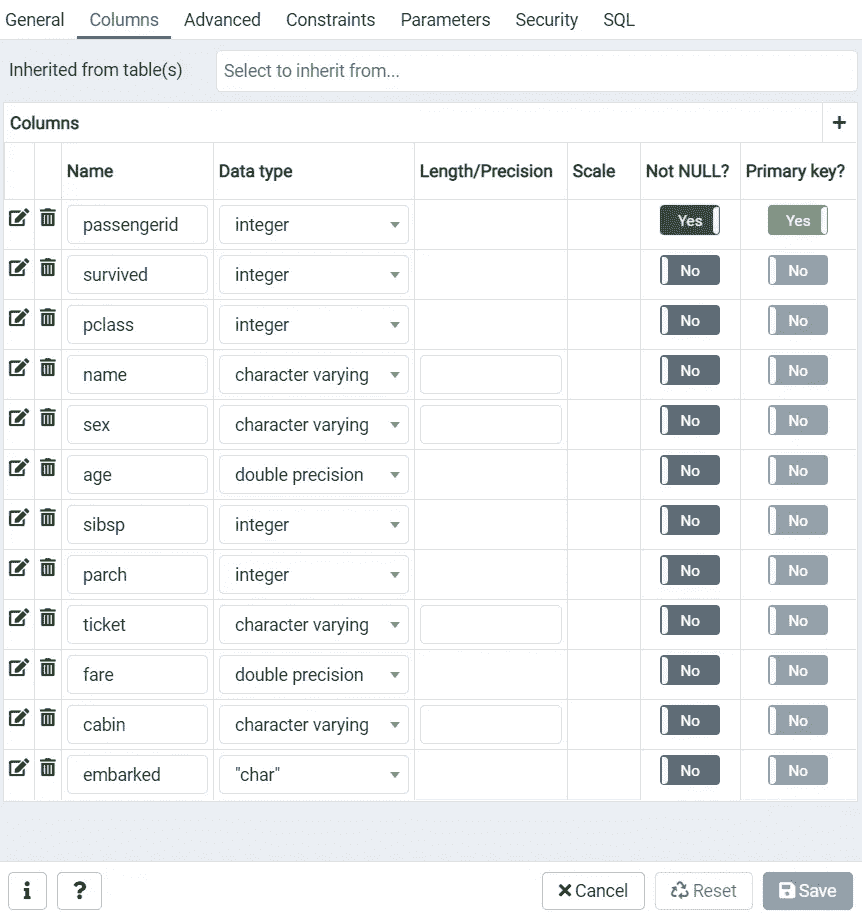
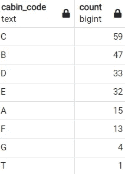

# 使用 PostgreSQL 进行数据分析的 SQL 初学者指南

> 原文：<https://medium.com/codex/beginners-guide-to-sql-for-data-analysis-using-postgresql-4ed443308835?source=collection_archive---------5----------------------->

## 本文讨论了一些对数据分析有用的基本 SQL 命令。本文不涵盖涉及多个表的高级技术。

约书亚·索蒂诺在 [Unsplash](https://unsplash.com/s/photos/data-management?utm_source=unsplash&utm_medium=referral&utm_content=creditCopyText) 上拍摄的照片

# 结构化查询语言(SQL)

SQL 是一种用于管理关系数据库的语言，其中数据以表格的形式存储。关系数据库管理系统(RDBMS)中的表类似于电子表格，其中每一列称为一个字段，每一行称为一条记录。“姓名”、“年龄”、“性别”是字段的几个例子。

# 数据导入

我们将使用来自 [Kaggle](https://www.kaggle.com/hesh97/titanicdataset-traincsv?select=train.csv) 的 Titanic 数据集，并将其导入 Postgres/PostgreSQL。下面是将数据导入 Postgres 的过程。

**第一步:**

右键单击“数据库”，选择“创建”->“数据库”，输入数据库名称，然后单击“保存”。

作者图片

**第二步:**

在您创建的数据库下，右键单击“模式”下的“表”，然后选择“创建”->“表”。键入表的名称。

作者图片

**第三步:**

在上面对话框的 Columns 选项卡中，从下载的 Titanic 数据集创建列(确保以小写输入列名),然后单击 Save。

作者图片

**第四步:**

右击 titanic 表，选择“导入/导出”菜单选项，将“导入/导出”切换开关改为“导入”。在“文件名”文本框中输入下载的 Titanic csv 文件的位置，并将“标题”切换开关更改为“是”，然后单击“确定”。这将数据导入到 titanic 表中。

作者图片

# 提取数据的基本 SQL 命令

在这一节中，我们将讨论几个从表中获取数据的基本 SQL 命令。这些命令与“选择”命令一起使用，该命令是数据查询语言(DQL)的一部分。

## 挑选

“SELECT”是从表中提取数据的主要命令。如果没有“SELECT”命令，您无法想象从表中获取数据的查询。我们将返回泰坦尼克号表格中的前 5 条记录。

作者图片

作者图片

## 明显的

“DISTINCT”关键字返回字段中的唯一值。我们将选择“性别”字段中的唯一值。

作者图片

作者图片

## 在哪里

“WHERE”子句用于指定要返回的记录的条件。我们将选择“性别”为男性的列。字符串应该用单引号引起来。

作者图片

作者图片

## 和

“AND”是 SQL 中的逻辑运算符，类似于其他编程语言。' AND '返回满足所有规定条件的记录。我们将从《泰坦尼克号》中选择年龄小于 10 岁且存活=0(未存活)和 pclass=1 的记录。

作者图片

作者图片

上面的查询结果显示，第一个班只有一个孩子没有活下来。

## 运筹学

“OR”是 SQL 中的逻辑运算符，类似于其他编程语言。' OR '返回满足任一指定条件的记录。我们将从“泰坦尼克号”中选择“性别”和“年龄”，其中“性别”是女性或年龄小于 5。

作者图片

作者图片

## 不

“NOT”是与其他编程语言类似的求反运算符。我们将从《泰坦尼克号》中选择不属于女性的独特的“性”价值观。

作者图片

作者图片

## **< >(不等于)**

<>是一个比较运算符，在其他语言中并不常见。<>‘不等于且类似’的意思！='.既有“<>”又有“！= '在 Postgres 工作。

作者图片

作者图片

## 别名

SQL 中的别名使我们能够为查询结果中返回的字段指定一个自定义名称(别名)。我们将选择《泰坦尼克号》中独一无二的“性”作为“独一无二的性”。我们可以使用“as”关键字为查询结果中的字段指定一个别名。别名不会影响表中的字段名称。

作者图片

作者图片

## 空

“NULL”表示字段中缺少值。它类似于 Python 中的‘NaN’。我们将选择在“cabin”字段中具有空值的记录。我们可以通过使用“IS NULL”来实现。

作者图片

作者图片

现在，我们将选择“cabin”字段中没有缺失值的记录。我们可以使用“IS NOT NULL”来实现。

作者图片

作者图片

## 在…里

“IN”与“WHERE”子句一起使用，返回给定条目列表中的记录。让我们选择“幸存”、“已上船”和“sibsp”，其中“已上船”等于“S”和“C”，“sibsp”等于 0、1 和 3。

作者图片

作者图片

## 在...之间

“BETWEEN”与“WHERE”子句一起使用，返回字段在范围[a，b](包括这两个范围)内的记录。让我们选择“幸存”、“sibsp”和“上船”，其中“sibsp”在范围[2，4]内，“上船”在范围[“A”、“Q”]内。

作者图片

作者图片

## 喜欢

“LIKE”与“WHERE”子句一起使用，返回条目与模式匹配的记录。可以使用通配符指定模式。“%”表示零个或多个字符，而“_”表示单个字符。让我们选择包含“A”和两个以“G”开头的字符舱的名称。

作者图片

作者图片

“LOWER”关键字将字符串/文本转换为小写。因为模式匹配是 SQL 区分大小写的，所以将文本转换成小写/大写会使大小写一致。

## 聚合函数

聚合函数用于汇总我们的数据。聚合函数的几个例子是 count、sum、avg、min、max 等。我们将看几个重要的数据分析。

**COUNT**:‘COUNT’返回表格或字段中非空条目的计数。

**SUM** :返回一个字段中条目的总和。

**AVG** :返回字段中非空条目的平均值。

**MIN** :返回一个字段的最小值。

**MAX** :返回一个字段的最大值。

**方差**:返回一个字段中条目的样本方差。

**STDDEV** :返回字段中条目的样本标准差。

**CORR** :返回两个数值字段之间的皮尔逊相关系数。

**COVAR_SAMP** :返回两个数值字段之间的样本协方差。

我们将在下面的示例中查看“年龄”字段上的所有这些聚合函数。

作者图片

作者图片

我们将计算“年龄”和“费用”字段之间的相关系数和样本协方差。

作者图片

作者图片

## 以...排序

“排序依据”默认情况下按升序对字段中的条目进行排序(要按降序排序，请使用关键字 DESC)。我们将通过按降序对“年龄”进行排序来选择“年龄”和“存活”字段。

作者图片

作者图片

## 分组依据

“分组依据”根据指定的字段对记录进行分组。这有助于对字段中的组执行聚合。让我们按性别找出乘客的数量。

作者图片

作者图片

## 拥有

“HAVING”类似于“WHERE”子句，与“GROUP BY”一起使用以指定条件。我们会清点船上兄弟姐妹/配偶的数量。让我们忽略少于 10 名的乘客。

作者图片

作者图片

## 数学函数

数学函数用于对表中的字段执行数学运算。下面是几个常用的数学函数。

**舍入**:将数值字段舍入到指定的精度。

**SQRT** :返回数值字段的平方根。

**CBRT** :返回数值型字段的立方根。

**FLOOR** :将数值字段向下舍入到最接近的整数。

**CEIL:** 将数值字段向上舍入到最接近的整数。

**TRUNC** :返回数值型字段的整数部分。

**LOG:** 返回数值型字段的对数(基数为 10)。LN '返回自然对数。

**EXP** :将数值字段中的值提升到“e”的幂。

**幂**:将数值字段中的值提升到指定的幂。

作者图片

当 round 函数返回错误时，添加::DECIMAL 或::NUMERIC。这会将该字段转换为数值字段。

作者图片

## 字符串函数

字符串函数用于操作文本字段。我们将看看几个常用的字符串函数。

**LOWER** :将文本字段的值转换成小写。

**大写**:将文本字段的值转换成大写。

**INITCAP** :将文本字段的值转换成标题大小写。

**TRIM** :删除前导和尾随空格。

**LEFT** :从左边返回‘n’个字符。

**右侧**:从右侧返回‘n’个字符。

**LENGTH** :返回字段值的字符数。

**SUBSTR** :从位置‘p’返回‘n’个字符。

**位置**:返回主字符串中子串的索引。

**子串**:从位置‘p’返回‘n’个字符。它还有另一个变体，匹配正则表达式并返回匹配模式的子串。

**替换**:用主字符串中的另一个字符串替换一个子字符串。

**重复**:将一个字符串重复‘n’次。

**反转**:反转一个字符串。

作者图片

作者图片

# 分析 Titanic 数据集的几个示例查询(对于绝对初学者是可选的)

## 幸存的男性和女性比例是多少？

作者图片

作者图片

## 每班幸存乘客的百分比是多少？

作者图片

作者图片

## 按标题数乘客人数？

作者图片

当我们需要使用另一个表的结果而不将两个表连接起来时，就使用以“with”开头的第一个语句。在上面的查询中，我们需要 titanic 表中的记录数来计算比例。我们用了‘total . count’，这是泰坦尼克号表中记录的数量。

作者图片

## 每班的平均票价、乘客人数和总票价是多少？

作者图片

作者图片

## 有兄弟姐妹/配偶在飞机上有助于乘客生存吗？

作者图片

作者图片

## 每个客舱代码(客舱字符串中的第一个字符)的乘客人数是多少？

作者图片

作者图片

这是一些用于涉及单个表的数据分析的基本 SQL 命令。本文是初学者开始使用 SQL 进行数据分析的综合指南。一旦熟悉了 SQL 的基础知识，读者就可以进一步学习涉及多个表的连接、子查询。