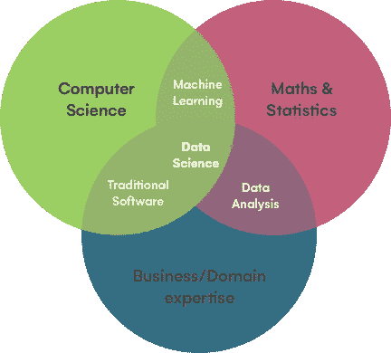

# 面向有抱负的 Python 数据分析师/科学家的初学者资源

> 原文：<https://medium.com/codex/beginners-resources-for-aspiring-python-data-analysts-scientists-2d7cb03dd1c4?source=collection_archive---------9----------------------->

## [法典](http://medium.com/codex)

在我为 [CodeFirstGirls](https://codefirstgirls.org.uk) 教授 Python 入门课程的最后，我们收到了几个关于如何开始学习使用 Python 库进行数据分析、可视化和数据科学的热情问题。不久前我才了解到这些，我想我应该分享一些我个人认为有用的资源！

在我深入研究之前，我认为首先澄清数据分析和数据科学的实际含义以及它们的区别是很重要的(因为它们经常被混淆)。

**数据分析** =识别数据集中的趋势，执行描述性统计，开发图表和数据可视化，以帮助个人或公司做出具体的战略决策(通常是商业决策)的行为。

**数据科学** =指从数据中提取真实世界知识的更广泛的探索性追求(数据分析可以被认为是数据科学的一个子集)。除了开发可视化，数据科学往往涉及建立更复杂的统计模型来表示数据(如线性回归)，或训练机器学习模型来进行未来预测。通常这比数据分析涉及更多的编码和计算机科学专业知识。

来源:[https://www . iron hack . com/en/data-analytics/data-science-data-analytics](https://www.ironhack.com/en/data-analytics/data-science-data-analytics)

*来源:* [*https://hackr.io/blog/data-science-vs-data-analytics*](https://hackr.io/blog/data-science-vs-data-analytics)*[*https://www . northeast . edu/graduate/blog/data-analytics-vs-data-science/*](https://www.northeastern.edu/graduate/blog/data-analytics-vs-data-science/)*

# ***数据分析和可视化资源***

*首先，这里有一些你应该知道的广泛使用的库。文档的以下链接还包括您可以查看的教程:*

*   *[**熊猫**](https://pandas.pydata.org/docs/index.html)—“Python 数据分析库”。它允许快速和容易地操作表格和时间序列数据；行和列的合并和连接、groupbys 之类的聚合以及丢失数据点的有效处理。它建立在 Numpy 之上，引入了两种基本的数据结构 Series(用于一维数据)和 DataFrame(二维数据)。*
*   *[**Numpy**](https://numpy.org/) —允许支持和操作多维数组和矩阵数据结构。在数据分析的上下文中，数据通常定义在 Numpy 数组中，这就是我们创建 Pandas 数据帧的方式。*
*   *[**Matplotlib**](https://matplotlib.org/) —用于绘制各种图形和图表，以实现统计可视化*
*   *[**Seaborn**](https://seaborn.pydata.org)**——matplotlib 的替代方案(人们倾向于觉得它更美观一点)***

***我发现学习这些库的最好方法是跟随实际的例子，同时查阅官方文档以确保我理解每个函数的作用。我推荐关注[迈向数据科学](https://towardsdatascience.com)中的博客文章，并在[谷歌实验室](https://colab.research.google.com/notebooks/intro.ipynb#)上找到可以实时浏览的笔记本。***

***以下是一些起点:***

1.  ***[Python 数据分析初学者指南(面向数据科学)](https://towardsdatascience.com/a-beginners-guide-to-data-analysis-in-python-188706df5447)***
2.  ***[Python 中的数据可视化(中后期)](/in-pursuit-of-artificial-intelligence/data-visualization-in-python-9aa1d9c2baec)***
3.  ***[熊猫简介(谷歌 Colab)](https://colab.research.google.com/notebooks/mlcc/intro_to_pandas.ipynb)***
4.  ***[使用 Seaborn (Google Colab)进行可视化](https://colab.research.google.com/github/jakevdp/PythonDataScienceHandbook/blob/master/notebooks/04.14-Visualization-With-Seaborn.ipynb)***

# *****机器学习和数据科学资源*****

***当学习更高级形式的数据科学时，即训练预测模型、构建和优化机器学习算法，理解这些方法背后的数学和统计理论变得非常重要。尽管许多现代 Python 库将这些算法的实现抽象为单行代码，但理解它们如何工作的基本理论对于确保您获得的结果是准确和适当的至关重要。例如，知道哪个分类器或回归方法对您的特定数据集有意义，防止数据泄漏(您无意中将测试数据输入到训练过程中)，以及知道如何优化模型超参数。也就是说，一开始不要太担心完全掌握所有的数学细节(这一开始可能会很吓人！)—我发现最好同时学习理论和实用编码。***

## *****为了理解理论:*****

*   ***[**吴恩达的机器学习 Coursera**](https://www.coursera.org/learn/machine-learning) 对于机器学习概念的更一般的概述。它变得非常数学化，可能缺乏实际的一面(除了基于 MATLAB 而不是 Python 之外)，但这对于确定理论和概念基础来说是非常理想的。***
*   ***[**深度学习。AI Coursera**](https://www.coursera.org/specializations/deep-learning#courses) 更侧重于深度学习算法，如神经网络，也包括 Jupyter 笔记本，你可以通过它工作。尽管只有当你至少了解了一些通用的 ML 概念后，我才会继续讨论这个问题。***

## *****学习实用方面:*****

***以下是一些广泛使用的机器学习库:***

*   ***[**Scikit-learn**](https://scikit-learn.org/stable/)**—实现广泛的分类、回归、聚类、降维、模型选择和预处理算法(基于 NumPy、SciPy 和 matplotlib)*****
*   *****[**tensor flow**](https://www.tensorflow.org)—Google 开发的专注于深度神经网络训练和推理的库*****
*   *****[**py torch**](https://pytorch.org)**——类似 Tensorflow，但更强调计算机视觉和自然语言处理*******

*******就像上面提到的数据分析库一样，我发现对我来说最好的学习方法是通过其他人的代码的例子。除了 TowardsDataScience 博客帖子和 Google Colab 笔记本，我还发现以下资源非常有帮助:*******

*   *******[**ka ggle Code**](https://www.kaggle.com/code)**:**
    ka ggle 是一个在线平台，公司和组织向公众分享他们的数据集，用户竞相为他们的用例建立最高精度的机器学习模型。但是除此之外，还有一个针对初学者的丰富而广泛的 Jupyter 笔记本档案，它解释了他们代码中的每一步。通过上面的链接，你可以搜索任何类型的数据集或你想了解的机器学习方法(不过要确保你是通过 Python 过滤的)。举个例子，这是我跟踪的第一批笔记本之一— [什么会导致心脏病？解释型号](https://www.kaggle.com/tentotheminus9/what-causes-heart-disease-explaining-the-model)*******
*   *****[**使用 Scikit-Learn、Keras 和 TensorFlow 进行机器实践学习，第二版**](https://www.oreilly.com/library/view/hands-on-machine-learning/9781492032632/) **:**
    如果你发现写在纸上的概念更容易掌握，我推荐这本教科书作为如何使用 Python 中最流行的机器学习库的实用指南。它特别擅长只解释最相关的理论，然后给你代码示例，你可以自己尝试。*****
*   *****[**data quest . io**](https://www.dataquest.io/data-science-courses-directory/)**:** 一个提供一系列数据科学和机器学习互动课程的网站。完整版是付费的，但你仍然可以访问一系列免费课程来开始学习。*****

*****希望有所帮助！*****