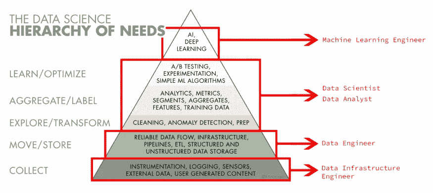
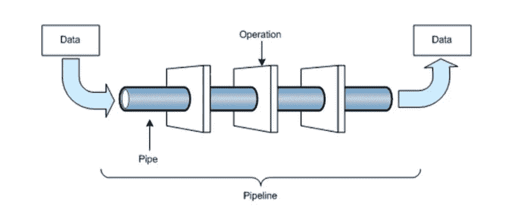

# 数据工程指南

> 原文：<https://medium.com/codex/beginning-to-data-engineering-49521538e2f4?source=collection_archive---------0----------------------->

我收集了关于数据工程的事实、路线图、教程链接、建议和概念。

**“数据工程师不提供*直接*的商业价值——他们的价值在于让您的数据分析师和科学家更有效率……数据工程师必须对为分析和数据科学团队构建工具感到兴奋。”[9]**

**内容:**

**数据工程师 vs 数据科学家**

**数据工程师和数据科学家的预期技能**

**数据工程正在改变**

**数据工程需求**

**数据工程的概念**

**数据工程的缺点**

**路线图**

**教程链接**

# **数据工程师 vs 数据科学家**

每个公司的角色描述都不一样。下图描述了一般描述，但职责各不相同。在一些公司，数据工程师也处理后端/前端编程，而一些数据科学家管理整个数据科学层次结构。

*数据科学需求层次—* [*莫妮卡·罗加蒂*](https://medium.com/u/b31aba7f4828?source=post_page-----bc8dab5ac124--------------------------------)

数据工程师设计、构建、测试和维护数据库和大规模处理系统等架构。数据工程师收集相关数据。这些数据被移动并转化为数据科学团队的“管道”。根据任务的不同，他们可能会使用 Java、Scala、C++或 Python 等编程语言。

数据科学家清理、传递和组织大量数据。统计和分析用于创造洞察力、建立模型和解决业务问题。数据科学家为公司分析、测试、汇总和优化数据。

数据工程师创建自动化方法和模型数据结构，使数据得到有效处理。数据工程师的目的是构建和开发表和数据管道，以支持分析仪表板和其他数据客户(如数据科学家、分析师和其他工程师)。[2]

熊猫和 Scikit 学习库将由数据科学家使用，而 Python 将由数据工程师用来管理管道。像 Airflow 和 Luigi 这样的库在这里会很有帮助(稍后解释)。同样，数据科学家的调查本质上也是临时的。另一方面，数据工程师将专注于清理和操作数据。[2]

AI 工程师，机器学习工程师，或者深度学习工程师被一些程序先进的公司聘请来完成他们的团队。

# **数据工程师和数据科学家的预期技能**

数据科学家利用干净的数据得出答案，与团队交流分析结果，展示数据，并根据他们的发现做出决策。

数据工程师必须具备强大的沟通、解决问题、分析和假设检验能力，并对机器学习、数据挖掘、统计学和大数据基础设施中的各种方法有透彻的理解。

**数据工程师背景**

数据科学家通常进行研究，拥有硕士学位使申请人有资格申请数据科学职位。开发对于数据工程来说是必须的，他们必须具备动手编程的知识，而不是硕士学位。

# 数据工程正在改变

“在混乱中扩展是极其困难的。数据工程师处理混乱，因为工具不能。我们需要数据工程师来帮助构建工具，为数据科学家提供支持，而不是将熊猫转化为火花。”[1]

数据工程的乏味部分正迅速被软件自动化。2019 年，你可以购买现成的技术来完成大部分工作。在大多数情况下，您和您的数据分析师和科学家可以在没有具有丰富数据工程知识的人的帮助下创建完整的管道。[9]

现在，基于 Stitch / Fivetran / dbt 的管道比基于定制气流任务的管道可靠得多。

工程师不应该写 ETL，那应该怎么做？数据工程师仍然是任何高功能数据团队的重要组成部分。

您的数据工程师不应开发现成的接收管道和执行基于 SQL 的数据转换，而应专注于管理和优化核心数据基础架构、构建和维护自定义接收管道、协助数据团队资源进行设计和性能优化，以及构建非 SQL 转换管道。[9]

# 数据工程需求

*“数据工程师的职位空缺数量几乎是数据科学家职位空缺数量的五倍。这是有道理的，因为大多数组织需要的数据工程师比他们团队中的数据科学家多"*此外，许多非技术背景的毕业生对数据科学感兴趣，尽管数据工程需要一套独特的技能。

全球平均月薪为 9，200 美元，土耳其平均月薪为 9，000 土耳其里拉(1.055 美元)(2021 年 8 月)。

# **数据工程的概念**

**“数据工程师专门从事 3 种主要的数据活动:设计、构建和安排数据“管道**”。[3]

他们类似于数据架构师。数据工程师通常具有计算机工程或科学背景，以及系统开发专业知识。

## 什么是数据管道？[3]

数据管道是为特定目的而应用于数据的处理和分析阶段的集合。它们在生产项目中是有益的，如果人们预期在将来会遇到相同类型的业务问题，为了节省设计工作和编码，它们也是很方便的。例如，可以消除异常值，使用降维技术，然后将结果通过随机森林分类器，以提供对每周数据集的自动分类。[4]

从原始数据创建结果数据的数据管道[3]

数据工程活动包括设计和配置用于分析的大型数据基础设施，创建复杂的查询以建立管道，以及在编程系统中安排问题。

## 维度建模(也称为星形模型)〔5〕

因为我们有不同的需求，所以我们在维度建模中对数据建模的方式不同。维度建模由两个主要部分组成:事实表和维度。顾名思义，我们将事实存储在事实表中。例如，我们卖出了一件商品。这种秩序将成为事实，在某个时间点发生的事情。

接下来是尺寸。维度提供了关于该事实的进一步信息。我们可以有产品维度、客户维度、日期维度等等。代理键将事实表连接到维度。该键指的是某个时间点的维度项目。

## 了解您的基础设施[5]

处理数据时，您必须创建一个基础结构来存储和处理数据。

有两种选择:利用 Hadoop 版本或使用云技术，如 AWS Redshift 和其他服务。如果您不想处理基础设施维护，建议使用 AWS 解决方案。然而，如果你想对整个过程有更多的控制，建议使用 Hadoop 版本。

Cloudera 是 Hadoop 发行版。建立一个只有几个节点的集群并开始利用 HDFS 以分布式方式存储数据是相当简单的。与 MapR 等替代发行版相比，管理 Cloudera Director + Manager 更简单。

如果您选择云解决方案，您最有可能使用 S3 进行数据存储，并使用 AWS Redshift 来执行处理和查询数据。您可以在您的 Hadoop 发行版中使用 Impala(推荐)或 Drill 来使用 SQL 语法查询您的数据。Impala 和 Hive metastore 一起，是使用 SQL 查询数据的优秀工具。

## 分析您的数据[5]

当数据放入分布式系统后，接下来的步骤是开始分析它。为数据转换和聚合创建各种表。

Spark 是以分布式方式运行活动的强大工具，允许您轻松地编辑和转换输入。更自然的活动通常是批处理过程。但是，如果您需要实时分析，您可以将 Spark Streaming 与消息代理系统(如 Kafka)结合使用。Spark 支持多种编程语言，包括 Java、Scala 和 Python。

使用 Spark，您可以将代码发送到数据节点，并以分布式方式执行转换，尝试利用节点的内存而不是文件系统。这是相对于 Map/Reduce 的一个优势。

## **精心安排你的任务【5】**

气流和 Luigi 是任务编排的两个最重要的工具。Luigi 快不行了，失去支持，Airflow 是以 Airbnb 为主要支持者的 Apache 项目。您可以使用 Airflow 创建有向无环图(DAG ),以指定 DAG 执行任务的顺序。DAG 是一组按特定顺序运行的作业。

这也被称为 ETL(提取、转换和加载),因为所有的任务都将完成这三个过程。从 API 中提取数据，转换数据，最后将数据加载到您的数据解决方案中。

以下是数据工程师和数据基础设施工程师可能构建和操作的一些服务示例:

*   **数据摄取**:用于“抓取”数据库、加载日志、从外部存储或 API 检索数据等的服务和工具。
*   **度量计算**:计算和总结与参与度、增长或细分相关的度量的框架。
*   **异常检测**:自动化数据消费的过程，以便在异常事件发生或模式发生剧烈变化时通知人类。
*   **元数据管理:**用于生成和消费元数据的技术，使在数据仓库中及其周围查找信息变得容易。
*   **A/B 测试:** A/B 测试和实验框架通常是公司分析的重要组成部分，其中包含大量的数据工程成分。
*   **仪器**:分析从记录事件和与这些事件相关的属性开始；数据工程师在确保上游记录高质量数据方面有既得利益。
*   **会话化**:专门理解一系列事件的管道，允许分析师理解用户习惯。

# 数据工程师工作的缺点**【10】**

**厌倦【7】**

编写和维护 Extract Transform and Load (ETL)逻辑比看着油漆变干更有趣。大多数 ETL 作业需要很长时间来运行，错误或问题通常发生在运行时或者是运行后断言。

## 太新了

近年来，它有了自己的生命。不会有很多关于这个主题的大学课程，也不会有很多数据工程训练营。结果，工程师们在工作中学会了他们的大多数最佳实践。数据工程是一个真正的混合角色，是数据爆炸和技术创新的结果。

## 数据太多

数据的增长速度超过了大多数人的承受能力，这导致了一些问题。

## 性能差

所有这些数据甚至会给最强大的设备带来压力。报告和模型滞后，因为它们试图消化流经它们的大量数据。如果您不小心，您的数据需求可能会超过您的机器的能力。

## 无法获取数据

对于努力以足够快的速度绘制数据集的工程师来说，所有这些数据可能会让人不知所措。旧的 ETL 技术可能代码量很大，并且会阻碍您的过程，但这并没有帮助。一种可能的选择是使用 ELT 系统—提取、加载和转换—根据需要与数据进行交互。

它可能与您的数据治理策略相矛盾，但是它对于建立更广泛的数据视图并指导您为您的主模型建立更好的数据集是有价值的。

## 数据管道维护

随着对更多数据管道的需求和海啸般的大数据泛滥，最困难的数据工程任务之一是保持现有管道的运行。

## 数据治理，或者缺乏数据治理

它给数据工程增加了一层您可能想要避免的官僚作风。

一种解决方案是实现某种数据治理计划。根据你公司的规模，这可能是一本手册的一页，也可能是一个更大的委员会。重要的是您有一个适当的策略来确保数据输入和输出是一致的。好消息是，您很可能已经有了某种数据治理策略。

不幸的是，这给数据工程师增加了新的障碍，之前提到的问题是有太多的数据要处理。现在，您必须在快速和“足够好”地获取数据与保持足够的数据准确性以做出有效的业务判断之间取得平衡。

## 人的因素

客户或雇主可能有意或无意地设置障碍。

## 不明确的战略

改变不必像引入一个新的人工智能那样激烈。这可能是您想要实施的新整合。然而，如果你不检查这种增加将如何适合你的商业计划，你可能会花更多的时间试图把拼图放在适当的位置。

# **数据工程路线图[8]**

**1_ 编程语言** : Python，Scala，Java。

**2_ 操作系统&脚本** : Linux，Unix，Shell 脚本。

**3_ 数据结构与算法(平均水平)**:数组、字符串、链表、堆栈、队列、树、图(基础)、动态规划、搜索、排序。

**4 _ DBMS 的核心基础知识** : DDL、DCL、DML、完整性约束、数据模式、基本操作、ACID 属性、数据模式、事务、并发控制、死锁、索引、散列、规范化形式、视图、存储过程、ER 图

**5_ SQL 脚本**:事务型数据库(PostgreSQL 是开源的)、所有类型的联接、嵌套查询、Group By、Case When 语句的使用、窗口函数。

**6_ 大数据中的基本术语**:什么是大数据？5V 的大数据、分布式计算、分布式存储、垂直与水平扩展、商用硬件、集群、文件格式(CSV、JSON、AVRO、Parquet、ORC)、数据类型(结构化、非结构化、半结构化)。

**7_ 数据探索库**:熊猫，Numpy。

**8_ 数据仓库概念:** OLAP vs OLTP **，**维度表、事实表、星型模式、雪花型模式、仓库设计问题、更多主题。

**9_BigData 框架**:

Apache Hadoop(了解大多数实现的架构)

HDFS，地图缩小，纱线。

阿帕奇蜂房

如何加载不同文件格式的数据，内部表，外部表，查询存储在 HDFS 的表数据，分区，分桶，映射端连接，排序-合并连接，Hive 中的 UDF，Hive 中的 SerDe。

Apache Spark(最重要的):Spark 核心

**10_ 工作流调度器，依赖关系管理**:

阿帕奇气流和阿兹卡班。

**11_ NoSql 数据库:** HBase，DataStax Cassandra(推荐)，ElasticSearch，MongoDB。

**12** _ **消息队列框架**:阿帕奇卡夫卡。

**13** _ **仪表盘工具** : Tableau、PowerBI、Grafana、Kibana(ELK 的一部分(ElasticSearch、Logstash、ki Bana))

**14** _ **云中的大数据服务:**按需机器(AWS EC2)、访问管理(AWS IAM)、用于存储和访问凭证(AWS Secret Manager)、分布式文件存储(AWS S3)、事务数据库服务(AWS RDS)、AWS Athena(AWS Redshift)、NoSQL 数据库服务(AWS Dynamo)、无服务器(AWS Lambda)、ETL 服务(AWS Glue)、调度器(AWS Cloudwatch)、分布式数据计算(AWS EMR)、消息队列(AWS SNS、

如果你喜欢我的文章，请不要忘记鼓掌。谢谢你。

# **路线图教程【8】**

**Python** :

[https://www.youtube.com/watch?v=_uQrJ...](https://www.youtube.com/watch?v=_uQrJ0TkZlc&t=16281s)https://www.programiz.com/python-prog...T2

**斯卡拉**:

[https://www.youtube.com/watch?v=LQVDJ...](https://www.youtube.com/watch?v=LQVDJtfpQU0&list=PLS1QulWo1RIagob5D6kMIAvu7DQC5VTh3&t=0s)

[http://allaboutscala.com/](https://www.youtube.com/redirect?event=video_description&redir_token=QUFFLUhqbUZQdDIxTFJZNlgzQXRVZWxVOUpiT3Y1VUt3Z3xBQ3Jtc0ttZXZmUE1MR3lhWVdQNVVXdDNYMVNJaEFqNzg4UTNHU0lmSnk3SkFJRDU2ZWlVeG01UUpPMW4yb2Q1dHN6NURFRXBSMmoyOWJnQ3NlNHp1V2lJclg3RlZKOUJYTktkaFBQVG5WemhxYXc0TFlPZU5STQ&q=http%3A%2F%2Fallaboutscala.com%2F)

**Java** :

[https://www.youtube.com/watch?v=eIrMb...](https://www.youtube.com/watch?v=eIrMbAQSU34&t=0s)https://beginnersbook.com/java-tutori...

**Linux、Unix、Shell 脚本**:

[https://practice.geeksforgeeks.org/ba...](https://www.youtube.com/redirect?event=video_description&redir_token=QUFFLUhqbmVIa2F0ZTcyTDdEVXhOZVIzX2xZZ2ZNOHppUXxBQ3Jtc0tsRElwWjMwbDczNHNJbVpYZHNRcG00SXMtWkJjYWNyaGUyMVhRQ1JJQlVCck1HUlJxZldVTlhMS0RvQ1k5eXNBYnkzSE1xbXlnQ215SE05NGQzZnEwblFvUnhqUk9PaVU4Ni13ckg0SjFUc0ZMNEI3VQ&q=https%3A%2F%2Fpractice.geeksforgeeks.org%2Fbatch%2Flinux-shell-script)

上面一个是带邀请码的免费课程——ELEARNINGBLINUX

**数据结构&算法:**

[https://www.youtube.com/watch?v=5_5oE...](https://www.youtube.com/watch?v=5_5oE5lgrhw&list=PLu0W_9lII9ahIappRPN0MCAgtOu3lQjQi&t=0s)https://www.geeksforgeeks.org/T2

【https://leetcode.com/ 

**数据库管理系统:**

[https://www.youtube.com/watch?v=kBdlM...](https://www.youtube.com/watch?v=kBdlM6hNDAE&list=PLxCzCOWd7aiFAN6I8CuViBuCdJgiOkT2Y&t=0s)https://www.studytonight.com/dbms/

**SQL 脚本**:[https://www.youtube.com/watch?v=HXV3z...](https://www.youtube.com/watch?v=HXV3zeQKqGY&t=0s)https://www.youtube.com/watch?v=7S_tz...https://www.w3schools.com/sql/

**大数据中的基本术语**:

[https://data-flair.training/blogs/wha...](https://www.youtube.com/redirect?event=video_description&redir_token=QUFFLUhqbEZRS0JRVVFyZUZIVDZoMjM2ZERzclEtckNkQXxBQ3Jtc0tuTkJqV0JJSHZHaGhaQ0J6aV9fa3doa3hjMHFYeXI3MV9pUVJyeWJYRXVEcVlOSVBMU2o0VEdtc3dwZW5TYWFuTmpOZlQ4NWVqQlN1TlBBTVVUclVfS2YzTGlwbFh3R1d1SEVYYlBjN25xRDJWN2gxRQ&q=https%3A%2F%2Fdata-flair.training%2Fblogs%2Fwhat-is-big-data%2F)

https://www.edureka.co/blog/what-is-b...

**数据探索库**:

熊猫——[https://www.youtube.com/watch?v=UB3DE...](https://www.youtube.com/watch?v=UB3DE5Bgfx4&t=0s)

**NumPy**——[https://www.youtube.com/watch?v=DI8wg...](https://www.youtube.com/watch?v=DI8wg3SRV90&t=0s)

**数据仓库概念**:[https://www.youtube.com/watch?v=J326L...](https://www.youtube.com/watch?v=J326LIUrZM8&t=0s)[https://www.tutorialspoint.com/dwh/dw](https://www.youtube.com/redirect?event=video_description&redir_token=QUFFLUhqbTM2bnoycmg1c2tTa2w2eHY5RjFDai1NRi1Cd3xBQ3Jtc0tsWGpiZzBoT2xuZ0Jvck10S1lzRlFEelQ2am1Rdm5EenNTM21MVmxMVy1feDFSZlUzb3ZjMzd0OGNEZEZUOFY0ZlRmU3htZ09zRTZxQXNRWFFNQjF0SUpVZ3lrdkNwLVNMcHBoS1QxcGVPREFXNTFjdw&q=https%3A%2F%2Fwww.tutorialspoint.com%2Fdwh%2Fdwh_data_warehousing.htm%23%3A%7E%3Atext%3DData%2520warehousing%2520is%2520the%2520process%2Choc%2520queries%252C%2520and%2520decision%2520making)...

**大数据框架(Hadoop、Hive、Spark、Sqoop、Nifi、Flume)** :

[https://www.youtube.com/results?searc...](https://www.youtube.com/results?search_query=learning+journal)https://www.youtube.com/user/edurekaIN

[https://data-flair.training/](https://www.youtube.com/redirect?event=video_description&redir_token=QUFFLUhqbFpLcWY2Qkg3MVkzRkx1ZUlla1V2SzRZZlV0Z3xBQ3Jtc0trT0hhZzFGcEJ6RjBNS3IyRGJ2Wm1HTHJGTk1lczJuSHNoRzM5QS1HNzNCc1dQeTU4QXRJZGM2aXl3WlFqdHE1ZlBNUm0yZ3hxVmY2ZDRQLXVsbkI1bk1PU2lkU1BkNjEzbmNXTWR2WTR2MlFsRGI5OA&q=https%3A%2F%2Fdata-flair.training%2F)

https://www.edureka.co/

工作流调度器**，依赖管理**:[https://www.youtube.com/watch?v=niJ06...](https://www.youtube.com/watch?v=niJ063dV5nA&t=0s)[https://www.youtube.com/watch?v=6RebQ...](https://www.youtube.com/watch?v=6RebQR-5Kh8&t=0s)

**NoSQL 数据库**

**h base**—[https://www.youtube.com/watch?v=NOX6-...](https://www.youtube.com/watch?v=NOX6-nDtrFQ&t=0s)

卡桑德拉——[https://www.youtube.com/watch?v=iDhIj...](https://www.youtube.com/watch?v=iDhIjrJ7hG0&list=PL9ooVrP1hQOGJ4Yz9vbytkRmLaD6weg8k&t=0s)

**弹性搜索【https://www.youtube.com/watch?v=1Envk...】——**

**MongoDB**——[https://www.youtube.com/watch?v=pWbMr...](https://www.youtube.com/watch?v=pWbMrx5rVBE&t=0s)

**阿帕奇卡夫卡:**https://www.youtube.com/watch?v=daRyk...

**仪表板工具**:

**画面**——[https://www.youtube.com/watch?v=aHaOI...](https://www.youtube.com/watch?v=aHaOIvR00So&t=0s)

**power bi**——[https://www.youtube.com/watch?v=3u7MQ...](https://www.youtube.com/watch?v=3u7MQz1EyPY&t=0s)

**格拉法纳**——【https://www.youtube.com/watch?v=CjABE... 

基巴纳——[https://www.youtube.com/watch?v=gQ1c1...](https://www.youtube.com/watch?v=gQ1c1uILyKI&t=0s)

**云端大数据服务(AWS)** :

[https://www.youtube.com/watch?v=k1RI5...](https://www.youtube.com/watch?v=k1RI5locZE4&t=0s)https://www.youtube.com/watch?v=8PyLr...https://www.simplilearn.com/aws-big-d...

## **资源**

[1]Devin Petersohn(2021 年 4 月 8 日)，我们不需要数据工程师，我们需要为数据科学家提供更好的工具:

 [## 我们不需要数据工程师，我们需要为数据科学家提供更好的工具

### 正如我们所知，数据工程师的角色之所以存在，是因为缺乏足够的工具来支持数据科学家

towardsdatascience.com](https://towardsdatascience.com/we-dont-need-data-engineers-we-need-better-tools-for-data-scientists-84a06e6f3f7f) 

[2]SeattleDataGuy，(2019 年 2 月 18 日)，数据工程师和数据科学家的区别是什么:

 [## 数据工程师和数据科学家的区别是什么

### 我们最近在 Reddit 上做了一个 AMA。出现的最常见的问题是数据之间的区别是什么…

towardsdatascience.com](https://towardsdatascience.com/what-is-the-difference-between-a-data-engineer-and-a-data-scientist-a25a10b91d66) 

[3]Christopher Bolard(2018 年 12 月 5 日)，数据工程师 VS 数据科学家:

 [## 数据工程师 VS 数据科学家

### 大数据改变了世界的面貌！

towardsdatascience.com](https://towardsdatascience.com/data-engineer-vs-data-scientist-bc8dab5ac124) 

[4] Colleen Farrelly，数据科学家/诗人/社会科学家/拓扑学家(2009 年至今)

[5]塞尔吉奥·索拉(2017 年 12 月 24 日)，成为一名数据工程师:

 [## 成为一名数据工程师

### 正如我在以前的文章中解释的那样，我是一名在 HelloFresh 工作的软件工程师。我已经在公司工作了…

medium.com](/@ssola/becoming-a-data-engineer-5e0f14048d42) 

[6]Maxime Beauchemin，(2017 年 1 月 21 日)，《数据工程师的崛起:

 [## 数据工程师的崛起

### 我于 2011 年加入脸书，担任商业智能工程师。2013 年离职的时候，我是一名数据工程师。

medium.com](/free-code-camp/the-rise-of-the-data-engineer-91be18f1e603) 

[7]Maxime Beauchemin(2017 年 8 月 28 日)，《数据工程师的没落:

 [## 数据工程师的衰落

### 这篇文章是对《数据工程师的崛起》的跟进，这是最近一篇试图定义数据工程的文章…

maximebeauchemin.medium.com](https://maximebeauchemin.medium.com/the-downfall-of-the-data-engineer-5bfb701e5d6b) 

[8]E-learning Bridge，(2020 年 2 月 23 日)，数据工程师初学者完整路线图，包含资源|最佳技能集和框架:

[9] [特里斯坦·汉迪](https://blog.getdbt.com/author/tristan/)，(2019 年 2 月 1 日)，什么时候雇佣数据工程师？

 [## 分析工程指南-雇用数据工程师

### 数据工程师在创业数据团队中的角色正在迅速变化。你的思考方式正确吗？我…

www.getdbt.com](https://www.getdbt.com/data-teams/hiring-data-engineer/) 

[10]thesettledataguy(2021 年 3 月 11 日)，数据工程师面临的 9 大挑战:

[https://www . theseattledataguy . com/9-挑战-数据-工程师-面子-数据-工程-咨询/#page-content](https://www.theseattledataguy.com/9-challenges-that-data-engineers-face-data-engineering-consulting/#page-content)