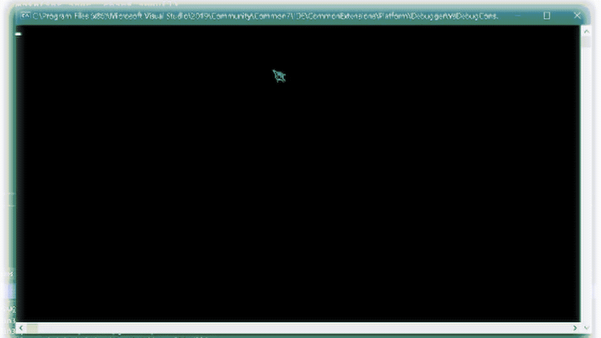
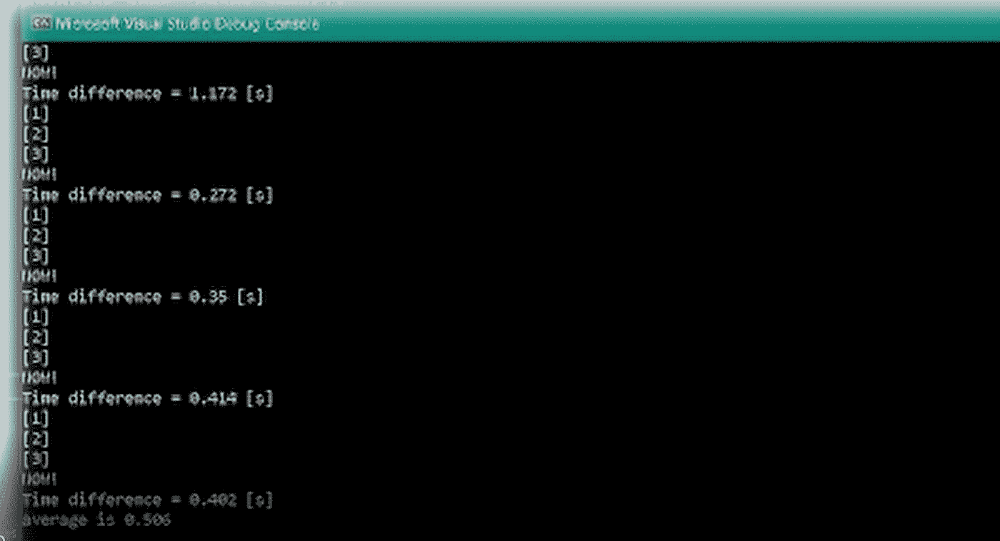

# 更快

> 原文：<https://medium.com/codex/being-faster-694a4842d149?source=collection_archive---------22----------------------->

克里斯·利维拉尼在 [Unsplash](https://unsplash.com?utm_source=medium&utm_medium=referral) 上的照片

“时间过得真快。由你来当导航员”。很多时候，我们无法做出正确的决定，因为我们没有足够快地抓住呈现在我们面前的机会。当开始学习编程时，我们不太担心我们创作的**时间**。不幸的是，当我们超越到一个专业的环境中，我们不仅要面对多重的限制，还要面对各种各样的期限，这是一个困难的要求。在一个真正的高端项目中，10 秒钟的延迟可能会导致昂贵的损失，这就是为什么大多数程序的宽限期延迟会减少到毫秒。

现在在我们的日常生活中，即使是在玩电子游戏的时候，能够做我们想做的事情也归结为一个时间游戏:如果你在处理一个时间敏感的项目时不鞭策自己，你可能会导致加班。如果你是一个游戏玩家，你可能会发现自己在玩一个射击游戏，却因为糟糕的时机输掉了一场比赛，因为你决定在敌人出现的时候重新装弹。

如果我们想做深思熟虑的快速程序，我们也应该训练自己能够工作并对我们遇到的任何事情做出快速反应。我在这里展示的简单游戏将帮助你练习快速计时。这个程序的子部分可以用于许多其他的事情，所以不要害怕“科学怪人”你的程序来创造一个杰作。

我们首先从 ***头文件*** 开始:这个文件用来设置我们将要使用的类。

# 类别文件

然后我们继续看 cpp 文件，它实际上是整个程序的*花饰*。当然，我们从构造函数方法开始，默认情况下，它将布尔变量初始化为 true。

我们的武器库中的下一个方法当然是 **createCounter** ，我们将在这里很好地使用布尔变量。该方法的功能是创建一个倒计时计数器，当用户必须按回车键时发出信号。不仅如此，还增加了一些趣味，倒计时就像正在输入一样。时间就是一切，我们在运行某些代码行之前等待的时间让事情变得更有趣。该方法包含两个不同的函数，用于为计时减速: **sleep_for** 和 **pauseThread** 。

现在，人们可以对这两行都使用其中任何一个，但是我决定以这种方式向您展示可能性，pauseThread 方法是我们在这里创建的一个方法，它足以用来*减慢速度*(如果您想要进一步的解释，可以在评论中询问)。计数语句被*组合成一个单独的字符串*，然后每个字符被一个接一个地打印出来，中间有一定的延迟，以便给人一种缓慢打字的错觉。您当然可以个性化这个语句，但是如果字符串太长，您必须相应地管理时间。计数器与计数变量结合使用，不仅可以打印计时器，还可以管理所述**计时器**的持续时间。在这个方法的最后，是时候调用 **createPrompt** 方法了。

该方法显示消息，通知用户现在是尽快按下回车键的最佳时机。然后，我们计算从消息显示到用户按键之间的时间。

然后，我们将进入**主 cpp** 文件。这里是我们创建用来运行游戏的类对象的地方。在这个文件中，我们将以一种非常特殊的方式运行类方法:我们将使用 **async** 函数以线程的形式启动该方法。现在这样做并不是构建这个游戏的唯一方式，但这是我选择的获得正确时间的方式，让所有线程等待轮到它们，总共运行 5 个线程，并提示用户按下回车键 5 次。在循环的最后，我们将对存储的所有计时进行平均。

# 最后的想法

现在，这个程序本质上是简单的，但正是这种简单性带来了改进的机会。通过一些额外的修改，您可以让程序提示用户按下一个特定的字母键，或者甚至是输入一个特定的单词。你甚至可以创建一个计算平均打字速度的类方法。虽然令人印象深刻，但这个程序有一些缺陷，比如如果你在提示出现之前多次按下回车键，就会出现意想不到的行为。

# 结论

确保一切都遵循正确的顺序是编程不可或缺的一部分:从简单的循环到完整的银行应用程序。不可否认，一路上会犯错误。但是把那些错误当成学习的机会，成长。

很高兴为你们所有人建立这个程序。让我们继续学习，一起创造伟大的事物。请在下面评论任何问题，不要忘记关注。