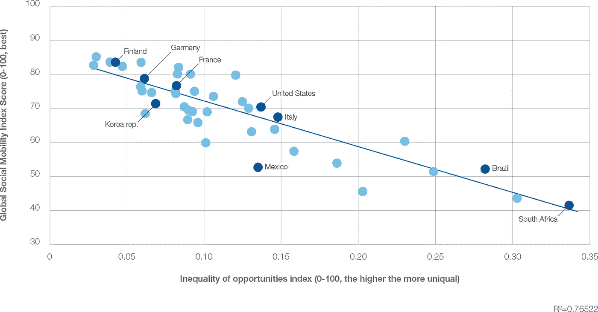
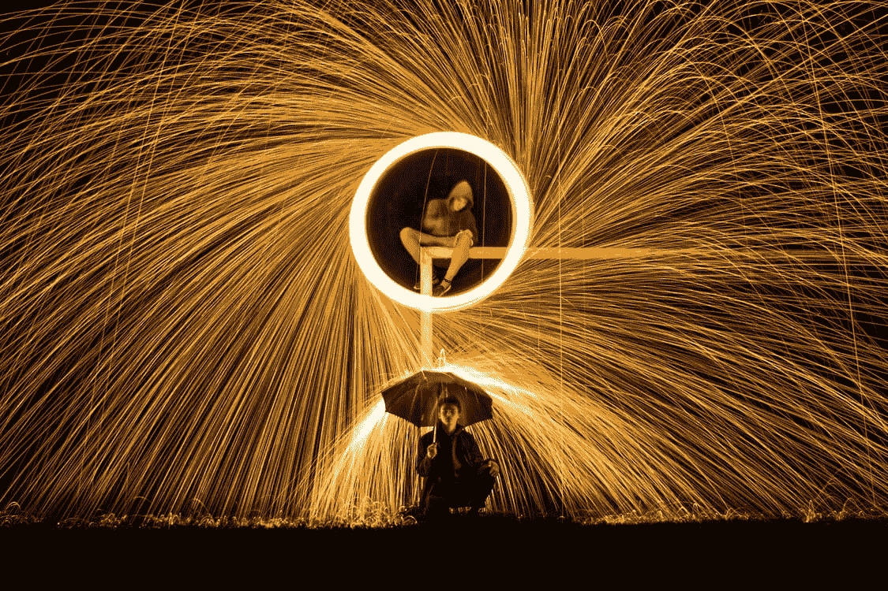

# 属于一个多现实的世界

> 原文：<https://medium.com/codex/belonging-in-a-multi-reality-world-edda8a867b7c?source=collection_archive---------12----------------------->

互联互通让我们有机会增加我们的[社会资本](https://www.oecd.org/insights/37966934.pdf)——去接触和联系我们原本无法接触到的人和社区。它帮助我们挑战[社会阶层](https://www.sciencedirect.com/topics/social-sciences/social-stratum)和我们被“处方”的生活机会。

举例来说明我的社会学胡言乱语:

*   **求职者、企业家&经济流动性。**我们知道这高度依赖于您认识的人。但是连接扩大了机会——远程工作，建立和分享文件夹，直接的信息也就是通过推特认识关键影响者的机会，等等。
*   **心理健康资源&社会流动。**我在网上找到了支持团体。我可以获得更多资源来帮助我变得有韧性。我阅读人们的经历。我属于一个在线社区。

**来源**:世界经济论坛，[2020 年社会流动性报告](https://www.weforum.org/reports/global-social-mobility-index-2020-why-economies-benefit-from-fixing-inequality)

所以，是的，连通性很好。我们可以继续讨论教育以及它如何有助于应对气候变化。最近我一直在谈论很多关于元宇宙的事情(惊喜，惊喜)。我对它为其他人获得联系带来的机会感到兴奋。但我对另一个平台或现实不感兴趣，即[会在](https://gerryforcomms.medium.com/are-you-inclusive-or-exclusive-on-social-media-57212cfe0456)被拒绝。

任何美好的事物都是一把双刃剑。让我们联系起来的东西，也让我们容易被拒绝。我怀疑我现在的精神状态能承受比我们现在更多的东西…

以分手为例。在过去，你们只是不再见面了。也许你们会在商场里偶遇，或者在报纸上看到对方。现在，你会想起你在生活中遇到的每一个拒绝和伤害——没有电话，没有短信，在社交媒体上你所看到的一切中缺席。

一旦你失去了一个对你来说很重要的人，并且处于悲痛之中，这是相当多的任务。您可以在社交网站上存档聊天记录、照片、阻止或删除它们，将它们的名称添加到关键字过滤器中。很快你就要把元宇宙的所有东西都加到这个列表中了。我不期待那个。

随着技术的发展和采用率的激增，我们的心理弹性也需要跟上。

照片由[鲁道夫·基什内尔](https://www.pexels.com/@rudolf-kirchner-278171?utm_content=attributionCopyText&utm_medium=referral&utm_source=pexels)从[派克斯](https://www.pexels.com/photo/time-lapse-photography-of-person-making-firework-spark-under-person-holding-umbrella-during-nighttime-1229841/?utm_content=attributionCopyText&utm_medium=referral&utm_source=pexels)拍摄

也许我们需要一个心理训练营来适应一个更加互联的世界。我们经常谈论生态系统需要跟上并以协调的步伐前进(比如网络、设备和技术)。一切都联系在一起。我们经常忽略的是它的社会学和心理学部分。政治事件。在更多的现实情况下，需要有法律来保护受害者。通常，他们跟得不够快。社会资源需要准备好支持那些将要接受新事物的人。我们是一个适应力强的物种，但我们的脆弱性也是我们成为人类的原因。

就目前的情况来看，我还没准备好迎接元宇宙，尽管它向我走来的速度很快。很难接受我们的基础设施能够继续这种进步。我们仍在与网络骚扰作斗争——法案仍在通过中。虐待的受害者经常被遗弃。我们还在争论隐私权的问题。我不确定我们是否能保护好自己。不过话说回来，我想善与恶之间的斗争将会是一场旷日持久的战争，或者说是一场持续不断的战争。

我喜欢认为当事情吓到你的时候，它一定是好的。这就是为什么我知道我有一个需要认真考虑的好主意。我有点害怕虚拟现实，害怕元宇宙。请帮我报名参加训练营，为未来做准备。