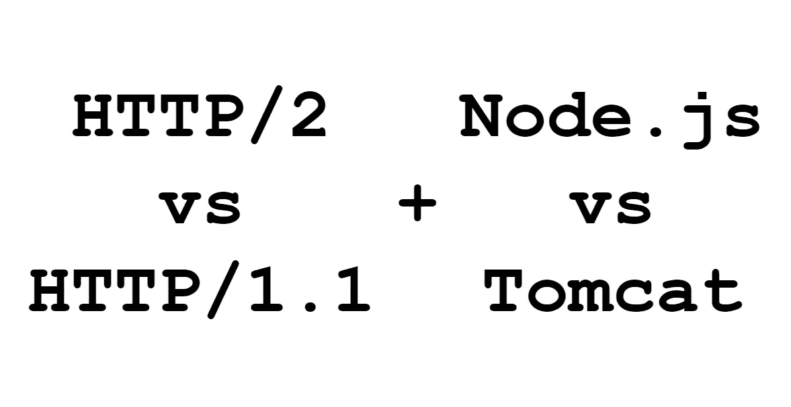

# HTTP/2 并不比 HTTP/1.1 快多少

> 原文：<https://medium.com/codex/benchmarking-http-2-against-http-1-1-using-javascript-modules-a5bfb316cc47?source=collection_archive---------3----------------------->

## 使用 JavaScript 模块测试 HTTP 协议。你认为更现代的 HTTP/2 比传统的 HTTP/1.1 更快吗？

# 为什么不是 HTTP/3？

尽管 HTTP/3 在 Web 上很流行，但 Node.js 或 Tomcat 还不支持它。

# 什么是 HTTP/2？