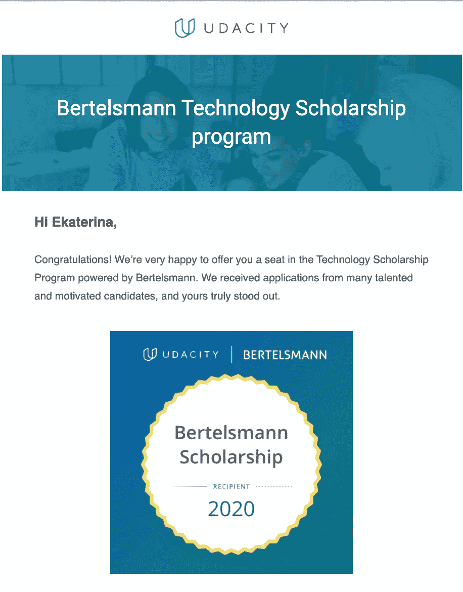
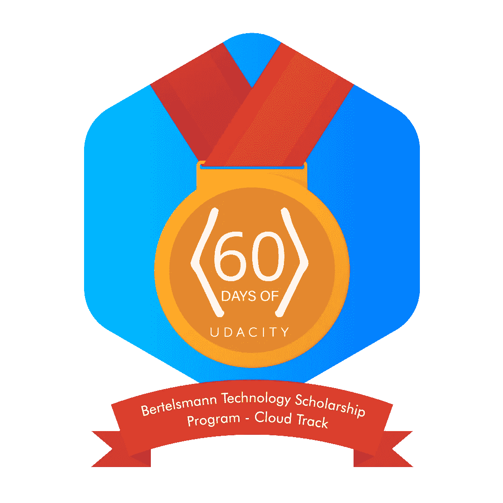
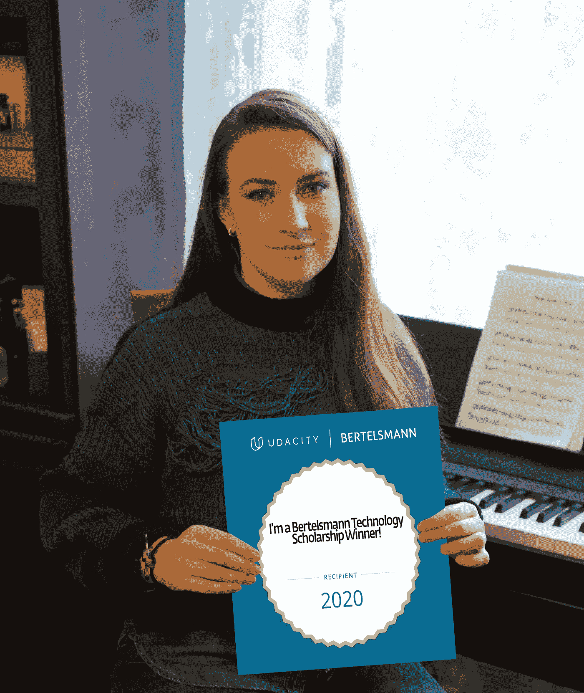

# 贝塔斯曼奖学金 Azure 应用纳米学位项目简介。第一阶段

> 原文：<https://medium.com/codex/bertelsmann-scholarship-introduction-to-azure-applications-nanodegree-program-phase-i-eb510d9e9c79?source=collection_archive---------6----------------------->

## [法典](http://medium.com/codex)

## 不仅仅是一次学习经历！

由[埃里克·扎亚茨](https://unsplash.com/photos/jucpqqAVjRA)在 [Unsplash](https://unsplash.com/) 上拍摄的照片

# 目录

1.  [我是如何入选第一阶段的](#390d)

2.[什么是「Udacity 科技奖学金计划」？](#ccbb)

3.[奖学金项目的结构是怎样的？](#80b4)

4.[谁可以申请？](#f0ee)

5.[云轨迹的先决条件](#9ca0)

6.[社区参与](#d3d3)

7.[社区太棒了！](#b9e0)

8.[资源](#e08e)

# 我是如何被第一阶段选中的

第一阶段快结束了，是时候和 Udacity 分享我这段时间的经历了。2020 年 10 月底，当我在编码训练营学习时，我发现了关于“贝塔斯曼技术奖学金项目”的信息。这三首歌对我来说都很有趣，所以很难决定选择哪一首。当我在学习 Fullstack Web 开发时，我特别有兴趣了解更多关于云的知识，因为它是 Web 开发的现在和未来，我总是对学习新技术感兴趣！作为一个终身学习者，我喜欢成长和学习新事物，并努力利用每一个机会。新知识总是能拓展视野，所以我决定申请。

12 月 1 日，我是被选中参加第一阶段并学习 Azure 应用程序基础知识的 5 万名学生之一。我非常兴奋能够开始这个项目，了解更多关于云技术的知识。贝塔斯曼奖学金云轨给了我这个机会。下面是我收到的一封电子邮件中的徽章，上面写着我获得了贝塔斯曼技术奖学金项目的一个席位。

收件人徽章

在这个博客中，我将回顾我在贝塔斯曼奖学金项目第一阶段的经历，但是，首先，我要简单介绍一下这个奖学金和它的目的，它来自贝塔斯曼大学网站。

# 什么是「Udacity 科技奖学金计划」？

在三年时间里，贝塔斯曼将投资数百万欧元，在教育平台 Udacity 上设立多达 5 万个技术奖学金，以提高人们的技术技能。这个想法是教员工未来就业市场所需的数字技能。具体来说，该集团每年为 Udacity Challenge 课程提供 1.5 万份技术奖学金。此外，前 10%的参与者将获得他们所选学科领域的全额纳米学位奖学金。奖学金项目同样面向初学者(建议具备基本的计算机技能)和有经验的程序员。它侧重于三种技术学习途径:

*   云，即在线 IT 基础设施的应用
*   数据，即用于分析和解释大量数据的应用
*   人工智能，即与机器学习和智能算法相关的应用

# 奖学金项目的结构是怎样的？

由于奖学金由三种不同的学习途径(云、数据、人工智能)组成，参与者必须决定他们希望申请哪种学习途径。每条学习路径包括两个阶段:

**第一阶段:挑战课程**
在该奖学金的第一阶段，学生将获得为期 3.5 个月的入门挑战课程。申请人应该准备在此期间每周投入大约 3-5 个小时。参与该计划第一阶段的奖学金获得者将成为一个强大的学生社区的一部分，在那里他们可以与他们的同学接触并获得他们的支持。

**第二阶段:全纳米学位项目**
前 10%的参与者将获得奖学金，获得他们所选学科领域的全纳米学位。这些纳米学位项目包括专家项目评审、指导和社区支持。申请人应该准备在 6 个月的课程中每周投入 5-10 个小时

# 谁可以申请？

所有贝塔斯曼的员工，以及外部的普通公众，如果想扩展他们的云，数据和人工智能技能，并且至少年满 18 岁，都可以申请这个“Udacity 技术奖学金计划”。每个学习路径的前提条件各不相同，将在课程描述中进行解释。申请人应该准备在挑战课程中每周投入大约 3-5 小时，在纳米学位课程中每周投入大约 5-10 小时。

# **云轨的先决条件**

准备充分的学习者具备:

*   至少 1-3 年的网络开发经验，最好是 Python 编程。
*   有创建和管理 SQL Server 或 PostgreSQL 等数据库的经验。
*   使用 Git 作为版本控制系统来克隆、拉或推代码的舒适性。
*   创建和提供 Azure 服务所需的免费或现有 Azure 帐户。

在大学我学了 Pascal，汇编，Delphi，C/C++，C#。Net ASP 等。我的训练营课程涵盖了 Ruby、Ruby on Rails、JavaScript 和 React。我很高兴先决条件没有吓走我，因为在开始时，我不确定我是否完全符合要求，但我喜欢挑战自己，成长。我的大学和训练营是富有挑战性的经历，但它们教会了我如何学习。从认为 Azure 对初学者来说太复杂，到仅仅能够创建和部署多个服务器，面对验证项目，部署 API 和创建数据库，我肯定已经走了很长的路。真的很感谢 Udacity 和贝塔斯曼给我颁发奖学金。

# 社区参与

高度鼓励社区参与，因为这是选择前 10%的参与者获得全额纳米学位奖学金的决定性因素之一。下面列出的事件以及空闲参与被正式计入社区参与:

## ❓weekly·阿马斯

有机会问任何关于奖学金计划的非技术性问题！这是一个每周与社区经理交流两次的好机会。

## 🙋学生领袖— [AI 赛道](https://sites.google.com/udacity.com/bertelsmann-tech-scholarship/ai-track/ai-student-leaders) | [数据赛道](https://sites.google.com/udacity.com/bertelsmann-tech-scholarship/data-track/data-student-leaders) | [云赛道](https://sites.google.com/udacity.com/bertelsmann-tech-scholarship/cloud-track/cloud-student-leaders)

第一阶段开始时，我们有机会填写表格，申请学生领袖职位。

学生领袖是我们学生社区的志愿代表，他们胸怀宽广，有伟大的想法，并有强烈的参与意愿。💖 💪

学生领袖由**渠道领袖**和**技术领袖**组成，他们超越自我为同学服务——在非正式和有组织的活动中提供出色的技术和道德支持！

## 🗓 [60 天的乌达城](https://sites.google.com/udacity.com/bertelsmann-tech-scholarship/community/60-days-of-udacity)

#100DaysofCode 上的旋转！保证每天花 30 分钟学习 60 天。让学习成为一种习惯，让你自己(和你的同龄人！)问责。

每天花 30 分钟对基础课程的主题进行编码或练习。

我加入了 **#60daysofUdacity** slack 频道，每天在 **#60daysofUdacity** 频道发布一个简短的公告，总结我每天的工作进度，并注明我在哪一天上班。

我每天都通过在某人的帖子下留下表情符号或直接回复来鼓励和支持学生。 **❤️🤝**

*uda city 的 60 天，*不仅帮助我与学习过程保持一致，还帮助我每天记住并庆祝我在一天中所取得的成就。它让我保持动力，我从其他学生的日常活动中受到启发，并且经常给我一个学习什么和如何学习的想法。我觉得我的每一步都有导师和朋友激励着我。来自世界各地的数百名学生试图提高自己，并在提供帮助或分享知识的过程中提升他人。完成挑战后，我获得了一枚徽章，但我并没有在第 60 次挑战时停下来，而是一直坚持到第一阶段结束。

**# 60 日城市徽章**

## 👩‍🏫研究组— [人工智能轨迹](https://sites.google.com/udacity.com/bertelsmann-tech-scholarship/ai-track/ai-study-groups_1) | [数据轨迹](https://sites.google.com/udacity.com/bertelsmann-tech-scholarship/data-track/data-study-groups_1) | [云轨迹](https://sites.google.com/udacity.com/bertelsmann-tech-scholarship/cloud-track/cloud-study-groups_1)

学习小组可以让你与同龄人建立更深层次的联系，并获得完成基础课程所需的额外支持。许多学生创建了针对他们所在地区的学习小组，并定期聚会！

我也做了！我组织有趣的会议，自己准备技术网络研讨会，与他人合作或邀请其他学生发表演讲。我喜欢在熟悉材料并与他人分享后准备网络研讨会。网络研讨会帮助我练习公开演讲技巧。在学习小组中，我分享了我在学习过程中发现的有用资源。

## 📔学习智慧周

在这一周中，社区经理每天都张贴提示，帮助我们在学习时保持动力和注意力！

## 📚学生故事

这是最鼓舞人心的举措之一，因为我真的被同伴的故事感动了，这个社区组织的活动让我们有机会了解一些同学的旅程，以及是什么让他们来到 Udacity，但我们只能阅读 10 个精选的故事。在超过 90 个令人惊叹的学生故事中，我很荣幸成为决赛选手之一，并被社区选中，成为前 5 名故事的一部分！

我们写了我们是如何来到 Udacity 的，以及我们希望用新发现的技能做些什么！

每个提交故事的学生都有机会在贝塔斯曼技术奖学金网站上出现。每条赛道的前 5 个故事可以在 Udacity 和贝塔斯曼团队上展示！✨

## 🚀学习堵塞

一个充满活力，有趣的马拉松式学习会议，每个人都努力完成基础课程！

这是一项活动，每个人都可以找到一个地方来展示自己的才华，分享知识或帮助志愿服务。活动的范围非常广泛，从创建和举办我们自己的网络研讨会，制作生活课程演练，帮助制作传单，志愿者技术渠道和公告。一些学生创造了各种各样的游戏和测验，许多有趣的活动发生了，学习堵塞松弛频道是充满活力的持续时间为 24 小时。太有趣了，所以我们决定再来一次。这也是一个问我们所有问题的好时机，因为专家学生都站在旁边帮助每个人。

为了学习 jams，我准备了关于 Python 的网络研讨会，第二个是关于“关于 Azure 和 SAP 的 10 个事实”以及传单。

## 🤝导师/学员计划

学生导师项目需要每个人都付出时间和努力，但这是一个令人难以置信的充实和有益的旅程。

我们可以注册成为**的学员**以获得导师*或*注册成为**导师**并帮助学生在 3 月 15 日截止日期前完成挑战课程。对于导师来说——这不仅是回报项目的好方法，也是巩固你所学知识的最好方法之一！

## 🎁新社区计划:TBD(大小字节画廊🎨)

这是第一阶段结束时的一个惊喜活动。记住我所学的一些最好的方法是将它应用到一项任务中，并教给其他人相同的概念。

在这次挑战中，两者兼而有之！我们被要求创建一个简单的“卡片”,分解基础课程中的一个概念。这些卡片可以容纳一个视觉图形，图表，信息图，笔记，或视频！

我们上传到[概念画廊](https://www.notion.so/bytesizedgallery/37d2448031574d81a823d0a5a92b0d8b?v=e2175168deed42038aa9fe36cd27a74c)的所有卡片！

## 📝中点调查和👨‍💻计划调查结束

表达你对项目体验的看法的机会。该调查是为了让 Udacity 社区团队评估我们迄今为止在奖学金项目中的体验。在我们为奖学金项目的后半部分和未来的奖学金做准备时，我们考虑了这项调查。

## 🔄反向 AMAs

在这个 AMA，我们的角色互换了！整个小时，社区经理都在问我们关于奖学金项目的问题。

## 🎉节目晚会结束:3 月 12 日星期五

庆祝节目(接近)结束！在整个小时里，社区经理们分享了有趣的事实和我们个人在奖学金项目中的亮点。本次活动对所有 3 条赛道开放。这是一次有益健康的聚会！

# 社区太棒了！

我喜欢课程的实用内容，因为熟能生巧，而且我能够熟悉 Microsoft Azure GUI 和相应的 CLI 命令。虽然这个奖学金已经不仅仅是一次学习经历了！它给了我们向他人学习和帮助他人、练习沟通技巧、保持活跃和创造性的机会。

我认为进入下一阶段的要求是明智的，因为它要求人们在懈怠小组中积极活动，无论何时你在完成一课时遇到困难，你都可以在几小时内从同学那里获得帮助。Slack community 给了我一个机会，让我可以与来自世界各地的志趣相投、才华横溢、正在努力实现相似目标的人建立联系。

这个社区太棒了！总是善良、耐心和非常积极的社区经理使整个体验更加令人惊叹！从对云一无所知到为像我这样的爱好者组织活动，这都是因为我从贝塔斯曼云轨道社区获得了支持。一路走来，国际学生团体给了我极大的鼓舞和支持。这是一次很棒的经历！

# 资源

📖[https://Bertelsmann-university . com/individual-campus/program-information/uda city-technology-scholarship-program . html？FB clid = iwar 3 JK 2 szbhcgnxln 3692 MC 0 WSI-VW2o _ zgkC-jil pj-aJ-CPC qxk 0 mvkrrq](https://bertelsmann-university.com/individual-campus/program-information/udacity-technology-scholarship-program.html?fbclid=IwAR3Jk2SzbhcgNXlN3692mc0wsi-VW2o_zgkC-jILpJ-aJ-Cpcqxk0mVKRrQ)

📖[https://www . uda city . com/course/cloud-developer-using-Microsoft-azure-nano degree-nd 081](https://www.udacity.com/course/cloud-developer-using-microsoft-azure-nanodegree--nd081)