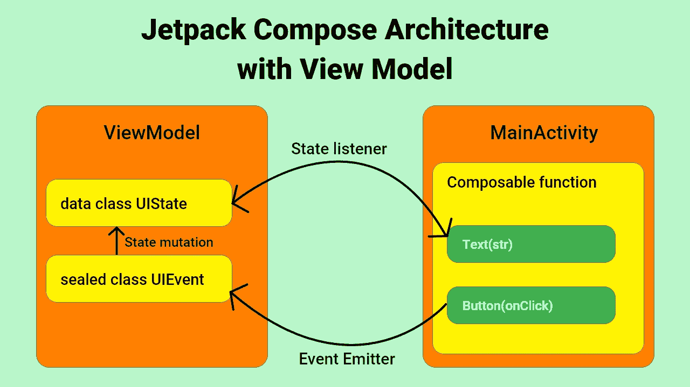

# Jetpack 撰写的最佳架构

> 原文：<https://medium.com/codex/best-architecture-for-jetpack-compose-45d2fc82aa92?source=collection_archive---------1----------------------->

## 撰写 UI 和视图模型交互

11 个月前，JetBrains 宣布稳定发布 Jetpack Compose，它像风暴一样占领了 Android 社区。新的 UI 工具套件正成为每个人的最爱。然而，理解如何将它与现代建筑相结合可能是一个挑战。让我们来看看如何做到这一点。

# 工作流程



使用 Adobe XD 创建

在特色图片中，您可以了解我们在这里会做什么。我们所有的屏幕状态都将存在于视图模型中。我们还将使用一个特定的功能，该功能将侦听用户的触摸交互，并相应地改变我们的状态。这些更改将使 UI 用更新的数据重新组合。

# 设置

在继续我们的应用程序之前，我们需要这两个依赖项。将它们添加到您的应用程序级`build.gradle`文件中。

```
implementation 'androidx.lifecycle:lifecycle-runtime-ktx:2.4.0'
implementation 'androidx.lifecycle:lifecycle-viewmodel-compose:2.4.0'
```

# 构建用户界面

让我们有一个简单的 UI，有几个按钮*和几个文本*和**

我们开始有了屏幕的示意图。我们有两个*文本*在顶部，三个*按钮*在底部。

# 创建视图模型

除了 ViewModel，我们还需要两个额外的类。

1.  **UIState —** 这是一个`data class`，它将包含屏幕状态所需的所有信息。
2.  **UIEvent —** 这是一个`sealed class`，它将包含所有可能的用户与屏幕的交互。

# 集成屏幕和视图模型

现在回到可组合屏幕，我们需要将 ViewModel 的实例作为参数传递，并使用它来定义我们的屏幕。

当 UIEvent 更改 ViewModel 内部的状态时，屏幕将使用更新后的数据进行重组。ViewModel 和您的屏幕紧密地耦合在一起，并一起工作。

# 结论

这是一个非常基本的例子，说明如何使用带有 Jetpack Compose 的 ViewModel。我已经尝试了各种架构，在我看来，这是迄今为止最好的。从长远来看，在应用程序中分离关注点总是一个好主意。事件也可以描述为发起网络请求或从本地数据库检索数据。

我希望你喜欢读我的文章，并学到了一些东西。谢谢大家！✌️

```
**Want to connect?**My [GitHub](https://github.com/cybercoder-naj) Profile.
My [Portfolio](https://cybercoder-naj.github.io) Website.
```