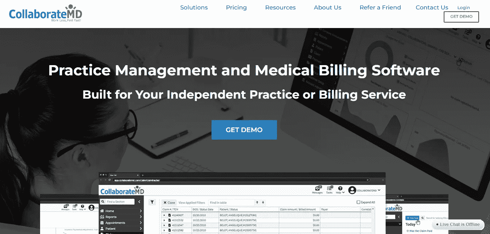

# 2023 年最佳诊所管理软件

> 原文：<https://medium.com/codex/best-clinic-management-software-to-use-in-2022-bbb1f8e1ddb6?source=collection_archive---------14----------------------->

## 为您的企业选择最佳的诊所管理软件。获得顶级 ERP 系统的免费试用，并阅读真实的用户评论。

照片由[马克西姆](https://unsplash.com/@maximeutopix?utm_source=medium&utm_medium=referral)在 [Unsplash](https://unsplash.com?utm_source=medium&utm_medium=referral) 上拍摄

经营一家诊所与所有其他企业都有很大不同。因为[门诊管理软件](https://wellyx.com/clinic-management-system/)正在承担多个患者的健康责任。如果你未能履行这一职责，它将成为一生的遗憾。你需要找到一个解决方案来管理你的诊所，而不是恐慌。

下面是来自 Statista 的图表，它代表了 2019 年至 2022 年的发病率。你可以看到特定疾病对美国居民的侵袭程度。

资料来源:统计数据

这只是美国的数据。你不认为你需要解决这个问题吗？治疗中晚几分钟就可能导致病人死亡。尝试更新你的预约系统。问题是，在这里，你必须面对一场精英之战。

要了解哪种系统适合我们的诊所，请查看以下功能:

# 十大诊所管理软件:

检查系统列表，并选择您的类型:

# 1.Wellyx

来源:Wellyx

你见过全能管理系统吗？Wellyx 无疑是一个全面的管理系统，因为它适用于几乎所有类型的企业。无论行业是健康还是健身，Wellyx 都提供完整的管理软件。

使用超快的业务管理软件管理您的业务。购买此软件之前，请试用免费试用版。改善您的客户体验，让您的销售更上一层楼。统一支付支持多个地点的管理。

# 特点:

预约管理

电子病历

员工监控

刷卡机

支付管理

存取控制系统

移动应用程序

# 2.高级 MD EHR

资料来源:EHR 高级医学博士

这个系统的名字解释为病人管理。它是为人类的精神和身体健康而设计的。从事此类项目的组织可以拥有先进的 EHR 医学博士学位。

你担心治疗时的医药费吗？AdvancedMD EHR 将为您的治疗提供电子发票。它还创建了一个针对每个患者的在线图表，从中可以查看他们的治疗史。

# 特点:

患者治疗图表

在线医疗账单

电子健康记录

远程医疗功能

在线商业报告

# 3.CGM 初级软件

来源:CGM PRIMA 软件

CGM PRIMA 是医生和其他诊所工作人员公认的市场领先软件。这是一个专家软件，由多名外科医生处理 70 多种疾病。它还为您提供了一个用户友好的应用程序。

这个软件以前的名字是普里马 EHR。这是一个专门为医务人员设计的实习管理软件。它将通过系统集成来支持老用户。在线输入您的医疗详情。

# 特点:

患者健康记录

远程保健

患者门户

系统综合

人口健康图表

# 4.临床 Q.D

资料来源:Q.D .临床

如果临床文件是一个问题，那么去一个类似 Q.D .临床的系统。该系统的主要目的是检查临床医学中的药物。查看和修改其中的临床预约。它将生成一个自动约会提醒。

适用于所有类型的诊所。此外，跟踪您的实验室订单以及哪种药物是必需的。所有库存的细节都在同一个系统中。通过查看诊所员工的时间表来创建和安排约会。这款软件的起价是 2995.00 美元。

# 特点:

在线预约时间表

存货管理

在线患者记录

多模板易用性

# 5.供应商套件

来源:ProviderSuite

你体验过基于云的系统吗？通过 ProviderSuite 在线记录您的医疗账单。该系统还将为您的诊所安排预约时间。这个系统的优点是它提供了一份财务报告。

现在，你可以通过软件估算你的盈亏。实现无纸化门诊管理。它正致力于 SAAS(软件即服务)的原则。如果所有的账单都是在线的，诊所的管理将避免任何错误的账单索赔。

# 特点:

医疗账单记录

财务报表

集成可用

在线账户管理

# 6.服务

资料来源:Sevocity

为诊所定制的最佳基于云的管理软件。它包括一个 24/7 全天候支持系统，可为所有国内和国际客户提供服务。它向 30 多个国家提供服务。Sevocity 吸引人的界面是一个加分点。

它有一个直接的电子邮件系统。购买这个系统不需要额外的费用。为软件的新版本创建更新。报告和 E&M 编码计算器也在那里。使用 Sevocity 在线计算您的医疗账单。Sevocity 的初始价格为每月 379.00 美元。

# 特点:

在线报告

直接电子邮件系统

定制和客户支持

E&M 编码计算器

# 7.eClinicalWorks 软件

来源:eClinicalWorks 软件

患者及其记录管理的在线示例。它可以进一步访问 Healow 应用程序，通过该应用程序，所有患者记录都在您的手机上。远程医疗和健康分析都包含在该软件的功能中。

实时报告患者的健康状况。购买该系统的初始价格约为每月 449.00 美元。如果你想要更多的功能，那么它有 599 美元/月的额外费用。试用 eClinicalWorks 软件，在全球范围内实现安全的临床管理。

# 特点:

远程健康管理

实时健康报告

用于查看患者记录的移动应用程序

网上预约

# 8.CollaborateMD 软件

来源:CollaborateMD 软件

像诊所一样实践你的医疗业务，但永远不要想独自处理它。选择 CollaborateMD 类型的软件。它可以计算你的业务收入。简化您的临床活动和编码过程。

基于网络的系统是实践管理业务的最佳系统。自动计费是这种系统的主要特征。CollaborateMD 是一个软件，它将帮助您改善与诊所客户(如患者)的关系。

这个系统的免费版本可以让你满意。购买该软件的首期付款为每月 194.00 美元。

# 特点:

业务收入计算

自动计费功能

患者记录测量

免费试用版

# 9.雅典娜软件

来源:athenaOne 软件

想每天查看自己的病历吗？为它选择一个 athenaOne 软件。它将为你提供一个门户，让你的所有病人都能看到他们的在线记录。此外，如有必要，您可以编辑他们的医疗详细信息。

在系统的帮助下，在诊所实践你的医学知识。患者可以通过相同的在线门户来安排他的预约。他也将从同一个账户支付治疗费用。在线表单具有删除或添加记录的编辑选项。

# 特点:

在线预约管理

约会提醒

用于记录检查的患者门户

支付管理

# 10.MDConnection 软件

来源:MDConnection 软件

当你有一个像诊所一样的小生意时，去用 MDConnection 软件。是因为这个软件是管理小企业的医疗细节。调度器是这个系统的核心。大多数诊所都有它，因为它有调度功能。

此外，医疗记录功能也将登陆诊所。他们还提供了一个视频描述，你们都可以查看他们的功能细节。不要错过这个选择最佳诊所管理软件的绝佳机会。

# 特点:

安排约会

耐心交易

在线记录管理

支付处理

# 总结:

以上，您可以查看关于顶级诊所管理软件的所有详细信息。不过，如果你有任何困惑，然后访问他们的网站。你必须阅读上述系统的所有功能，并选择最适合你的诊所。现在，决定权在你。

通过投资一些钱来拯救你的诊所。软件是你最好的解决方案，永远不要错过它。