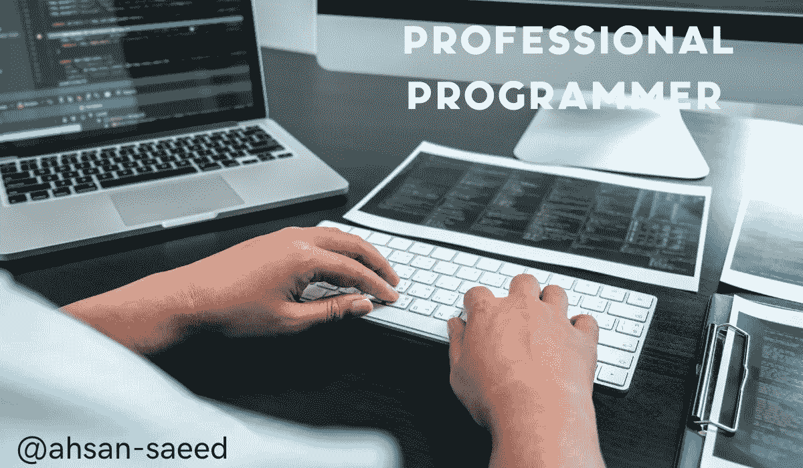

# 成为职业程序员的最佳基本技巧？

> 原文：<https://medium.com/codex/best-essential-tips-to-become-a-professional-programmer-9baec8279dc5?source=collection_archive---------17----------------------->

程序员通过做出逻辑决策和使用编程语言来编写软件。他们用代码解决实际问题。程序员的主要目标是通过将数据转换成计算机指令来告诉计算机如何存储、呈现和使用信息，从而使事情变得更简单、更快速。

## 对最新技术保持警惕