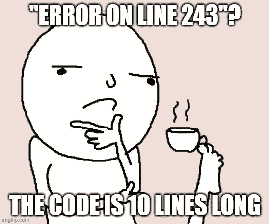
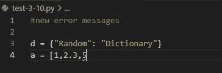
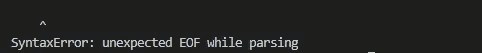
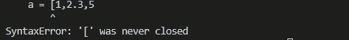
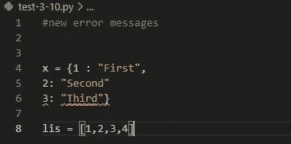
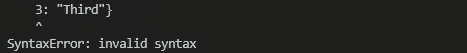
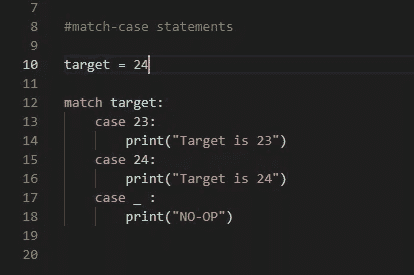
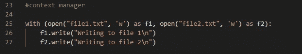

# Python 3.10 的最佳特性

> 原文：<https://medium.com/codex/best-features-in-python-3-10-1666b91536ec?source=collection_archive---------7----------------------->

如果你的工作或研究与数据或人工智能有关，那么你一定知道最近推出了最新版本的 python，即 Python 3.10。

这个新特性附带了一些期待已久的特性，我将在本文中重点介绍它们。如果你对这次更新的细节感兴趣，你可以在这里阅读详细的文档。

我们开始吧。

## 用户友好的语法错误消息

在 Python 3.10 之前，语法错误消息并不是非常具体，调试起来可能非常困难，尤其是当您有大量代码时。新版本改变了这一点。下面的比较完美地解释了这一点。

错误代码

在 python 3.10 之前，这不是一个很容易理解的错误

python 3.10 的错误消息

错误的词典

python 3.10 之前的错误

python 3.10 中更具体的错误消息

## 开关盒终于来了！

由[霍比工业](https://unsplash.com/@hobiindustri?utm_source=unsplash&utm_medium=referral&utm_content=creditCopyText)在 [Unsplash](https://unsplash.com/s/photos/switch-button?utm_source=unsplash&utm_medium=referral&utm_content=creditCopyText) 上拍摄的照片

嗯，它并不完全被称为*开关状态*语句，但它的工作方式几乎相同。

Python 3.10 引入了 ***匹配用例语句*** 或者他们称之为***‘结构模式匹配’***

**这种结构模式匹配值得单独撰写一篇文章，但现在我将只关注它的概述**

下面的示例显示了使用 Match-Case 语句的语法。

匹配大小写语句

目标= 24 的结果

目标= 23 的结果

那些在其他语言中使用过 Switch-case 语句的人应该熟悉这种语法。在关键字*‘match’*前面传递一个模式，几个可能的*案例*就在它下面定义。如果模式与下面传递的任何一种情况相匹配，那么这个特定的代码块就会像上面的例子所演示的那样被执行。

还有一个默认的 case 集合，在最后一个 case 语句中用' _ '标识，当您的模式与定义的 case 都不匹配时，将执行这个默认的 case。

目标= 25 的结果

同样重要的是要注意，定义默认情况是可选的，如果你不这样做，那么“匹配情况”语句将被跳过，不执行(或者我们在编程术语中称之为；无操作)。

Match-Case 允许匹配**数据值、数据类型、数据结构、数学表达式等等；**一个非常灵活的功能。

 [## MPV 配置指南，提升您的动漫体验

### 我是一个忠实的动漫迷，通常会花我大部分的空闲时间来挑选一个新的季节，并在它的…

writersbyte.com](https://writersbyte.com/mpv-configuration-guide-to-upscale-and-enhance-your-anime-experience/) 

## 带括号的上下文管理器

照片由来自 [Pexels](https://www.pexels.com/photo/laughing-male-constructor-showing-thumb-up-at-working-desk-3760613/?utm_content=attributionCopyText&utm_medium=referral&utm_source=pexels) 的[安德里亚·皮亚卡迪奥](https://www.pexels.com/@olly?utm_content=attributionCopyText&utm_medium=referral&utm_source=pexels)拍摄

python 中的上下文管理器用于在需要时分配内存，并在使用结束时释放内存。python 中的' ***with*** '语句是上下文管理器最常见的例子之一，其最常见的用例是打开文件读/写数据。这方面的一个例子如下所示:

上下文管理器示例

这里我们的文件被打开，并被对象变量 f1 识别。我们将执行的所有操作都将使用这个变量，但是**f1**只能在缩进块中访问。f1 上的所有操作都必须在这个缩进块中执行，因为一旦我们的代码离开缩进块，文件就会自动关闭(这是上下文管理器的目的)。

在 Python 3.10 之前，您只能通过一个带有'语句的*来管理一个对象的上下文，如果在低于 3.10 的 Python 版本上执行，以下代码将引发语法错误。*

带括号的上下文管理器

然而，Python 3.10 中已经添加了此功能，现在上面的代码将打开上面的文件进行写入，并按照编码执行。

 [## 手机上的 TPU-谷歌的 Pixel 6。

### 当谷歌本月宣布他们的新 Pixel 手机 Pixel 6 时，看到了一个非常有趣的公告。谷歌…

writersbyte.com](https://writersbyte.com/tpu-on-a-phone-the-pixel-6-by-google/) 

## 结束了

这是 Python 3.10 中引入的 3 个最显著的特性，还有许多其他细微的更新，如果你感兴趣，你可以在这里阅读完整的更新文档。

## 更像这样

 [## 每个初学者都必须知道的 4 个关键 Python 数据结构。

### 最近几年，Python 已经成为最受编程新手欢迎的语言，因为它易于使用，而且…

writersbyte.com](https://writersbyte.com/4-key-python-data-structures-e-very-beginner-must-know/)  [## 面向数据科学初学者的 5 种数据处理技术

### 对于所有寻找数据科学工作或数据科学实习的年轻科学家来说，数据处理是一项技能…

writersbyte.com](https://writersbyte.com/5-data-processing-techniques-for-data-science-beginners-python-and-pandas/)