# 2022 年最佳编程笔记本电脑

> 原文：<https://medium.com/codex/best-laptops-for-coding-in-2022-c969851e2dfa?source=collection_archive---------0----------------------->

老实说，你可以在任何笔记本电脑上编写代码，但对于多任务和其他繁重的使用目的，你需要一个能够处理许多任务的平衡的笔记本电脑。那么，什么样的笔记本电脑才是好的编码电脑呢？它还应该有良好的规格，如用于打字的漂亮键盘，固态硬盘存储，良好的内存和英特尔，AMD 或苹果的良好处理器。

这里有一个列表，列出了最好的用于编码的笔记本电脑

注意-如果您使用银行报价，您可以获得额外的折扣

# 笔记本电脑价格范围(低于 50，000 卢比)

## 1.宏碁 Aspire 5 (49，990 卢比)

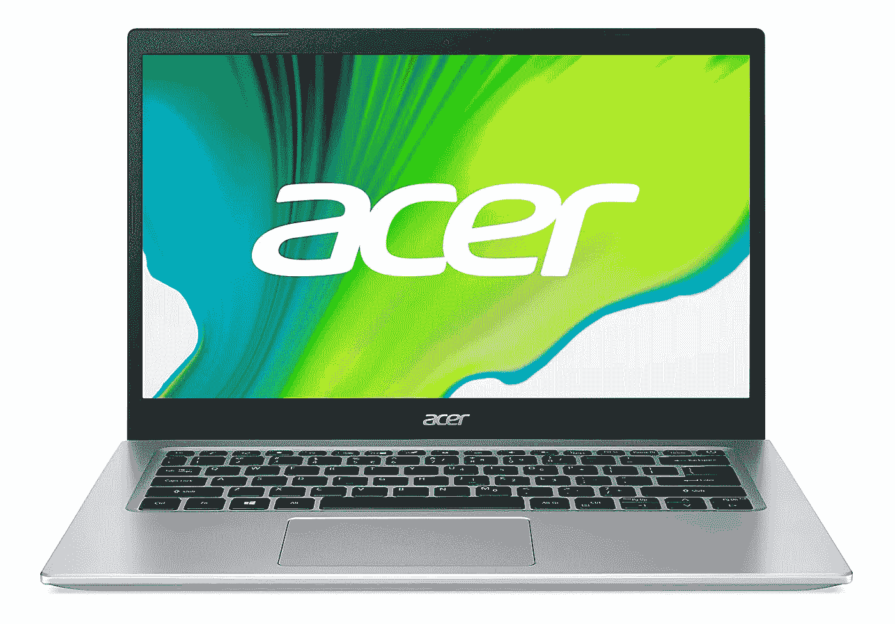

宏碁 Aspire 5

Acer Aspire 5 英特尔酷睿 i5–1135 G7(第 11 代)英特尔 Iris Xe 8GB 256GB 固态硬盘+1TB 硬盘，带 Windows 10 家庭普通版(可升级到 Windows 11 ),是您的不错选择。该笔记本电脑配备了 4.2 GHz 主频的英特尔酷睿 i5–1135 G7(第 11 代)，让您可以轻松进行多任务处理，体验更快的性能。这款笔记本电脑采用坚固、全长且符合人体工程学设计的 FineTip 键盘，配有独立的数字小键盘，可让您在更长时间内以最大的便利性工作。

你可以根据需要的规格购买不同型号的笔记本电脑。

> [购买宏碁 ASPIRE](https://amzn.to/3zecdHI) 5

## 2.惠普 15(42，740 卢比)

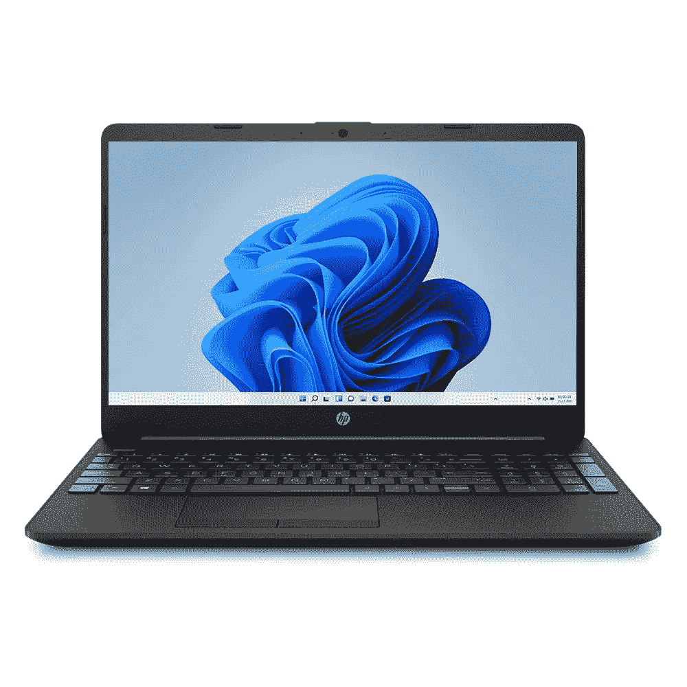

惠普 15s

惠普 15s 笔记本电脑第 11 代英特尔酷睿 i3–1115 G4 英特尔 UHD 8GB 512GB 固态硬盘 Windows 10 家庭基本版，具有引人注目的功能和规格。这款理想的计算设备采用第 11 代英特尔酷睿 i3–1115 G4 处理器，时钟速度为 2.9 GHz，让您可以在没有任何延迟或中断的情况下进行多任务处理。还预装了 Windows 11。

你可以根据需要的规格购买不同型号的笔记本电脑。

> [买 HP 15s](https://amzn.to/3eWQpqR)

## 3.联想 IdeaPad 超薄 3 (48，750 卢比)

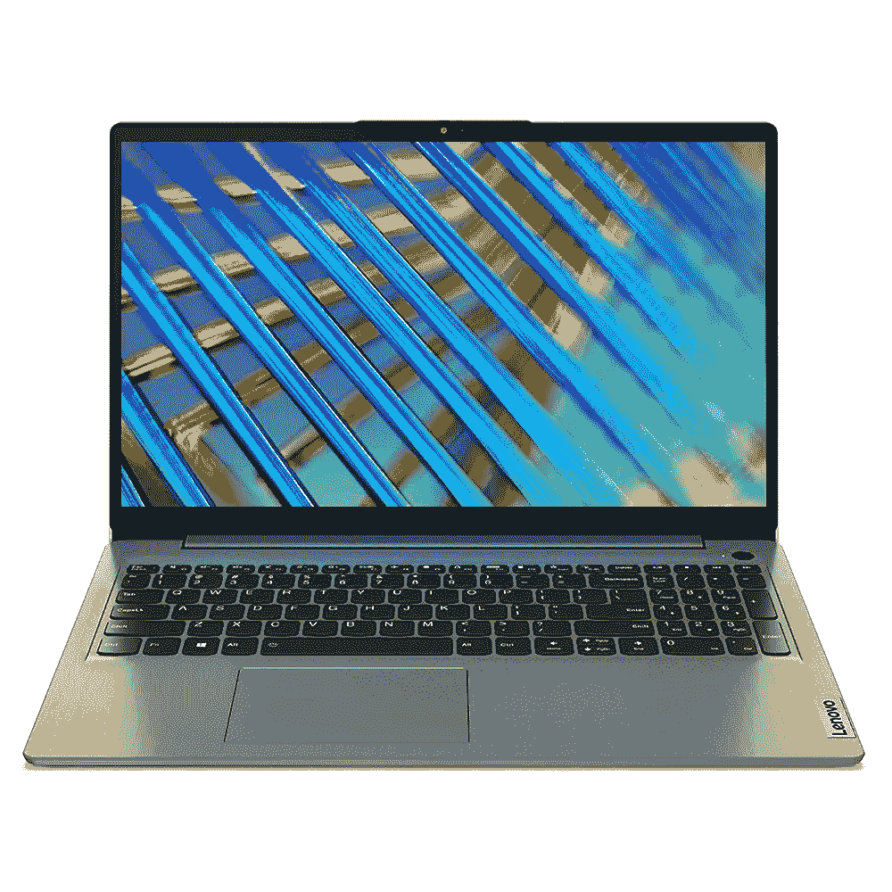

联想 IdeaPad Slim 3

*   处理器:第 11 代英特尔酷睿 i3–1115 G4 |速度:3.0 GHz(基本)— 4.1 GHz(最大)| 2 个内核| 6MB 高速缓存
*   操作系统:预装 Windows 11 家庭版，终身有效
*   预装:MS Office 家庭和学生版 2021
*   内存和存储:8GB 内存 DDR4，可升级至 12GB | 512 GB 固态硬盘
*   显示屏:15.6 英寸 FHD (1920x1080) |亮度:300 尼特| IPS 技术|防眩光

你可以根据需要的规格购买不同型号的笔记本电脑。

> [购买联想 IdeaPad Slim 3](https://amzn.to/3HwtYF7)

## 4.红米笔记本专业版(49，999 卢比)

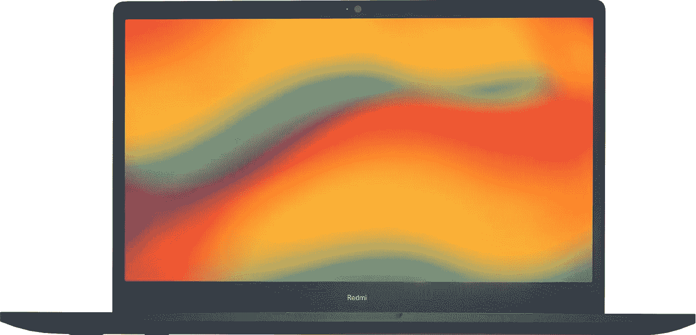

RedmiBook Pro

RedmiBook Pro Core i5 第 11 代— (8 GB/512 GB SSD/Windows 10 Home)轻薄笔记本电脑(15.6 英寸，炭灰色，1.8 千克，带 MS Office)

*   RedmiBook Pro 笔记本配备第 11 代 TigerLake 英特尔酷睿 i5–11300h H35 处理器，性能出众。因此，无论您是想用它来工作、看视频还是玩游戏，这款笔记本都能满足您的所有计算需求。
*   这款笔记本配备了 8 GB DDR4 RAM，主频为 3200 MHz，允许您同时运行多个应用程序。此外，这款笔记本电脑集成了 512 GB 固态硬盘，可让您快速传输数据，并提供快速启动和唤醒时间。
*   这款笔记本一次充电的电池续航时间长达 10 小时，确保您不必担心一次又一次地给笔记本充电。

> [购买 RedmiBook Pro](https://amzn.to/3FLoCoJ)

## 5.联想 IdeaPad 3 (39，990 卢比)

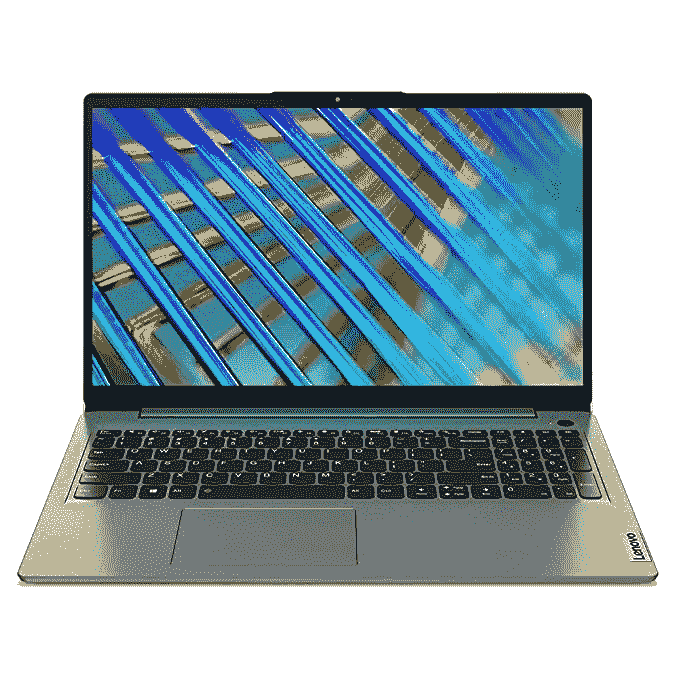

联想 IdeaPad 3

联想 IdeaPad 3 第 11 代英特尔酷睿 i3 15.6 FHD 轻薄笔记本电脑(8gb/256 GB SDD/Windows 11/MS Office 2021/2 年保修/北极灰/1.65Kg)，82H801L3IN

*   处理器:第 11 代英特尔酷睿 i3–1115 G4 |速度:3.0 GHz(基本)— 4.1 GHz(最大)| 2 个内核| 6MB 高速缓存
*   操作系统:预装 Windows 11 家庭版，终身有效
*   预装:MS Office 家庭和学生版 2021
*   内存和存储:8GB 内存 DDR4，可升级至 12GB | 256 GB 固态硬盘
*   显示屏:15.6 英寸 FHD (1920x1080) |亮度:250 尼特|防眩光
*   电池续航时间:3 芯 45 瓦时|长达 6 小时|快速充电(1 小时可充电 80%)

> [购买联想 IdeaPad 3](https://amzn.to/3eLpnSW)

# 70，000 卢比以下最佳笔记本电脑

## 1.惠普 Pavilion 15 (62，990 卢比)

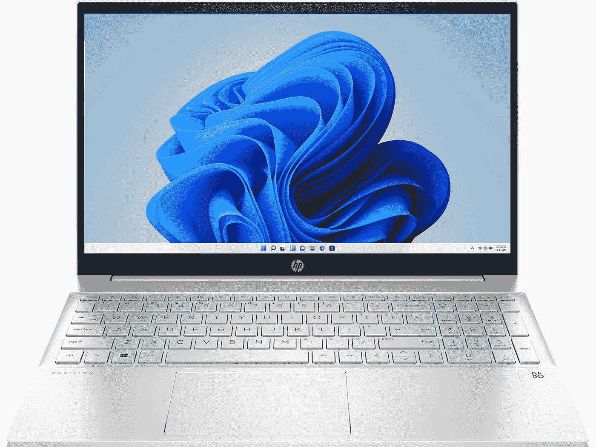

惠普展馆 15

惠普 Pavilion 15 AMD 锐龙 5，15.6 英寸轻薄 FHD，Micro Edge 显示屏(16GB RAM/512 GB SSD/FPR/B&O 音频/Windows 11 Home/Alexa 内置/MS Office/自然银/1.75 千克)，15-eh1108AU

*   处理器:AMD 锐龙 5 5500U(最高 4.0 GHz 加速时钟，8 MB 三级高速缓存，6 个内核，12 个线程)|内存:16 GB DDR 4–3200 SDRAM(1 x 16 GB)|存储:512 GB PCIe NVMe M.2 SSD
*   操作系统和预装软件:预装终身有效的 Windows 11 家庭版| Microsoft Office 家庭和学生版 2019
*   显示器:对角线 39.6 厘米(15.6 英寸)，FHD (1920 x 1080)，IPS，微边缘，BrightView，250 尼特，45% NTSC | AMD 镭龙显卡

> [购买惠普 Pavilion 15](https://amzn.to/3ELafQi)

## 2.小米笔记本电脑专业版(56，999 卢比)

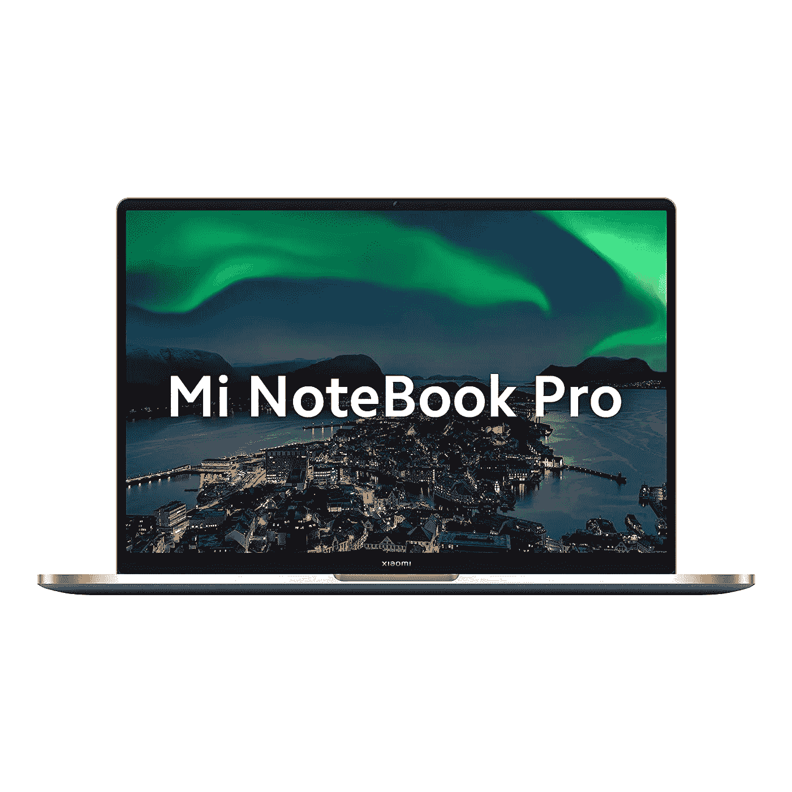

小米笔记本专业版

小米笔记本 Pro QHD+ IPS 防眩光显示屏英特尔酷睿 i5–11300h 第 11 代 14 英寸(35.56 厘米)轻薄笔记本电脑(8GB/512GB 固态硬盘/Iris Xe 显卡/Win 10/背光 KB/指纹传感器/1.4 千克)

*   处理器:第 11 代英特尔 Tiger Lake 酷睿 i5–11300h 处理器|速度:3.1 GHz(基本)4.4 GHz(最大)| 4 个内核| 8 个线程| 8 MB 高速缓存
*   显示屏:14 英寸 IPS QHD+分辨率(2560x1600) |16:10 宽高比，100% sRGB，215 PPI，1000:1 对比度|防眩光| TUV 低蓝光
*   内存和存储:8GB DDR 4 3200 MHz | 512 GB PCIe NVMe m . 2 固态硬盘

> [买米笔记本 Pro](https://amzn.to/31hmuGo)

## 3.超级小米笔记本电脑(64，999 卢比)

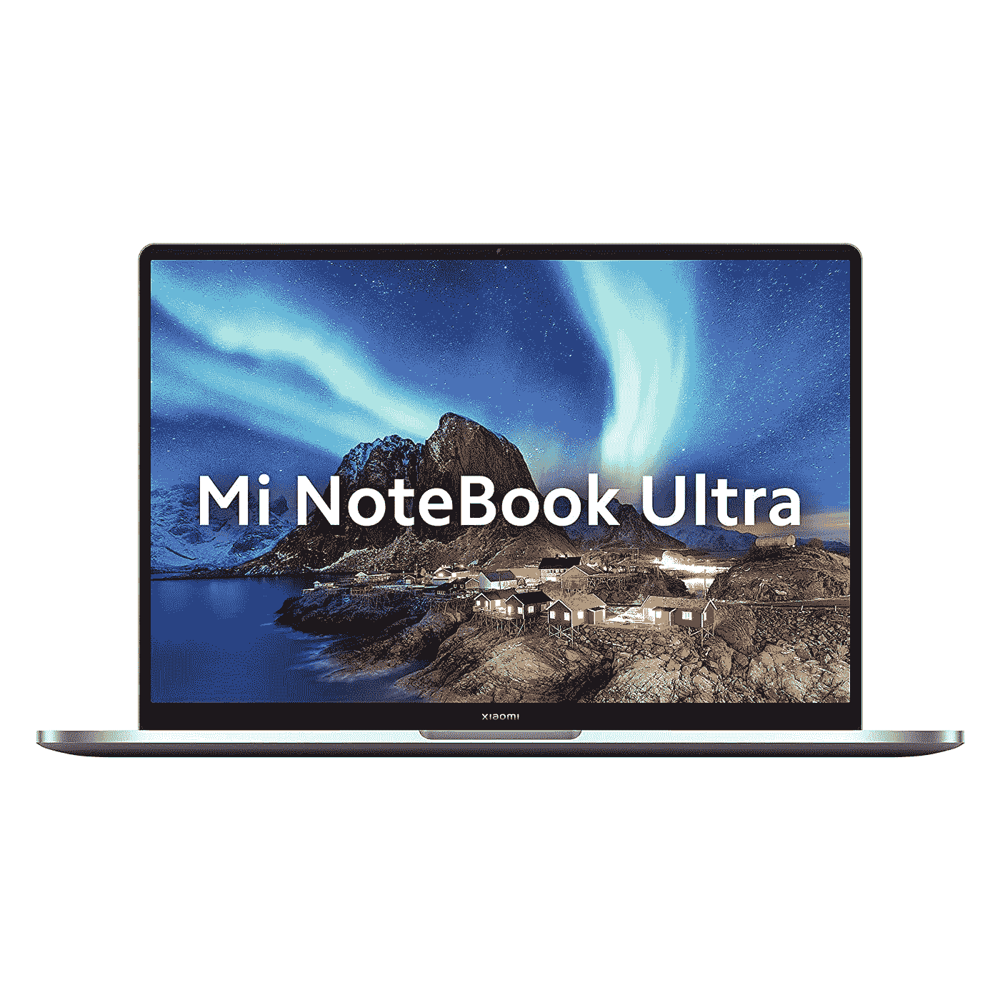

小米笔记本超

Mi 笔记本电脑超 3.2K 分辨率显示屏英特尔酷睿 i5–11300h 第 11 代 15.6 英寸(39.62 厘米)轻薄笔记本电脑(16GB/512GB 固态硬盘/Iris Xe 显卡/Win 10/MS Office/背光 KB/指纹传感器/1.7 千克)

*   处理器:第 11 代英特尔 Tiger Lake 酷睿 i5–11300h 处理器|速度:3.1 GHz(基本)4.4 GHz(最大)| 4 个内核| 8 个线程| 8 MB 高速缓存
*   显示屏:15.6 英寸 IPS 3.2K 分辨率(3200x2000) | 16:10 宽高比，100% sRGB，90Hz 刷新率，241 PPI，1500:1 对比度|防眩光| TUV 低蓝光
*   内存和存储:8GB DDR 4 3200 MHz | 512 GB PCIe NVMe m . 2 固态硬盘

> [买小米笔记本超](https://amzn.to/3sUgw9R)

## 4.惠普 14

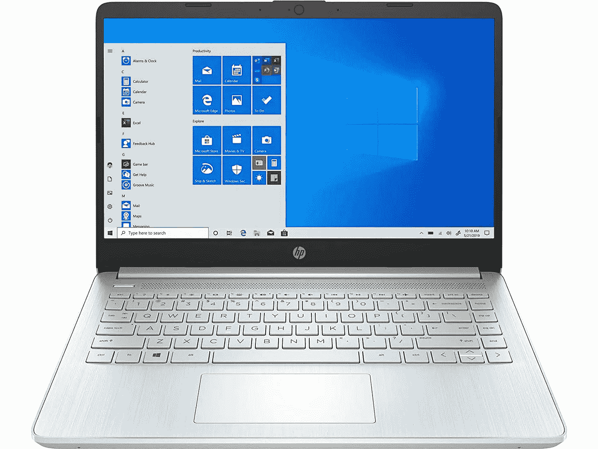

惠普 14

惠普 14 锐龙 5 5500U 14 英寸(35.6 厘米)FHD 笔记本电脑，内置 Alexa(8GB/512 GB 固态硬盘/Windows 10/MS Office/自然银/1.46 千克)，14s-fq1030AU

*   处理器:AMD 锐龙 5 5500U (2.1 GHz 基本时钟速度，最高 4.0 GHz 加速时钟，8MB 三级高速缓存，6 个内核)
*   内存:8 GB DDR 4–3200 MHz 内存(1 x 8 GB)，最高可升级至 16 GB (2 x 8 GB) |存储:512GB PCIe NVMe M.2 固态硬盘
*   显示屏:14 英寸(35.6 厘米)FHD 防眩光微边缘，250 尼特，45% NTSC (1920 x 1080)
*   显卡:AMD 镭龙显卡

> [购买 HP 14](https://amzn.to/3zkglFS)

# 最佳笔记本电脑(70，000 台以上)

## 1.苹果 MacBook Air

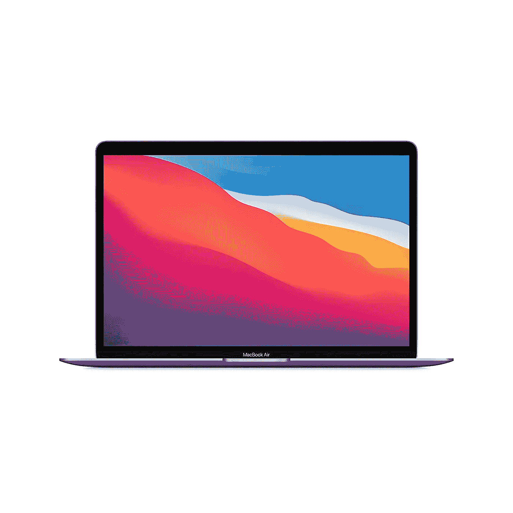

MacBook Air 2020 M1

2020 年苹果 MacBook Air 笔记本电脑:苹果 M1 芯片，13.3 英寸/33.74 厘米视网膜显示屏，8GB 内存，256GB 固态硬盘存储，背光键盘，FaceTime 高清摄像头，触控 ID。适用于 iPhone/iPad；银

由于基于 ARM 的革命性苹果 M1 芯片为新的 MacBook Air 提供了动力(苹果已经放弃了英特尔，转向这些新的笔记本电脑)，这是一个惊人的成就:一个轻薄的笔记本电脑，提供了出色的性能，同时还提供了令人难以置信的电池寿命。这款笔记本电脑一次充电可轻松运行 11 个小时以上，您可以在工作或上学时随身携带。它的屏幕是华丽的，新的和改进的键盘意味着你可以愉快地在这个东西上编码几个小时。

> [购买 MacBook AIR M1](https://amzn.to/3zkj7LF)

## 2.苹果 MacBook Pro

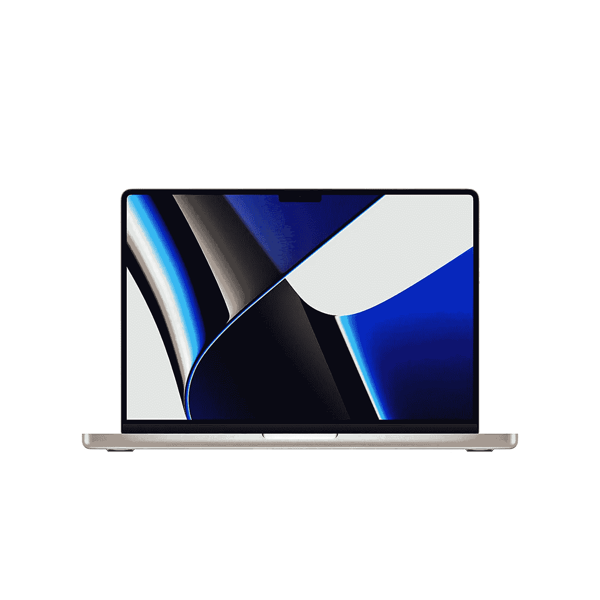

2021 苹果 MacBook Pro (14 英寸/35.97 厘米，苹果 M1 Pro 芯片，8 核 CPU 和 14 核 GPU，16GB 内存，512GB 固态硬盘)——太空灰

虽然一些程序员可能会发现在他们的笔记本电脑上安装更大的 16 英寸或 17 英寸屏幕会使编程更加舒适，但其他人可能会发现这些笔记本电脑太大太笨重，不容易随身携带。因此，新的 14 英寸 MacBook Pro 是任何想要一台功能强大的笔记本电脑进行编程并且更容易携带的人的绝佳选择。

它由新的 M1 Pro 或 M1 Max 苹果芯片提供动力，这些芯片与 16 英寸机型相同，这意味着它提供了与更大的笔记本电脑类似的性能水平。因此，如果您想要一台功能强大得难以置信的笔记本电脑来进行编程，但又想要易于携带的东西，那么您可以选择这款笔记本电脑，而不会牺牲性能。较小的尺寸并不意味着它错过了苹果为 16 英寸机型添加的新设计元素，因为它配备了相同数量的端口，包括一个 SD 卡插槽、一个 HDMI 端口和三个 Thunderbolt 4 端口。

> [购买苹果 MacBook Pro](https://amzn.to/3eI3K65)

## 3.戴尔 XPS 13

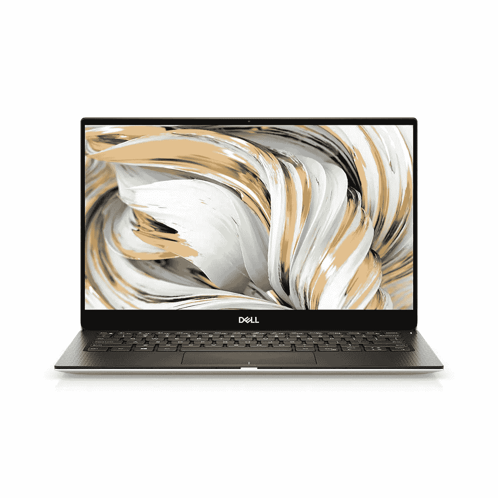

戴尔 XPS 13

戴尔 XPS 9305 13.3 英寸(33.78 厘米)FHD 显示屏轻薄笔记本电脑(i7–1165 G7/16GB/512 GB 固态硬盘/集成显卡/ Win 10 + MSO /背光 KB + FPR /银色)D560050WIN9S

*   处理器:第 11 代英特尔酷睿 i7–1165 G7 处理器(12MB 高速缓存，最高 4.7 GHz)
*   内存和存储:16GB 4267MHz LPDDR4x 板载内存| 512GB M.2 PCIe NVMe 固态硬盘
*   显示屏:13.3 英寸 FHD (1920 x 1080)无限宽显示屏
*   显卡:带共享显卡内存的英特尔 Iris Xe 显卡

> [购买戴尔 XPS 13](https://amzn.to/3EOu7C2)

查看 Instagram 上的@rahul_codes，了解编码技巧和更多信息