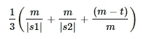

# Python 中模糊匹配的最佳库

> 原文：<https://medium.com/codex/best-libraries-for-fuzzy-matching-in-python-cbb3e0ef87dd?source=collection_archive---------0----------------------->

## 字符串匹配变得简单

数据科学家在日常工作中必须处理各种数据。数据处理的最大挑战之一来自非结构化数据。当数据不能以表格(结构化)的方式表示时，就称为非结构化数据。[非结构化数据](https://writersbyte.com/uncategorized/why-is-big-data-so-important/)包括文本、音频、视频文件等。

文本数据是通过使用特殊技术来处理的。一种这样的技术是模糊匹配。模糊匹配是指寻找字符串之间的相似性，这些相似性度量可以用于多种目的。模糊匹配可以通过多种算法来完成，每种算法都有其优缺点。下面我们来讨论一下这些算法。

## 常见的模糊匹配算法

模糊匹配用于检查两个字符串是相同还是不同，如果是后者，则检查它们不同的原因。模糊匹配通常被称为**编辑距离，**，即字符串 A 需要编辑多少才能匹配字符串 B？有多种计算相似性度量的方法。我们来讨论三个最常见的。

*   **莱文斯坦距离**

弗拉基米尔·莱文斯坦于 1965 年首次使用了莱文斯坦距离。它通过计算将第一个字符串转换为第二个字符串所需的最小单字符编辑次数来确定两个字符串之间的相似性。Levenshtein 将以下操作视为编辑:

1.  添加
2.  删除
3.  代替

所需编辑的数量越小，两个字符串越接近。

*   **damer au–Levenshtein 距离**

Damerau-Levenshtein 的工作方式与传统的 Levenshtein 算法完全相同，但有一点改进。除了上面提到的三个编辑，Damerau-Levenshtein 还考虑了换位。换位相当于交换两个相邻的字符，被认为是一次操作。Damerau 指出，这四种操作占所有人类拼写错误的 80%。

*   **贾罗-温克勒距离**

Jaro-Winkler 距离算法是在 1990 年提出的。它建立在 Jaro 相似性算法的基础上，该算法使用以下公式来计算相似性。

Jaro 相似方程

*   m =匹配字符的数量
*   t 是转座数的一半
*   |s1|和|s2|分别是每个字符串的长度。

Jaro 相似性返回一个介于 0 和 1 之间的分数，其中 0 表示不匹配，1 表示字符串完全相同。Jaro-Winkler 通过对第一个 *i* 匹配字符应用更多权重来修改公式。我不会讲太多细节，但最终形式由下面的等式表示。

在继续之前，如果你觉得这些内容有帮助，请考虑在 [Ko-Fi](/codex/ko-fi.com/moosaali9906) 上支持我。

在高保真上支持我

## python 中的模糊匹配库

Python 有很多模糊匹配算法的实现。我收集了一些可供开源使用的最好的库。

1.  **FuzzyWuzzy**

FuzzyWuzzy 使用模糊匹配的 Levenshtein 距离实现来给出所提供的句子之间的比率分数。

使用以下命令安装库。

模糊的装置

安装完成后，只需如下所示的一行代码就可以使用这个库。

测试 fuzzywuzzy

得到的比率是 90，意味着这两个句子 90%相似。

该库还附带了一个额外的包，可以将计算速度提高 10 倍。从他们的[文档](https://pypi.org/project/fuzzywuzzy/)中了解更多关于 FuzzyWuzzy 的信息。

2. **Rapidfuzz**

RapidFuzz 与 FuzzyWuzzy 是完全相同的实现，但主要是用 C++编写的，并在它的基础上提供了额外的算法改进。它的 C++实现使得这个库非常快，并且它提供了一些优于 FuzzyWuzzy 的额外好处。

*   这是一个麻省理工学院的许可证，所以你可以为你的项目自由选择许可证。
*   它包含了一些额外的实现，比如 Jaro-Winkler，这是 FuzzyWuzzy 中没有的

您可以使用以下命令安装该库。

安装 RapidFuzz

它的功能与 FuzzyWuzzy 完全相同，但速度更快。

这个比率是 **80.7%**

RapidFuzz 也提供了更多的功能，类似于 FuzzyWuzzy。在[官方文档](https://pypi.org/project/rapidfuzz/)中阅读更多关于它们的信息。

3.贾罗-温克勒

**Jaro-Winkler 距离在 python 中也有多种实现，但很明显，其中许多都是不正确的。根据 StackOverflow 上的一个用户所说，pyjarowinkler (一个非常古老和流行的 python 库)产生的结果似乎不正确。我用 jaro-winkler 库测试了同样的问题，得到了与其他正确实现匹配的结果。**

**使用以下命令安装库。**

****

**安装 jaro-winkler**

**使用“jaro_winkler_metric”函数计算距离。参见下面的应用程序。**

****

**测试 jaro-winkler 库**

**相似度为 **78.3 %****

**在计算比率或百分比时，Jaro-Winkler 距离比 Levenshtein 或 damer au–Levenshtein 具有非常重要的优势。后面提到的算法为较小的字符串提供了误导性的结果。下面我们来看一个例子。**

****

**测试较短的字符串**

****

**结果**

**即使字符串只相差一个字符，比率也是 67%，这是一个非常大的数字。现在让我们和 Jaro-Winkler 距离比较一下。**

********

**两种算法的结果**

**Jaro-Winkler 算法返回相似性百分比 **82.2%，**这是一个合理得多的数字。**

## **模糊匹配的应用**

**字符串匹配在日常应用中起着重要的作用。当你在谷歌上搜索某样东西，它会用著名的*“包括……的结果”来纠正你的错别字。***

****

**谷歌字符串匹配**

**在后台，谷歌实际上通过编辑距离算法运行您的查询，并将其与预定义词典中的每个单词进行匹配。同样功能的另一个例子是手机上的自动更正功能。**

**它也用于许多搜索算法中，这些算法弹出与实际查询相似的术语建议。这使得搜索功能更加高级，因为即使您没有输入准确的术语，也可以找到正确的匹配项。**

**模糊匹配的另一个应用是消除数据库中的重复记录。很多时候，我们的记录包含类似的数据，所以像“分组”这样的把戏不起作用。模糊匹配有助于挑选出定义的阈值内的所有记录。**

## **总结想法**

**模糊匹配是一种简单却非常有用的[数据处理](https://writersbyte.com/datascience/applied-data-science-with-python-and-pandas/)技术。它用于 web 应用程序的不同方面，也包含在许多数据处理管道中。Python 提供了一些惊人的库，实现了某种形式的模糊匹配。这些库提供了简单的 API 来计算字符串匹配分数，可以在您的应用程序中使用。**