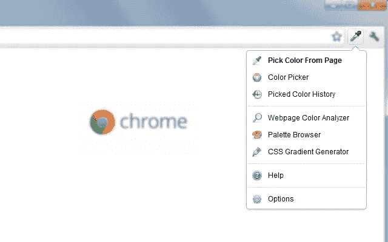

# 最佳救生 Chrome 扩展

> 原文：<https://medium.com/codex/best-life-saving-chrome-extensions-aa5f5b6e495?source=collection_archive---------1----------------------->

## 谷歌 Chrome 是一款很棒的浏览器。速度快、设计好、包含基本功能，但这仅仅是开始。Chrome 的真正优势之一是庞大的扩展库。

事实上，Chrome 网上商店有如此多的扩展，它们可以与所有基于 Chrome 的浏览器如微软 Edge 兼容。是的，如果你以前不知道，微软 Edge 是一个基于 Chrome 的网络浏览器，它完全支持 Chrome 扩展。

不管怎样，我们在这里不是在讨论浏览器，而是在讨论它们的扩展。分机是我们的救命稻草。来说说他们中的佼佼者吧。

# 1 —屏幕记录器

[点击进入扩展页面。](https://chrome.google.com/webstore/detail/screen-recorder/hniebljpgcogalllopnjokppmgbhaden)

我打赌很容易理解屏保是干什么用的。当你每天经常上网时，你可能想在网上与你的朋友分享一些东西。屏幕记录器在这里帮助它。

此外，它不仅仅保存浏览器屏幕。您可以在电脑上录制和保存任何想要的东西，包括麦克风。

# 2-黑盒

[点击进入扩展页面。](https://chrome.google.com/webstore/detail/blackbox-select-copy-past/mcgbeeipkmelnpldkobichboakdfaeon)

你曾经尝试过改写照片或视频吗？黑盒扩展将为您节省大量时间！有了黑盒，你可以选择屏幕上的任何地方并复制那里写的东西。即使是在照片或视频中。

要使用它，你只需要点击黑盒的图标，然后选择屏幕上的某个地方，它会做剩下的事情！之后，你会看到一个弹出窗口，说它复制了屏幕上你选择的内容。你可以粘贴复制的内容。

# 3 —语法上

[点击进入扩展页面。](https://chrome.google.com/webstore/detail/grammarly-grammar-checker/kbfnbcaeplbcioakkpcpgfkobkghlhen)

如果你的母语不是英语，我相信你对语法有所了解。如果你像我一样作为一个非英语国家的人用英语写作，Grammarly 对你的措辞和语法有很大的帮助。当然，它不能 100%解决所有问题，但肯定会有很大帮助。

# 4 — AdGuard

[点击进入扩展页面。](https://chrome.google.com/webstore/detail/adguard-adblocker/bgnkhhnnamicmpeenaelnjfhikgbkllg)

嗯，内容创作者靠广告挣钱。但是，一些网站过度使用这些广告，甚至无法阅读里面的内容。当然，我们必须支持内容创作者，而不是使用广告拦截器，但有时他们真的需要。

# 5-拉环吊杆

[点击进入扩展页面。](https://chrome.google.com/webstore/detail/tab-suspender/fiabciakcmgepblmdkmemdbbkilneeeh)

这样的特性已经默认出现在浏览器中。但是现在，我们可以使用 Tab 吊杆来提高我们的系统性能，特别是如果你习惯了用数百万个标签在网上冲浪。

标签暂停扩展基本上暂停标签，你没有打开几分钟。有了它，你的浏览器将消耗更少的内存。

# 6 — ColorZilla

[点击进入扩展页面。](https://chrome.google.com/webstore/detail/colorzilla/bhlhnicpbhignbdhedgjhgdocnmhomnp)

当你在网上冲浪时，你有没有想过某样东西的确切颜色？ColorZilla 就是来帮忙的。要查看准确的 RGB 或十六进制代码，您只需点击扩展，然后点击您想要了解其颜色的内容。仅此而已！

# 最后的想法

当然，有数以百万计的扩展，其中大多数使日常工作更容易。毕竟我们说的是最流行最有用的。如果你有其他建议，请在评论中分享。还有，如果你觉得内容有用，可以通过下面的提示支持我😇。下一个主题再见！