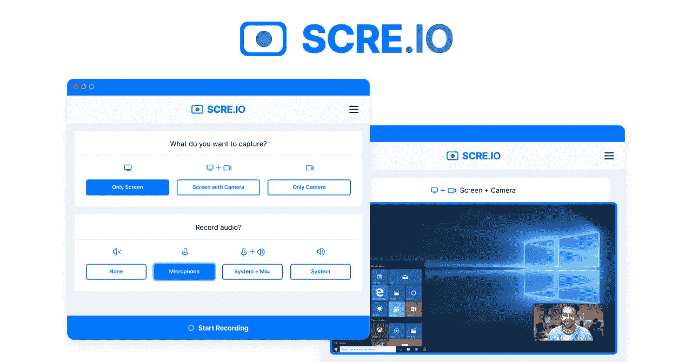

# 前端开发人员的最佳救命工具

> 原文：<https://medium.com/codex/best-life-saving-tools-for-front-end-developers-ce5419665ff1?source=collection_archive---------2----------------------->

对于不知道我的故事的人([点击阅读](/@sellimenes/how-to-learn-front-end-development-before-a-wedding-62e552b5d65a))，我是一个 jr .前端开发者，没有任何 CS 学位，也没有任何 bootcamps。我在 2022 年 1 月开始学习前端开发，已经做了 3 个月的全职前端开发人员。我会在这篇文章里分享我给前端开发者的最好的救命工具。

作为一个新手前端开发人员，什么都不知道怎么做，或者说连做什么都不知道。有时候，向你的团队领导提简单的问题也不是很好的选择。在这种情况下，谷歌当然是最好的帮手，但有些工具也可以救命。开始了。

# 1.色彩奇拉

[官方 ColorZilla 页面](https://www.colorzilla.com/)

我在每一个浏览器上都使用 ColorZilla。它基本上可以帮助我在一秒钟内从网页上获取准确的颜色代码。当然，你总是可以从 inspect 菜单中找到颜色代码，但是如果你能在一秒钟内找到它，为什么还要浪费时间呢？

在我的工作中，我已经在做 3 个不同的项目，他们有 7 个不同的项目。他们都有一个管理面板，客户端页面，其中一个有一个额外的登录页面。在这些项目中，我致力于 React、Nextjs 和 Svelte。前一分钟我还在 React 中写代码，下一分钟我发现自己写得很苗条。其中一个项目没有任何 Figma 文件，但有一个原始页面(我们正在制作一个流行页面的官方土耳其页面)，我有点从零开始克隆它的功能。在这里，ColorZilla 帮了我大忙！

# 2.JSON 浏览器专业版

[官方 Chrome 扩展网址](https://chrome.google.com/webstore/detail/json-viewer-pro/eifflpmocdbdmepbjaopkkhbfmdgijcc)

我正在做的一个项目，就像一个 API 集成的地狱。我的意思是，一个项目不可能有更多的 API。我们的 sr .后端开发者很快就会屏蔽我，因为我几乎每天都在要求新的 API！

嗯，当我检查新的 API URL 时，很难理解那里有哪些数据以及如何组织这些数据。有了 JSON Formatter Pro，所有的 API URLs 都将是 JSON 格式，你甚至可以一键复制路径。我很难理解如此漫长而复杂的道路，但这一延伸拯救了我的生命。

# 3.屏幕记录器

[官方页面网址](https://scre.io/)

作为开发人员，理解问题是至关重要的。作为一个 jr .开发者，理解你的团队领导想要你做什么是最重要的。如果远程办公，通过写作很难正确理解一切。屏幕记录器在这里帮了我很大的忙。当我有不明白的地方，我只是用麦克风录下我的屏幕，我会简短地问我需要什么。还有，我每天汇报工作的时候都在用它。

# 4.自动重命名标签(VS 代码)

[扩展的官方网址](https://marketplace.visualstudio.com/items?itemName=formulahendry.auto-rename-tag)

作为一名 jr .前端开发人员，我更多的是用 HTML CSS 设计页面，而不是编写至关重要的功能。当然，我写了很多函数，但是每当有设计任务时，它就突然变成了我的任务。我喜欢这样。无论你使用哪种框架，自动重命名标签都有助于 HTML。对于其中一个项目，我们使用查克拉界面进行设计，在查克拉界面中，我在<box>和<flex>之间做了很多改变。有了自动重命名标签扩展，它自动事半功倍。</flex></box>

# 5.顺风 CSS(我知道它不是一个“工具”)

[官方顺风 CSS 页面](https://tailwindcss.com/)

是的，你说得对。顺风 CSS 不是一个“工具”。但它比我在这里写的其他文章更能拯救生命，所以我不想写完提及它。嗯，我想没有人不知道 Tailwind CSS，但它是一个 CSS 框架。它让你的设计之路更快更容易。

此外，Tailwind CSS 最好的部分是，它删除了所有你不用的东西！所以，使用它没有一个缺点。你的网站或者网络应用不会因为你在用顺风而变慢。没有比自己写 CSS 更糟糕的了！这就是我最喜欢它的原因！

# 结束…

我在这个领域还是个新手，所以可能会有更好的选择，或者我甚至不知道它的存在。但我只是想分享我用的和我喜欢用的东西。当然，还有一些其他的扩展，比如 React Developer Tools 和 VS Code 的 ES7+,但我不认为我需要提到它们。

如果你对其他工具有什么建议。请不要犹豫，写在评论中。我喜欢分享我在这条道路上的想法，但没有比在这里发表评论更好的动力了！下篇见，不知道什么时候的！还有，如果你觉得内容有用，可以通过下面的提示支持我😇。