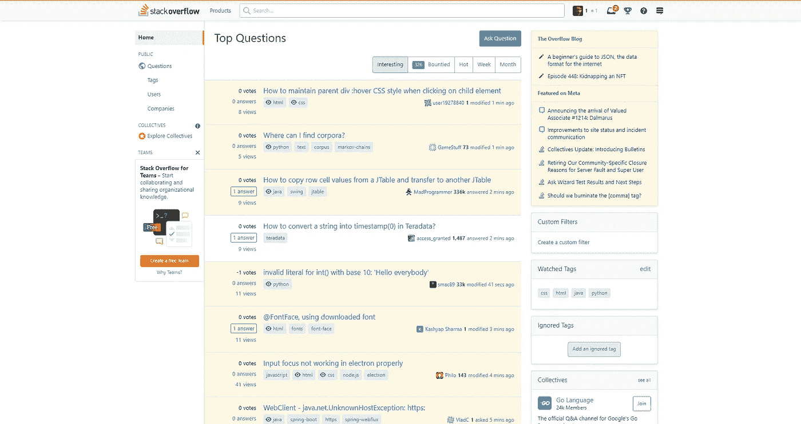
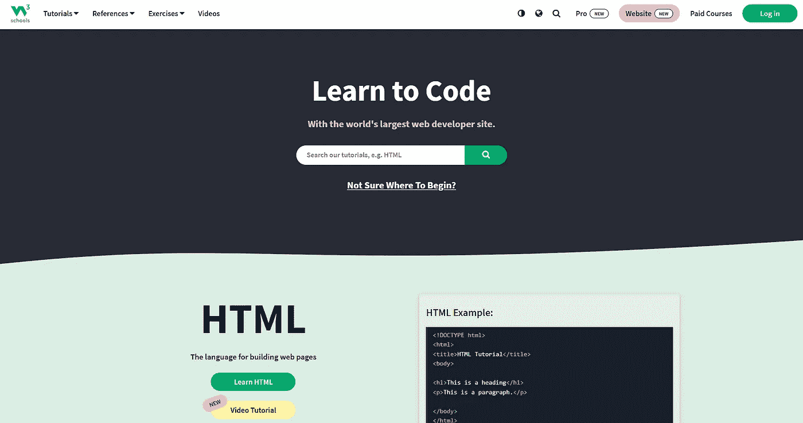
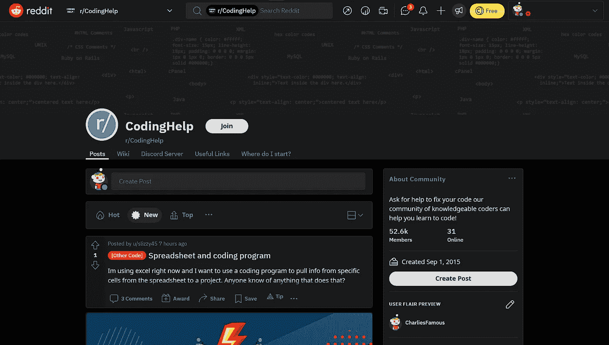

# 免费获得编码问题帮助的最佳地点

> 原文：<https://medium.com/codex/best-places-to-get-assistance-with-coding-issues-for-free-8d5266d22bdb?source=collection_archive---------24----------------------->

有没有被一个 bug 困扰太久？我们都有过这样的经历，无休止地搜索谷歌，试图找到一个你还没看过的、不需要信用卡的结果。以下是查找任何编码问题的编码帮助和协助的 5 个最佳免费位置列表:

## [**1。堆栈溢出**](https://stackoverflow.com/)

Stack Overflow 将 reddit 和编码混合在一起，邀请一个大型的程序员社区走到一起，互相帮助。堆栈溢出允许任何人在任何时间提出任何问题。

免费

1400 多万注册用户

*   许多人之前回答问题是为了寻求帮助，而不是问。
*   许多活跃的人准备回答你的问题。

[2**。不和谐**](https://discord.com/)

Discord 为 bug 修复提供了更私人的体验，用户可以加入与他们喜欢的特定主题相关的不同服务器。很多类似[**Dis-board**](https://disboard.org)**&[**top . gg**](https://top.gg/)**这样的网站更容易找到对公众开放的服务器的邀请链接。****

****免费(可选购买)****

****650 多万台活动服务器****

****通过 DM 提供一对一帮助****

****[**3。quora**](https://www.quora.com)****

********

****你可能听说过这个流行的提问网站，但是并不是每个人都知道这个网站有一个大型的编码相关问题的社区。Quora 每分钟都会收到新问题，这意味着几乎任何问题都有答案。****

****免费****

****4000 多万个问题****

****涵盖不同主题的许多不同空间****

****[**4。W3 学校**](https://www.w3schools.com/)****

********

****W3 Schools 是一个只专注于编码的网站，它提供的信息非常密集。****

****免费(可选会员)****

****每页的深度信息****

*   ****W3 Schools 还举办练习、测验和课程****

****[**5。Reddit**](http://Reddit.com)****

********

****正如 Reddit 的口号所说，你可以真正“深入任何事情”，因为 Reddit 已经建立了良好的社区，它在这个名单上赢得了一席之地，提供了这个名单所提供的最大的用户群。****

****免费(可选购买)****

****许多来自非常熟练的程序员的著名回应。****

*   ****超过**4.5 亿**月活跃用户****
*   ****250 多万活跃的子 Reddit****

****我希望您喜欢我个人列出的在您的编程之旅中寻找帮助的 5 个最佳地点。祝你好运，找到你未来所有好奇心的答案！****