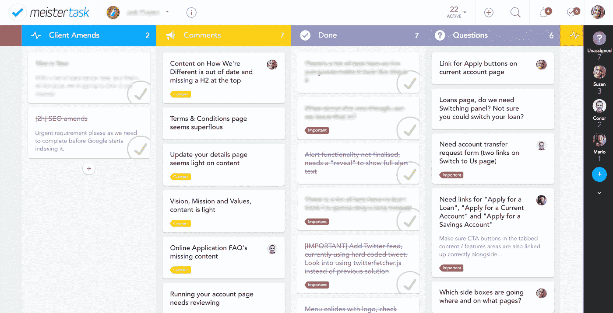
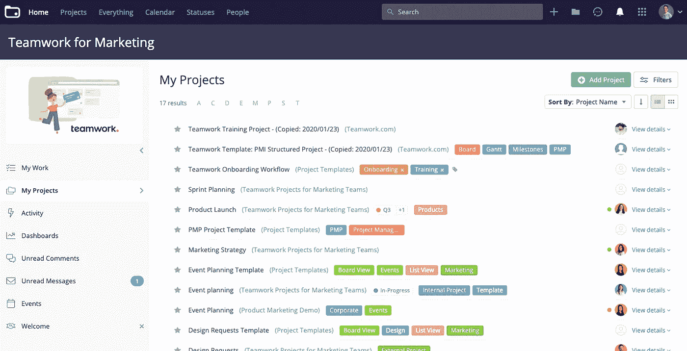
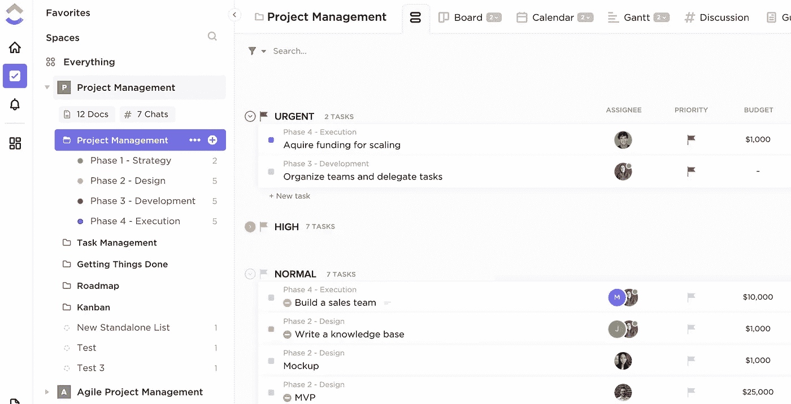
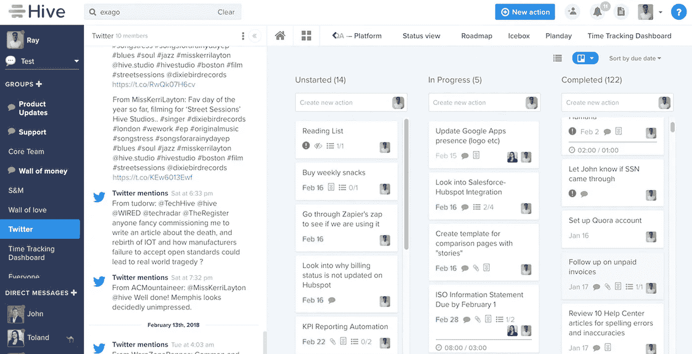
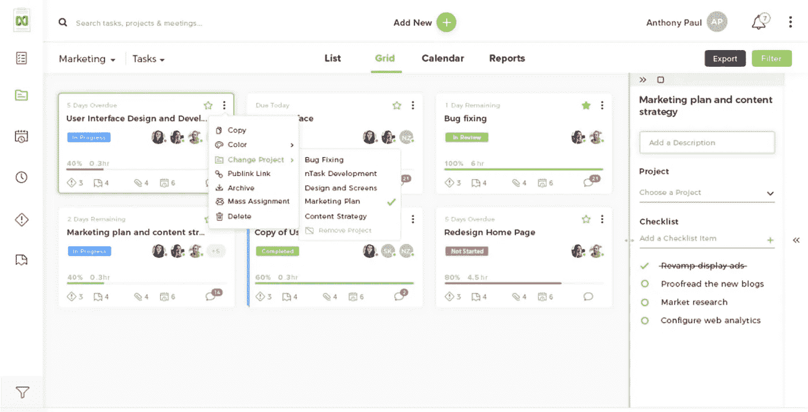
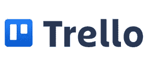
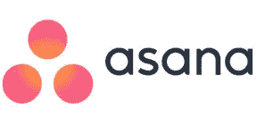
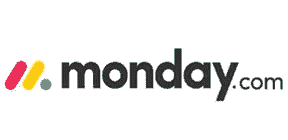
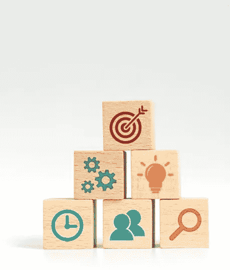

# 当今最好的项目管理软件是什么？

> 原文：<https://medium.com/codex/best-project-management-software-92194c993c50?source=collection_archive---------11----------------------->

## 在 2022 年为你的团队寻找合适的项目管理工具？作为一名项目经理，下面列出了我用过的 PM 软件。

由 cottonbro 在 pexels.com 发现的照片

你可能听人们说过，当你远程工作时，很难掌握项目，但有了当今最好的项目管理软件，这不再是借口。

从第一天开始，就有一个组织你的任务和沟通渠道的简化系统，你可以确保每个团队成员都有他们需要的一切，以免错过任何最后期限。如果你允许团队中的每一个人，包括你雇佣的自由职业者和独立承包人，都可以访问并参与进展，那么就不会有任何人被遗漏或感觉他们错过了关于下一步需要做什么的关键信息。

这还允许跨办公室(或大洲)的团队无缝协作，而不会牺牲效率，也不会因为只是为了完成工作而不断往返于不同地点而不堪重负。

# 哪些项目管理工具最好？

我被要求定义什么是好的项目管理软件。老实说，我不认为任何一个特定的软件可以为所有的项目提供最好的特性，因为不同的工具有不同的方面更适合某些需求。

我喜欢的对你来说可能不是一个好的选择；正因为如此，我敦促你从头到尾读完这篇文章，以便你做出明智的决定，而不仅仅是因为我告诉了你。

# 我最喜欢的 5 个项目管理软件

以下是我在与许多数字营销机构合作时用过的最大赌注清单。

## 1.MeisterTask

[MeisterTask](https://bit.ly/meistertasktool) 是我最喜欢的项目管理工具，因为它非常用户友好、简单明了，并且有可以定制的彩色项目板。

在某种程度上，这就像一个更好的特雷罗版本。它的界面允许您直观地创建任务并与团队的其他成员无缝协作，同时使用软件提供的最新功能。

任务卡也同样得到了增强。在每个任务卡中，您可以创建易于检查的子任务，系统本身会自动记录谁做了什么。额外的部分，例如作为单独描述的任务注释，也是一个很好的特性，所以整个任务本身是组织良好的。

除此之外， [Meister Task](https://bit.ly/meistertasktool) 还包括类似@提及和通知的功能，因此您可以通过评论轻松交流，并跟踪合作者的任务或项目状态。

MeisterTask 唯一的缺点是，尽管它提供了很多特性，但它们并不是默认启用的。像自动化、时间跟踪和统计报告这样的特性，您必须深入项目属性并调整设置来启用它。

***高亮集成:***
Slack、Google Drive、微软团队、IFTTT、MindMeister 等。

*****订阅选项:***
基础(免费)
专业(4.19 元)
商务(10.39 元)
企业(定制价格)**

# **2.协力**

****

**团队合作是我的另一个最爱，虽然它不如上面的 Meister Task 那么容易上手。然而，它同样很好，因为它是专门为项目经理设计的，所以他们可以成功地领导他们的团队从头到尾完成工作流程的每个元素。**

**这种基于云的解决方案允许您创建任务，并有效地跟踪您的时间和资源，这是高效管理项目的关键方面，尤其是如果您是一家大公司。还有一个选项是用你公司的标志来标记它。**

*****突出显示的集成:***
[团队协作](https://bit.ly/teamworktool)使用 Webhooks。这是一个更高级的功能，使您能够自动化和管理平台的外部集成。**

*****其他功能:***
*交互式甘特图
*可查看的活动任务和过期任务
*时间记录和每个任务花费的时间
*计费小时和发票生成器
*里程碑
*触发器和积压**

*****订阅选项:***
永远免费
交付(10 个月)
增长(18 个月)
企业(定制价格)**

# **3.点击**

****

**如果你想在 [MeisterTask](https://bit.ly/meistertasktool) 和[团队合作](https://bit.ly/teamworktool)之间有所融合，那么 [Clickup](https://bit.ly/clickup-tool) 就是为你准备的。使用 ClickUp，目标驱动的项目轻而易举，因为它提供了可自定义的视图来帮助组织您的工作量。例如，列表视图允许用户以一种有组织的方式一次跟踪他们所有的任务，没有任何混乱。**

**ClickUp 对于那些需要“任务控制中心”的目标驱动型个人来说也是完美的，他们很难组织一切事情，从单个项目如任务或次要任务到一个需要在会议、截止日期等之上关注的总体项目。**

*****高亮集成:***
Slack、G Suite、Dropbox、Zoom 等**

*****其他功能:***
*清单和子任务
*甘特图和时间表
*协作 Wiki 和文档编辑
*能够与其他团队成员聊天
*可定制的报告仪表板**

*****订阅选项:***
免费
无限制(5 元起)**

# **4.储备**

****

**Hive 是用于项目管理和协作的一站式应用程序。它的受欢迎程度一直在自然增长，在全球范围内有超过 30 万用户，包括优步、星巴克、IBM 和 WeWork 等公司。**

**[Hive](https://bit.ly/hivepmtool) 通过一个支持数千个集成、数百个项目视图和基于人工智能的分析的集中式平台，让事情变得前所未有的简单。因为它可以容纳 1000 人，中型到大型公司都选择 [Hive](https://bit.ly/hivepmtool) ，因为它能够处理公司工作流程的各种需求。**

*****高亮集成:***
Salesforce、Hubspot、Freshbooks、G Suite、Slack 等。**

*****其他功能:***
*可以在甘特图、看板或日历中查看
*任务摘要的清晰视图
*表单集成
*焦点模式功能
*时间跟踪和时间表报告
*实时聊天**

*****订阅选项:***
【单人(免费)
团队(12 mo)
企业(定制价格)**

# **5.nTask**

****

**如果你想更好地管理你的工作流程，那么 [nTask](https://bit.ly/ntasktool) 值得一试。NTask 是一款用户友好的时间管理和项目规划工具，适用于自由职业者、小团队或想要记录在单个项目上花费的时间的机构。这可以让你更好地估计成本，并看到你的钱会去哪里，同时也随时了解你的业务中需要注意的最新情况。**

**使它们区别于其他项目管理工具的是它的高级会议功能(这也是我喜欢 [nTask](https://bit.ly/ntasktool) 的原因)。您可以创建一个包含所有详细信息的议程，将其存储起来供以后查看，或者发送给团队以外的成员，而无需在此过程中关闭应用程序。**

****高亮集成:**
Zapier、Evernote、Github、Office 365、Slack 等。**

*****其他功能:***
*任务优先级
*具有在线会议软件
*灵活的时间跟踪和记录
*附带风险管理工具
*专用工作区**

*****订阅选项:***
免费
超值(2.99 元)
商务(7.99 元)
企业(自定义价格)**

# **我最差的三个项目管理工具**

**特雷罗 vs 阿萨纳 vs 周一的战斗…**

## **特雷罗**

****

**作为最古老的任务板之一，Trello 是一个很好的项目管理伙伴。但随着时间的推移，它只能作为个人项目管理来利用。项目板和任务卡非常有限，其存储也非常有限。因为一切都是有限的，所以会有太多的麻烦，甚至让你没有效率。**

**Trello 仍然可以成为那些刚起步并想要简单的项目管理应用程序的人的一个很好的工具。但如果你是一家成长中的公司，你最好选择 MeisterTask 或 Teamwork，他们也有免费试用。**

## **阿萨纳**

****

**有太多关于 Asana 和 Trello 的争论，那是因为他们已经存在太久了，现在大多数人已经习惯了他们。但对我来说，我已经超越了他们，转向了更好的选择，我在上面已经提到过了。**

**我第一次接触 Asana 是在西雅图一家 SEO 公司工作的时候。我以前喜欢这个，当所有其他选项还不可用或者我以前没有听说过它的时候。老实说，我喜欢 Asana，因为它只是 Trello 的升级版。但是完全加载项目板和卡要慢得多。**

## **星期一**

****

**周一是街区里最新的孩子之一，到处都是成熟的营销广告，很难不认识他们。它们开始于 2012 年左右，但直到 2020 年中期才开始流行，当时 Youtube 所做的只是为我提供他们的广告，其中有一个人不断用头撞桌子，循环播放。**

**我目前有一个客户使用周一来管理他们的项目，我只能说他们的加载速度很糟糕。完全加载他们的仪表板需要很长时间。有一次，我不得不刷新几次。在其他情况下，我不得不坐在那里，永远等待仪表板出现。**

**这个工具本身非常具有交互性——它更像是一个时间线，而不是卡片的使用——但是因为它太慢了，所以我不愿意四处浏览来了解它的特性。**

# **什么是项目管理？**

**项目管理背后的历史可以追溯到 20 世纪早期，亨利·甘特开发了一个图表，提供了任务如何进展的概览视图。然而，随着计算机在二战后变得越来越受欢迎，以及在我们最近的十年(2000 年代)中再次成为自己的一部分，一种新的形式或理解也出现了。**

**使用这些工具的重要性现在可以说是[的顶点](https://www.forbes.com/sites/forbestechcouncil/2020/05/29/project-management-in-the-age-of-remote-working-three-tips-for-managing-team-members/?sh=2af8dcc56698)，因为每个功能都需要它们，从上到下——而不仅仅是那些像经理或执行官那样只负责协调项目本身的人。**

**简单来说，项目管理软件是一种工具，它通过提供在线协作空间来帮助组织和简化项目，人们可以在这里登录，查看他们必须做的任务，记录他们在这些任务上的进展以及相关细节，如关于任何更改的注释。具有适当权限级别的人将能够查看所有其他需要完成或已经完成的任务，因此一切从开始到结束都很顺利。**

# **为什么要使用预防性维护软件？**

## **1.它增强了交流**

**项目管理软件的一个主要好处是能够建立沟通渠道。这些可以包括每个团队成员的个人电子邮件或聊天室，以及整个团队的电子邮件链和讨论板。**

**在一个拥有许多部门的大型组织中，很难找到合适的人来做出改变或询问需要做什么。项目管理工具使找到合适的人和发送任务或请求变得容易，而不必通过可能甚至不知道你需要什么帮助的多人。**

## **2.领导者可以从宏观层面来看待项目**

**项目管理应用程序旨在让项目经理和高管轻松保持领先地位。他们可以看到谁需要什么，什么时候需要，在截止日期之前还有多少工作，以及他们团队中是否有人没有及时完成任务或根本没有完成任务。**

## **3.帮助团队区分任务的优先级**

**它消除了管理项目的担忧，并使团队成员更容易看到他们接下来需要做什么，这[提高了他们的生产力](https://smallbusiness.chron.com/increase-productivity-workplace-planning-procrastinating-prioritizing-17940.html)，因为任务完成得更快。**

**项目管理软件还通过允许人们查看任务需要多长时间以及他们还剩多少时间来完成这些任务，来让人们负起责任。大多数工具现在都增加了日历功能，显示一周中每天应该完成的任务，这也有助于团队成员保持组织性。**

## **4.帮助控制成本和管理预算**

**关于项目管理软件，你必须明白的一点是，它不是为单个项目设计的。它具有处理所有企业级业务操作的潜力，包括轻松地同时管理小型任务或多个项目的大型团队。项目管理软件通过自动化各种流程(如计划、计时和开票)来帮助控制成本和管理预算。**

## **5.有助于资源分配**

**项目管理软件可以帮助分配资源。例如，如果一家公司正在考虑雇用一名额外的员工来承担未来六周的工作，而他们有 50 名员工可以执行这项任务，项目管理软件将能够根据他们的技能组合或可用性告诉他们哪些资源最适合这项新工作。项目管理软件还可以用来帮助跟踪员工资源分配，并识别技能组合中的潜在差距。**

****

# **选择项目管理应用程序时，需要考虑哪些关键特性？**

**我知道你很忙，处理你盘子里的所有事情可能是一个挑战，因此你在这里寻找最好的项目管理软件。**

**一个好的项目管理工具是帮助你让一个团队一起创造东西并把它从 A 点带到 b 点的工具。**

**也就是说，我将在这里分享功能的五个关键方面，这将有助于让您更容易地交付项目，这样您就可以继续前进，并删除那些便利贴和永无止境的电子邮件，以便更有效地运行您的项目。**

## **项目任务列表**

**这对于概述什么时候需要做什么是必要的。它还可以帮助您了解还剩多少工作，或者谁应该负责哪些任务。有了这些知识，团队中的每个人都更容易准确地知道他们需要将注意力集中在哪里，以便在不牺牲质量的情况下高效地实现每个项目的目标**

## **行程安排**

**你需要能够控制你的项目，充分利用你的项目管理应用程序的最好方法是确保它具有日程安排功能。这将有助于让事情保持在正轨上，这样每件事都可以在适当的时间发生，没有任何不必要的麻烦或问题。一个好的视觉概观有助于确保没有任何遗漏，同时在从开始到结束需要多长时间的更广泛的方案中，所有任务都被适当地分配了适当的时间。**

## **文件共享**

**如果你在保持组织性方面有问题，那么考虑一个项目管理工具，它可以很容易地找到你需要的文件。有了这样的功能，您可以与团队成员共享关键文档，按分配的工作人员或截止日期组织任务，实时跟踪里程碑和截止日期，以及[在团队内部创造透明度](https://kissflow.com/project/how-to-improve-project-transparency/)。想象一下，如果所有这些资源都是即时可用的，您的项目会如何发展？**

## **沟通**

**沟通在项目成功中起着重要的作用，因为它有助于你让你的团队走上正轨并保持组织性。最好的方法是什么？获得一个具有协作功能的项目管理软件，该软件允许基于所有参与方的项目进行上下文对话，因此每个人都可以随时获得最新信息。**

## **报告**

**项目经理应该知道项目是否按照其目标进行。为了清晰地向高层管理人员或客户沟通提前或滞后的项目，项目经理需要及时报告，这就是为什么在选择订阅什么项目管理系统时，这是一个必须考虑的功能。**

**在选择项目管理软件时，重要的是首先知道你需要什么，然后你可以探索高级功能(如思维导图规划、计费、事后分析、时间跟踪等)。**

****

# **你觉得怎么样？**

**那么你认为最适合你的项目管理软件是什么呢？你考虑过你想要的功能吗？或者也许你已经决定去找我上面提到的那些？我很想听听你对此的看法。**