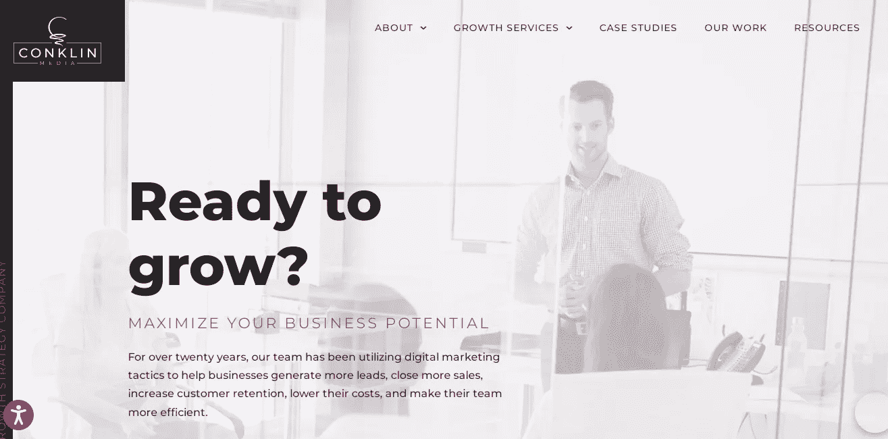
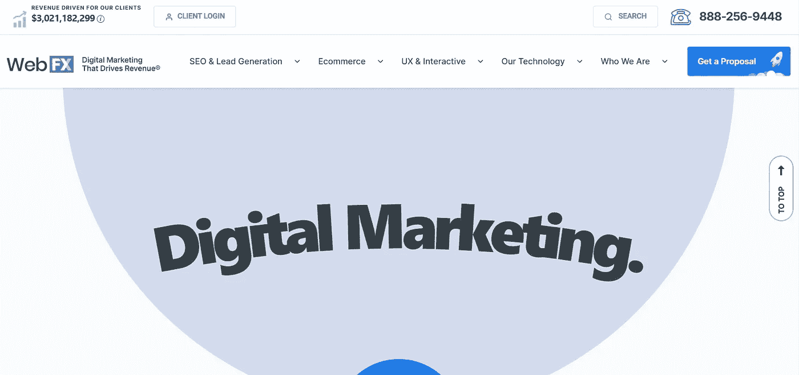
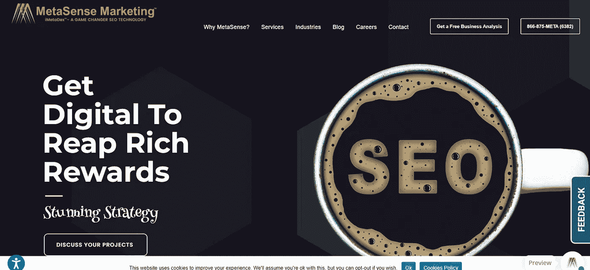

# 费城 21 家最佳 SEO 公司(排名和评论)

> 原文：<https://medium.com/codex/best-seo-companies-in-philadelphia-d647ac9e7615?source=collection_archive---------11----------------------->

## 看看费城最好的搜索引擎优化公司，它们可以帮助你找到合适的外包公司。

由作者设计

各种规模的企业都需要通过销售产品或服务来创收。

成功的企业增加了他们的客户群，确保了源源不断的现金流来维持他们各种各样的业务运营，同时仍然获得利润。

为了增加销售额，每个公司都必须学会如何将网站访问者转化为潜在顾客，然后是潜在顾客，最后是顾客。然而，故事并没有就此结束。有远见的企业继续用有用的材料吸引他们的客户，以确保他们长期的忠诚度。

然而，SEO 在产生潜在客户并将其转化为忠实客户方面有多重要？通过高质量、优化的内容和设计完美的网站。

我们已经讨论了费城最好的 SEO 公司，以帮助您提高组织访客的数量和质量。

## 1.[康克林传媒](https://conklinmedia.com/)

来源:康克林媒体

17 年来，康克林传媒通过成熟的数字营销策略，为业务增长提供了一种定制的方法。康克林媒体是实现商业成功的最佳结果驱动的数字营销机构。

由[戴夫·康克林](https://daveconklin.org/)创立的康克林传媒提供一系列服务来满足你的商业需求，包括付费广告、搜索引擎优化、内容营销、设计、网络开发和咨询。康克林媒体公司位于宾夕法尼亚州的兰卡斯特，为全国各地的企业实施成熟的战略。

作为一家致力于帮助企业发展的全方位服务机构，康克林传媒首先使用[利润路径方法](https://profitpaths.com/)来分析每个企业的目标和优先事项，以确定最佳战略，从而显著提高销售额、增加客户保留率和增加平均客户终身价值。

无论您的企业是希望获得更多合格的销售线索，获得更多的客户，还是完成更多的销售，康克林传媒都可以执行正确的数字营销策略来帮助实现这些目标。

康克林传媒已经帮助了许多成熟的和正在扩张的公司成长并取得了更大的成功。凭借跨行业的经验，他们的全方位服务数字营销团队可以为您的企业提供可扩展的业务增长方法。

康克林媒体为全国各地的企业提供创新的业务增长解决方案，是费城地区最好的数字营销机构之一。当您与康克林媒体合作时，您将受益于 100 多年的综合经验、成熟的框架和为您独特的业务目标定制的以增长为导向的方法。

*   员工:11-50 岁
*   **行业:**制造、电子商务、零售、医疗、法律、金融、建筑、商业服务、消费品和服务
*   **项目规模:**$ 5000 以上
*   时薪: $175-$250

**社交联系:**

*   https://www.facebook.com/conklinmedia/的脸书
*   领英:https://www.linkedin.com/company/conklinmedia
*   推特:https://twitter.com/conklinmedia

## **2。** [**排名首席**](https://rankingchief.com/)

首席情报官

Ranking Chief 采用数据驱动的数字营销策略来帮助公司和企业增加销售额和收入。

他们由经验丰富的数字营销人员和主题专家组成的团队可以帮助您打造品牌、挖掘潜在客户和获得经济高效的客户。认识到每项业务的独特性及其目标。

因此，个人提供定制的数字营销服务，如搜索引擎优化、社交媒体优化和应用程序商店优化，以帮助公司增加有机和赞助流量。

用户是最好的页面内、页面外、社区参与和技术 SEO 服务和策略的专家，帮助你实现最大的搜索可见性和有针对性的流量。

排名首席的道德搜索引擎优化服务是专为您的品牌和业务，协助品牌，线索创造，销售和收入。

通过增加品牌和非品牌行业关键词的流量，他们希望增加有机接触。

*   员工:10-49 岁
*   **行业:**金融服务、电子商务、房地产、IT、医疗保健
*   **项目规模:**1000 美元以上
*   每小时费用:50 美元到 99 美元

在社交上保持联系；

*   https://m.facebook.com/rankingchief 脸书
*   领英:https://www.linkedin.com/company/ranking-chief
*   推特:https://twitter.com/ranking_chief

## **3。WebFX**

来源— WebFX

由 William Craig 拥有的 WebFX 是一家业绩驱动的数字营销公司，为客户提供服务，改善合格的销售线索、电话和交易。

WebFX 是面向中型企业的最佳绩效驱动型数字营销代理。

WebFX 成立于 1996 年，总部位于宾夕法尼亚州哈里斯堡，是中型企业最佳的绩效驱动型数字营销公司。

它雇佣了超过 225 名网络营销专家，是谷歌的首要合作伙伴。此外，他们还与谷歌、脸书、必应和 Salesforce 达成了协议。

他们致力于通过从 SEO 到 PPC 的定制数字营销策略来发展组织，这占了他们客户保持率的 90%以上。

当你与 WebFX 合作时，你会得到他们的熟练员工和 MarketingCloudFX 的令人难以置信的组合，他们的结果加速技术。

*   **员工:**250–999 人
*   **行业:**商业服务、医疗、法律、金融、电子商务
*   **项目规模:**25，000 美元以上
*   每小时费用:$ 150-$ 199

**在社交上获得联系；**

*   https://facebook.com/webpagefx 的脸书
*   领英:https://www.linkedin.com/company/webpagefx
*   推特:https://twitter.com/webpagefx

## **4。SEO 品牌**

来源-SEO 品牌

SEO Brand @ Mike sal Mike Salvaggiois 是一家位于佛罗里达州博卡拉顿的数字营销公司，专注于基于技术的 SEO。

该公司在迈阿密、宾夕法尼亚、巴黎和蒙特利尔设有办事处。他们做博客管理和内容营销，以及公共关系和网站建设。

此外，该公司还提供针对亚马逊的服务，通过进行详细的关键词研究和撰写准确的产品描述，帮助客户在亚马逊上获得更多的可见性。

SEO 品牌知道如何帮助您的业务在线增长。事实上，他们是最早提出大量链接建设、市场优化和移动解决方案策略的公司之一，这些策略至今仍在使用。

因为他们参与过数百种不同类型的活动，所以他们非常了解活动的运作方式。

这些都在数据里。这样，他们可以对其他人看不到的数据做出决策。他们通过结合大量的数据点来做到这一点。

这个过程会产生比你能处理的更多的收入、前景和流量，而这仅仅是个开始。

无论你的企业是大是小，他们都会关注你网络形象的每一部分，因为他们是一家提供全方位服务的数字机构。

对于每个客户，他们都提出了一个独特的、量身定制的数字营销计划，在投资回报方面 100%可以实现。他们利用他们在分析、开发和设计方面的技能来做到这一点。

*   员工: 10 至 49 岁
*   **行业:**汽车、商业服务、零售、医疗、非营利、制造
*   **项目规模:**1000 美元至 10000 美元
*   每小时费用:$ 100-$ 149

**在社交上保持联系；**

*   https://www.facebook.com/SEObrand/的脸书
*   领英:https://www.linkedin.com/company/seo-brand/
*   推特:https://twitter.com/seobrand

## **5。搜索引擎优化区域设置**

Source-SEO 区域设置

SEO Locale，LLC 是费城最好的 SEO 公司之一，专门从事本地和全国 SEO 服务以及小型企业的网页设计和开发。

该公司由两位在该领域拥有超过 15 年专业知识的数字营销人员于 2015 年创立。

他们向客户提供页面内和页面外 SEO 服务，以及社交媒体营销、点击付费广告和内容营销。

他们还提供月度报告，以便企业可以跟踪他们的增长。Clutch 将 SEO Locale 选为 2017 年费城最佳 SEO 公司之一。

马克·布鲁克兰(Marc Brookland)渴望创建自己的数字营销机构，并从根本上帮助企业发展。

Nick Quirk 于 2018 年作为合伙人加入该公司，带来了数十年的专业知识。Nick 为价值数百万美元的企业重新设计了完整的数字营销策略。

凭借 Nick 的背景和 Marc 的基础，他们能够在美国将 SEO Locale 发展到 10 名员工和客户。

他们认识到，他们的成功取决于客户的成功，这正是激励他们每天为客户提供结果的原因。

*   **员工:**10–49 岁
*   **行业:**消费品&服务、法律、电子商务
*   **项目规模:**1000 美元以上
*   每小时工资:100 美元到 149 美元

**获得社交上的联系；**

*   **https://www.facebook.com/SEOLocale/:脸书**
*   推特:https://twitter.com/seolocale

## **6。NuStream**

源-核流

NuStream 是费城一家提供全方位服务的最佳 SEO 公司，为市内和周边的各种企业提供服务。

该组织成立于 2010 年，为客户提供搜索引擎优化和点击付费服务。

NuStream 是一家数字营销机构，专注于搜索引擎优化、网站设计、视频制作、PPC 活动和一般数字营销服务。

他们在宾夕法尼亚州、费城和阿伦敦各有一家工厂，能够以合理的价格提供高质量的工作。

据他们说，这是至关重要的优先考虑您的企业的网站，因为在今天的环境下，大多数消费者寻找信息在线使用搜索引擎。

在今天的市场上，每个人在日常生活中都使用搜索引擎。为了确保你的企业出现在相关搜索中，请 NuStream 的专家来处理和运行你的点击付费广告活动。

NuStream 的搜索引擎营销专业人员团队将创建一个包含相关关键词、信息丰富且极具吸引力的广告的活动，并确保您的广告到达您网站上包含相同相关关键词的正确相关页面。

NuStream 通过推广其品牌和利用尖端策略来帮助各种规模的企业开展创意和营销活动，使其在行业竞争中脱颖而出。

*   **员工:**2–9
*   **行业:**医疗、法律
*   **项目规模:**$ 1000 以上
*   每小时费用:$ 100-$ 149

**在社交上保持联系；**

*   https://www.facebook.com/nustreammedia/的脸书
*   领英:https://www.linkedin.com/company/nustream-marketing-llc/

## **7。1 数字代理**

来源-1 数字机构

1Digital Agency 成立于 2012 年，是一家数字营销机构。他们的总部在费城，在加拿大魁北克也有一个办事处。他们总共雇用了 28 人。

1Digital 是一群拥有不同技能的独特个人，他们有一个共同的目标:创建令人惊叹的电子商务网站&被称为费城最好的 SEO 公司之一。

他们主要专注于电子商务解决方案，通过使用 BigCommerce、Shopify Plus、Magento、CPC、SEO 和电子邮件营销来优化中端市场企业。

他们的数字营销人员是强迫性的研究人员，不断寻找新的战术和战略，我们可以说是最好的电子商务搜索引擎优化团队。

这家电子商务机构很乐意为您的企业提供电子商务网站设计和开发专家团队，以及全面的数字营销策略，包括行业领先的电子商务 SEO 和 PPC 服务。

这家电子商务数字机构致力于与严肃的电子商务企业发展长期关系，旨在扩大其销售和在线知名度。

在 1Digital，他们发现每个客户都有无限的机会和难以想象的潜力，然后制定战略来帮助他们实现这种潜力。

*   员工:50–249 人
*   **行业:**电子商务、医疗、合法大麻、汽车
*   **项目规模:**1000 美元以上
*   每小时费用:$ 150-$ 199

**在社交上保持联系；**

*   【https://www.facebook.com/1digitalagency】脸书:T4
*   领英:https://www.linkedin.com/company/1digitalagency-com
*   推特:https://twitter.com/1digitalagency

## **8。布罗里克**

Source-Brolik

Brolik 是一家总部位于费城的数字营销机构。Brolik 成立于 2004 年，目前约有 15 名员工。

该公司专注于中小型企业的网站设计、数字营销策略、品牌和视频创作。

Brolik 是费城最好的 SEO 公司之一，提供全方位服务，结合创意和数据来帮助公司发展。

他们是专门从事数字营销的增长战略家。无论你需要网页设计，品牌，还是数字战略，Brolik 通过首先了解你的商业模式和目标，让你走上成功之路。

他们对项目的迭代方法保证了你的公司可持续发展。

通过把你放在适当的渠道，弄清楚如何传达你的独特价值，并确定市场前景，他们的主要目标是在正确的时间把你和正确的观众联系起来。

他们通过可扩展的过程去神秘化营销，从而帮助企业成长——无论是知名企业还是刚刚起步的企业。让我们与 Brolik 携手打造您企业的未来。

*   **员工:**10–49 岁
*   **行业:**消费品&服务、法律、商业服务、零售、医疗、非营利、制造、房地产
*   **项目规模:**10，000 美元以上
*   **时薪:**$ 150-$ 199

在社交上建立联系；

*   **https://www.facebook.com/brolikproductions/:脸书**
*   领英:https://www.linkedin.com/company/brolik/
*   推特:https://twitter.com/brolik

## 9。DMi 合作伙伴

KSource-DMi 合作伙伴

DMi Partners 是费城一家提供全方位服务的最佳 SEO 公司，提供广泛的服务。

该公司成立于 2003 年，拥有超过 75 名员工，主要从事非营利组织和消费品及服务工作。

他们在为客户提供增长解决方案方面拥有超过 16 年的经验。

DMi Partners 提供代销商管理解决方案，帮助品牌在销售线索挖掘、搜索引擎优化、电子邮件营销、品牌开发和代销商营销领域建立业务。

这是通过项目咨询、战略制定和执行来实现的。

DMi 在营销行业提供最高质量的营销战略、执行和结果方面有着良好的记录。

自 2003 年以来，DMi 一直倡导一种以人为本的协作战略来驾驭数字世界，以便为其业务合作伙伴带来成效。

作为一个 360 度的机构，他们高度重视创造力和数据之间、创新和屡试不爽之间以及自动化流程和人类洞察力之间的互动。

*   员工:50–249 人
*   **行业:**消费品&服务、电子商务、零售、媒体
*   **项目规模:**$ 5000 以上
*   每小时费用:$ 100-$ 149

**在社交上保持联系；**

*   https://www.facebook.com/dmipartners 的脸书
*   领英:https://www.linkedin.com/company/dmi-partners
*   推特:https://twitter.com/DMi_Partners

## **10。SEO 数字集团**

来源-SEO 数字集团

SEO Digital Group 是一家总部位于费城的搜索引擎优化和数字营销公司。SEO Digital Group 成立于 2016 年，目前拥有一个六人团队，专门从事 SEO、内容营销、PPC、数字战略和转化优化。

当谈到 PPC 时，他们有使用 Google AdWords 和 Bing 广告的经验。

SEO Digital Group 是一个由对线上和线下业务增长有着共同热情的数字营销爱好者组成的团体。

他们的成功集中在寻求改善或扩大互联网业务的中小型企业。

他们热爱并呼吸着数据驱动的战略，在客户的目标实现之前不会睡觉。

他们位于费城，但与美国各地的大小企业都有业务往来。

他们的方法始于对客户业务的理解，然后他们与你的团队合作设计一个专注于具体结果的计划。

他们不仅提供搜索引擎优化和在线营销服务，还提供补充服务，如响应式网页设计、点击付费广告、脸书广告、网站审计、分析、线索挖掘优化和本地搜索营销。

*   **员工:**2–9
*   **行业:**商业服务
*   **项目规模:**1500 美元以上
*   每小时工资:100 美元到 149 美元

**获得社交上的联系；**

*   **https://www.facebook.com/seodigitalgroup/:脸书**
*   领英:https://www.linkedin.com/company/seo-digital-group
*   推特:https://twitter.com/seodigitalgroup

## **11。元认知营销**

源-元感知营销

MetaSense Marketing 是一家位于新泽西州西柏林的信息技术服务公司。

MetaSense Marketing 现在是一家位于费城/新泽西州的公司，专门为全球市场提供高质量、经济高效、可靠且以结果为导向的数字和电子商务解决方案。

他们的 50 多名员工为各行各业的小型企业提供数字战略、社交媒体营销和电子邮件营销方面的咨询。

MetaSense Marketing 是一家提供全面服务的数字营销机构，专门开发成功的综合营销策略，也是世界上唯一一家提供专利人工智能工具 iMetaDexTM 的公司。

MetaSense Marketing 投入时间了解您的业务，并制定全面的战略来帮助您实现商业目标。

通过合作，他们可以帮助您加快在线增长，并最大限度地提高您的数字营销投资回报率。

他们运用专业精神、技能和专业知识让网络为你的企业服务。

他们在尽可能短的时间内最大化您的投资回报(ROI)。它们提供独一无二的 web 解决方案，可以提高您的业务效率，为您带来竞争优势。

*   员工: 10 至 49 岁
*   **行业:**商业服务、医疗、汽车、法律、牙科、酒店&休闲
*   **项目规模:**$ 5000 以上
*   每小时费用:$ 50-$ 99

**在社交上保持联系；**

*   https://www.facebook.com/MetaSenseMarketing 的脸书
*   领英:https://www.linkedin.com/company/metasense
*   推特:https://twitter.com/MetaSense

## **12。Majux 营销**

来源-Majux Marketing

Majux Marketing 是一家位于宾夕法尼亚州费城的搜索引擎优化公司。

Majux 是一家提供全方位服务的数字营销公司，专门帮助财富 500 强企业、律师事务所和电子商务网站增加收入。

Majux 专注于增加律师事务所和电子商务业务的收入和平衡 SEO 的可见性。

这家总部位于费城的咨询公司成立于 2012 年，服务于大中型企业以及财富 500 强企业。

他们的服务包括搜索引擎优化(SEO)、网站设计、电子商务开发和营销，以及 PPC、Adwords 和显示广告(付费搜索)、HTML5 广告设计/编程、内容创建/管理、现场和转化优化、品牌保护和声誉管理。

他们认识到每个部门和目标都需要定制的方法。

这就是为什么如此多的组织信任他们的团队和他们交付的结果。

Majux 作为数字营销解决方案的杰出提供商，在法律界享有盛誉。

在一些竞争最激烈的市场，他们与全国数十家企业合作。这是一个他们熟悉的空间。

在创建 Majux 之前，管理团队在地区律师事务所从事了 15 年的营销管理工作。

这种经历不会随着他们的管理而停止；他们还有律师、记者和营销人员，这些人都曾在律师事务所工作过。

Majux 的客户在与他们合作时，最看重他们新鲜的观点、诚实和对结果的重视。

*   员工: 10 至 49 岁
*   **行业:**商业服务、消费产品&服务、法律、广告&营销
*   **项目规模:**$ 5000 以上
*   每小时费用:$ 100-$ 149

**在社交上保持联系；**

*   https://www.facebook.com/majuxmarketing/的脸书
*   领英:https://www.linkedin.com/company/majux/
*   推特:https://twitter.com/majuxmarketing

## **13。入围名单**

来源-入围名单

Shortlist 是一家位于宾夕法尼亚州费城的数字营销公司，拥有 10 多名员工。

他们成立于 2018 年，专门为医疗保健、电子商务和医用大麻领域的各种规模的公司提供搜索引擎优化(SEO)、营销策略和品牌解决方案。

他们的目标是通过提供一流的营销执行来帮助您拓展电子商务业务。

利用专门的营销合作伙伴的服务，或者根据您公司的需求创建自己的数字营销团队。SEO，链接建设，网页设计，网页开发；文案；博客写作；客座博客；他们熟练的专家团队可以提供更多的服务。

“与我们合作，您将会发现营销合作伙伴投资于您的发展和销售人员投资于榨干您的利润之间的区别！”候选名单上写着。

他们的员工有丰富的经验，组织良好，并拥有可信的案例研究。他们的目的是获得结果，将使他们的消费者高兴，而不诉诸过度滥收费用。

*   **员工:**10–49 岁
*   **行业:**合法大麻、医疗、电子商务
*   **项目规模:**5000 美元以上
*   每小时费用:50 美元到 99 美元

**获得社交上的联系；**

*   **https://www.facebook.com/shortlist.io:脸书**
*   领英:https://www.linkedin.com/company/shortlistio

## **14。创意彩信**

来源-创意彩信

Creative MMS 是一家位于费城的数字营销机构，专门从事社交媒体营销。

这家公司成立于 2005 年，有 17 名员工。PPC、SEO 和数字规划是 Creative MMS 向中小型企业提供的一些服务。

创意彩信是一项数据驱动的数字营销业务，致力于为客户实现可衡量的结果。

其训练有素的营销专业人员团队使用成熟的技巧和尖端技术，在适当的时间通过适当的平台接触到适当的受众。

根据对分析和客户信息的分析，定制数字活动以满足特定受众的需求。

复杂的搜索引擎优化策略被编织到每一个营销资源中，确保你公司的信息在竞争对手的海洋中被看到。

现代网站设计既吸引人又有效，这是技术理解和独创性的结果。

另一方面，有效的内容营销将受众转化为忠诚的消费者。

Creative MMS 的每位员工都将他们的工作建立在客户数据的坚实基础上。

*   员工: 10 至 49 岁
*   **行业**:商业服务、法律、房地产、非营利、教育、金融服务、医疗
*   **项目规模:** $10，000 以上
*   每小时费用:$ 150-$ 199

**在社交上保持联系；**

*   https://facebook.com/creativemms 的脸书
*   领英:https://www.linkedin.com/company/creativemms/
*   推特:https://twitter.com/creativemms

## **15。鼹鼠街**

来源-摩尔街

摩尔街是一家成长型营销机构，总部设在费城，在弗吉尼亚州雷斯顿设有第二个办事处。它成立于 2011 年，在费城和莱斯顿设有办事处。除了战略和创意，他们还为中端市场、企业和小型企业客户提供数据分析服务。数字策略、会话优化和搜索引擎优化是他们提供的一些服务。

摩尔街的专业领域包括付费获取渠道、转化率优化、搜索引擎优化和消费者心理学。他们是 HubSpot 白金解决方案的官方合作伙伴，总部位于宾夕法尼亚州中心城市费城，在弗吉尼亚州雷斯顿设有办事处。他们在这两个城市都有业务。

他们提供的服务包括定制 WordPress web 设计和开发、线索生成和转化优化服务、点击付费(PPC)、付费社交、内容营销、视频制作和 SEO。

金融服务、医疗保健、技术、法律、教育和酒店行业的公司因其收集的数据和见解而获得不公平的优势。

摩尔街的项目基于一个简单的基本问题:他们如何与客户的目标受众互动，以实现业务的可持续和可预测的增长？

*   **员工:**2–9
*   **行业:**法律、酒店&休闲、教育、金融服务、医疗、电子商务
*   **项目规模:** $10，000 以上
*   每小时工资:$ 200-$ 300

**在社交上保持联系；**

https://facebook.com/molestreet 的脸书

领英:https://www.linkedin.com/company/mole-street

推特:https://twitter.com/molestreet

## **16。来自未来**

来源-来自未来

From the Future 是一家全球全方位服务数字营销机构，在费城和洛杉矶设有办事处，自 2011 年以来一直为全球企业提供服务。

From the Future 专注于用户体验和用户界面设计、搜索引擎优化、社交媒体营销、数字战略、内容营销、付费广告和分析，并提供可大规模使用的全渠道客户获取流程。

此外，该机构还在媒体规划和采购、转化率优化(CRO)、销售漏斗设计、表演创意和内容管理系统开发等领域提供营销解决方案。

来自未来已经与各种客户，包括 Jumio，凉鞋度假村，UFC，和神童教育。

该公司大约有 20 名员工为中端市场和企业客户提供服务。

来自未来(“FTF”)是一家世界级的数字战略机构，在几乎每个行业的客户面前都表现出卓越的能力，并在 SAAS、电子商务和专业服务方面具有竞争优势。来自未来的总部设在纽约市。

理想情况下，他们的客户每年创造超过 5000 万美元的收入，并希望通过包括搜索引擎优化(SEO)、社交媒体推广和行业领先的用户体验设计在内的综合战略来主导其市场。

*   **员工:**10–49 岁
*   **行业:**法律、金融服务、医疗、电子商务、商业服务、消费品&服务、政府、制造业、房地产
*   **项目规模:**10 万美元以上
*   每小时工资:200-300 美元

**获得社交上的联系；**

*   **https://www.facebook.com/ftfagency:脸书**
*   领英:http://linkedin.com/company/ftfagency
*   推特:http://linkedin.com/company/ftfagency

## 17。Dignitas Digital

来源-Dignitas Digital

Dignitas Digital 于 2012 年在费城成立，是一家全球软件开发和数字营销服务提供商。

四大洲的 100 多家客户受益于他们的专业知识，这是一家提供全方位服务的数字公司，在本质上既灵活又可扩展。

他们的 35 名员工团队与教育、信息技术和消费品行业的客户合作。

数字营销和定制应用程序开发是提供的一些服务。

其核心能力包括所有类型的定制 web、软件和移动应用程序开发，以及数字营销服务，如网站开发、搜索引擎优化、搜索引擎营销、社交媒体管理、电子邮件营销、手机广告和物联网开发。

*   员工: 10 至 49 岁
*   **行业:**教育、IT、媒体、零售、消费品&服务
*   **项目规模:** $10，000 以上
*   时薪:$ 25-$ 49

**在社交上保持联系；**

*   https://www.facebook.com/DignitasDigital/的脸书
*   领英:https://in.linkedin.com/company/dignitas-digital
*   推特:https://twitter.com/dignitasdigital/

## **18。动力波咨询**

源-动力波咨询

Dynamic Wave Consulting 是一家位于宾夕法尼亚州费城的直销公司，位于 Rittenhouse 广场。

该组织提供直接营销、网页设计、广告、搜索引擎优化、网页管理、媒体规划、品牌、法律咨询、战略规划和咨询、业务增长以及其他服务。

Dynamics Wave Consulting 是一家总部位于大费城地区的全方位服务媒体咨询公司，通过与初创企业、企业家和非营利组织合作，帮助他们以高效、有效和充满活力的方式发展业务，取得了卓越的成绩！

以下公司是他们的客户:Stradley Ronon Stevens & Young、LiveWell Foundation、ThankX-We Deliver、Value Prop 和 Steve Butcher 等。

Dynamic Wave Consulting 赢得的荣誉和提名包括 UpCity、CSS 提名和 2021 年戴维奖。

*   **员工:**2–9
*   **行业:**广告&营销，娱乐&音乐，商业服务，电子商务，金融服务
*   **项目规模:**5000 美元以上
*   每小时工资:100 美元到 149 美元

**获得社交上的联系；**

*   **脸书:**https://www . Facebook . com/Dynamic-Wave-Consulting-Greater-费城-109149291571910/
*   领英:https://www.linkedin.com/company/dynamic-wave-consulting

## **19。日常网络**

来源-每日网

天天网是一家成立于 2021 年的网页设计公司。该公司是一个小团队，专门从事在线设计、网页开发、电子商务开发和社交媒体营销。

该公司的总部在宾夕法尼亚州的费城。

日常网络正在重新定义游戏；为您的小型企业提供价格实惠的移动友好型网站、电子商务商店和社交媒体营销，起价 500 美元！

每日网络希望确保任何企业，无论规模大小，都能利用技术发展。让我们面对现实吧——为了竞争，你的企业必须是在线的。

他们的任务不仅仅是创建一个网站；他们帮助你发展你的网上业务，并引导你通过令人困惑的数字营销世界。如果处理得当，数字营销可以真正为你的企业创造奇迹。

他们为餐馆、房地产经纪人、美甲沙龙、牙医和律师提供特定行业的套餐，但他们也为所有类型的企业和自由职业者开发网站！daily Web 使用 Shopify、WebFlow、WordPress、Squarespace 和 Wix 等工具来启动和运营您的业务——这些工具为现代网络提供了动力，也将使您能够控制您的网站或电子商务商店。

这一切都始于网站或电子商务商店，但要真正在网上取得成功，你需要出色的社交媒体营销、搜索引擎优化和广告，以及使你的网站对客户更加友好的插件——幸运的是，他们以低廉的价格覆盖了你。

*   **员工:**2–9 人
*   **行业:**房地产、牙科、电子商务、法律
*   **项目规模:**$ 1000 以上
*   每小时费用:$ 50-$ 99

**在社交上获得联系；**

*   https://www.facebook.com/everydayweb.co 的脸书

## **20。先知互动**

源-Seer 交互

Wil Reynolds 旗下的 Seer Interactive 是一家位于费城的数字营销机构，在圣地亚哥设有分公司。

该公司成立于 2004 年。Seer Interactive 成立于 2002 年，采用搜索引擎优化将全国各地的客户与世界各地的潜在客户联系起来。电子商务、技术和国际搜索引擎优化、点击付费(PPC)、社交媒体、数字战略、**最佳本地搜索引擎优化以及营销战略是该机构擅长的一些领域。**

**它以受众为中心，在将这些信息整合到客户的搜索引擎优化(SEO)网站之前，先了解他们是谁，他们想要什么。**

**它是谷歌的首要合作伙伴，脸书营销合作伙伴，以及微软精英代理合作伙伴计划的成员。**

**B2B 和 B2C 业务，以及娱乐业、制药和医疗保健、保险和银行以及零售，都由 Seer Interactive 提供服务。**

*   **员工:50–249 人**
*   ****产业:**消费品&服务，娱乐&音乐，商业服务，零售，金融服务，医疗**
*   ****项目规模:**$ 5000 以上**
*   **每小时费用:$ 150-$ 199**

****在社交上保持联系；****

*   **https://www.facebook.com/SeerInteractive 的脸书**
*   **领英:https://www.facebook.com/SeerInteractive**
*   **推特:https://twitter.com/SeerInteractive**

## ****21。BrainDo****

****

**来源-BrainDo**

**BrainDo 是宾夕法尼亚州费城最好的 SEO 公司之一，提供广泛的服务。**

**BrainDo 是一家小型 SEO 服务公司，由一群行业专家于 2013 年成立，他们在网络分析、标签管理、SEO、付费搜索、社交、网页设计和开发、用户体验和品牌战略等领域拥有丰富的知识和经验。**

**数字解决方案的特定组合用于确保其合作伙伴的长期成功。**

**他们与广告公司、内部营销团队和企业合作，以增强他们的数字技能。**

*   ****员工:**10–49 岁**
*   ****行业:**广告&营销、商业服务、媒体**
*   ****项目规模:**5000 美元以上**
*   **每小时费用:50 美元到 99 美元**

****获得社交上的联系；****

*   ****https://www.facebook.com/braindollc/:脸书****
*   **领英:https://www.linkedin.com/company/braindo**
*   **推特:https://twitter.com/braindo**

## ****总结****

**虽然每个费城 SEO 服务公司都有自己的定价政策和开展业务的方法，但你应该在承诺之前问所有相关的问题。**

**作为一个一般准则，找到费城最好的搜索引擎优化公司，这是可访问的，适应性强，足以带你通过整个搜索引擎优化程序。虽然这是一项艰巨的任务，但一家声誉良好的费城 SEO 公司会花时间帮助你赶上进度。**