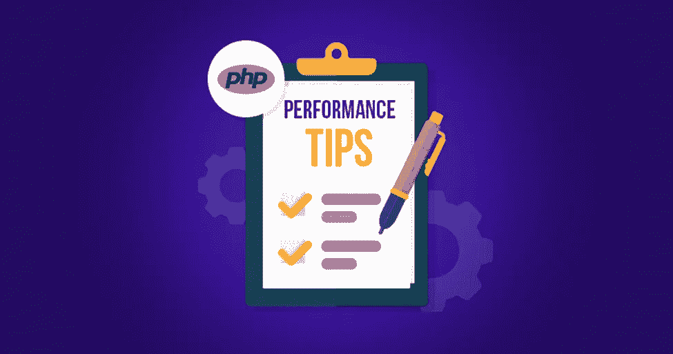

# 优化 PHP 代码的最佳技巧

> 原文：<https://medium.com/codex/best-tips-for-optimizing-your-php-code-1560d491bdb1?source=collection_archive---------16----------------------->

## 优化你的 PHP 代码可以提高你网站的性能

PHP 代码可能非常复杂，优化它并不容易。然而，一些简单的技巧可以帮助你优化你的代码，使它更有效地运行。通过遵循这些提示，您可以提高 PHP 代码的性能，使其更加有效。