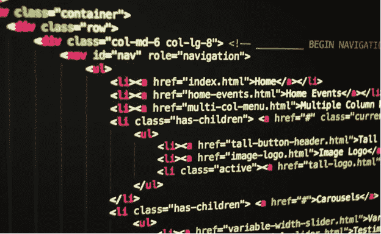

# 编写干净 HTML 的最佳技巧

> 原文：<https://medium.com/codex/best-tips-for-writing-clean-html-1a4490fa4def?source=collection_archive---------17----------------------->

HTML 是创建网页和 web 应用程序的标准标记语言。HTML5 是最新版本，包括音频和视频支持、更好的性能和更低的功耗等新功能。

**为什么你应该总是关闭你的 HTML 标签**

在 HTML 中，<keywords>标签用来表示一段需要特别强调的文本。这个标签通常是…</keywords>