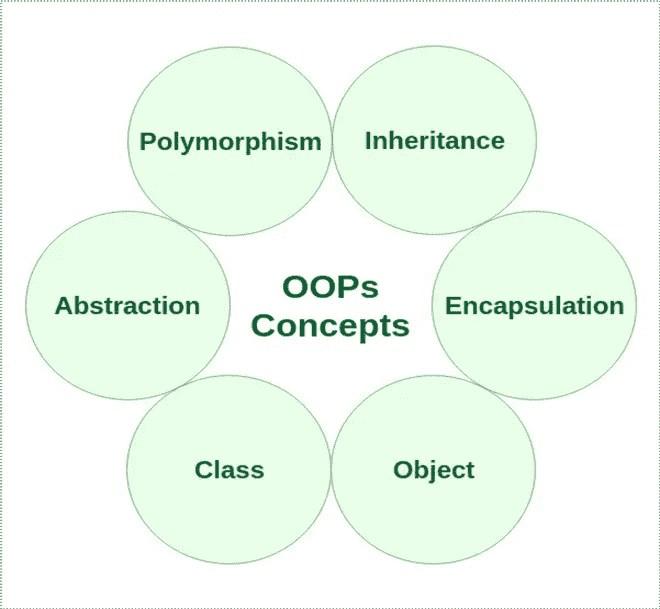

# 面向对象编程和设计的最佳技巧

> 原文：<https://medium.com/codex/best-tips-of-object-oriented-programming-and-design-1416418bd1a3?source=collection_archive---------15----------------------->

设计软件可能是一个复杂而耗时的过程。然而，你可以做一些事情来简化你的设计过程。本文将分享一些简化软件设计的技巧。遵循这些提示可以在设计过程中节省时间和精力。

## 为什么使用返回值进行输入验证？