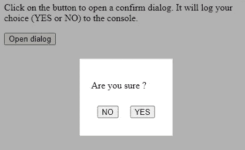

# 使用承诺处理 Vue 3 对话框

> 原文：<https://medium.com/codex/best-way-to-work-with-dialogs-in-vue-b992e7ca1818?source=collection_archive---------2----------------------->


在本文中，我将带您浏览 PrimeVue 和 Vuetify 等组件库提供了哪些对话框。然后我会告诉你我认为更好的方法。最后，我会告诉你如何使用 [vue3-promise-dialog](https://github.com/rlemaigre/vue3-promise-dialog) 。

# 以通常的方式对话

大多数组件库都提供对话框组件。

这是 PrimeVue 中的一个[例子:](https://primefaces.org/primevue/showcase/#/dialog)

和[另一个来自 Vuetify](https://vuetifyjs.com/en/components/dialogs/) :

如您所见，组件库鼓励您将对话框的代码(模板和逻辑)嵌入到打开它的父组件中。这有几个缺点:

*   这使得构建可重用的对话框变得不可能，因为每个对话框都被绑定到它的打开站点。
*   对话框的逻辑和模板与其父组件的逻辑和模板混合在一起。当一个父组件必须打开几个对话框时，这变得更加混乱。
*   无法从 JS/TS 文件打开对话框。
*   对话框只是从用户获取数据的一种方式，打开它并等待结果应该像异步函数调用一样简单，就像从服务器获取数据一样。组件库的方式并不是这样。

# 使用承诺的对话

众所周知，从服务器请求数据是一个异步过程，最好用承诺来处理。例如，[获取 API](https://developer.mozilla.org/en-US/docs/Web/API/Fetch_API) 是一个基于承诺的 API。

```
let response = await fetch('http://example.com/movies.json');
```

现在，就像从服务器获取数据一样，使用对话框从用户获取数据*也是一个异步过程，当用户关闭对话框时，它可能会在将来的某个时间点以一个值完成。为什么从用户获取数据的 API 与从服务器获取数据的 API 会有任何不同？*

使用 promises，打开一个确认对话框(例如)就像这样简单:

```
let ok = await confirm('Are you sure you want to do this ?');
if (ok) {
    // Do something
}
```

当对话框关闭时，promise 解析为用户在对话框中输入的值(在确认对话框的情况下为布尔值，但如果对话框包括表单，则可以是任何数据结构)。

这种方法有几个优点:

*   对话框没有绑定到它的打开位置，所以很容易构建可重用的对话框。
*   可以从父 Vue 组件或任何 JS/TS 文件中打开对话框。这只是一个函数调用。
*   在从用户和从服务器请求数据之间有一种令人愉快的对称。
*   对话框的代码和父组件的代码保持分离和独立。所以你必须解决两个独立的问题，这比解决它们的混合要容易得多。
*   一个父组件可以使用许多对话框而不会变得一团糟。

理论上这一切都很好，但是你应该如何去实现它呢？对于 Vue 2，可以使用 [vue-modal-dialog](https://github.com/hjkcai/vue-modal-dialogs) 。对于 Vue 3，可以使用 [vue3-promise-dialog](https://github.com/rlemaigre/vue3-promise-dialog) 。我将在下一节向您展示如何使用后者。

# 用 vue3-promise-dialog 许诺你的对话

我将向您展示如何构建一个基本的确认对话框。它不会很漂亮，但会很实用。可以在 StackBlitz 上玩完整的项目:[Vue 3+Vite+Vue 3-promise-dialog](https://stackblitz.com/edit/vitejs-vite-nzzfdg?file=src%2Fmain.ts&terminal=dev)。如果你想要一个漂亮的例子，看看这个小的对话框集合，它是这个库的测试用例，以及它的[演示。](https://rlemaigre.github.io/vue3-promise-dialog/)

这是我们将要建造的:



首先安装库:

```
npm i vue3-promise-dialog
```

然后安装插件:

```
import { createApp } from 'vue'
import App from './App.vue'
import {PromiseDialog} from "vue3-promise-dialog"const app = createApp(App);
app.use(PromiseDialog);
app.mount('#app')
```

接下来将`DialogWrapper`组件添加到应用程序根组件的末尾:

```
<template>
    <div id="app">
        <!-- your content -->
        <DialogWrapper :transition-attrs="{name: 'dialog'}"/>
    </div>
</template>
```

您的对话框将在那个`DialogWrapper`中打开。在内部，`DialogWrapper` 使用一个转换标签来转换你的对话框进入和退出视图。在我上面的例子中，转换的名称是`dialog`。使用`dialog-enter-from`、`dialog-leave-to`等类来制作对话框出现和消失的动画。为了简单起见，我们在这里不做任何事情。

下面是我们确认对话框的代码:

如你所见，这是一个普通的 Vue 组件。这是一个黑色的背景和一个居中的 div，带有“是”和“否”按钮。它有一个`text`道具来控制显示给用户的问题。除了一个`returnValue`函数和当用户点击按钮时对`$close`的调用之外，它没有什么特别之处。我现在将解释这两件事。

当你在一个对话框中调用`$close(this)`时，对话框关闭，它的承诺解析为`returnValue()`函数的结果。通常对话框会包含一个表单，`returnValue()`函数会返回用户在表单中输入的任何数据。在我们的例子中，没有形式，所以函数只返回 true。因为我们希望承诺在用户单击 YES 时解析为该值，所以我们在单击 YES 按钮时调用`$close(this)`。

当您使用第二个参数(例如 null 或 false)调用`$close(this, ...)`时，promise 将使用该值进行解析。在我们的例子中，我们希望当用户点击 NO 时，承诺解析为 false，所以我们在点击 NO 按钮时调用`$close(this, false)`。如果对话框有一个表单和一个取消按钮，当用户点击取消时，你可能想调用`$close(this, null)`。

这就是关闭对话框并返回值的方法。现在你如何打开它并得到承诺？您使用`openDialog`功能。

在我们的例子中，我们的目标是让这个 API 打开我们的确认对话框:

```
let yes = await confirm("Are you sure ?");
```

让我们看看异步`confirm`函数是如何实现的:

```
import { openDialog } from 'vue3-promise-dialog';
import ConfirmDialog from '../components/ConfirmDialog.vue';export async function confirm(text: string) {
  return await openDialog(ConfirmDialog, {text});
}
```

因此，要打开一个对话框并得到一个承诺，你调用`openDialog`并作为第一个参数传递你想要打开的对话框，作为第二个参数传递它的道具。该函数在类型方面很聪明:它将从组件定义中推断道具的类型，从`returnValue()`函数中推断返回类型。因此，如果你传入一个错误的道具，你的 IDE 将会抱怨。如果您等待承诺并将值赋给一个变量，该变量将具有正确的类型，因为 TypeScript 将从赋值中推断出它。

现在你知道了。我希望你喜欢这篇文章！感谢您的阅读。