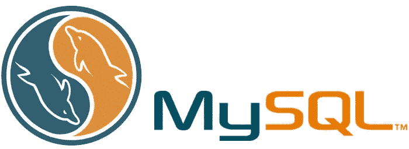

# 练习 MySQL 的最佳网站

> 原文：<https://medium.com/codex/best-websites-to-practice-mysql-93ebc0693afe?source=collection_archive---------11----------------------->

演职员表—[https://howto.lintel.in/mysql-best-pactices/](https://howto.lintel.in/mysql-best-pactices/)

# **简介**

MySQL 是最重要的关系数据库管理系统之一，它是开源的。所以你一定对什么是 SQL 有疑问。嗯，SQL 代表结构化查询语言。但是为什么这么叫呢？

在 SQL 中，字母 **S** 代表**结构化**，意思是我们的数据是结构化的形式，是以行和列的形式，所以叫做结构化。 **Query** 的意思是用来从表中检索信息的命令叫做 Query， **Language** 的意思是 SQL 和英语一样，容易使用，所以叫做 Language。

你从这篇文章中接受了什么

1.  您将获得关于哪些在线网站适合开始学习 SQL 的信息。
2.  在哪个数据库上可以开始练习？

让我们开始吧。

**网站开始学习 SQL。**

## 1. [W3Schools](https://www.w3schools.com/mysql/)

W3School 是一个免费的在线学习编码的网站。它是你能在网上找到的重要的网络开发者网站之一。我从 W3School 开始学习 MySQL，它非常清楚地解释了所有的例子。如果你想学习 MySQL，它将是我的首选。

## 2.[黑客排名](https://www.hackerrank.com/domains/sql)

在此之前你一定听说过黑客排名。他们有最惊人的 SQL 内容。在这里，您可以找到一些重要的专家级问题来练习和学习。最棒的部分是在考试竞争之后，你会得到一个证书，你可以在你的 LinkedIn 个人资料中展示它。

## 3.花艺学院

可汗学院是一个在线学习平台，拥有广泛的科目。以 SQL 为例，可汗学院提供了一门免费的课程，SQL 入门。

## 4.[教程点](https://www.tutorialspoint.com/sql/)

它有很好的 SQL 入门内容。如果你是初学者，开始学习它会对你有好处。

# 在哪个数据库上可以开始练习？

**1。人力资源数据库**

**2。北风数据库**

**3。Sakila 数据库**

这是您可以用来练习 SQL 查询的前 3 个数据库。

关于如何开始的提示。

如果你来自非编码背景或编码背景，SQL 是一种不需要任何编码语言的语言。所以在学习 SQL 的时候，试着关注每一个函数，在 SQL 中你需要学习的函数是有限的。尝试了解查询背后的逻辑，这将有助于你以简单的方式理解代码。

练习是成功的关键，所以尽可能多地练习。

# **结论**

这就是你在学习 SQL 时应该知道的顶级 SQL 网站列表。把它们标在书签上，每天一个一个地练习。

学习 SQL 就像学习任何其他语言一样——也就是说，一种编码语言。你不仅需要每天熟悉它，还需要使用它。养成访问和参与这些网站的习惯，然后动手——你需要编写查询来真正学习 SQL。

谢谢，祝你愉快

请看看我的其他故事。

 [## 地理空间分析项目(佐马托案例研究)

### 介绍

medium.com](/@singole/geospatial-analysis-project-zomato-case-study-f5026cebdfdd)