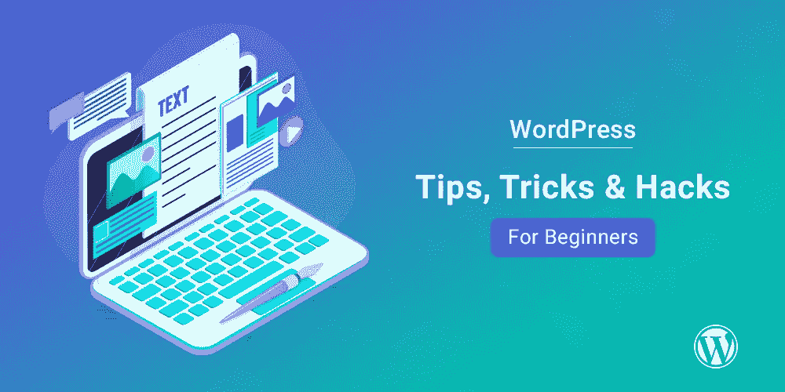

# 给初学者的最佳技巧

> 原文：<https://medium.com/codex/best-wordpress-tips-for-beginners-aa08da333b43?source=collection_archive---------15----------------------->

WordPress 是一个内容管理系统(CMS ),可以让你从头开始创建一个网站或博客，或者改进一个现有的网站。WordPress 是在 GPL 下发布的免费开源软件。WordPress 被全球数百万人使用，包括许多大型组织，如卫报、福布斯和纽约时报。WordPress 也很受小企业和个人的欢迎，他们想要一个简单的方法来创建一个漂亮的网站或博客。

