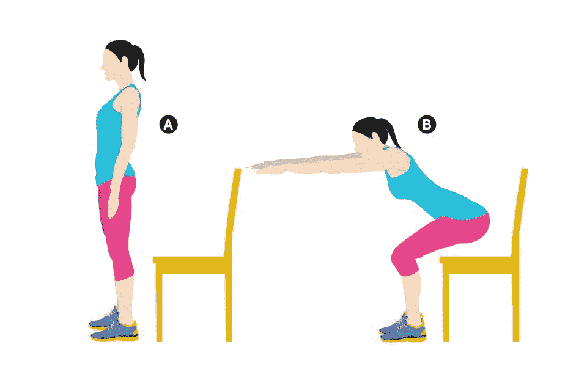
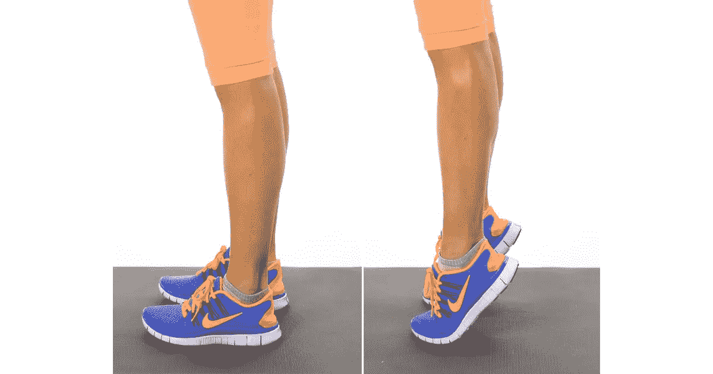
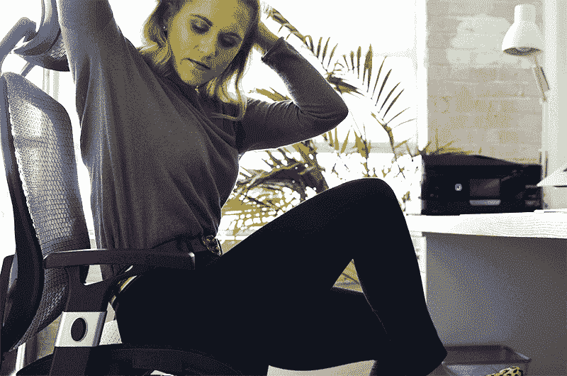
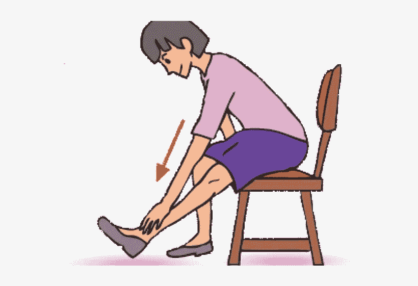
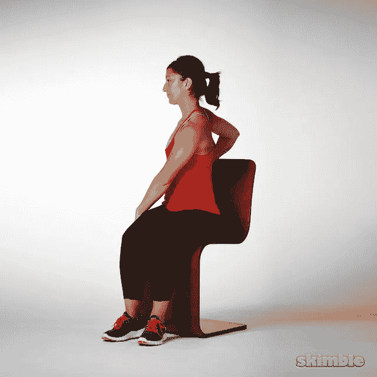

# 全天编程后的最佳锻炼

> 原文：<https://medium.com/codex/best-workouts-after-programming-all-day-33f3b5458071?source=collection_archive---------8----------------------->

维克多·弗雷塔斯在 [Unsplash](https://unsplash.com?utm_source=medium&utm_medium=referral) 上拍摄的照片

整天坐着编程可能会让你赚很多钱，但一切都是有代价的。你牺牲了维持身体和保持健康所需的户外活动。然而，并不是每个人都有时间或习惯去健身房或在家锻炼。

> 这里有 5 个练习可以在你的桌子旁边做！

# # 5——椅子蹲坐

[来源](https://www.google.com/url?sa=i&url=https%3A%2F%2Fcourtneymedicalgroupaz.com%2F2018%2F10%2F23%2Fexercise-of-the-week-chair-squats%2F&psig=AOvVaw1tbO5W8umWP9WgriFy0SJR&ust=1652943259995000&source=images&cd=vfe&ved=0CA4Q3YkBahcKEwjwhrLhu-j3AhUAAAAAHQAAAAAQDg)

这是工作时最简单也是最有效的锻炼方法之一。

1.站在你的椅子前面。

2.把你的臀部向后拉。

3.慢慢坐下，同时保持脊柱中立。

4.站起来，挤压你的臀肌(臀部)。

5.尽可能多次重复。

# # 4——小腿提升

[来源](https://www.google.com/url?sa=i&url=https%3A%2F%2Fwww.popsugar.com%2Ffitness%2Fphoto-gallery%2F31081972%2Fimage%2F31081978%2FCalf-Raises-Basic&psig=AOvVaw1xLth8gD5GvqJJEr3klbJo&ust=1652943554992000&source=images&cd=vfe&ved=0CA4Q3YkBahcKEwiQj4rgvOj3AhUAAAAAHQAAAAAQAw)

这看起来好像运动没什么好处，但它增强了你的小腿肌肉。

1.站起来，锁紧膝盖。

2.现在踮起脚尖，保持几秒钟。

3.从你开始的地方回来重复。

# # 3——坐式自行车仰卧起坐

[来源](https://www.google.com/url?sa=i&url=https%3A%2F%2Fsnacknation.com%2Fblog%2Foffice-exercises%2F&psig=AOvVaw0Crg1jdT14Q-EZOvk0BaTI&ust=1652943955919000&source=images&cd=vfe&ved=0CA4Q3YkBahcKEwjAqN2evuj3AhUAAAAAHQAAAAAQCQ)

这是一个非常重要的练习，甚至不需要你站着。坐式自行车仰卧起坐激活你的核心肌肉，如果做得正确，还会影响你的脊柱。

1.坐直，双手放在脑后。

2.**支撑你的核心**保持脊柱中立。

3.抬起一条腿，扭转你的躯干，让另一只手肘接触膝盖。

4.交替重复这个动作。

# # 2——腘绳肌拉伸

[来源](https://www.google.com/url?sa=i&url=https%3A%2F%2Fwww.editorialelpirata.com%2Ffshaapu%2F26528fshaapuf906098%3Fss%3D2_157_3_17_34%26pp%3Dsitting%2Bhamstring%2Bstretch%2Bchair%26ii%3D6116375&psig=AOvVaw0Wpb4tN2AD0HwYG1bVt5ZT&ust=1652944490960000&source=images&cd=vfe&ved=0CA4Q3YkBahcKEwiY4qmpwOj3AhUAAAAAHQAAAAAQAw)

长时间坐着会导致你的腿筋不活动。记住这个练习的灵活性和更好的走路姿势。

1.伸展一条腿，锁定膝盖。

2.保持脊柱中立，伸手够脚趾。

3.保持至少 5 秒钟。

4.另一条腿重复上述动作。

# #1 —躯干扭转

[来源](https://www.google.com/url?sa=i&url=https%3A%2F%2Fwww.skimble.com%2Fexercises%2F460-seated-torso-twists-how-to-do-exercise&psig=AOvVaw0meYmPnZLqxqnnK8Mfc5Uj&ust=1652944774461000&source=images&cd=vfe&ved=0CA4Q3YkBahcKEwjo_aukwej3AhUAAAAAHQAAAAAQAw)

即使坐姿很好，如果坐的时间太长，背部也会受到压力。花 1 分钟时间做这个练习，以减轻脊椎压力。

1.舒服地坐在你的椅子上。

2.不要让背部碰到靠背(如果有的话)。

3.保持脊柱中立，交替向两侧扭转躯干。

4.你可能会听到一些破裂声，这没什么，但不要过度。

# 结论

编程需要大量的脑力，但照顾好自己的身体也很重要。将这些基本练习纳入你的日常生活中，它们会让你的身体保持健康。

我希望你喜欢读我的文章，并学到了一些东西。谢谢大家！