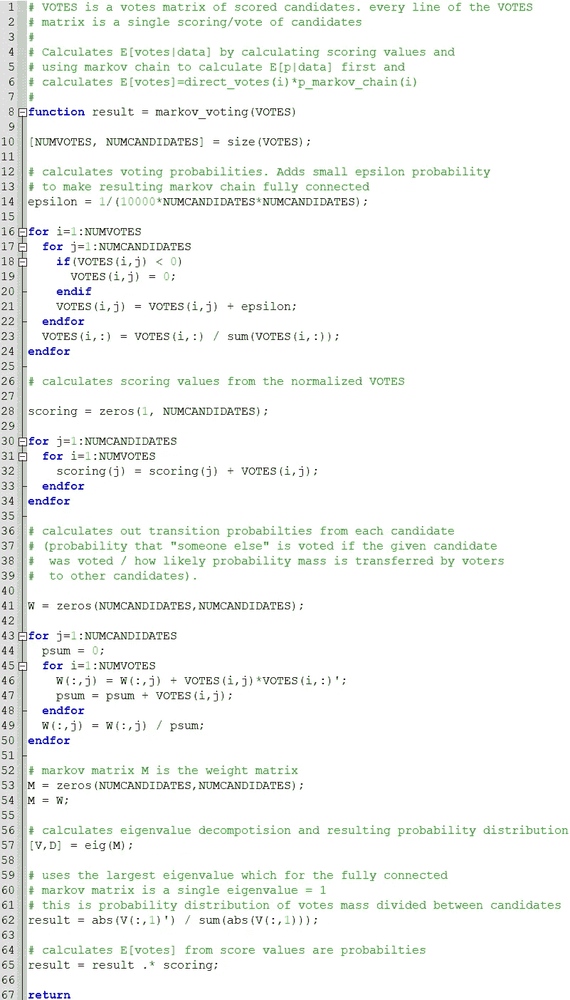

# 使用马尔可夫链获得更好的投票结果

> 原文：<https://medium.com/codex/better-voting-results-through-markov-chains-d8aa46c79870?source=collection_archive---------5----------------------->

注意:本文假设你对马尔可夫链有很好的理解，所以先阅读维基百科关于[马尔可夫链](https://en.wikipedia.org/wiki/Markov_chain)的文章。

*2021 年 9 月 27 日更新:阅读文末的* ***勘误表*** *。计算投票结果的代码中有一个错误，导致了错误的结论。我决定把这篇文章放在网上，因为它可能对一些读者来说仍然很有见地。*

**想法**

资本主义体系中的货币流动可以被认为是不断变化的马尔可夫链。在这些马尔可夫链中，人们用他们的钱为商品和服务的生产“投票”,这些钱也被用来购买产品。那些以最便宜的价格生产最好的商品的人得到最多的钱和资源。你为他人做的好事决定了你拥有的金钱数量，因此也决定了你的经济“投票权”。然后，政府的税收被用来保持系统更加民主，资金不断被重新分配给穷人，因此，即使是最贫穷和最年轻的人也有一些投票权，可以集体决定谁获得最多的资源来在系统中创造商品。

PageRank 算法的例子，权重最大的是重链接页面。

例如，搜索引擎也使用相同的机制对网页进行排名( [PageRank](https://en.wikipedia.org/wiki/PageRank) 算法)。每个页面的“投票权”是链接到它的页面数量，每个页面通过链接到其他页面来“投票”。这意味着如果用户点击页面上的随机链接，结果概率告诉用户在给定网页上的概率。

因为 PageRank 和资本主义经济运行得相当好，所以在投票中尝试使用相同的想法是一个有趣的想法。捕捉上述思想的数学模型是马尔可夫链，并且计算使用马尔可夫链矩阵来定义节点之间的概率质量转移。在定义了马尔可夫链矩阵之后，就有可能计算该链所收敛的节点的概率分布，并基于这些概率对节点进行排序。

**马尔可夫链和投票**

在大多数投票系统中，获得最多票数的人获胜。然而，在实践中，在选民的偏好中排名第二的人可能会从大多数选民那里获得大多数次要的位置，所以也许他应该当选。因为投票系统是民主的，每个人必须只有一张单位票，不像资本主义。不过，我建议这个单位票可以分成百分比票给不同的候选人，以取得更好的投票结果。这是由博弈论推理激发的，其中最佳选择有时是不同选择的概率分布。例如，选民可以将 90%的选票投给他的最佳候选人，将 10%的选票投给他的第二候选人。

有了这些想法后，我从 TowardsDataScience.com 那里找到了一篇有趣的文章*更好的投票方式。*

 [## 更好的投票方式

### 从个体排序选择量化集体偏好的马尔可夫方法

towardsdatascience.com](https://towardsdatascience.com/a-better-way-to-vote-4e04afd3a826) 

在文章[中，Vishesh Khemani 博士](https://medium.com/u/92a54b8269fc)介绍了一种分级投票方案，其中投票选项由每个投票者排序，并根据投票构建马尔可夫链。然而，这种候选人排序有几个缺点:

1.  如果候选人的数量很大，在投票时很难对所有候选人进行良好的排序，
2.  一个人不能精确地衡量他喜欢的不同候选人，而只能对候选人进行排序。例如，第三个候选人和其余的候选人可能只有很小的偏好，所以他想给第三个候选人 10%的权重，给其余的候选人 0%的权重。

**马尔可夫链投票计算**

在我的投票计算方法中，一张选票 *i=1..K* 是向量 ***p_i*** 对每个候选人的概率分布/权重*c _ j*:**P _ I**(*c _ j*)= P(*c _ j*|*I*)*。*然后，通过为每个候选对象 *n=1 增加一个小概率 *1/(10000*N*N)* 来扩大这个概率分布..N* 并且再次归一化概率向量 **p_i** 以具有和 1。这不会改变结果，并导致所得的马尔可夫链完全连接，从而最终的概率质量分布被很好地定义，并以精确的顺序对候选进行排序。

通过计算转移概率权重***w****(c _ j)*= E {***P***|*c _ j*} = SUM(*I*)***P _ I**** P(*I*|)为候选人 *c_j* 构造马尔可夫链矩阵 **= E {***p***|*c _ j*}*确定有多少概率质量从该候选人转移到其他候选人(由投票人也投票给其他候选人的偏好决定)。 计算这些转移概率的确切公式是投票人投票给其他候选人(和自己)的预期概率。它可以通过使用贝叶斯规则和每个投票者 *i* 都有相同的可能性 P( *i* )=1/K(一个恒定概率)的事实从投票中精确地计算出来:***

**

*马尔可夫链的马尔可夫矩阵**q***_(n+1)*=***M*********q****_(n)*为:*

**

*在计算马尔可夫链矩阵 **M、**之后，可以计算最终分布***q****_(INF)**，这给出了每个候选人的概率得分。这是通过计算特征值分解 **M** ，[ **X** ， **D** ]=eig( **M** )并使用特征值为 1 的最大特征向量 **x** 来完成的。**

****

**现在，在测试中，很明显，仅仅计算选票的分布是不够的。例如，在 PageRank 算法中，每个节点只有一个页面，但是在投票中，每个候选人/节点有多个投票，并且通过计算“期望得分/投票”可以获得更好的结果，在“期望得分/投票”中，马尔可夫概率值乘以该候选人的投票总数 *c_j* :**

****

****示例和评分基础方法****

****例 1****

**为了比较这个方法和 Viskesh Khemani 的方法，我用了一个例子。该示例使用候选人投票，其中有 5 张选票，3 名候选人根据投票人的偏好进行排序:**

**投票 1: X，MX，M
投票 2: X，MX，M
投票 3: MX，M，X
投票 4: M，MX，X
投票 5: M，MX，X**

**在多数投票中，在 X 和 M 之间有一个平手，并且从它们中，M 将被选择，因为从 X 和 M 的选择中有 M 作为第二选择票。然而，在这个投票结果中，有相当多的人支持 MX，它可能被选择而不是 X 或 M。**

**为了测试我提出的方法，通过给第一选择分配 3 分，给第二选择分配 2 分，给第三选择分配 1 分，对候选人进行评分/加权。通过计算每个候选人的得分，我们得到:**

**x:3+3+1+1+1 = 9
MX:2+2+3+2+2 = 11
M:1+1+2+3+3 = 10**

**这意味着基于评分的方法更倾向于选择 MX 而不是 M，类似于 Viskesh Khemani 的方法。这种基于排名的评分仍然不允许投票者为投票设置准确的权重，或者没有考虑投票的马尔可夫链网络中可能存在的复杂的相互依赖关系。为了测试我的方法，得分被转换成概率向量 **p** :**

****p**=【X，MX，M】
投票 1: 3/6，2/6，1/6 = 0.50，0.33，0.167
投票 2: 0.50，0.33，0.167
投票 3: 1/6，3/6，2/6 = 0.167，0.50，0.33
投票 4: 1/6，2/6，3/6 = 0.16**

**通过使用我的基于马尔可夫链的方法，得到的最终分布是 **p** =[0.3011，0.3651，0.3338]，预期票数是 E[ **票** ]=[0.45，0.67，0.56]。这些结果导致候选人的排序与 Khemani 文章中的方法相同，或者当使用以前的基于得分的排序时。得到的分布比使用 Khemani 方法时更平坦，这可能是因为对投票概率向量 ***p_i*** 进行平均接近某种正态分布，这意味着更接近的概率值。**

****例二****

**为了进一步测试我的方法，我们使用与例 1 中相同的投票，但是只允许最佳候选人获得所有概率质量(正常的一个候选人投票)。**

****p**=【X，MX，M】
投票 1: 1.00，0.00，0.00(投 X 票)
投票 2: 1.00，0.00，0.00(投 X 票)
投票 3: 0.00，1.00，0.00(投 MX 票)
投票 4: 0.00，0.00，1.00(投 M 票)** 

**在这种情况下，我的马尔可夫方法导致选票的分布 **p** =[0.40，0.20，0.40]并且期望选票是 E[ **选票** ]=[0.80，0.20，0.80]。这意味着这种方法在特殊情况下仍能正确工作，在这种情况下，选民只投票给一个候选人。**

****例 3****

**在这个测试中，马尔可夫链属性的投票计算方法被测试。选票在四名候选人之间分配:**

****p**=【A，B，C，D】
投票 1: 1.0，0.0，0.0，0.0(票数 A)
投票 2: 1.0，0.0，0.0，0.0(票数 A)
投票 3: 1.0，0.0，0.0，0.0(票数 A)
投票 4: 0.5，0.5，0.0，0.0(票数 A，B)
投票 5: 0**

**对候选人的简单评分给出以下结果:**

**a:1+1+1+0.5+0+0+0 = 3.5
B:0+0+0+0+0+0.5+0 = 1.0
C:0+0+0+0+0+1+0.5+0 = 1.5
D:0+0+0+0+0+0+0+1 = 1.0**

**因此，直接计分的结果是:A、C、B 和 D(平手)。但是当看选票时，B 似乎应该成为第二，因为一些受欢迎的候选人 A 的选民(以及 C 的选民)也支持 B。**

**我的基于马尔可夫链的投票计算给出分布 **p** =[0.226，0.50，0.273，0.0]意思是顺序:B，C，A，d .这里结果有争议。选择候选人 B 是因为 A 和 C 的选民也支持 B。因此，B 似乎是 A 和 C 之间的某种妥协，但感觉不对，因为 A 获得的票数比 B 或 C 多。计算预期票数 E[**票数**]=[0.79，0.50，0.41，0.0]修正了这种情况，并对 A、B、C、D 进行了更合理的排序。结果很好，可能除了获得一票但预期投票值接近零的离群候选人 D。**

****代码计算马尔科夫得分投票结果****

**下面是 MATLAB/GNU Octave 代码，用于计算积极得分候选人的投票结果(我提出的方法)。**

****

****结束语****

**在这篇文章中，我概述了一种方法来计算投票结果时，选票是积极的得分值的候选人。该方法使用马尔科夫链，像 PageRank 一样，应该能够处理候选人和选民偏好之间的复杂依赖关系，并挑选出最受选民支持的候选人。**

**在简单的例子中，排序的结果与仅使用候选人的分数作为投票时相同，将每个候选人的分数相加并排序。这意味着，如果投票系统的简单性和可理解性很重要，那么在简单的情况下，将分数加在一起是正确的。需要进一步的工作来研究 1)在更复杂的情况下，马尔可夫链的使用如何影响投票结果，以及 2)如何将数学方法扩展到实际的选举系统，在这些选举系统中，有时复杂的投票法律和联盟定义了如何计算精确的投票结果。**

****勘误表****

**发表文章后，我注意到 MATLAB 代码中的一个错误，它有时会计算出错误的马尔可夫链的平稳分布(见下面的修正代码)。这导致了错误的结论，即使用马尔可夫链可以改善投票计算结果。在示例 1、2 和 3 中，以及当使用随机投票结果时，当使用得分值的分布(参见代码)时以及当使用来自所构建的马尔可夫链的平稳分布时，候选人之间的概率质量分布是相同的。**

**具体来说，例 1 中得分值的分布为**得分**=【1.5055，1.8255，1.6690】，**得分%**=【0.3011，0.3651，0.3338】，**马尔可夫概率**=【0.3011，0.3651，0.3338】(同)。在例 2 中**得分%** = [0.40，0.20，0.40]和**马尔科夫 _ 概率** = [0.40，0.20，0.40]而在例 3 中**得分%** = [0.50，0.1429，0.2143，0.1429]和**马尔科夫 _ 概率** = [0.50，0.1429**

**所有的结果都是相同的意思，即允许投票者简单地给候选人打分，将分数转换成百分比，并将每个候选人的投票结果的百分比相加就足够了。通过使用马尔可夫链来使用更复杂的数学机器并不能改善结果，至少在使用本文描述的方法时是如此。然而，如果你设置马尔可夫矩阵对角线为零(无自参照/自投票)，你给高度网络化的节点/候选者以高价值，意味着不同的结果。但在实践中，这并不会带来更好的结果，因为没有在多个候选人之间分配选票的高票候选人几乎没有结果。另一种方法不是计算期望的马尔可夫链 E[ ***M*** | *票数*】*，*而是近似一个分布 p( ***M*** | *票数*)，并通过从 p(**中抽样来计算例如 ***M* 的平稳分布的 95%置信区间(风险)快速测试表明，在这种情况下，人们通常会得到与使用评分不同的结果。******

********

****修正了计算从投票结果构建的马尔可夫链的平稳分布的代码。还可以将马尔可夫链对角线设置为零，对通常不会改善投票结果的高度连接的节点/候选节点进行加权。****