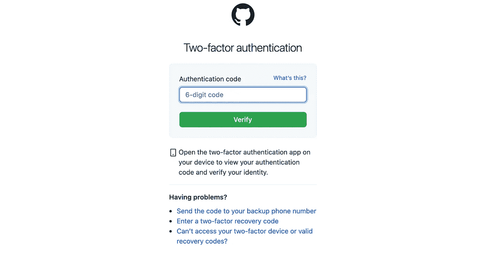
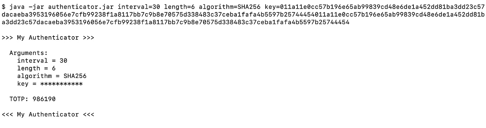
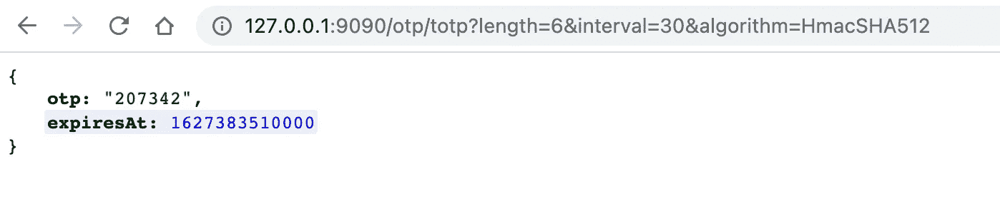

# 超越你好，世界！

> 原文：<https://medium.com/codex/beyond-hello-world-2133ca15cc90?source=collection_archive---------12----------------------->

## 通过构建有用的东西来学习语言

Nubelson Fernandes 在 [Unsplash](https://unsplash.com?utm_source=medium&utm_medium=referral) 上的照片

每个软件开发者都知道“[你好，世界！](https://en.wikipedia.org/wiki/%22Hello,_World!%22_program)”，这是您第一次尝试新编程语言的必备程序。也许你已经遇到了 99 瓶啤酒。但是如果你的目标只是学习语言，而你没有正在进行的具体项目，你下一步该怎么做？

你可以按照教程为宠物店创建一些 API(这是 [Java](https://www.oracle.com/java/technologies/petstore-v1312.html) 和 [Swagger](https://petstore.swagger.io/) 的最爱)，但是除非你处于宠物店老板和软件开发人员的维恩图的中心，否则这可能会感觉有点徒劳。

照片由[海燕](https://unsplash.com/@petrebels?utm_source=medium&utm_medium=referral)在 [Unsplash](https://unsplash.com?utm_source=medium&utm_medium=referral) 上拍摄

那么，如何快速构建一些东西，涵盖各种概念，完成后非常令人满意，并且您将实际使用。

我说的是基于时间的一次性密码。如果这没有让你想起什么，那么想想 Google Authenticator、Authy、LastPass Authenticator 等等。每当你被要求在一个在线账户上设置双因素身份验证时，你通常可以使用这些应用程序中的任何一个，它们都可以工作，因为它们都基于相同的标准算法。这意味着你可以构建自己的应用程序，并用它来访问 GitHub、亚马逊、LinkedIn、Evernote 等。

GitHub 2FA 登录页面

在互联网工程任务组出版的 RFC 6238 中描述了算法本身:[https://datatracker.ietf.org/doc/html/rfc6238](https://datatracker.ietf.org/doc/html/rfc6238)，并且该 RFC 包括了用于生成附录 a 中的一次性代码的 Java 代码

简而言之，你计算自 1970 年 1 月 1 日以来有多少 30 秒，用某个秘密密钥(主要是在建立 2FA 账户时要求你扫描的二维码中的内容)散列该数字，从结果散列中取出一些字节，然后将这些字节转换成一个数字——该数字是你登录的一次性密码。每隔 30 秒，已经过去的 30 秒的数量增加 1，散列值改变，字节改变，并且最终数量改变。有一些填充，在十六进制、字节和整数之间转换，以及一些按位运算符来完成它，但总而言之，它是一个相当小的独立函数，具有确定的结果。如果你不确定你是否得到了正确的输出，那么就启动谷歌认证器并检查它是否匹配。

在 Kotlin 中，这可能不到 50 行，您已经学习了函数、变量、选项、一点密码学、日期、字节数组、按位运算符、数学运算符和异常处理。或者，这个算法有开源库，所以这可能给你一个机会去理解一门语言的依赖管理和构建系统。

从这里，您已经有了基本的实现，您可以考虑如何使用它，您可以添加几行代码，使它成为一个命令行工具:

从命令行参数化 2FA 验证器工具

一个 REST API (Spring Boot，无服务器 Lambda，部署到云…):

作为 REST API 的参数化 2FA 认证器工具

智能手机或手表应用程序(iOS/Android 原生、React、Flutter…):

作为 iPhone 应用程序的 2FA 认证器工具

当代码以完全正确的值出现，并且您第一次用它登录 GitHub 时，这当然是令人满意的。

你可以通过扫描二维码来获得参数(查看二维码中编码的 URL 格式的[谷歌维基页面](https://github.com/google/google-authenticator/wiki/Key-Uri-Format))，为多个网站生成代码，安全地存储参数以便你可以随时检查它们的值，或者在你的应用程序中添加一些漂亮的动画来倒计时代码何时会发生变化。

所有这些都为您提供了一个简单的概念，可以运行并扩展到您选择的语言的任何方面，并且每次都以您实际可以使用的东西结束。