# 超越 Matplotlib 和 Seaborn:有效的 Python 数据可视化工具

> 原文：<https://medium.com/codex/beyond-matplotlib-and-seaborn-python-data-visualization-tools-that-work-3ef7f8d1500e?source=collection_archive---------0----------------------->

卢克·切瑟在 [Unsplash](https://unsplash.com?utm_source=medium&utm_medium=referral) 上的照片

## [抄本](http://medium.com/codex)

> 这篇文章是我的同名会议演讲的延伸，包含来自[https://github.com/skirmer/new-py-dataviz](https://github.com/skirmer/new-py-dataviz)的内容。要查看所有代码和其他可视化示例，请访问 repo。如果你更想在视频/直播上看到这些内容，[欢迎参加离群值会议或 ODSC 东部 2021！](https://skirmer.github.io/events.html)
> 
> 这篇文章反映了我的观点，而不是任何雇主的观点。

**我要坦白:我是一个 Python dataviz 投诉者。**从 R 生态系统来到 Python，我被漂亮、简单的可视化工具宠坏了很多年，从 ggplot2 的[基础开始，包括由](https://ggplot2.tidyverse.org/) [Thomas Lin Pedersen](https://github.com/thomasp85) 和其他人开发的所有壮观的库。

因此，转向 Python 进行机器学习对我来说一直是一场斗争。当 Python 中的所有可视化选项一片混乱时，我如何可视化我的数据、评估我的模型性能并呈现我的输出？像许多人一样，我经常是一个视觉学习者，看到一个情节可以帮助我点击一些东西，如果它只是一个表格或一个段落，我永远不会完全理解。

在多次抱怨之后，也从其他人那里听到了这种抱怨，我开始怀疑我对 Python dataviz 的最初印象是否仍然正确。我最终决定，如果我要继续说 Python dataviz 是一场垃圾大火，我需要仔细看看 Python 中的可视化工具，并实际测试它们。

**剧透:我错了，Python 中有一些不错的 dataviz 工具。不过 R 的工具包还是比较好的。**

# 开始

大多数从零开始使用 Python 中的 dataviz 的人都会被指向 Matplotlib。如果他们幸运的话，有人会说“哦，试试 Seaborn，结果看起来更好。”然而，这些都是 Python 中最没用和用户友好的可视化工具。Python dataviz 糟糕的名声很大程度上是因为从这里起步的人糟糕的经历。

让我们看看更好的选择。为了公平起见，我将展示 Matplotlib 和 Seaborn 的一些情节，但是请相信我:除非这些库是创建您想要的情节的唯一方式(它们很可能不是)，否则请跳过它们。

# 标准

我意识到，这些观点可能会让我对“实际上很好”的人群敞开心扉，所以让我来设定一些基本规则。当我在寻找一个好的数据可视化库时，我有一些标准。就可视化工具而言，这些可能对你来说并不重要，这没关系！你做你的。

## 学习曲线

拥有丰富库经验的超级用户通常可以用不太好的工具完成很多工作。这很好，但这不是我们应该对新用户期望或要求的。强迫人们学习使用一个困难的工具(当有更好的选择时)是挫败用户并让他们转向其他工具的好方法。

## 语法

一旦用户学会了基础知识，我希望他们能够根据常识即兴发挥。如果`set_title`适用于散点图，那么它也应该适用于柱状图。为什么不会呢？(看着你，Seaborn)。当你不能开始建立基础知识时，那么学习过程就像是死记硬背。这就是每个人都觉得英语动词难学的原因——不规则在语言中不是一件好事。

## 灵活性

所以这个库可以让你很快启动并运行，这很好——但是你将需要一些特别的、定制的或者很快改变的东西。如果，当用户出去寻找“我如何改变 X”的时候，得到的答案是你不能改变 X，或者你必须建立一个全新的工具包来做这件事，这是一个大问题。如果这个工具很容易使用，但是没有完整的功能，它就不够好。

## 质量输出

我们有时会陷入极端，要么花上数不清的时间让情节变得有吸引力，调整每个微小的细节，要么我们放弃并决定美学不重要(想想你看到的所有普通的白色幻灯片和黑色 Calibri 字体——许多人只是放弃了体面的设计)。我想要一个好的 dataviz 库来帮助我们找到一个中间地带。如果用户不付出大量的努力，没有理由认为一个默认的情节不具有合理的吸引力。

# 竞争者

*   2003 年，https://matplotlib.org/
*   [西博恩:2012 年，https://seaborn.pydata.org/](https://seaborn.pydata.org/)
*   [散景:2012 年，https://bokeh.org/](https://bokeh.org/)
*   [牛郎星:2016，https://altair-viz.github.io/](https://altair-viz.github.io/)
*   [剧情九:2017 年，https://plotnine.readthedocs.io/](https://plotnine.readthedocs.io/)
*   [剧情:2013 年，https://plotly.com/python/](https://plotly.com/python/)

# 试验

为了使我的评价尽可能公正，我选择了五种类型的情节，并在六个库中分别进行了渲染，试图在不做大量改动的情况下，使它们尽可能地相似，尽可能地吸引人。

我选择这些图是为了了解这些库如何处理不同的数据类型和分组。当然，我们可能经常使用无数的绘图类型，但这些通常是基于一些可视化类型的核心基础。我们将使用几种不同的分组方法来查看点、线和条，我们还将查看数字、分类和日期时间数据类型。

*   柱状图
*   散点图
*   分面散点图
*   分组条形图
*   时间序列线
*   额外奖励:3D 散点图

# Matplotlib

在 Matplotlib 中，方法是创建一个初始的 plot 对象，然后在其上覆盖数据系列——这是一种常见的模式，我们在浏览这些库时会很熟悉。然而，最初的情节对象是一件复杂的事情，并对新用户构成了直接的挑战。

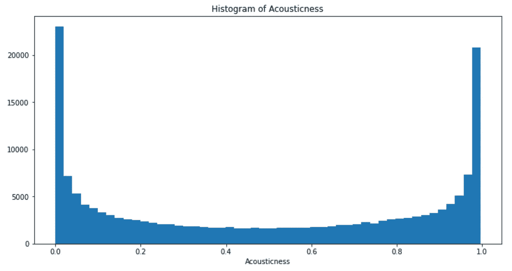

`fig, ax = plt.subplots()`几乎总是 Matplotlib 中绘图的第一行，它表示图形(fig)是与轴(ax)不同的对象。这已经对用户的认知理解提出了挑战，用户可能会想知道这个框架中的图形到底是什么。一个不擅长视觉设计的开发人员或数据科学家在这里可能会特别沮丧。

值得称赞的是，Matplotlib 开发人员确实有大量的文档和教程材料来帮助新用户——但是，对于大多数用户来说，这种需要大量解释的工具真的是最好的选择吗？这不就是“不直观”的定义吗？

就视觉设计而言，Matplotlib 产生了非常独特的情节，而且不是以一种好的方式。渲染很难从美学角度定制，分辨率不够清晰，应用主题或有序的配色方案也很费功夫。

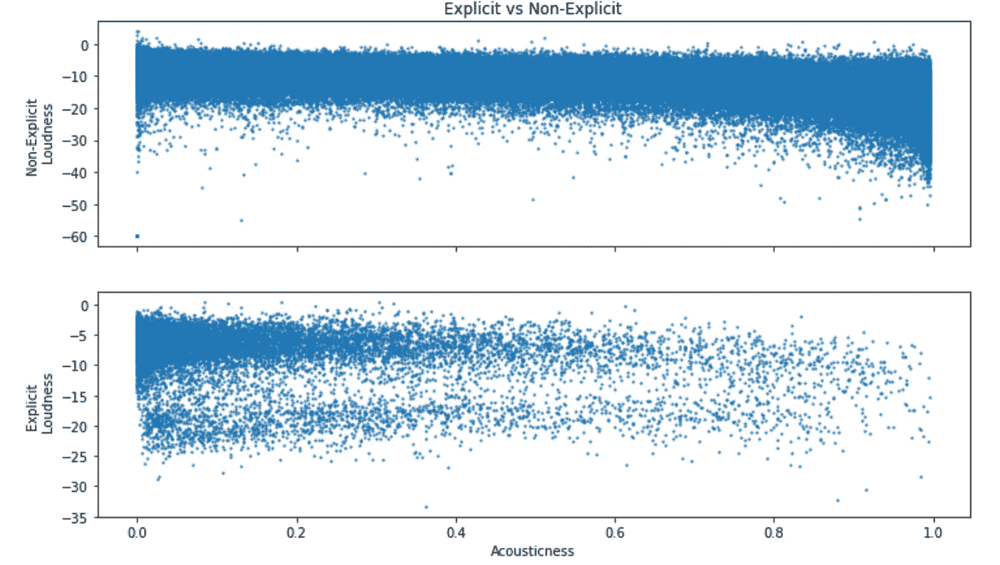

还值得注意的是，Matplotlib 是为 NumPy 数组设计的，并没有承诺它将如何处理其他数据类型，如 pandas 对象。

# 海生的

Seaborn 是基于 Matplotlib 的改编，旨在改善一些功能和结果质量，但仍然受到 Matplotlib 的挑战。它肯定比 Matplotlib 更容易使用，但必须牺牲一些语法一致性，因为它是为了与 Matplotlib 兼容。

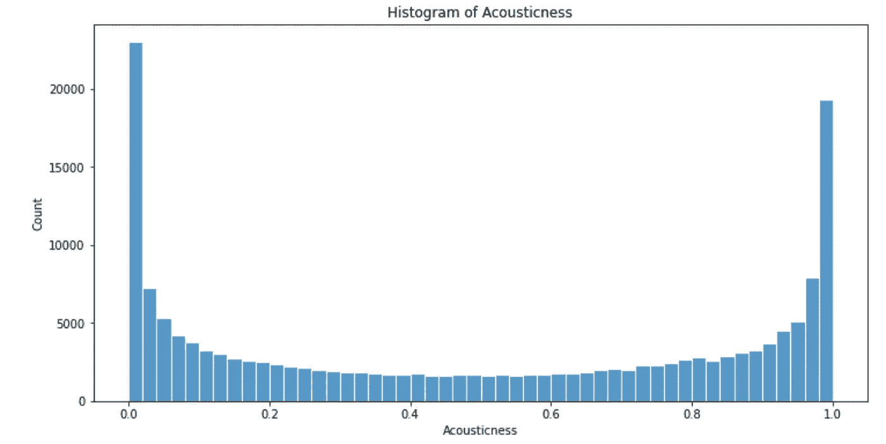

你不一定需要从 Matplotlib 的令人困惑的元素如`plt.subplots()`开始，但是你可以很快进入必须使用 Matplotlib 层元素来获得你想要的情节的情况。正如官方文档会告诉你的，“虽然你可以只使用 seaborn 函数来提高效率，但是你的图形的完全定制需要一些 matplotlib 的概念和 API 的知识。”[文件](https://seaborn.pydata.org/introduction.html)

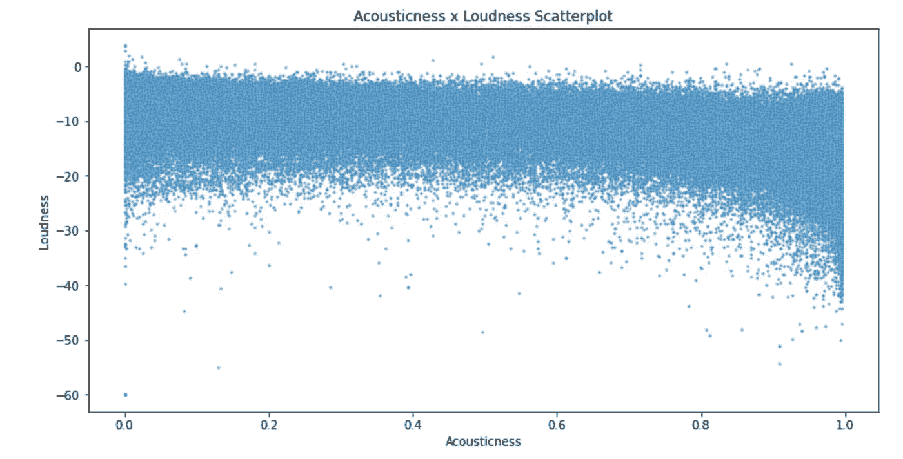

根据我们所了解的，让我们来讨论四个完全不同的备选库。这些库有自己的语法和框架，如果不是完全独立于 Matplotlib 的话，大部分也是如此。

# 散景

总的来说，散景的语法很有意义，非常适合新用户的即兴创作。在散景中，你从指定你的输出类型(笔记本或文件)开始，然后添加一个包含许多整体美学参数的“图形”对象。之后，你在上面覆盖数据系列，并可能在最后添加一些设计调整。

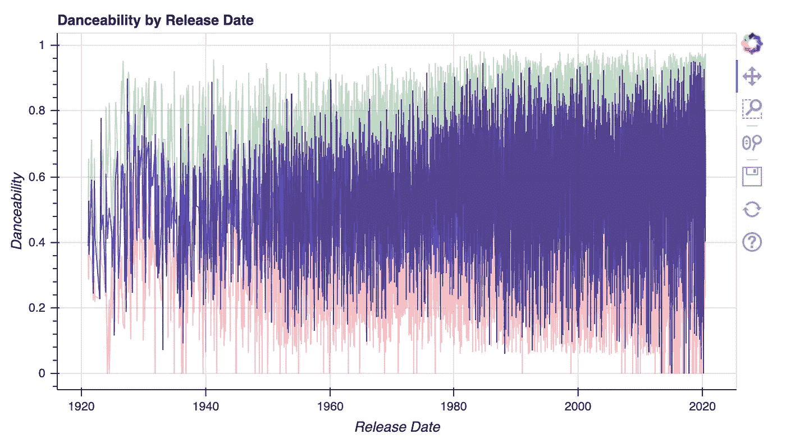

虽然这不是一个真正有趣或复杂的任务，但我很惊讶地看到散景在渲染直方图时有多么特别和独特。它要求用户在 NumPy 中用数字生成直方图界限，然后用户在图上创建一个矩形覆盖图来呈现直方图的图像。如果 Matplotlib 的认知开销很高，我认为这个特定的散景例子在所需的精神体操中有点荒谬。

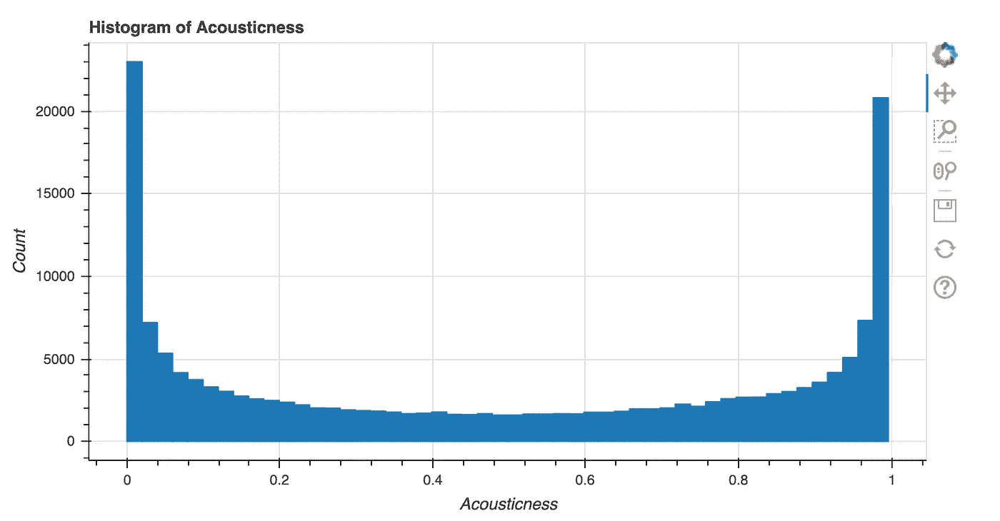

然而，我不想听起来像是我对散景很失望——对于它可以制作的几乎所有其他类型的情节，它是可用的顶级库之一。它拥有华丽、犀利的剧情，对剧情的交互性(比如缩放)真的是得心应手。也许部分是因为视觉效果，散景图在 Jupyter 中加载很慢，有时直到你在一个块上点击两次 Run 才会出现。

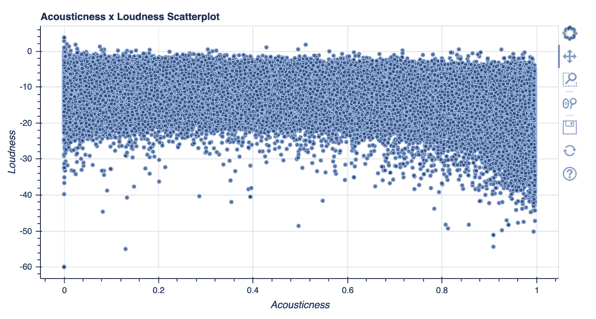

偶尔会出现预绘制数据操作令人困惑的情况——有时您必须提前完成所有数据操作，有时散景会为您完成——但我认为这对图书馆来说是一个自然的挑战，对此我不会太苛刻。

# 阿尔泰尔

像散景一样，Altair 为设计剧情带来了清晰易懂的语法和方案。在 Altair 中，用户从一个“图表”对象开始，然后在此基础上添加图表类型(如“条形图”)，然后设置编码来指示属于每个轴的数据。设计元素通常是最后添加的，在“属性”调用中。如果您愿意，可以将这些不同的步骤链接在一起(尽管这可能会使代码的可读性变得有些困难。)

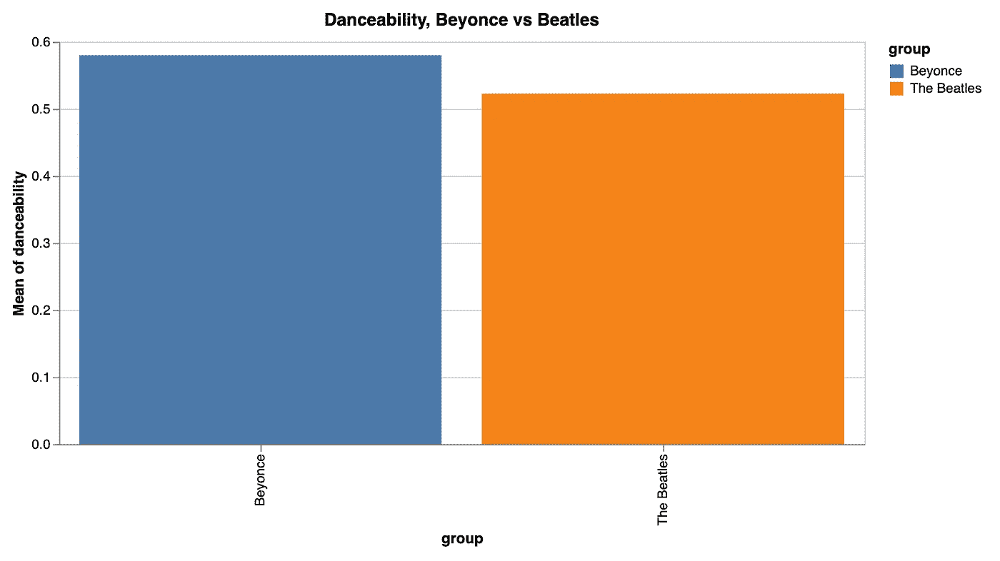

牛郎星有一个很大的差距，但是，不能忽视。它强烈建议用户不要使用超过 5，000 行的数据集。诚然，大量的数据可能会使任何可视化渲染缓慢，特别是如果有交互功能或 JSON 后端。然而，与这里的所有其他库不同，Altair 在超过 5000 行时会产生一个失败错误，而不是用户预期的性能损失，您可以冒险覆盖这个错误。因此，对于我所做的测试，我使用了下采样，这使得图在许多情况下信息量较少。

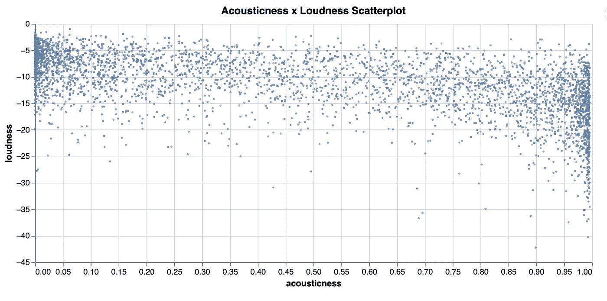

如果您忽略了这个错误，Altair 的性能会严重下降。考虑到性能下降，我可以理解为什么开发人员设置了这个错误消息，但似乎找到一些解决性能下降的方案是更好的计划。这可能不太可能，但是就目前的情况来看，尽管我非常喜欢它的语法和结果，我还是不太推荐 Altair，除非你有小的数据集或者可以预聚合你的数据。

但是不要搞错了——Altair 的输出很漂亮，语法也非常容易和一致！

# 普洛特宁

Plotnine 只是将 ggplot2 库移植到 Python 中，并试图在 Python 中尽可能多地复制 ggplot2 API。这确实是一个令人印象深刻的壮举，因为 R 和 Python 是完全不同的语言，ggplot2 的语法显然是非 Python 的，但这个库成功了。ggplot2 用户会发现这非常熟悉且易于使用。

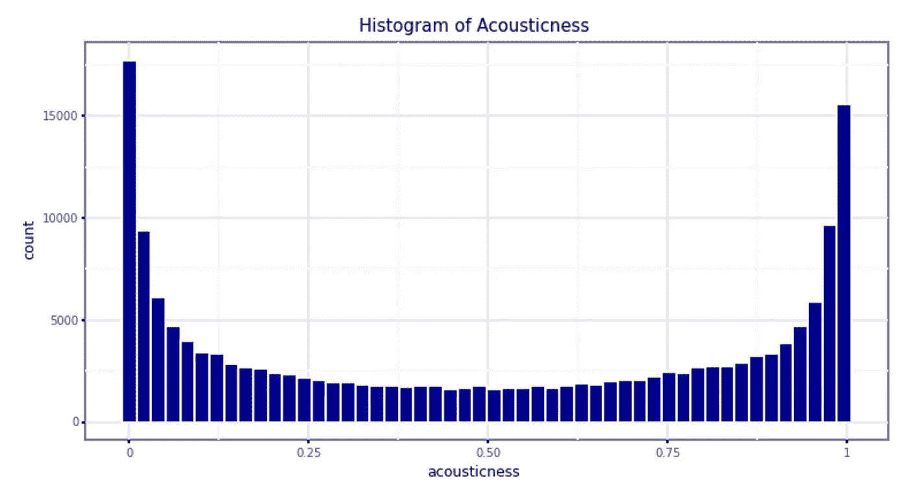

不幸的是，Plotnine 的视觉输出类似于 Matplotlib，因为 Plotnine 是建立在 Matplotlib 的基础上的。值得庆幸的是，Plotnine 的语法与 Matplotlib 没有任何相似之处，但输出无法像 Altair 或 Bokeh 那样清晰或漂亮，因为这一点。

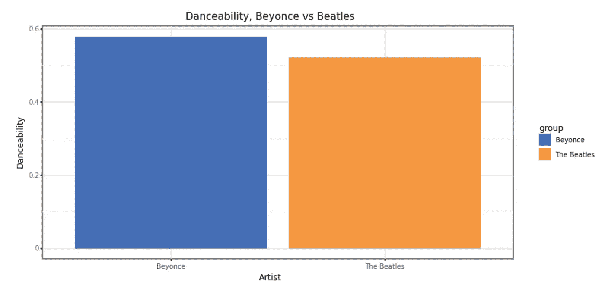

我有偏见，非常清楚:我喜欢 ggplot2，我认为它是一个好工具，所以我认为将 API 移植到 Python 是一件好事。有些人会发现 plotnine 非常不符合 pythonic(他们是对的)，这对他们来说是一个不可逾越的障碍。没关系，这是合理的批评。然而，对于 R 用户来说，Python 的数据可视化失败是学习和有效使用它的最后一个主要障碍，这是一个非常有用的工具。它很可能不会成为任何数据可视化的终极目标，但它允许 R 用户在 Python 中充分发挥生产力，而不必首先学习新的可视化语法。

# Plotly

Python 中的 Plotly 有两种不同的语法——Plotly Express 和 Plotly Graph Objects。Plotly Express 被描述为“Plotly 的易于使用的高级界面”，推荐给新用户使用。另一方面，Graph Objects 既是 Plotly Express 下的框架，也是提供更多灵活性和选项的独立模块。我的经验是，Plotly Express 是一个合理的起点，但是许多(如果不是大多数的话)用户将达到它的极限，并希望以后过渡到图形对象——然而，这种过渡将是困难的，因为语法不一致。

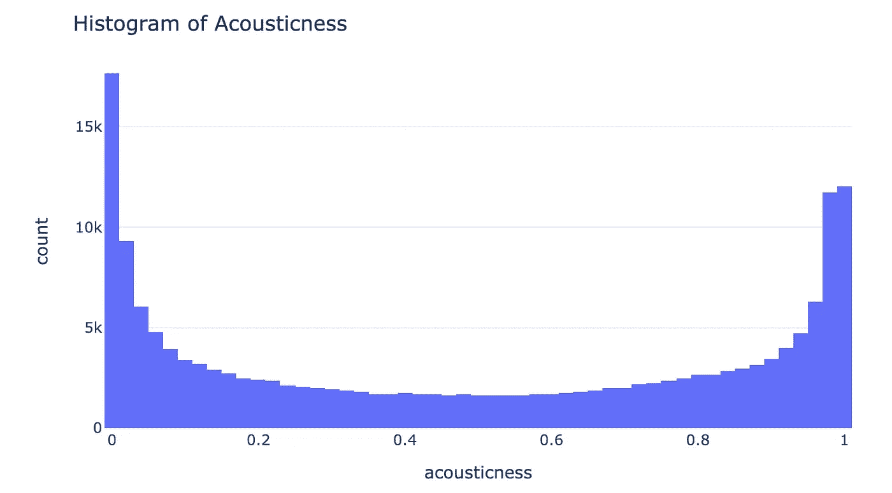

一个巧妙表达例子

尽管我有这样的抱怨，但我坚信 Plotly 是 Python 中任何 3D 或交互的最佳工具——散景提供了一些交互性，但 Plotly 在这方面做得更好，用户干预更少，并且绘图加载更快。我喜欢展示我的 3D 散点图来解释这些事情做得有多好，因为这是一个非常令人印象深刻的结果，但它并不容易建立。

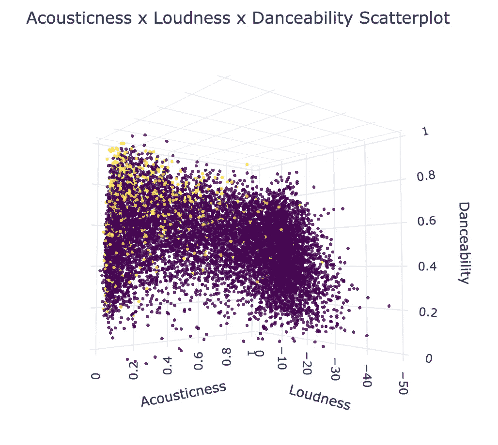

一个图形对象示例(在 jupyter 笔记本中，它可以向各个方向旋转)

Plotly Express 有点缺乏定位，部分原因是 Plotly 输出在默认情况下没有吸引力。对于在 Plotly Express 中可以轻松构建的非常简单的情节，语法很简单，但在其他库中(如 Bokeh)结果会更好看(也同样容易)。对于复杂的东西，Plotly 可能有独特的能力，你需要在图形对象中工作。

# 现在怎么办？

所以，在我测试了所有这些情节后，你已经阅读了我所有的意见，现在你正试图为你的需要选择正确的库。我不能保证有一种灵丹妙药可以解决所有问题，但是这里有一些建议:

*   如果你需要非常复杂的交互和/或 3D 图形，使用 Plotly。
*   如果你是一个进入 Python 世界的 R 用户，使用 plotnine。
*   如果数据量很小，可以考虑 Altair。
*   如果你需要一个以后不需要切换的万能工具，使用散景。它在许多不同的领域都有相当强的表现。

老实说，如果你有选择任何生态系统的自由，并且你非常关心可视化？使用\_(ツ)_/