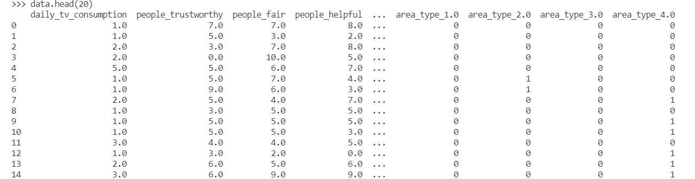
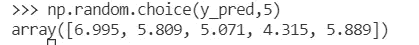
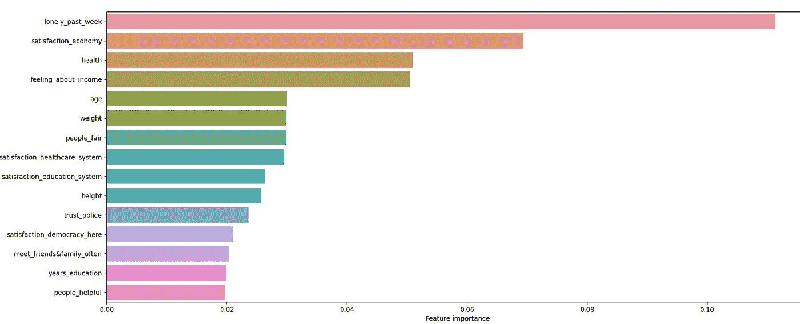
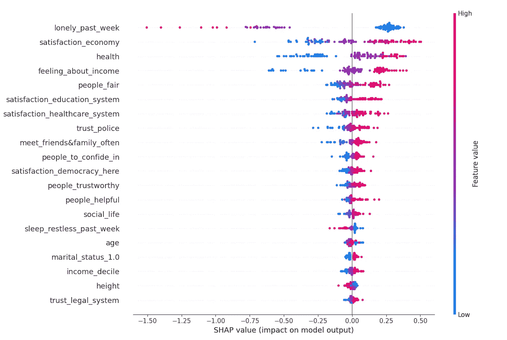
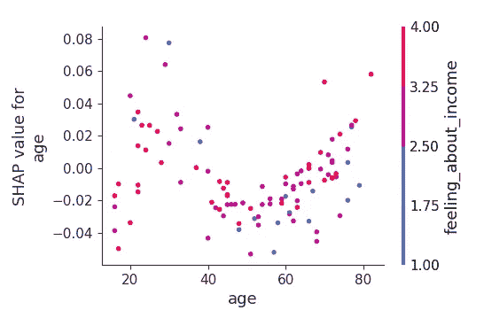
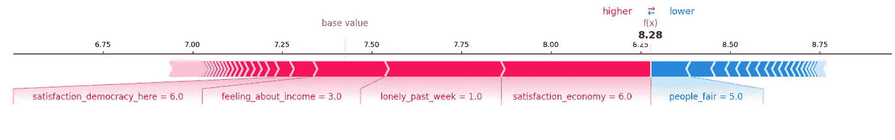

# 超越 RMSE:以非数据人员实际理解的方式解释机器学习回归模型

> 原文：<https://medium.com/codex/beyond-rmse-interpreting-machine-learning-regression-models-in-a-way-non-data-people-will-actually-694021823699?source=collection_archive---------10----------------------->

**场景**:这是 Zoom 上的一个早间脱口秀节目，产品团队正在讨论他们昨天做了什么:

**数据科学家#1:** “前几天我构建了一个 XGBoost 回归器，设法得到了 0.96 的 RMSE，0.6 的 R！”

**数据科学家# 2:“**不错！那是在超参数调整之前还是之后？MAE 是什么？”

与此同时，团队经理私下给团队的一名软件开发人员发消息:

经理:“他们到底在说什么！?"

软件开发人员回答“不知道，他们这么做真烦人。我知道他们不是故意的，但这让我觉得自己像个白痴”

经理:是的，我明白你的意思。啊，我明天要在他们的报告上听一个小时，我怎么能保持清醒呢？”

> **数据科学家:别让这种事发生在你身上！**

我不会给你讲为什么我们作为数据科学家需要投资于我们的沟通技巧。你听到了，这就是你在这里的原因。因此，让我们直接开始吧，我们将构建一个随机森林回归器，然后以非数据专家能够理解的方式分解其性能和见解。

我们将使用我清理过的来自欧洲社会调查的数据集。这是一个非常贴近我内心的数据集。每两年，他们会对来自每个欧洲国家的 2000 名公民进行一次大调查，调查内容从政治到家庭规模到最近是否被盗。我在博士期间用它发表了两篇论文(这里[这里](https://www.sciencedirect.com/science/article/pii/S1090513820301379)和[这里](https://link.springer.com/article/10.1007/s12144-021-01619-5)，如果你感兴趣的话！).

他们问的一个问题是:

> "综合所有因素，如果用 0 到 10 分来衡量，你觉得自己有多幸福？"。

所以让我们看看我们是否能预测一个人有多幸福！

但首先，让我们确保安装了所有正确的库，并直接从我的 GitHub 中读取干净的数据。

```
import pandas as pd
import numpy as np
import matplotlib.pyplot as plt
import seaborn as sns
from sklearn.ensemble import RandomForestRegressor
from sklearn.model_selection import train_test_split
from sklearn import metrics
from sklearn.inspection import permutation_importance
import shapdata_raw = pd.read_csv(‘https://raw.githubusercontent.com/Thomas-Richardson/Blog_post_data/main/ESS7.csv')
data = data.drop(columns = 'Unnamed: 0')
```

我们将需要 [pandas](https://pandas.pydata.org/) 来操作数据帧， [numpy](https://numpy.org/) 来处理丢失的数据， [matplotlib](https://matplotlib.org/) 和 [seaborn](https://seaborn.pydata.org/) 来绘制有吸引力的图形，以及来自 [scikit learn](https://scikit-learn.org/stable/index.html) 的一些位用于我们的机器学习，以及 [shap](https://pypi.org/project/shap/) 用于 shap 值(稍后将详细介绍)。

我从 ESS 网站抓取数据，选择任何我认为可能与幸福有关的栏目。我花时间用一种应该更容易理解的方式重新命名了所有的变量:例如，在原始数据中，是否有人在他们的国家被识别为少数民族被有益地称为“blgetmg”！

我们看数据:

```
data.head(20)
```



同样为了让事情更容易理解:我颠倒了许多变量，使它们以直观的顺序排列。在原始数据中，对于是/否问题，是是 1，否是 2。我把这个改成了 yes = 1，no = 0。还有一些问题，比如“上周你觉得有多孤独？”最初值越低表示越孤独，这对我来说没有意义，所以我把它反过来，所以分数越高意味着越孤独。

我做了一些简单的缺失值估算。有一些专栏，我觉得在伦理上可能是可疑的(我觉得推断某人如何回答“你的父母在成长过程中打架吗？”).所以我放弃了。我没有做任何特征工程，除非你把一些分类变量的伪编码算进去。

```
data.shape
```

我们有 24667 行，每行是 person，还有 168 列。

# 建立模型

```
Richie_rand_seed = 14X = data3.drop(columns = ‘happy’)y = data3.loc[:,’happy’]X_train, X_test, y_train, y_test = train_test_split(X, y, test_size = 0.20, random_state = Richie_rand_seed)
```

我们设置了一个特定的随机种子，以确保我们的结果是可重复的。我喜欢 14 个，但是你可以随便挑一个给你自己。我们将 X 定义为我们的所有特征，即不是我们的目标' *happy '，*的每一列，我们将其定义为 y。我们将数据分为 80%的训练集和 20%的测试集。

```
RF_model = RandomForestRegressor(n_estimators = 1000, random_state = Richie_rand_seed)RF_model.fit(X_train, y_train)
```

我们用 1000 棵树初始化一个随机森林模型，并使它适合我们的训练数据。现在我们不要担心超参数调整。

```
y_pred = RF_model.predict(X_test)
np.random.choice(y_pred,5)
```



查看预测的随机样本，我们遇到了第一个问题:模型预测了实际上不存在的值！回答我们问卷的人不能给自己打 6.996 分(满分 10 分)。因此，当一个利益相关者让我们预测一个给定的人的幸福时，我们回答“他们应该打 5.5 分左右”，你会得到一些困惑的表情。让我们来完成我们的预测:

```
y_pred = y_pred.round()
```

现在，让我们从 6 个方面来解释这个模型:

# 1.计算标准成功指标

现在让我们计算回归问题的 3 个标准成功指标:平均绝对误差(MAE)、均方根误差(RMSE)和 R。

```
print(‘Mean Absolute Error:’, metrics.mean_absolute_error(y_test, y_pred).round(2))print(‘Root Mean Squared Error:’, np.sqrt(metrics.mean_squared_error(y_test, y_pred)).round(2))print(‘R squared:’, metrics.r2_score(y_test, y_pred).round(2)
```

我们得到平均相对误差为 1.07，RMSE 为 1.49，剩余误差为 0.34。

那么这个怎么跟别人解释呢？我们可以说，“当模型预测幸福时，平均来说，它往往会偏离约 1.07 点至约 1.5 点”。

# 2.这个模型与好的预测有多接近？

我们还可以问“模型准确预测的概率是多少?”？多长时间差 1 分？”

```
sum(y_pred == y_test) / len(y_test)sum( abs(y_pred - y_test) <= 1) / len(y_test)
```

使用上面的两行代码，我们可以看到我们的模型有 32.9%的时间是完全正确的，有 74%的时间它的预测是完全正确的或者在 1 个点以内。

```
sum( abs(y_pred - y_test) >= 4) / len(y_test)
```

只有在 3%的情况下，我们的模型预测相差 4 个百分点(这是一个相当灾难性的预测)。最后一点很重要:我们经常想知道我们的模型发生灾难性错误的几率有多大！

# 3.将您的模型与另一个模型进行比较

让我们将我们的衡量标准与一个预测每个人幸福中位数的愚蠢“模型”进行比较。如果我们的模型并不比预测中值好多少，我们可以这样做，这样可以节省大量的代码和数据！这里中值比平均值好，因为幸福分数不是正态分布的。

```
y_pred_null = np.repeat(y_train.median(), len(y_pred))print(‘MAE of null model:’, np.sqrt(metrics.mean_absolute_error(y_test, y_pred_null)).round(2))print(‘RMSE of null model:’, np.sqrt(metrics.mean_squared_error(y_test, y_pred_null)).round(2))
```

这给出了 1.15 的平均相对误差，1.93 的 RMSE。你不可能真正计算出一个模型的有意义的 R，这个模型一直都在做同样的预测，所以我们就不讨论这个了。现在我们可以说，我们的模型肯定比一个哑模型好。我们的机器做了一些学习！

```
round(((1.07-1.15)/1.15 )*100,1)
round(((1.49-1.93)/1.93 )*100,1)
```

我们还可以运行上面的程序来表明，根据度量标准(MAE 或 RMSE ),我们的模型比哑模型提高了 7%或 22.8%。因为梅和 RMSE 在这一点上有很大的不同，你可能应该选择一个最有意义的，并考虑只报告它，以避免混淆。

# 4.哪些特征对预测幸福感很重要？

所以我们知道我们的模型总体来说是 *ok* 的，但是一般来说是什么因素驱动了幸福呢？需要注意的一点是，我们在一般情况下找不到*驱动幸福**的因素，但是可以在我们的模型中找到什么因素*驱动预测。**

*有两种方法可以做到这一点:为此，我们转向特征重要性图:*

```
*feature_importances = RF_model.feature_importances_rf_results = pd.DataFrame({'Feature':list(X.columns), 'Feature importance':list(feature_importances)})rf_results_sorted = rf_results.sort_values('Feature importance', ascending = False)sns.barplot(y = 'Feature', x = 'Feature importance', data = rf_results_sorted.iloc[0:15,:])plt.show()*
```

*我们从我们的模型 *RF_model* 中获得特性重要性，然后我们创建一个包含两列的数据框架:特性名称( *X.columns* )和它们的重要性。然后我们从最高重要性到最低重要性对数据帧进行排序，最后我们在 seaborn 创建了一个*柱状图*。但是！我们只绘制了前 15 个特征。为什么？因为否则我们会有 100 个条形(每个特征一个)，情节会压倒一切，底部的大多数也没多大关系。*

**

*我们发现，一个人的孤独程度往往会对模型预测的孤独程度产生很大影响。他们对经济的满意程度也很重要，同样重要的还有他们的健康程度和他们对收入的感受。*

*如果我们在虚拟的 happy.ai 中工作，并希望让人们更快乐，我们可能会将这些因素视为可能的实验对象。该模型表明，减少孤独感可能是增加幸福感的最佳选择。但是要小心！相关性不是因果关系，我们的结果也不能保证改变孤独会改变幸福。但是因果关系远远超出了本文的范围。*

# ***5。更详细地了解我们的特性如何推动预测***

*所以可以肯定的是，越孤独的人越不快乐。但是我们能做得更好吗？我们可以。为此，我们计算预测的 SHAP 值。这些超级酷，在这里解释得更详细一点[，但是它们对各种各样的情节都有用。对于成千上万的预测，SHAP 值可能需要很长很长的时间来计算，所以我们将只从 100 个随机样本中获取 SHAP 值。](https://towardsdatascience.com/explain-your-model-with-the-shap-values-bc36aac4de3d)*

```
*my_model_explainer = shap.TreeExplainer(RF_model)X_sample = X_test.sample(100)shap_values = my_model_explainer.shap_values(X_sample)*
```

*然后我们制作一个总结图:*

```
*shap.summary_plot(shap_values, X_sample)*
```

**

*注意点聚集的地方和它们的颜色。对于孤独感，蓝色点都聚集在正范围内。蓝色意味着低，所以这意味着当某人孤独感低时，模型几乎总是增加其幸福预测。但是请注意紫色点(中度孤独)在负范围内，表明该模型认为即使是平均水平的孤独也会使你不太可能快乐。这给他们之前告诉我们“孤独很重要”的情节增加了更多的微妙之处。*

*我们可以用部分相关图更详细地观察一个变量。让我们看看年龄是如何影响幸福预测的。有趣的是，该图还倾向于包含与您感兴趣的变量交互最多的变量。你可能想把它关掉以避免让人们困惑，或者如果你发现了一个有趣的细微差别，你的观众可能会欣赏，你可能会把它留在这里。了解你的观众！*

```
*shap.dependence_plot('age',shap_values, X_test)*
```

**

*该图显示，年龄和快乐之间存在 U 型关系，中年人比年轻人和老年人更不快乐。看起来对个人收入感受的影响并不明显，所以让我们把它关掉:*

**

# *6.什么因素驱动了模型的特定预测？*

*所以我们知道这个模型是用什么来预测人们的总体幸福感*，让我们放大一下*的具体预测。*为此可以做出一个 SHAP 力图，我们每次做出 1 个预测:**

```
**person = 0shap_plot = shap.force_plot(my_model_explainer.expected_value, shap_values[person], features = X_test.iloc[person], feature_names = X_test.columns, matplotlib=True, plot_cmap=['#77dd77', '#f99191'])**
```

****

**有点小所以我给你分解一下:模型预测这个人的幸福感为 8.28，远高于刚刚低于 7.5 的基础值(也在图上标出)。为了方便起见，我们就叫他巴里吧。红色部分表示巴里特有的因素，这些因素使模型预测出高幸福分数:他对经济状况中等满意(6 分)，他在孤独感上得分最低(1！)，但请注意这实际上对巴里预测的影响比经济影响要小。尽管如上图所示，总体而言孤独对*更重要。这就是原力图的力量——它们真的很私人！巴里对自己的收入感觉好于平均水平(3 分，4 分制)，他对自己国家的民主状况感到满意。然而，蓝色条显示他的幸福预测被他不太相信这个世界上的人是公平的(谁伤害了你，巴里？).***

**这些是我最喜欢的一些情节，因为它们提供了细节。你甚至可以用这些来测试可能的场景，通过创建一个有特定虚假信仰的虚拟人，然后在模型中运行它们，并为预测制作一个力场图。如果巴里担心的是经济，那么《原力》的剧情会如何发展呢？如果他已经 80 岁了呢？20 岁？**

# **结论**

**我已经带您通过 6 种方法来挖掘基于回归的机器学习模型，超越枯燥的技术措施，以产生有用的指标和图表，希望您的非数据利益相关者能够理解！**