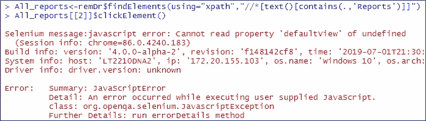
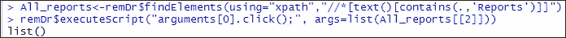
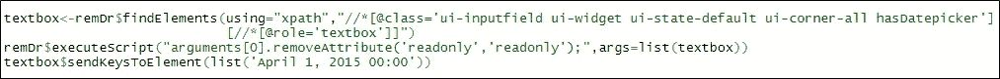
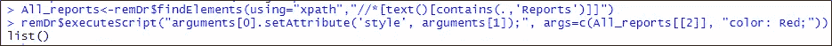
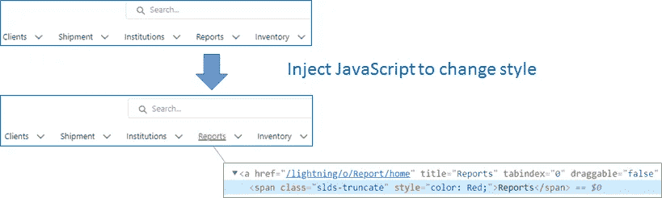

# 超越基础:以下是我在 Selenium 中使用 JavaScript 的 3 种方式

> 原文：<https://medium.com/codex/beyond-the-basics-here-are-3-ways-i-have-used-javascript-in-selenium-272e9417270a?source=collection_archive---------13----------------------->

我们大多数人都是从基本的 WebDriver 命令开始的。是的，他们几乎可以做任何需要与网页互动的事情，比如定位网页元素、点击按钮、发送文本等。但是，你有没有想过 [**executeScript**](https://cran.r-project.org/web/packages/RSelenium/vignettes/basics.html#injecting-javascript) 这个命令，为什么 Selenium WebDriver 一开始会提供 JavaScriptExecutor？

照片由[西格蒙德](https://unsplash.com/@sigmund?utm_source=medium&utm_medium=referral)在 [Unsplash](https://unsplash.com?utm_source=medium&utm_medium=referral) 上拍摄

我们先来看看 Selenium WebDriver 是如何工作的。

WebDriver 通过这些在客户端库中定义的命令来工作(例如，RSelenium 用于用 R 编写的测试脚本)。为了让它们工作，这些命令必须首先通过 JSON wire 协议进行翻译，然后通过浏览器特定的驱动程序(例如 Chrome 驱动程序)与浏览器进行通信，最后在浏览器中的 web 元素上执行。

相比之下，JavaScriptExecutor 是一个允许 JavaScript 在当前网页上直接运行的接口。由于 JavaScript 是浏览器理解的编程语言，所以不需要翻译！这也意味着 JavaScriptExecutor 允许您执行 Selenium 命令提供的任务之外的任务，或者当这些命令由于各种原因无法工作时。

在本文中，我将分享 JavaScriptExecutor 派上用场的三个场景。 **executeScript** 是所有这些情况下使用的方法。这种方法在当前选择的窗口/框架中注入 JavaScript，不需要信号延迟等特定的时序要求；后者由 **executeAsyncScript** 覆盖。

1.  当 WebDriver 方法不起作用时:

> **问题:** **click()方法在 Salesforce 的 lightning 框架中不起作用**

这是一个[已知的](https://help.salesforce.com/articleView?id=000352057&language=en_US&mode=1&type=1)问题；但是由于它没有被广泛的记录，我花了一些时间去谷歌并找出原因和解决方案。

从 2019 年底开始，Salesforce 开始实施一个标准化框架，该框架以这些 lightning web 组件(LWC)为特色——如果你想了解更多信息，我推荐[这个](https://www.youtube.com/watch?v=myrTYZf9roA) Youtube 视频。然而，对于运行自动化来说，对 Lightning 框架的直接影响是 Selenium WebDriver 使用的 click()方法不能再与 web 元素交互，因此我在本例中使用 clickElement()得到了错误消息。顺便提一下，findElement()仍然有效，可以用来定位 web 元素。

解决方案是使用 JavaScript 来执行“点击”:

2.当需要对 HTML 进行某种修改时:

> **问题:发送文本，但字段默认为只读**

我在[的上一篇文章](https://siqi-zhu.medium.com/yes-you-can-enter-text-into-a-read-only-text-box-1e330a996e07)中谈到过这个技巧，其中 **sendKeysToElement** 命令没有立即工作，因为文本被发送到一个只读输入字段。该解决方案需要一个两步过程，在应用 WebDriver 命令之前，首先注入 JavaScript 来删除“readonly”属性:

3.当开发测试脚本时需要验证时:

> **问题:一次定位多个 web 元素，但需要一种快速的方法来区分它们**

您可能已经注意到，在第一期文章中，findElements() 没有定位单个 web 元素，而是用于部分文本匹配，这将返回一个包含多个元素的列表。您可能想知道我是如何计算出第二个元素“All_reports[[2]]”应该是接收单击操作的元素。嗯，为了识别 DOM 中与正确元素相对应的元素，我设计了一行代码，以便在我有疑问时可以快速查看:

这个 JavaScript 可以通过改变所选元素的样式(例如颜色)来提供视觉确认:

这些就是我的“3 美分”。您在 Selenium 代码中使用过 JavaScript 吗？如果有，你是如何使用它们的？