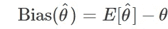
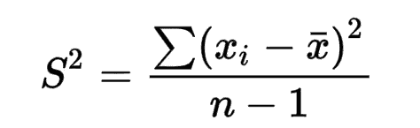

# 偏差-方差权衡

> 原文：<https://medium.com/codex/bias-variance-trade-off-de236c17f171?source=collection_archive---------20----------------------->

为了理解偏差-方差权衡，我们必须首先对这两个要素有一个具体的想法，这种理解将创建一个平台来解决由偏差和方差引起的问题。

# **偏置**

在创建模型时，我们使用的训练数据对预测结果有很大的影响，为了使预测更一般化，模型将做出简化的假设。这样做是为了让模型可以轻松地做出预测。

上述简化可能导致我们的实际值和预测值之间或大或小的差异，这种影响就是我们所说的偏差误差。

在数据中引入偏差的方式有很多种，但最常见的方式是通过采样过程，这被称为采样偏差。偏差的其他例子包括:信息偏差和测量误差。

我们无法消除偏差，因此我们专注于识别各种情况下存在的偏差，评估它们对预测的影响，并在某些情况下尝试减少这种影响。

我们如何估计参数的偏差:

参数θ的偏差

当处理大规模人口的统计问题时，我们利用代表人口的抽样。在这种情况下，我们不能得到偏倚的真实总体估计，因此我们必须对它们进行估计。

# **方差**

方差是可变性的度量之一，它向我们显示了平均值的方差的平均值。通过这种方式，它向我们展示了我们的数据中存在何种分布。与平均值相比，我们的数据中较大的差异表明有更多的差异。

方差公式

从训练数据建立的模型有大量的预测变量，往往会有很高的方差。这种高差异可能会导致预测值和生成的实际值之间的大幅波动，因此我们需要对其进行管理，因为误差率会很高。

现在我们已经确定了什么是偏差和方差，我们可以继续进行偏差-方差权衡。一个好的模型应该能够识别对生成最佳预测很重要的特征，并概括出一个函数来进行预测。

较低的偏差通常会导致较高的方差，反之亦然，这两个是正确模型的关键，因此我们上面定义的良好模型将很难实现。

我们该如何权衡？首先，低方差的模型可能不是真的好，因为它增加了欠拟合的机会，这是因为模型没有足够的数据来进行适当的区分。另一方面，高方差可能导致过度拟合，因此来自模型的结果将被高估。

解决这个问题的方法之一是增加我们正在使用的数据的大小。这种方法实质上增加了我们建立的模型的复杂性，因此我们有足够的方差和最小的偏差。

理解这个概念是制作一个合适的模型的关键，我希望这篇文章有助于照亮这个主题。