# 双向聊天-带有 Mailgun 和 GoDaddy 的电子邮件网关

> 原文：<https://medium.com/codex/bidirectional-chat-email-gateway-with-mailgun-and-godaddy-771e6fa471d1?source=collection_archive---------11----------------------->

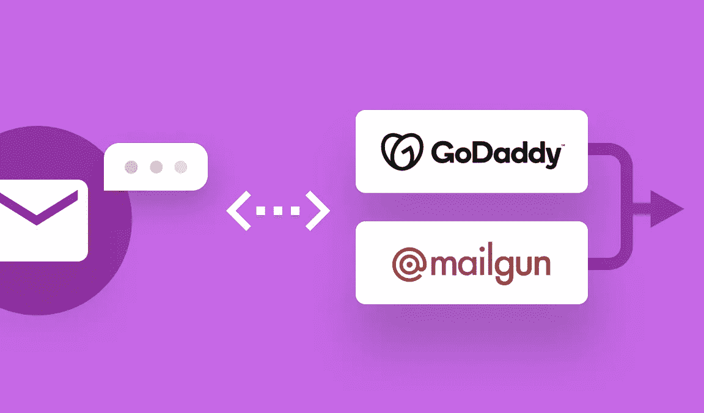

2022 仙鸟

## 如何使用 Sendbird 从您的聊天应用程序回复电子邮件

尼古拉斯·奥尔特里恩-布法拉
销售工程师| [森伯德](https://www.sendbird.com)

*你可能会发现查看 React UIKit* [*样本代码*](https://github.com/sendbird/sendbird-uikit-react) *，以及我们关于*[*web hooks*](https://sendbird.com/docs/chat/v3/platform-api/guides/webhooks)*的文档很有用。在* [*页面*](https://sendbird.com/features/chat-messaging) *了解更多关于仙鸟聊天的信息。*

*如需更多有用的教程和资源，请访问我们的* [*开发者门户*](https://sendbird.com/developer) *。*

# 介绍

一些组织表示希望将电子邮件通道集成到 Sendbird Chat 中，用于以下用例:

*   创建一个双向聊天到电子邮件网关，聊天对话可以在使用 [Sendbird Chat](https://sendbird.com/features/chat-messaging) 应用程序的用户和另一个使用电子邮件发送和接收聊天消息的用户之间进行
*   电子邮件通知，如果 Sendbird 用户没有使用聊天应用程序，电子邮件服务可以发送聊天消息

本教程中的方法适用于将任何通信通道 API 集成到 Sendbird Chat 中。例如，我们可以用 [Twitter API 添加一个双向通道。](https://developer.twitter.com/en/docs/twitter-api)类似地，我们可以使用 Nexmo-Vonage [SMS API](https://developer.nexmo.com/messaging/sms/overview) 添加一个双向 SMS 通道。

在本文中，我将向您展示如何将电子邮件通道集成到 Sendbird Chat，以及如何创建一个双向的聊天到电子邮件网关。

# 先决条件

要运行此概念验证，您需要:

*   在您的聊天应用程序**中激活了 webhook 功能的 Sendbird 帐户。**详见[文件](https://sendbird.com/docs/chat/v3/platform-api/guides/application)。
*   一个计划[允许你发送和接收电子邮件](https://signup.mailgun.com/new/signup?diversity_plan=foundation_50k)的 Mailgun 账户。我们为这个 POC 选择了 Mailgun，但是您可以为任何基于 API 的电子邮件提供商复制这个逻辑。
*   您将在 Mailgun 帐户中配置的域名。在这个概念验证中，我们将使用来自 [GoDaddy](https://www.godaddy.com/) 的域名。您可以使用这些 GoDaddy [DNS 设置指令](https://help.godaddy.com/help/manage-dns-records-680)按照此处[可用的 Mailgun 指令](https://help.mailgun.com/hc/en-us/articles/203637190-How-Do-I-Add-or-Delete-a-Domain-)配置 DNS 参数。我们为此 POC 选择了 GoDaddy，但是您可以使用任何域名提供商。
*   一个 [Sendbird 聊天应用](https://sendbird.com/docs/chat/v3/javascript/getting-started/install-chat-sdk)及其 UI。对于这个 POC 示例，我们使用 Sendbird[React Chat UIKit](https://sendbird.com/docs/uikit/v1/javascript/getting-started/about-uikit)，更准确地说是“组合的”React [示例应用程序。](https://github.com/sendbird/SendBird-JavaScript/tree/master/uikit-samples/composed-react-app)
*   一个 web 服务器，它将托管集成 Mailgun 和 Sendbird 聊天应用程序的后端脚本。对于这个概念验证，我们使用了来自 [Alwaysdata](https://www.alwaysdata.com/en/) 的免费虚拟主机服务。你可以为脚本使用任何支持 PHP 7.3.11 的网络托管服务。

现在，您已经准备就绪，让我们深入了解解决方案的全球体系结构，并回顾一下本次概念验证中涵盖的三个使用案例的实施。

# 全球建筑

该解决方案的全局架构如下图所示。

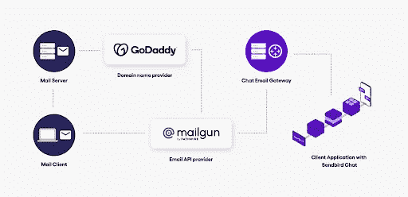

全球建筑

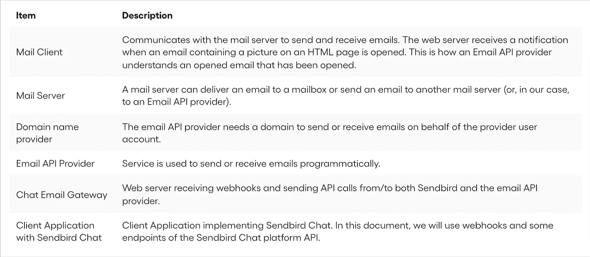

重要术语

# 用例 1:一个电子邮件地址收到一条聊天消息

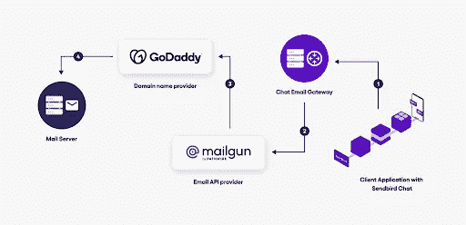

解决方案架构

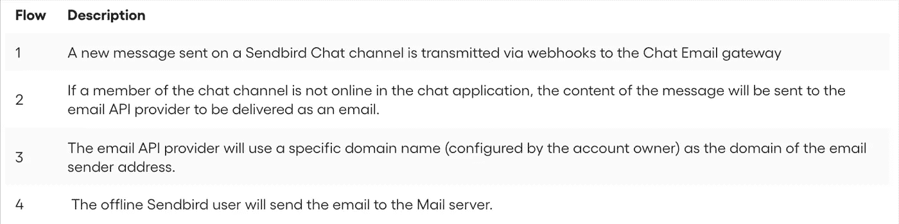

建筑说明

对于这个用例，我们将首先配置一个 [Sendbird webhook](https://sendbird.com/docs/chat/v3/platform-api/guides/webhooks) 来通过聊天电子邮件网关中托管的脚本(`webhook-sendbird.php`)重定向事件`group_channel:message_send`，如上图中记录的配置。请参见[文档](https://sendbird.com/docs/chat/v3/platform-api/guides/webhooks#2-group-channel-message-send)获取`group_channel:message_send`事件的 webhook 有效载荷。

然后，我们将为脚本安装并使用 [Mailgun PHP SDK](https://github.com/mailgun/mailgun-php) ，该脚本将把收到的聊天消息作为电子邮件发送。接收到的聊天消息的有效载荷描述可在[这里](https://sendbird.com/docs/chat/v3/platform-api/guides/webhooks#2-group_channel-message_send)获得。这个用例也适用于发送电子邮件通知。

我们来看看这个剧本，名字叫`webhook-sendbird.php`。

# 用例 2。电子邮件被发送到聊天频道

解决方案架构

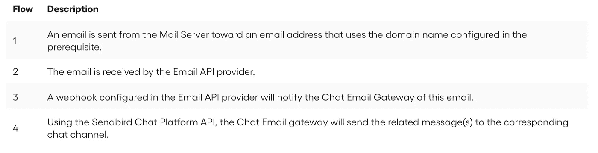

建筑说明

对于这个用例，我们首先配置一个 [Mailgun 接收路由](https://app.eu.mailgun.com/app/receiving/routes)来将入站电子邮件转发到聊天电子邮件网关后端。以下是执行此配置的相关[文档。按照下图中记录的配置，我们已经简单地将所有入站电子邮件重定向到该 POC 的端点(脚本`inbound-email.php`)。](https://documentation.mailgun.com/en/latest/quickstart-receiving.html#how-to-start-receiving-inbound-email)

这个脚本的逻辑非常简单。首先，我们将从收件人的电子邮件地址中扣除聊天频道 URL 来发送相关消息。我们会将任何电子邮件作为文本消息转发到相关的聊天频道，并将所有文件附加到收到的电子邮件中。收到的电子邮件的有效载荷描述可在[此处](https://www.mailgun.com/blog/handle-incoming-emails-like-a-pro-mailgun-api-2-0/)(章节“解析的消息参数”)获得。用于向聊天频道发送消息的聊天平台 API 端点文档可在[此处](https://sendbird.com/docs/chat/v3/platform-api/guides/messages#2-send-a-message)获得。让我们来看看这个脚本，命名为`inbound-email.php` *。*

# 用例 3。向聊天频道复制电子邮件事件

为了获得更好的用户体验，可以在聊天频道中重现电子邮件事件。让我们在聊天频道中通过电子邮件频道提供以下事件的动态更新。

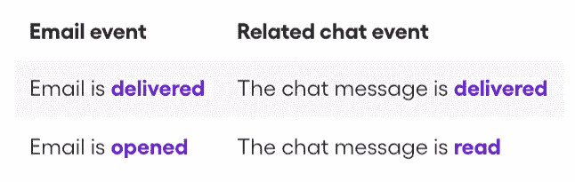

相应的电子邮件和聊天事件

让我们更详细地回顾一下每个用例。

## **发送了一封电子邮件**

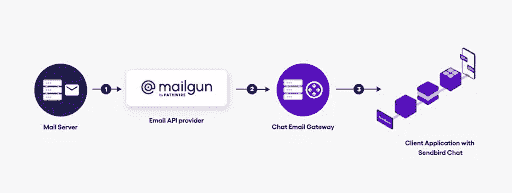

解决方案架构

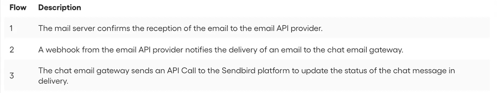

建筑说明

## **打开一封邮件**

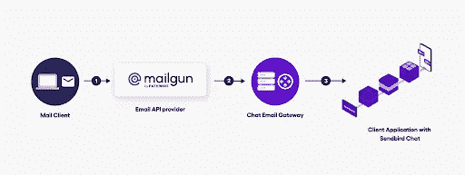

解决方案架构

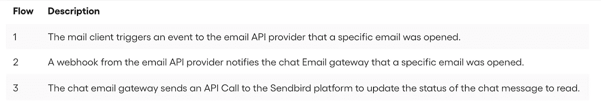

建筑说明

对于这两个事件，我们将使用类似的工作流程。第一步是[为交付和打开的事件配置电子邮件 API 提供者的 webhooks](https://www.mailgun.com/blog/a-guide-to-using-mailguns-webhooks/) 。我们希望同一个端点接收两个事件。配置完成后，每个事件的 webhook 将显示在您的仪表板中。见下图。

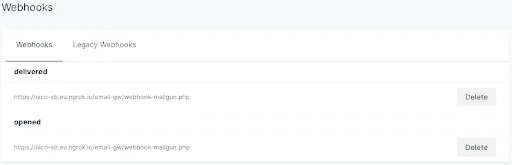

Webhook 配置

每个 webhook 会将事件发送到同一个脚本(称为`webhook-mailgun.php`)。我们将使用 webhook 有效负载中记录的事件来检查这是否是一封已发送或已打开的电子邮件。事件中的标签将让我们知道这个事件与哪个聊天频道相关。让我们看看这个剧本，名叫`webhook-email.php`。

# 结论

在本指南中，我们介绍了如何将电子邮件频道集成到 Sendbird 聊天应用程序中。这种方法可以简化基于电子邮件的业务交流向聊天的过渡，从而获得更具吸引力的体验。如果您已经有了一个，您可以使用您当前的基于 API 的电子邮件提供商来进行集成。我们希望您会发现它适用于您自己的业务用例。如果你遇到困难，请务必联系并在 [Sendbird 社区](https://community.sendbird.com/)上发布问题。

感谢阅读和快乐编码！

# 资源

[React UIKit 样本代码](https://github.com/sendbird/sendbird-uikit-react)

[Mailgun](https://www.mailgun.com/)

[GoDaddy](https://www.godaddy.com/)

Webhooks [文档](https://sendbird.com/docs/chat/v3/platform-api/guides/webhooks)

[Twitter API](https://developer.twitter.com/en/docs/twitter-api)

[Nexmo-Vonage 短信 API](https://developer.vonage.com/messaging/sms/overview)

[开发者门户](https://sendbird.com/developer)

[仙鸟社区](https://community.sendbird.com/)