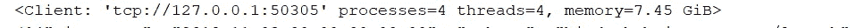

# Python 用户可以快速轻松地分析大数据

> 原文：<https://medium.com/codex/big-data-analyzed-fast-easy-for-python-users-34ab8af6fbc?source=collection_archive---------9----------------------->


这篇文章是写给所有热爱 Pandas、Scikit-Learn、Numpy 的数据科学家/分析师朋友的，他们希望将他们的分析应用于更大的数据集，而不必用另一种语言重写代码。

一如既往，我将努力保持这篇文章简洁、简单和有用。我也很想收到你的来信！

随着工作项目的最后期限即将到来，我们都希望进行渐进式的改变，而不是革命性的改变来完成工作，不是吗？试试 Dask &让我知道它如何为你工作。

# 达斯克，怎么了？


[Dask](https://github.com/dask/dask) 在某种意义上类似于 Spark，你可以水平扩展来处理大量数据。但这是不同的，因为 Dask 是用 Python 编写的，并且支持 Pandas 和 Scikit 这样的库——开箱即用。

# 它是如何工作的？

> Dask 遵循**惰性计算**机制，只有在明确请求时才会执行计算。

它使用 numpy 和 pandas，从某种意义上说，它扩展了这些包来处理太大而无法保存在内存中的数据处理问题。它将较大的处理任务分解成许多由`numpy`或`pandas`处理的较小任务，然后将结果重新组合成一个连贯的整体。这发生在一个无缝接口的背后，该接口被设计成模仿`numpy` / `pandas`接口。

# **Dask 好在:**

> Dask 在处理千兆字节的海量数据方面比 pandas 和 Spark 等直播数据表现得更好
> 
> Dask 绕过了全局解释器锁(GIL ),而**通过内部分块 python 对象并并行处理它们来利用多 CPU 内核**。
> 
> 它提供**调试**和诊断，通过仪表板，您可以看到跨机器的性能
> 
> 一次读取多个 CSV 文件就像 Spark 一样(我很快会给你看类似的东西)

DASK 在单个 CPU 上处理大型数据集，利用单个机器或机器集群上的多个内核进行并行计算。

那么这对你意味着什么呢？对于喜欢在咖啡馆工作或在国家公园观鸟的人来说，使用 Dask，你的整个数据集将在你喝咖啡时在一台典型的笔记本电脑上处理。


这就是我，想象未来的自己，原谅我。

在我开始之前，让我给你一个高层次的介绍，不使用任何单词。要了解更多关于 Dask 的信息，我鼓励您阅读[Dask:Python 中的可伸缩分析](https://dask.org/)中的文档。


# **Dask 数据帧的用例:**

为了便于说明，让我引入一些简单的代码来一次处理一部分纽约出租车数据。这是在我的 S3 桶休息。

在我们的遗愿清单中，我们都有特定的旅游景点。这些地方是你愿意花任何钱去的，而且你甚至会慷慨地给带你去的人小费。


我要找到人们花费超过 300 美元到达的所有地点，并给司机超过 30%的小费。对于出租车司机来说，去这些地方是实现现金流最大化的机会。

如果你看一下我们声明了`Client`的代码，这意味着同一会话中的任何操作都将默认使用它来进行计算。通过不带任何参数地调用它，Dask 自动启动一个本地集群来运行工作。这是我最喜欢 Dask 的一点——与为本地开发设置 Spark 的过程相比，我发现 Dask 工具的易用性是它最大的优势之一。

如果我们检查您的对象，我们将看到对一个`dask.Delayed`对象的引用，而不是我们数据的实际表示。这是因为当我们声明操作时，Dask 调度程序正在懒洋洋地构建一个执行图，所以现在的对象只是 Dask 正在计划的步骤的一个表示。该图实际上不会计算任何东西，直到我们明确地告诉它，允许调度程序在幕后优化它的操作。

回到这个关于“懒惰”的话题。只有当你在`dask.dataframe`上调用`compute`时，图中的所有任务才会被执行。嘣！

```
**import** math
**import** numpy **as** np
**import** s3fs
**import** pandas **as** pd
**from** dask.distributed **import** Client
**import** dask.dataframe **as** dd

taxi_info = dd.read_csv(
    **'s3://abhinaya321/2019_yellow_trip_data.csv'**,

    storage_options={**'anon'**: **True**, **'use_ssl'**: **False**}
)

**def** filter(df: dd.DataFrame) -> dd.DataFrame:
    *"""Process data"""* **return** (
        df[[
            **'VendorID'**,**'PULocationID'** , **'total_amount'**,**'fare_amount'**, **'tip_amount'** ]]

        .assign(tip_percent=(**lambda** df: (
            ( df.tip_amount)/df.fare_amount)
           ))

        .query(**'tip_percent >= 0.3 & total_amount >= 200'**)
        *#.drop(['fare_Amount', 'tip_amount'], axis=1)* .rename(columns={**'PULocationID'**: **'Expensive_locations_loved_by_customers'**})
        .groupby([**'Expensive_locations_loved_by_customers'**])
        .sum()

    )

**def** result(df: dd.DataFrame) -> pd.DataFrame:
    *"""Execute dask task graph and compute final results"""* **return** (
        df
        .compute()

    )

**if** __name__ == **"__main__"**:
    client = Client()

    taxi_data = dd.read_csv(
        **'s3://abhinaya321/2019_yellow_trip_data.csv'**,
        storage_options={**'anon'**: **True**, **'use_ssl'**: **False**}
    )

    filtered_data = filter(taxi_info)
    fare = result(filtered_data)

    print(fare.to_string())
```


哇，有些人给了很多小费。嗯…有些交易看起来真的很可疑！！

如果您在笔记本电脑上运行这段代码，Dask 会在后台的多个内核上运行任务。因此，如果你的机器上有四个内核，处理速度大约是使用`pandas`的四倍。

在单台机器上，这难道不是很好的性能提升吗？完全相同的代码运行在多达数百台机器的分布式集群上。当你放松的时候，任务调度程序会在后台处理所有的事情！

# 【Dask 箱包的使用案例

*   它只是一个 Python 对象的并行集合，即一个更大集合的分区。通常在处理**半或非结构化数据**
    *时使用，例如* JSON、日志文件或文本数据。此外，用户定义的 python object.inclusion。

今天让我们来读一个 JSON 文件。

```
**import** dask.bag **as** db

**if** __name__ == **"__main__"**:
    client = Client()

    print((db.read_text(**'https://archive.analytics.mybinder.org/events-2018-11-03.jsonl'**).take(3)))**Your output**('{"timestamp": "2018-11-03T00:00:00+00:00", "schema": "binderhub.jupyter.org/launch", "version": 1, "provider": "GitHub", "spec": "Qiskit/qiskit-tutorial/master", "status": "success"}\n', '{"timestamp": "2018-11-03T00:00:00+00:00", "schema": "binderhub.jupyter.org/launch", "version": 1, "provider": "GitHub", "spec": "ipython/ipython-in-depth/master", "status": "success"}\n', '{"timestamp": "2018-11-03T00:00:00+00:00", "schema": "binderhub.jupyter.org/launch", "version": 1, "provider": "GitHub", "spec": "QISKit/qiskit-tutorial/master", "status": "success"}\n')Process finished with exit code 0
```

启动 Dask 客户端是可选的。它将启动仪表板&我们可以用它来深入了解计算。

```
**if** __name__ == **"__main__"**:
    client = Client(threads_per_worker=1,
                n_workers=4,
                memory_limit=**'2GB'**)
    print(client)
```



mybinder.org 团队维护着一个索引文件，它指向所有其他可用的 JSON 数据文件。让我们把它转换成我们接下来要阅读的 URL 列表。

```
**import** json
**import** dask.bag **as** db
**from** dask.distributed **import** Client, progress
print(db.read_text(**'https://archive.analytics.mybinder.org/index.jsonl'**).map(json.loads).compute())
```


```
**if** __name__ == **"__main__"**:
    client = Client(threads_per_worker=1,
                n_workers=4,
                memory_limit=**'2GB'**)
    *#print(client)

    #print((db.read_text('https://archive.analytics.mybinder.org/events-2018-11-03.jsonl').take(3)))
    #print(db.read_text('https://archive.analytics.mybinder.org/index.jsonl').map(json.loads).compute())* filenames = (db.read_text(**'https://archive.analytics.mybinder.org/index.jsonl'**)
               .map(json.loads)
               .pluck(**'name'**)
               .compute())

    filenames = [**'https://archive.analytics.mybinder.org/'** + fn **for** fn **in** filenames]
    print(filenames[:5])
```


## 创建所有事件的包

我们现在在 URL 列表周围创建一个 [Dask 包](https://docs.dask.org/en/latest/bag.html)，然后在每一行调用`json.loads`函数，将这些 JSON 编码的文本行转换成更容易操作的 Python 字典。

```
events = db.read_text(filenames).map(json.loads)
print(events.take(2))
```

输出:

({ '时间戳':' 2018–11–03t 00:00:00+00:00 '，' schema ':' binder hub . jupyter . org/launch '，'版本':1，' provider': 'GitHub '，' spec ':' Qiskit/Qiskit-tutorial/master '，' status': 'success'}，{ '时间戳':' 2018–11–03t 00:00+00:00 '，' schema ':' binder hub . jupyter . org/launch '，'版本':1

## 最流行的活页夹

让我们做一个简单的频率统计来找出那些运行最频繁的绑定。

```
events.pluck('spec').frequencies(sort=**True**).take(20)(('ipython/ipython-in-depth/master', 7762385), ('jupyterlab/jupyterlab-demo/master', 2821333), ('jupyterlab/jupyterlab-demo/try.jupyter.org', 1592894), ('binder-examples/requirements/master', 456104), ('ines/spacy-io-binder/live', 331727), ('binder-examples/r/master', 234404), ('bokeh/bokeh-notebooks/master', 227438), ('DS-100/textbook/master', 221404), ('ELC/8fdc0f490b3058872a7014f01416dfb6/master', 186711), ('ines/spacy-course/binder', 184140), ('explosion/spacy-io-binder/spacy.io', 153913), ('QuantStack/xeus-cling/stable', 152866), ('joelachance/thebelab-requirements/master', 131813), ('qiskit-community/qiskit-textbook/thebe-stable', 124913), ('explosion/spacy-io-binder/live', 122298), ('SamLau95/nbinteract/master', 105686), ('Petlja/Informatika_VIII-files/master', 102967), ('Petlja/AnalizaPodatakaGim2/master', 98921), ('numba/numba-examples/master', 96241), ('binder-examples/demo-julia/master', 91046))
```

## 转换为 Dask 数据帧

最后，我们可以将我们的 Python 字典包转换成一个 [Dask 数据帧](https://docs.dask.org/en/latest/dataframe.html)，然后进行更多类似熊猫的计算。

我们将做和上面一样的计算，现在用熊猫语法。

```
df = events.to_dataframe()
print(df.head())
```

时间戳…状态
0 2018–11–03 00:00+00:00…成功
1 2018–11–03 00:00+00:00…成功
2 2018–11–03 00:00+00:00…成功
3 2018–11–03 00:01:00+00:00…成功

## 记忆犹新

这个数据集非常适合内存。让我们避免每次操作时都下载数据，而是将数据保存在本地内存中。

```
df = df.persist()
```

## 调查像 Gitlab 这样的提供商

GitHub 上大多数绑定器被指定为 git 仓库，但不是全部。让我们再调查一些。

```
**import** **urllib**df.provider.value_counts().compute()
```


```
Gitlab = (df[df.provider == **'Git'**]
.spec
.apply(urllib.parse.unquote, meta=(**'spec'**, object))
.value_counts()
```


这是给你的 Dask Dataframe！

# **结论**

作为一个分布式计算和数据处理系统，Dask 邀请一个[自然比较 Spark](https://docs.dask.org/en/latest/spark.html) 。对于 numpy/pandas/sklearn 用户来说，它所提供的一切都变得更容易理解、更容易和更自然，它的数组和数据帧有效地将 numpy 的数组和 pandas 的数据帧纳入了一个计算机集群。此外，由于 Dask 是一个原生的 Python 工具，安装和调试要简单得多:Dask 及其相关工具可以简单地安装在一个普通的 Python 环境中，使用`pip`或`conda`，调试非常简单，这使得它在繁忙的日子里非常方便！