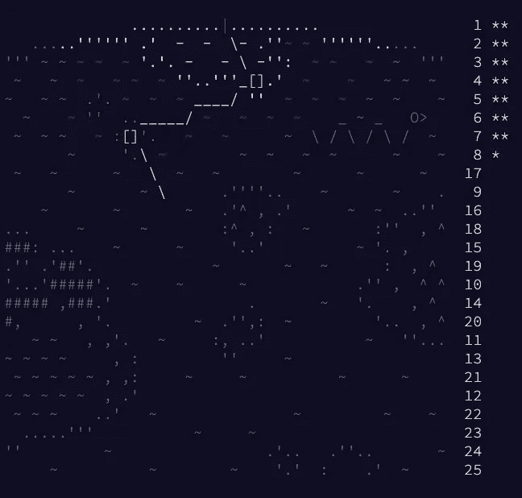
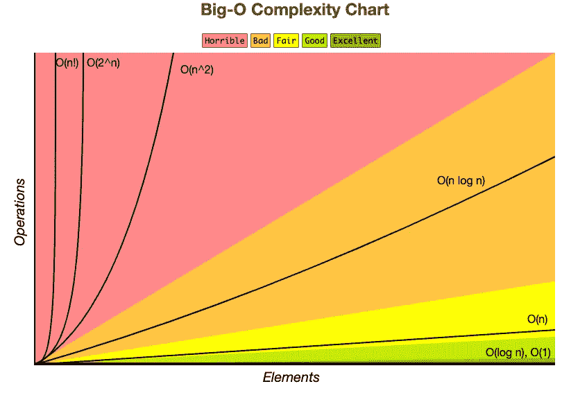
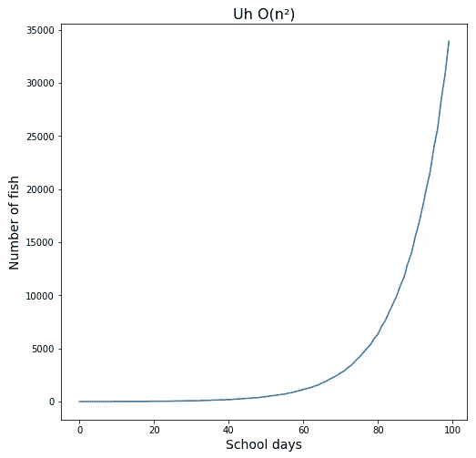
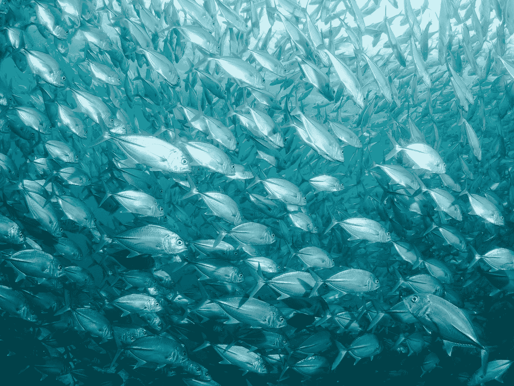

# 小池塘里的大

> 原文：<https://medium.com/codex/big-o-in-a-little-pond-a4422246d398?source=collection_archive---------4----------------------->

Elena Mozhvilo 在 [Unsplash](https://unsplash.com?utm_source=medium&utm_medium=referral) 上的照片

## **十二月快乐，代码降临快乐！**🎅🏻 🖥

对于那些不知道的人来说，[代码的出现](https://adventofcode.com/2021)是一年一度的编码挑战，从 12 月 1 日持续到 25 日。不是打开一个小门展示一块干巧克力，而是在美国东部时间每天晚上 12:00 发布一个新的谜题。谜题是代码不可知的(使用任何你想要的语言！)而每个谜题的答案都是一个数字，你可以通过处理你独特的输入来计算(每个人都有自己的！)用你写的任何代码。谜题一天比一天难，每一个都由第一部分和第二部分组成，这两个部分互为基础。完成一个部分会为您赢得一颗星，而完成整个拼图会让您进入下一个拼图，并在视觉日历上填充一行颜色。

我的未完成的 2020 板——所有的谜题都可以追溯到 2015 年！

这些谜题被放在狂野的故事中，比起在 HackerRack 上进行枯燥的算法练习，这些故事给了整个挑战更多的娱乐价值和动力。AoC 周围的社区非常支持，这对像我这样的技术新手尤其有帮助。(我强烈推荐 [subreddit](https://reddit.com/r/adventofcode) 中一些令人惊叹的可视化和用滑稽/疯狂的语言编写的解决方案。)许多人使用 AoC 来提升他们的技能，练习或学习一门新语言，或者通过在几分钟内解决每天的问题而登上全球排行榜。

去年，当我还在学习编码的时候，我尝试了 AoC，这是一个非常有趣的挑战，尽管我没有完成。现在我身后有了 Flatiron 的数据科学训练营，我很高兴看到我能走多远！

# 什么是大 O-dea？

[第六天](https://adventofcode.com/2021/day/6)我发现了 AoC 的一个优点:创造性优化。尽管这个谜题的描述和其他的一样牵强(看着发光的深海灯笼鱼从我自己运行的圣诞潜水艇中无性繁殖并呈指数增长)，但解决方案遇到了一个实际的、真实的问题，我经常看到只在理论上讨论这个问题:大 O 复杂性。

谷歌搜索一下就能找到很多详细的解释，所以现在我会说，大 O 指的是一段代码可能导致的最坏情况，即代码运行需要多少内存和/或时间。

例如，通过迭代每一项来搜索列表或数组中的值需要 O(n)(比如:“O of N”)时间，或线性时间。那是因为*最坏的情况*是你要找的项目在列表的末尾，所以你必须浏览 *n* 个项目。计算 *y=2x* 有 O(1)个时间，或者常数时间，因为无论 *x* 有多大，你只需要做一次计算。然而，如果一个循环在另一个循环中对其整个数组进行 n 次迭代，那么嵌套 for 循环可能会运行 O(n)-times-O(n)或二次 O(n)时间。

更多详情请见[https://www.bigocheatsheet.com/](https://www.bigocheatsheet.com/)

虽然关于大 O 的讨论常常令人生厌，但今天的 AoC 难题让我第一手地看到了这些概念的重要性。

# 巨大的效率收益

在拼图中，一群鱼中的每条鱼每 7 天繁殖一次。然而，不仅这些鱼没有同步，新的鱼实际上要花 9 天时间来繁殖它们的第一次，然后是 7 天。

给定的难题输入将每条鱼表示为数组中的一个元素；每条鱼的价值代表它繁殖的天数。例如，数组`[3, 4, 2, 1, 1]`总共包含 5 条鱼。第一条鱼在繁殖前还有 3 天，第二条鱼有 4 天，依此类推。

一天之后，这个数组看起来应该是这样的:`[2, 3, 2, 0, 1]`第四条鱼要繁殖了！

两天后，它会看起来像这样:`[1, 2, 1, 6, 0, 8]`另一条鱼被添加到最后，在它繁殖之前还剩 8 天，而第四条鱼的计数器已经从 0 重置为 6。

提出的问题是，80 天后还会有多少鱼？以下是我的初步解决方案:

我将我的解决方案分成一个名不副实的助手函数和一个主`solution()`函数，它工作得很好。我提交了我的最终答案，收集了我的星星，并愉快地阅读了第二部分:

> 假设灯笼鱼永生，拥有无限的食物和空间。他们会接管整个海洋吗？在上面例子中的 256 天后，总共会有`26984457539`灯笼鱼！
> 
> 256 天后会有多少条灯笼鱼？

轻松点。我输入`solution(puzzle_input, 256)`，自信地按下回车键，然后等待。等待着。等待着。

仍在等待代码运行…

我去拿了些水，回来，5 分钟后我的代码还在运行。我觉得很奇怪。只是简单的加减法。然后它像一吨鱼一样击中了我。

# o(圣夜)，二次时间是真实的

谜题描述甚至说，鱼“必须快速产卵以达到如此大的数量——也许是以指数级速度**”，但是我听进去了吗？大 n(O)！**

**我运行了一些可视化来检查——是的，人口每 7 天翻一倍，正如我所预料的那样，如果我，你知道，首先注意的话。**

****

**我们需要一艘更大的潜艇。**

**我最初的解决方案是经典的 O(n ),但是考虑到我的计算机内存和处理能力的限制，如果我现在想要一个答案，我显然需要一个更优化的解决方案。试图创建并迭代超过 1.5 万亿个元素的数组(是的，实际上)是不可能的。我遇到了实际的、身体上的极限——并在大 o 上了一课。**

**我研究了人口增长方程，但那些只给了我估计，没有答案。我摆弄着我的代码，分析着计数、求和以及比率，但是找不到绕过那个大大的 o 的方法。我被卡住了。最后，我去寻求帮助，无意中发现了《代码 subreddit》问世时的一个提示，它似乎和罗塞塔石碑一样神秘而重要:**

> **"要解决这个难题，你只需要一个 9 元素的数组."**

**什么？！怎么会？？？这似乎好得令人难以置信。但事实证明，知道这是可以做到的是成功的一半。**

# **快乐到线性时间！**

**我终于意识到我可以使用一种能带给我更多快乐的解决方案。我可以使用数组索引*作为整个学校*的信息源，而不是将每条鱼表示为它自己的数组元素！索引 *i* 处的每个元素可以表示在繁殖前还有多天的鱼的数量。**

**换句话说，`[3, 4, 2, 1, 1]`就是`[0, 2, 1, 1, 1, 0, 0, 0, 0]`。两次迭代之后，`[1, 2, 1, 6, 0, 8]`将同样被表示为`[1, 2, 1, 0, 0, 0, 1, 0, 1]`。该问题将在常数 O(n)时间内运行，而不是二次时间，并且使用的空间也少得多。**

**我的数组只有 9 个元素，而不是一个有超过一万亿元素的数组。也可以使用字典/散列表来代替，我确信我不需要`import deque`。我不声称自己有最好的解决方案；事实上，我确信还有更优化的方法来编写这个解决方案——甚至可能是一个常数 O(1)时间的解决方案。**

**不过，我喜欢这个解决方案的地方是它如何最佳地利用数组，使用数组的每一部分来包含信息。这是我以前在理论上学到的一课，但我认为让自己体验二次 O(n)时间的后果真的会让它坚持下去。或者我希望如此。**

****快乐编码的来临和保持编码 O(n！)** *(等等，那是最差的一个…)***

***(编辑:我已经改正了这篇文章中的一个错误。我最初把 O(n)描述为指数时间，这是不正确的！O(2^n)是指数时间；O(n)是二次时间。***

****

**由[让·维默林](https://unsplash.com/@jwimmerli?utm_source=medium&utm_medium=referral)在 [Unsplash](https://unsplash.com?utm_source=medium&utm_medium=referral) 上拍摄的照片**