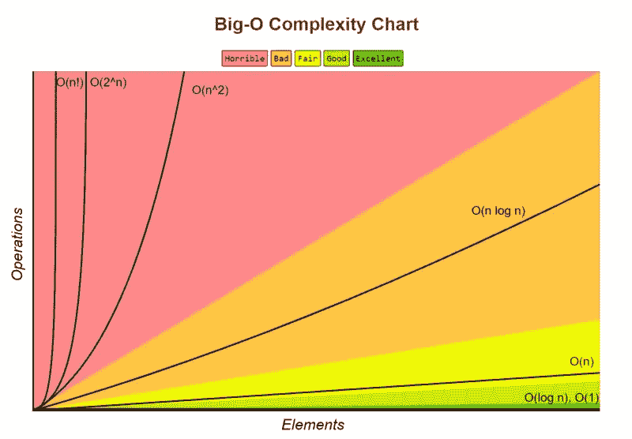

# 编程界的大 O

> 原文：<https://medium.com/codex/big-o-in-programming-c86803b01532?source=collection_archive---------15----------------------->

程序执行需要时间和内存，它取决于执行程序的计算机的处理速度。在我的机器上执行一段代码可能需要 1 秒，而同样的代码在另一台机器上可能需要或多或少的时间，这取决于它的处理能力。这意味着我们不能根据执行时间来衡量代码性能，它应该独立于机器资源。

好的代码有两个品质:

*   *可读性*
*   *可扩展性*

**可读性**意味着代码对开发人员来说是可读且易于理解的。这通常意味着代码应该有适当的编码风格、格式、命名约定和注释，这样其他开发人员就可以很容易地使用您的代码。

**可伸缩性**意味着代码应该易于扩展以适应更大的输入，并且不应该中断。例如，如果一个应用程序目前有一千个用户，在未来，用户群增长到数百万，应用程序应该工作相同。为了开发可扩展的应用程序，需要对代码进行大 O 分析，尽可能提高代码的效率。

**大 O 符号**用于根据**空间和时间复杂度**评估代码的性能矩阵。它通过估计执行时间和空间来判断代码在较大输入下的执行情况，而不考虑它在什么硬件上执行。



> **时间复杂度:** *预计执行所需的时间*

以下几点将帮助您如何计算代码的大 O 时间复杂度:

*   =，+，-，*，/，%的大 O 是 0(1)
*   loop 的大 O 是 O(N ),其中 N 是循环执行的次数
*   大 O 总是估计最坏的情况
*   一般 O(1) + O(1) + … = O(1)和 O(N) + O(N) +…= O(N)
*   此外，我们忽略了常数项和赋值，只计算循环和昂贵的运算。
*   嵌套循环的大 O 是 O(N) * O(N) = O(N)
*   对于嵌套循环的不同输入，O(N) * O(M) = O(N*M) = O(P)

考虑以下代码:

```
def TwoSum(numbers, target): mapValues = {}                                     O(1) for i in range(len(numbers)):                      O(N):N=length currentVal = mapValues.get(numbers[i], None)   O(1) if(currentVal is not None):                    O(1) return [currentVal, i]                     O(1) else: numberToFind = target - numbers[i]         O(1) mapValues[numberToFind] = i                0(1) return None                                        O(1) Note: Statements inside loop will execute N=length of numbers times, so their complexity will be multiplied with O(N)Big O = O(1) + O(N)*(O(1) + O(1) + O(1) + O(1) + O(1)) + O(1)As O(1) + O(1) +O(1) + ... = O(1), so
      = O(1) + O(N)*(O(1) + O(1)Also O(1) + O(N) = O(N) and O(1)*O(N) = O(N)
      = O(1) + O(N) + O(1)
      = O(N) 
```

> O(N)是一个通用术语，其中 N 代表大数。当 N 太大时，我们可以估计 N/2，N/3 等于 N。

现在我们可以看到，最终，复杂度取决于循环执行的次数，对于像计算和赋值这样的小操作，一般不计算复杂度。

> **空间复杂度:** *预计程序需要的内存量*

空间复杂度是根据程序内部的变量初始化来计算的。空间复杂度取决于:

*   变量
*   数据结构
*   函数调用
*   分配

为了更好地理解，请考虑下面的示例:

```
newArray = []                O(1)
for i in range(n):
    newArray.append(i);      O(N)Big O = O(1) + O(N) = O(N)
```

这里的空间复杂度是 O(N ),因为新的内存被分配给数组 N 次。

> 对于大 O 计算，通常估计输入的数量非常大，因此可以忽略小操作，只考虑重复操作。