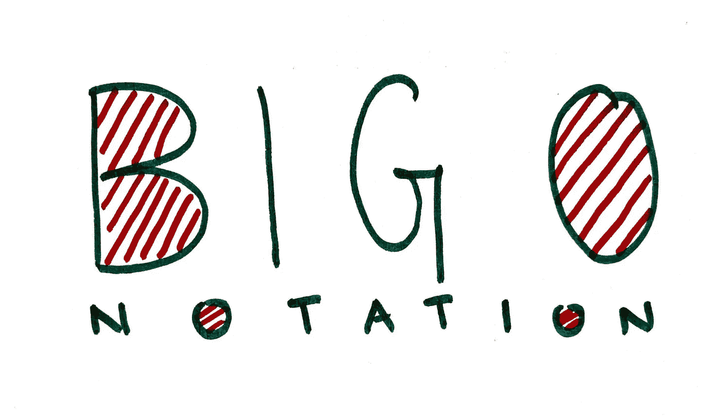
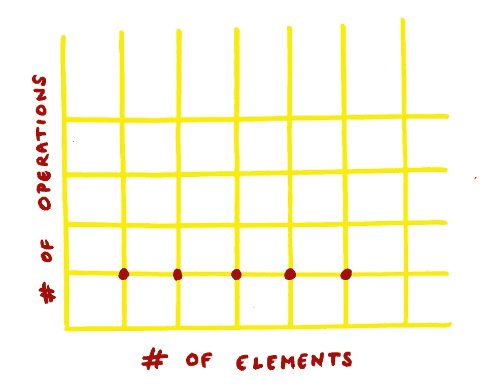
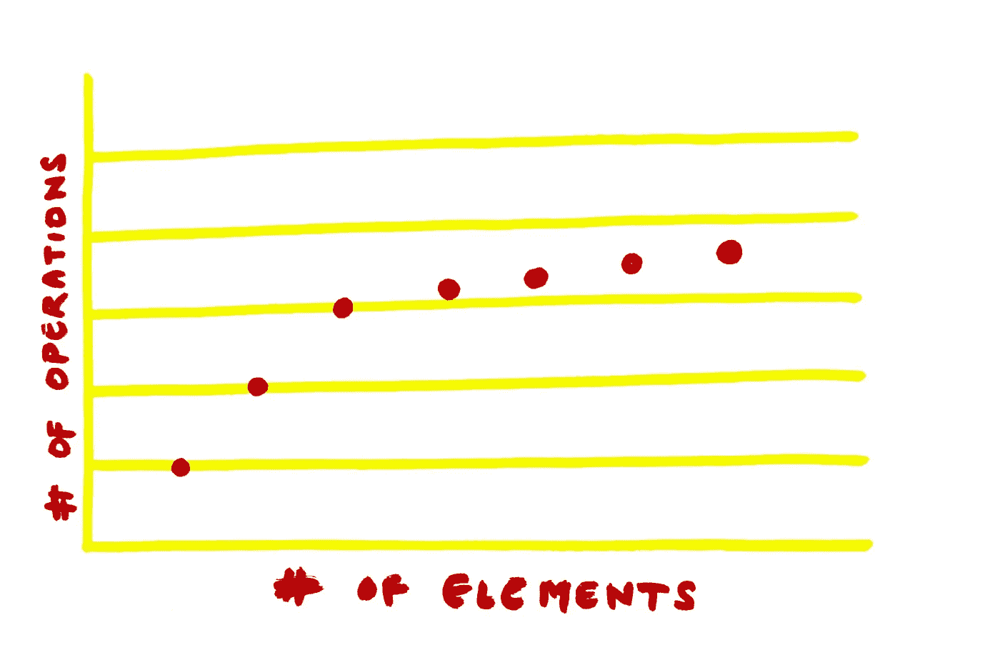
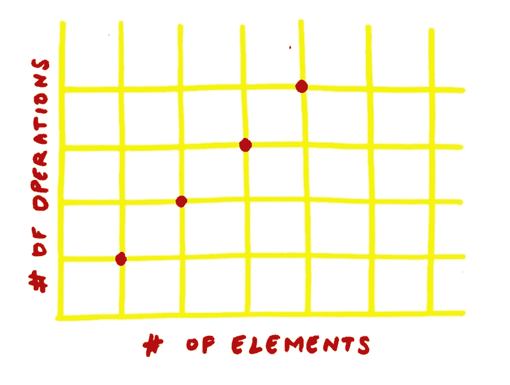
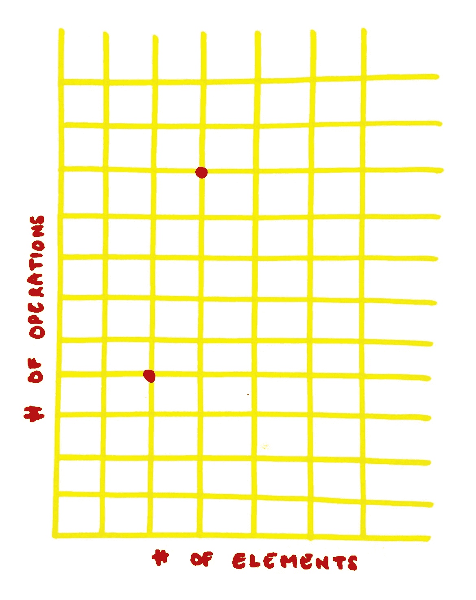

# 大 O 符号——保持简单。

> 原文：<https://medium.com/codex/big-o-notation-keeping-it-simple-8be5699fe9c?source=collection_archive---------4----------------------->

数据结构和算法的学习之旅总是从*大 O 符号*开始。那么真正的大 O 是什么，为什么它是一件大事？

编写一个给定问题的解决方案并不难，难的是编写一个**可扩展的**解决方案，当输入大小增加时*该解决方案工作良好。*

Big O 帮助我们做到了这一点——通过 ***衡量其可扩展性*** 来告诉我们一个解决方案有多棒。大 O 并没有告诉我们一个解决方案需要多长时间，相反，它给了我们一个通过增加输入来增加操作的想法。

让我们看看各种常见的大 O 符号—

1.  O(1) —最佳。
2.  O(log n) —更好。
3.  好的。
4.  O(n ) —不好。

还有几个比如 O(n！)这是可怕的**，我们很少遇到这种情况，因此让我们将它们排除在本文范围之外。**

# **O(1) —恒定时间。**

**在下面的代码中，操作的数量是恒定的——这意味着无论输入有多大，代码都会执行恒定数量的操作。如果数组包含 5 个元素，代码将执行一次，如果数组大小增加到 50，000 个元素，代码仍将只执行一次。这是 O(1)的一个例子。**

> **这里要注意的一点是，如果在上面的函数中有 3 个操作，而不是只有 1 个，那么大的 O 将是 O(3)。这意味着，不管输入大小如何，代码总是执行 3 个操作。**

****

**上图显示，无论输入大小如何，操作次数**保持不变**。**

# **O(log n) —对数时间。**

**当我们采用分而治之的解决方案时，复杂度为 O(log n)。二分搜索法是 O(log n)复杂度的一个很好的例子。**

**在下面的二分搜索法代码中，我们反复将数组中可能包含我们要搜索的项目的部分分成两半，直到我们将可能的位置缩小到只有一个。**

****

**上图显示了操作是如何随着输入大小的增加而对数增长的。**

# **O(n) —线性时间。**

**在下面的代码中，运算次数是**线性**——也就是说，*运算会根据输入大小*线性增加**。如果数组包含 5 个元素，下面代码中的 for 循环将运行 5 次，如果数组大小增加到 50，000 个元素，循环将运行 50，000 次。****

******

***上图显示了操作如何随着输入大小的增加而线性增加。***

# ***O(n ) —二次时间。***

***在下面的代码中，运算次数为**二次**——也就是说，*运算会根据输入大小*将 ***增加二次*** *。代码中有两个循环。对于输入数组中的每一项，将执行两个 For 循环。因此，如果数组大小为 2，总操作数将为 4，如果数组大小为 3，总操作数将为 9。****

******

***上图显示了操作如何随着输入大小的增加而二次增加。***

***希望你觉得这篇文章有用，请在评论中发表你的问题/反馈，我将很乐意回应。如果你喜欢这篇文章，你可以考虑在[媒体](/@dwivedi.2512_6282)上关注我，并在 [LinkedIn](https://www.linkedin.com/in/abhishek-dwivedi-25a45b225/) 上联系我。***