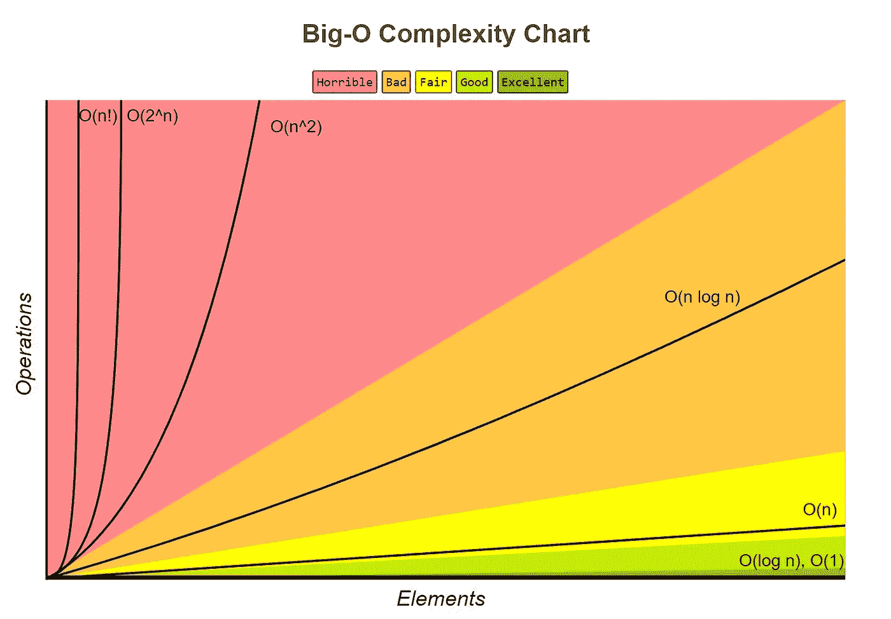
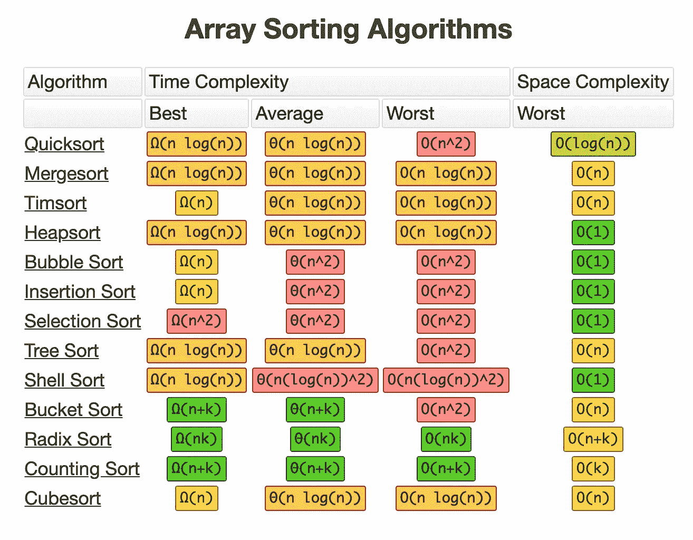

# 大 O:编程的终极支柱

> 原文：<https://medium.com/codex/big-o-the-ultimate-pillar-of-programming-f8777c898f21?source=collection_archive---------12----------------------->

## 任何人都可以编码。但是只有少数人能写出完美的代码。


迈克尔·泽兹奇在 [Unsplash](https://unsplash.com?utm_source=medium&utm_medium=referral) 上的照片

作为一名非计算机专业的学生，每当我得到正确无误的输出时，我总是感觉世界就在我的脚下。我从不担心我在程序中使用的变量的数量和我写代码的行数。我唯一的目标是看到零错误和正确输出的控制台。

> “糟糕的程序员担心代码。优秀的程序员担心**时间复杂度**和**空间复杂度**

我的第一次编码面试让我意识到这些天来我一直是个糟糕的程序员。我想知道为什么招聘人员没有把我列入候选名单，尽管我的代码给出了期望的结果。那是因为我写了一个时间复杂度为 O(n)的代码，而不是得到时间复杂度为 O(1)的相同输出。哎呀。！！:-(


照片由[弗多斯·罗斯](https://unsplash.com/@firdoussross?utm_source=medium&utm_medium=referral)在 [Unsplash](https://unsplash.com?utm_source=medium&utm_medium=referral) 上拍摄

在生活中，我们都知道有成百上千条通往成功的道路。同样，在编程中有许多方法可以找到正确的解决方案。但是我们如何找到正确的道路呢？与其努力工作，写无数行代码，不如让自己的“聪明工作”从“努力工作”手中抢夺王位。这就是“大 O”发挥作用的地方。

# **什么是大 O？**

在编程中，大 O 就像听起来一样强大。好的代码是可读的、可伸缩的、可 T21 的。大 O 符号允许程序员编写可扩展的代码。它让编码人员了解他们代码的性能。

> 大 O 符号通常用于从理论上衡量和比较算法的最坏情况。

算法通常属于这些 **7 大时间复杂度**之一，从效率最高到最低。

1.  **O(1)**
2.  **O(对数 n)**
3.  **O( *n* )**
4.  **O(n log n)**
5.  **O(n )**
6.  **O(2^n)**
7.  **O(n！)**



## *1。O(1) —常数时间*

如果一个算法无论输入大小如何都需要相同的时间，那么它就可以说是在恒定时间内运行。这意味着无论输入多大或多小，运行时间都将保持不变。例如:

```
if (3==3):
   return True
else:
   return False
```

具有恒定时间复杂度的算法是极好的，因为我们不需要担心输入大小。

## **2。O(log n) —对数时间**

如果一个算法在每一步中减少了输入数据的大小，就说它具有对数时间复杂度。例如:

```
for num in range(0,len(a),2):
       print(a[num])
```

其中一个现实世界的应用是谷歌搜索引擎。

## **3。O( *n* ) —线性时间**

具有 O(n)的算法的运行时间具有线性运行时间。这意味着当运行时间随着输入数据的大小最多线性增加时，算法被认为具有线性时间复杂度。例如:

```
for num in range(100):
     if (num%2==0):
          print num
```

在上面的例子中，我们需要查看该范围内的所有数字，以找到我们要寻找的值。

## **4。O(n log n) —准线性时间**

重复将一组数据分成两半，然后用时间复杂度为 O(N)的子算法独立处理这两半的算法，总时间复杂度为 O(N log N)。例如:

```
**from** random **import** randrange 
input = [10, 5, 2, 3, 7, 0, 9, 12] 
**def** **quicksort**(arr): 
    **if** len(arr) < 2: 
       **return** arr 
    **else**: 
       rand = randrange(0, len(arr))  *# grab a random 
       index* pivot = arr.pop(rand) 
       less = [i **for** i **in** arr **if** i <= pivot] 
       greater = [i **for** i **in** arr **if** i > pivot] 
       **return** quicksort(less) + [pivot] + quicksort(greater) 
print(“sorted: “, quicksort(input))
```

O(N log N)算法的更多例子是合并排序和堆排序。

## **5。O(n ) —二次时间**

当运算次数变成元素数量的平方时，算法就是“二次的”。它通常出现在嵌套循环中。例如:

```
for i in range(13):
   for j in range(11):
       print(i*j)
```

冒泡排序是二次时间复杂度的一个著名例子。

## **6。O(2^n) —指数时间**

当运算次数随元素数量呈指数增长时，算法就是“指数型”的。考虑一种算法，其实现是计算相对于计算输出呈指数增长的斐波那契数。

```
**def** **fibonacci**(num):
   **if** (num <= 1): 
       **return** num 
   **return** fibonacci(num — 2) + fibonacci(num — 1)
```

这种时间复杂度通常见于蛮力算法。

## **7。O(n！)—阶乘时间**

> O(n！)==“哦不！”


Ryan Snaadt 在 [Unsplash](https://unsplash.com?utm_source=medium&utm_medium=referral) 上拍摄的照片

这种时间复杂度效率最低。当运算的数量随着与元素数量相关联的排列的数量而增加时，算法是“阶乘的”。例如:

```
def factorial(n):
    if (n==1 or n==0):
        return 1
    else:
        return n * factorial(n - 1)
```

具有阶乘时间复杂性的算法的另一个很好的例子是堆算法，它用于生成所有可能的 *n* 对象的排列。

# **大魔神小抄**

最常见的数据结构中的操作的时间复杂度在这个备忘单中给出，以使你的生活更容易。


数据结构操作的大 O 记法:[http://bigocheatsheet.com/](http://bigocheatsheet.com/)

这是另一张关于最常见排序算法的时间复杂度的表格。



数组排序算法的大 O 记法:【http://bigocheatsheet.com/ 

# **底线**

我再怎么强调大 O 符号对所有软件开发人员的重要性也不为过。尽管你可以逃避它，或者从不关心它的表现，但在某个时候你会受到它的影响。因此，让我们改掉旧的糟糕的编码习惯，通过灌输在编码时记住时间复杂性和空间复杂性的习惯，成为更好的程序员。