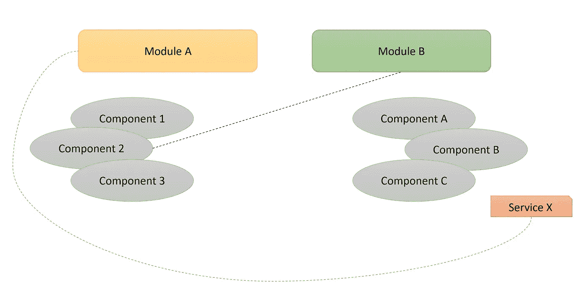
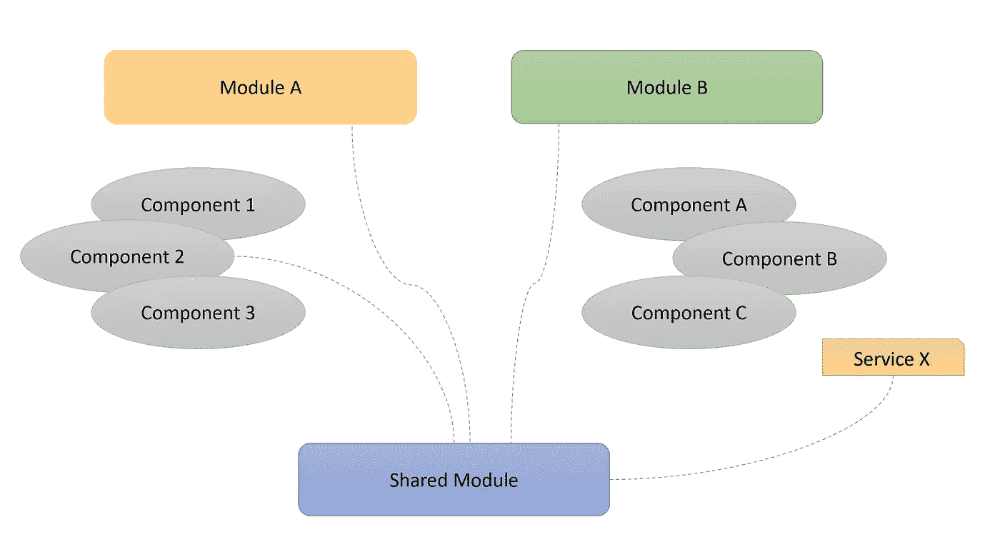
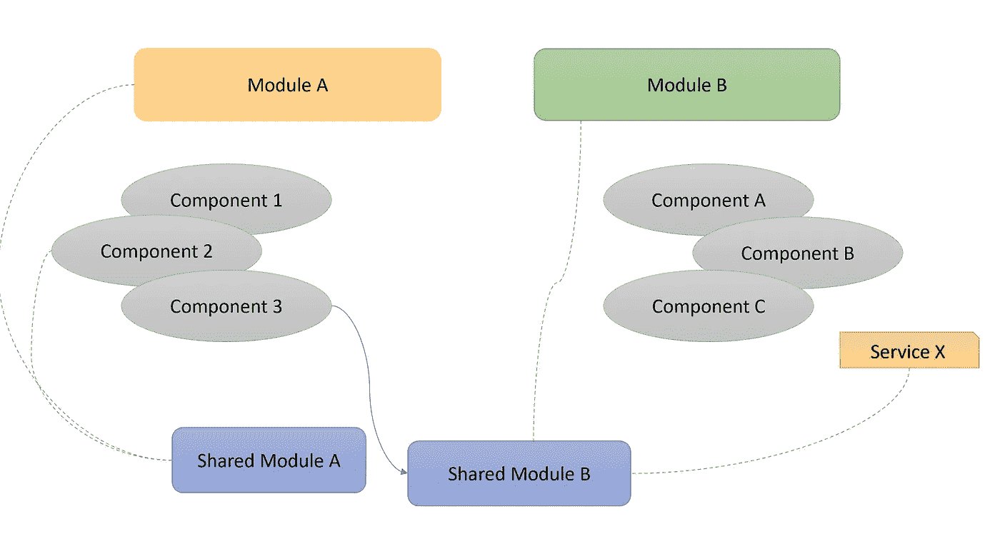

# 最大的角度陷阱和如何避免——第一部分——循环依赖

> 原文：<https://medium.com/codex/biggest-angular-pitfalls-and-how-to-avoid-them-part-one-circular-dependency-4272417428e4?source=collection_archive---------9----------------------->

所以另一个有角度的陷阱。我知道互联网上已经有数百万张这样的照片了。我还是决定再写一本。你可能会想，这是为什么？嗯，原因很简单，因为即使在过去五年里在 Angular 框架中大量编码之后，我仍然有时成为这些陷阱的受害者。所以这篇文章也是为了给我自己以及那些可能在谷歌上搜索到一个问题并意外登陆到这里的人记录这些陷阱:)

我会把这个话题分成几部分，因为我不想再写一个列表。相反，我想更深入地探究每一个陷阱。所以，在第一部分中，我们将看看每个 Angular 开发者最喜欢的错误——**循环依赖。**

**循环依赖**是新手 Angular 开发者可能犯的最常见的错误。老实说，它甚至不是 Angular Framework 特有的东西。这更像是一个依赖注入的问题。

那么，什么是循环依赖呢？假设你有两个服务，让我们称它们为 pizza.service.ts 和 delivery.service.ts。我们在 pizza.service 中注入 delivery.service，因为我们需要 pizza.service 中的交付状态。这很好**只要我们在 delivery.service 中不需要 pizza.service 本身。**

你可能会问，如何解决这个问题？在这种情况下，最好将依赖代码(例如 delivery.service 中的状态变量)放在第三个服务中，该服务不依赖于上述两个服务中的任何一个。然后，在这两个中注入第三个服务。

然而，有时问题比这更复杂。例如，如果您在 Angular 应用程序中启用了延迟加载。现在，在这个惰性加载的应用程序中，您有两个不同的模块。**模块 A** 有组件——pizza . component、pasta.component 和 tiramisu.component。另一方面，**模块 B** 有 delivery.component、payment.component 和 extras.component，以及一些服务..现在，在表面上，我们已经在模块之间清晰地划分了组件。但是在实践中，我们需要来自模块 A 的组件在模块 B 的组件中，模块 B 的服务在模块 A 的组件中。

问题是

在这种情况下，最干净的方法总是实现一个 **shared.module** 来保存公共组件，然后在两个模块中导入 shared.module。

解决方案

**但是要小心—** 这与其说是角度问题，不如说是架构问题。总是问自己，把某个组件放在某个模块中有意义吗？业务用例是什么？clearner 的工作流程是什么？不要盲目地把所有东西都放在 shared.module 中。如果你有不必要的东西存储在 shared.module 中，它可能会完全违背懒惰加载的目的。你也可以有更小更干净的多个共享模块，以防你有多个东西需要在懒惰模块之间共享。在这种情况下，只需引用您需要的共享模块。

较小的共享模块

循环依赖可以是兔子洞。尤其是当你有一块巨大的巨石。虽然我理解在当今时代编写 monolith Frontend 的缺点，但考虑到项目的生命周期，这有时是不可避免的。在这种情况下，最好从一开始就设计应用程序，以避免将来出现这样的陷阱。绕过一个可能的未来问题，在短期内看起来很昂贵，但从长期来看，它总是比重构更划算。

在下一部分，我们将讨论订阅的常见错误以及如何避免它们。

在那之前:)