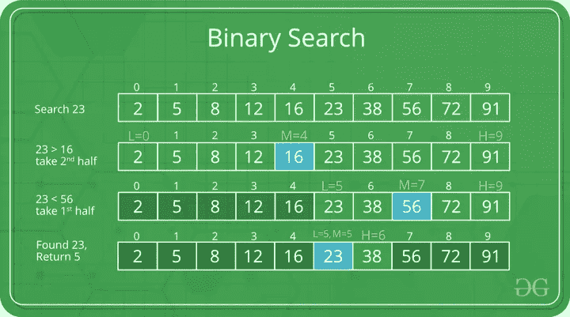

# 二分搜索法(下)704

> 原文：<https://medium.com/codex/binary-search-704-688bbbc93e61?source=collection_archive---------16----------------------->

## LeetCode (C++)

## [问题](https://leetcode.com/problems/binary-search/)

给定一个按升序排序的整数数组`nums`和一个整数`target`，编写一个函数在`nums`中搜索`target`。如果`target`存在，那么返回它的索引。否则，返回`-1`。

你必须写一个运行时复杂的算法。示例 1

**例 1:**

```
Input: nums = [-1,0,3,5,9,12], target = 9
Output: 4
Explanation: 9 exists in nums and its index is 4
```

**例 2:**

```
Input: nums = [-1,0,3,5,9,12], target = 2
Output: -1
Explanation: 2 does not exist in nums so return -1
```

## 解决办法

这个问题直接表明我们将使用二分搜索法。你也可以使用线性搜索来解决这个问题，但是我们将会花费太多的时间来解决这个问题，最好的运行时间复杂度将会是 O(n)。我们现在将坚持二分搜索法，并尽快解决这个问题。

***【二分搜索法】*** *是一种* [*搜索算法*](https://www.geeksforgeeks.org/searching-algorithms/) *用在一个由* ***反复划分搜索区间的有序数组中*** *。二分搜索法的思想是利用数组排序的信息，将时间复杂度降低到 O(Log n)。*



图片由 [GeeKforgeeks](https://www.geeksforgeeks.org/binary-search/) 提供

这个想法是将数组一分为二，在左边寻找目标数字，然后在右边寻找。这种方法将把复杂度减少 2 倍，每次迭代我们将试图找到目标数，结果复杂度为 O(logn)。

本例中的 Low 是 vector 的第一个元素(vectors 在 c++中也可以作为数组使用)。另一方面是向量的最后一个元素或向量最右边的元素。我们计算数组的中间值`(low+hight)/2`

只要低点没有那么高，我们就通过 if 语句检查我们是否找到了目标数字。如果目标数字是向量的实际中间值，我们返回中间位置。如果目标数大于向量的中间数，则新的低位变为中间+ 1，我们将只关注向量的右边部分。如果目标小于向量的中间，则高位将变为中间-1，我们将只关注数组的左边部分。我们将在第一次迭代后不断寻找中间值，因为低变量和高变量在每次迭代后都会发生变化。如果目标不在向量中，我们将返回-1。

**参考**

[](https://leetcode.com/problems/binary-search/) [## 二分搜索法-李特码

### 给定一个按升序排列的整数数组 nums 和一个整数目标，写一个函数来搜索…

leetcode.com](https://leetcode.com/problems/binary-search/) [](https://ynnenu.medium.com/membership) [## 通过我的推荐链接加入 Medium-Eniela p . Vela

### 作为一个媒体会员，你的会员费的一部分会给你阅读的作家，你可以完全接触到每一个故事…

ynnenu.medium.com](https://ynnenu.medium.com/membership)