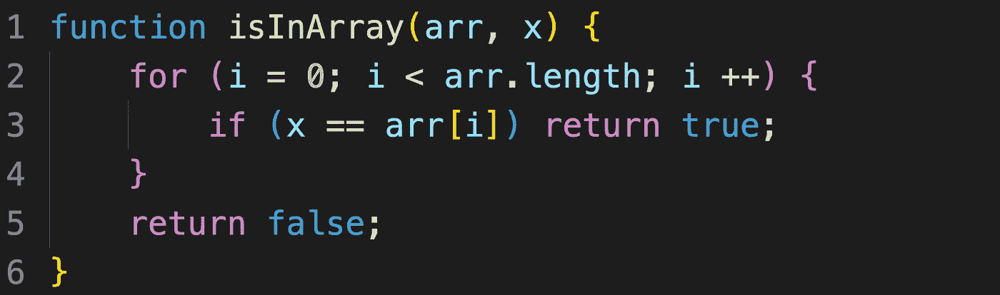
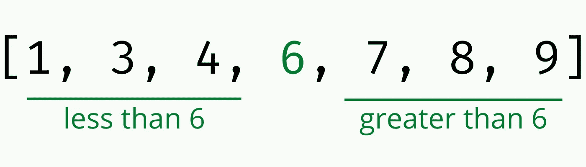
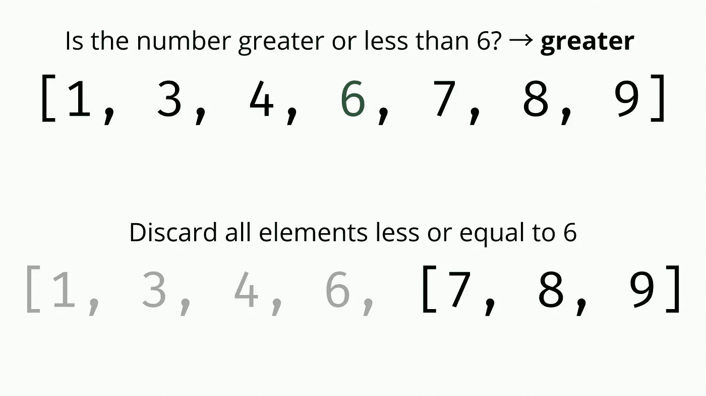
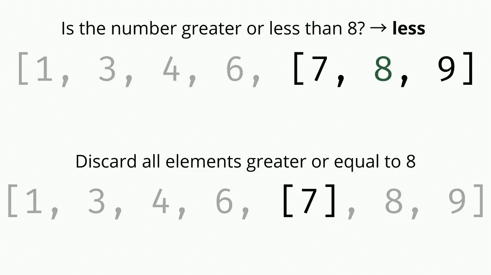
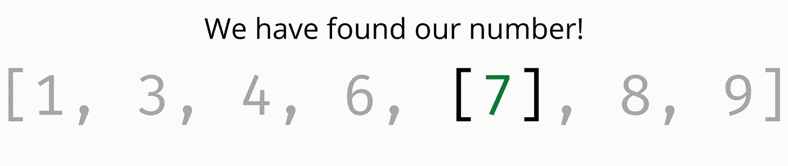

# 二分搜索法 400 字

> 原文：<https://medium.com/codex/binary-search-in-400-words-726f1afe3e82?source=collection_archive---------19----------------------->

二分搜索法是**一种用于排序数组**的搜索算法，包括连续将数组一分为二。该算法大大快于普通的线性搜索，将时间复杂度从 O(n)降低到 **O(log n)** 。

这一切意味着什么？

假设您有一个排序的数字数组，类似于[1，3，4，6，7，8，9]，您想检查数字 7 是否在数组中。你将如何实现它？

最简单的方法就是遍历一次数组，对于每个元素，检查它是否等于 7。如果我们已经到达数组的末尾，并且没有元素是相等的，那么我们将知道数组中不存在 7。这种方法叫做**线性搜索。**

线性搜索

线性搜索理解起来非常直观，但是对于在大型数据集上进行搜索来说，它的效率可能相当低。如果我们的数组不只是七个数字长，而是由数百万或数十亿个元素组成(在大型数据库时代很常见)，并且我们必须执行数千次搜索，那么线性搜索将会非常慢。

那么我们如何解决这个问题呢？

我们可以利用数组的一个重要属性:**它被排序的事实**。有序数组是特殊的，因为无论你在一个有序数组中的什么位置，所有较小的数字总是在一边，所有较大的数字总是在一边。

如果我们简单地从询问我们正在寻找的数字是大于还是小于在我们排序的数组中间的数字开始(如果它等于我们已经找到的第一次尝试！)，我们可以**立即丢弃数组中数字不能在**的那一半。

然后我们可以重复这个过程，不断地将子数组的长度减半，越来越接近我们要寻找的数字。

当“中间的数字”等于我们要搜索的数字(数字在数组中)或者当我们已经丢弃了整个数组(数字不在数组中)时，我们停止搜索。

现在，因为我们可以在每次迭代中丢弃数组的一半，所以最多需要迭代次数排序数组长度的 log₂，这意味着**在十亿个数字的数组中搜索一个元素最多需要 30 次操作**(相比之下，使用线性搜索需要十亿次)。这就是二分搜索法的美丽之处。

# 其他资源:

*   * [火船二分搜索法视频](https://www.youtube.com/watch?v=MFhxShGxHWc) *
*   [GeeksforGeeks 二分搜索法文章](https://www.geeksforgeeks.org/binary-search/)
*   [CS 道场二分搜索法视频](https://www.youtube.com/watch?v=6ysjqCUv3K4)
*   [可汗学院二分搜索法课程](https://www.khanacademy.org/computing/computer-science/algorithms/binary-search/a/binary-search)