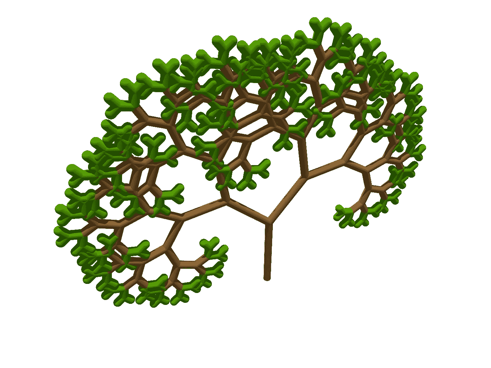

# 二叉查找树遍历(有序、前序和后序)

> 原文：<https://medium.com/codex/binary-search-tree-traversals-inorder-preorder-and-postorder-6f458e10dbb0?source=collection_archive---------9----------------------->

## 用 Javascript 解释树遍历。



# **什么是二分搜索法树？**

二分搜索法树是计算机科学中使用的基本数据结构之一。

二分搜索法树的概念包括节点的集合。这包括一个根节点以及相同类型的父节点、子节点和叶节点。每个节点都连接有 0、1 或 2 个子节点。左边的子代必须小于父代，右边的子代必须大于父代。没有子节点的节点是叶节点。这些内部节点集合构成了所谓的子树。这样可以在视觉上形成树状结构。

```
 10
                           /    \
                          8      15
                         / \    /  \
                        6   9  12  16
```

在 Javascript 中创建一个二叉查找树，我们通常通过一个类似于`BinarySearchTree`或`BST`的类和一个`Node`类来实现。我们给我们的树几个方法，如`insert()`、`remove()`和`contains()`。

```
class Node {
    constructor(value) {
        this.value = value;
        this.left = null;
        this.right = null;
    }
}
class BinarySearchTree {
    constructor(value) {
        this.root = value;
    }
    contains(node) {
        ...
    }

    insert(node) {
        ...
    }

    remove(node) {
        ...
    }
}
```

为了浏览这些二分搜索法树，我们通过三种主要的遍历方法来实现，这三种方法分别叫做有序、前序和后序。这些通常在 Javascript 中递归执行。让我们在接下来的小节中回顾一下这些遍历方法。

# 中根次序

为了执行有序遍历，我们总是先从左边的节点开始遍历，然后访问当前节点和右边的节点。

```
inOrderTraverse(node) { 
 // check if tree node exists
 if (node) {
  // traverse down left subtree (Left, Node, Right)
  inOrderTraverse(node.left);
  console.log(node.value);
  inOrderTraverse(node.right);
 }
}
```

在这个方法中，我们首先检查以确保当前节点不是`null`。然后，如果我们的节点存在，我们开始我们的遍历。首先，我们递归访问左边的子节点，然后打印出当前节点，最后，我们递归遍历右边的子节点。这将重复进行，直到访问完所有节点。

# 预购

对于前序遍历，我们遵循相同的步骤，只是顺序不同。我们将首先从当前节点开始，然后移动到左右节点。

```
preOrderTraverse(node) {
 if (node) {
  // traverse tree preorder (Current, Left, Right)
  console.log(node.value);
  preOrderTraverse(node.left);
  preOrderTraverse(node.right);
 }
}
```

像我们的 inorder 遍历一样，我们检查以确保我们试图遍历的当前节点存在。然后，我们访问当前节点，在递归调用左右节点上的方法之前将它打印出来，直到到达末尾。

# 后期订单

您可能已经猜到了，后序遍历与前序遍历相反。首先，我们先遍历左边的子节点，然后是右边的子节点，最后是当前节点。

```
postOrderTraverse(node) {
 if (node) {
  // traverse tree postorder (Left, Right, Current)
  postOrderTraverse(node.left);
  postOrderTraverse(node.right);
  console.log(node.value);
 }
}
```

就像前面的遍历方法一样，我们总是确保检查节点不是`null`。然后，在打印当前节点值之前，我们在左右节点上递归调用我们的方法，直到遍历完整个树。

# 摘要

这是对计算机科学中一些最常见的树遍历类型的简要解释。每种遍历技术都为我们提供了一种不同的方式来导航和访问树中的每个节点。关于这个主题的更多信息，请查看我在下面提供的参考资料。

# 参考

*   [极客之极客——穿越树](https://www.geeksforgeeks.org/tree-traversals-inorder-preorder-and-postorder/)
*   [二叉树训练营](https://www.youtube.com/watch?v=BHB0B1jFKQc)