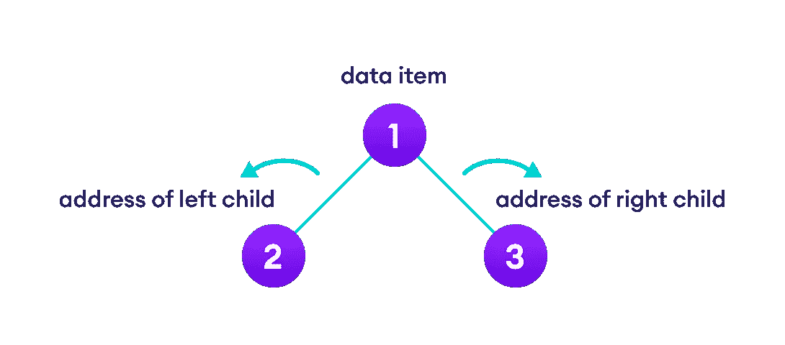
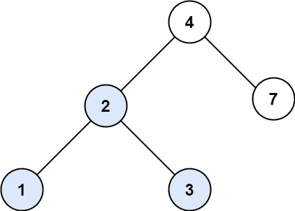
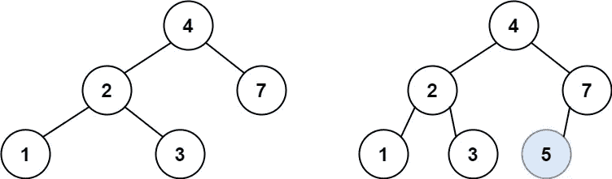
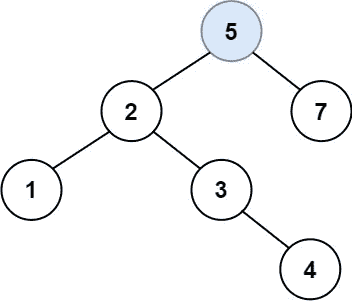
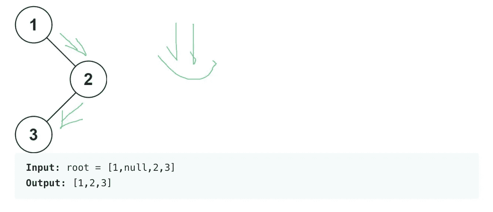
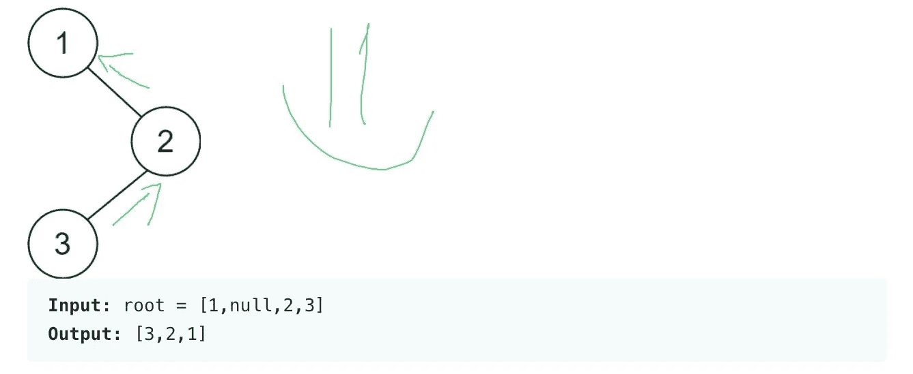
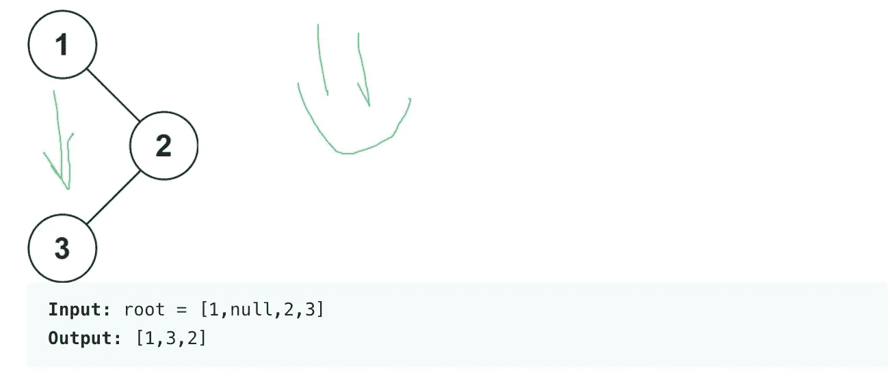

# 二叉树以及如何用递归函数进行查找和插入

> 原文：<https://medium.com/codex/binary-tree-and-how-to-search-and-insert-with-recursive-functions-91dd69473a5b?source=collection_archive---------4----------------------->


当谈到在计算科学中研究数据结构时，有简单的字节，通常所知的数组，实现对象的乐趣，甚至是我过去谈到的那些[链表](/codex/linked-list-fa0eba0f4c0f)。在我提到的这些数据结构中，还有一种数据结构会在 leetcode 问题中遇到，二叉树。

[二叉树](https://www.programiz.com/dsa/binary-tree)是一种数据结构，其中每个父节点最多可以有两个子节点。每一项都是:

*   数据项目
*   左侧孩子的地址
*   右子女的地址



图片来自 Programiz。请参阅超链接参考。

根据节点和子节点的连接方式，二叉树被分类或描述为完全、完美、完整和几种退化/病态类型。

**注意:**这篇博客文章是关于我解决 leetcode 数据结构和算法问题的经验。如果你想从头开始创建和实现你的树节点， [30 秒代码](https://www.30secondsofcode.org/articles/s/js-data-structures-tree)有一篇内容丰富的文章可以练习。

现在，让我们来看看 leetcode 参考。

一个 JavaScript 二进制 TreeNode 应该是这样的。

```
function TreeNode(val, left, right) { this.val = (val === undefined ? 0 : val) this.left = (left === undefined ? null : left) this.right = (right === undefined ? null : right)}
```

这相当于像这样创建您的类:

```
class treeNode { constructor(val) { this.val = val this.left = null this.right = null }}class BinarySearchTree { constructor() { this.root = null }}
```

我们可以在递归中使用声明的值和根参数实现 find 或 insert。一个[递归函数](https://www.javascripttutorial.net/javascript-recursive-function/)将在它自己的体内调用它自己。使用递归函数解决这些算法帮助我理解了它们是如何在二叉树场景中被调用和实现的。


M·C·埃舍尔的 Relativity 很好地展示了以下 JavaScript 函数的模式和递归。

# 搜索

```
const searchBST = (root, val) => {
    if (!root) return null; if(root.val === val) {
        return root;
    } else {
    if(root.val > val) {
        return searchBST(root.left, val);
    } else {
        return searchBST(root.right, val);
      }
    }
};
```

在这段代码中:

1.  我们正在检查是否有根，如果根本没有根，我们将返回`null`。
2.  如果这是搜索结果，我们将返回确切的值。
3.  否则，如果它们在树中，我们也会返回它们的值。



不过，这可能是展示在二叉树中搜索值的能力的最佳语法。有一种更干净的方法。首先，让我们检查根节点是否为空或者与值 i `f (!root || root.val === val) return root;`相同。其次，我们返回子节点的全部值，不管他们是左返回还是右返回`searchBST(root.left, val) || searchBST(root.right, val);`。

整个函数如下所示:

```
const searchBST = (root, val) => { if (!root || root.val === val) return root; return searchBST(root.left, val) || searchBST(root.right, val)};
```

# 插入

```
const insertIntoBST = (root, val) => { if(!root) return new TreeNode(val); if (val > root.val) { root.right = insertIntoBST(root.right, val); } else { root.left = insertIntoBST(root.left, val); } return root;};
```

在树中插入新值的代码与搜索给定值的方法类似。这一次，我们将有根，我们拥有的值将是我们必须插入的值。从上面的代码中可以看出，该函数与我们为搜索而编写的`searchBST`非常相似。

功能细分如下:

1.  如果没有根，我们将创建它。在这种情况下，我们在 leetcode 中的代码是`new TreeNode(val);`。
2.  如果根的值高于我们插入的值，我们将插入一个新的子元素。
3.  否则，我们将继续插入给定的值作为新树的根。



你可能会想，有一种更简单的方法。首先，我们将检查是否没有根，或者给定的值是否等于现有的根值，`if (!root || root.val === val) return new TreeNode(val);`。其次，我们可以用三行代码编写其余部分，不用花括号，也可以使用三元运算。然而，我更喜欢单独的线。下面是完整的功能:

```
const insertIntoBST = (root, val) => { if (!root || root.val === val) return new TreeNode(val); if(val < root.val) root.left = insertIntoBST(root.left, val); else root.right = insertIntoBST(root.right, val); return root;};
```

# 横越

如果我们可以搜索并向二叉树中插入值，那么访问每个节点呢？我们如何获得整个树的信息和流量？我们能以不同的方式做那件事吗？答案是遍历。

[遍历](https://opendsa-server.cs.vt.edu/ODSA/Books/Everything/html/BinaryTreeTraversal.html)是以某种顺序访问数据集合中所有对象(如[树](https://opendsa-server.cs.vt.edu/ODSA/Books/Everything/html/Glossary.html#term-tree)或[图](https://opendsa-server.cs.vt.edu/ODSA/Books/Everything/html/Glossary.html#term-graph))的任何过程。

顺序是:

**前序遍历**

```
const preorderTraversal = (root) => {
    if (!root) return [];

    let queue = [root], result = [];

    while (queue.length) {
        const node = queue.pop();
        result.push(node.val);
        if (node.right) queue.push(node.right);
        if (node.left) queue.push(node.left); 
    }
    return result; 
};
```



**后序遍历**

```
const postorderTraversal = (root) => {
    let result = [];

    let traverse = (root) => {
        if(root === null) return;
        traverse(root.left);
        traverse(root.right);
        result.push(root.val);
   }
   traverse(root);
   return result;
};
```



**顺序遍历**

```
const inorderTraversal = (root) => {
    let result = [];

    let traverse = (root) => {
        if(root === null) return;
        traverse(root.left);
        result.push(root.val);
        traverse(root.right);
   }
   traverse(root);
   return result;
};
```



编码中的树让我想起从我祖父母家的树上摘芒果。抽象比我们想象的更能反映现实，这是我编码的乐趣之一。

也许你电脑屏幕上的字节树也给你带来了快乐的童年回忆，但我也希望你能从中学到一些东西。编码快乐！

# 总结:

1.  二叉树概述。
2.  递归函数概述。
3.  搜索功能。
4.  插入函数。
5.  横越

# 参考资料:

1.  [程序名](https://www.programiz.com/dsa/binary-tree)，二叉树
2.  [30 秒代码](https://www.30secondsofcode.org/articles/s/js-data-structures-tree)，数据结构——JavaScript 二叉树
3.  [JavaScript 教程](https://www.javascripttutorial.net/javascript-recursive-function/)，递归函数
4.  [OpenDSA](https://opendsa-server.cs.vt.edu/ODSA/Books/Everything/html/BinaryTreeTraversal.html) ，二叉树遍历